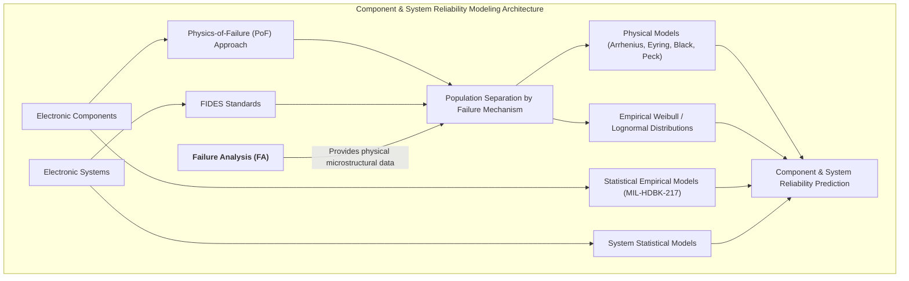
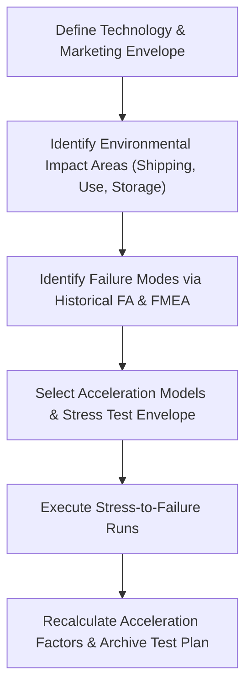
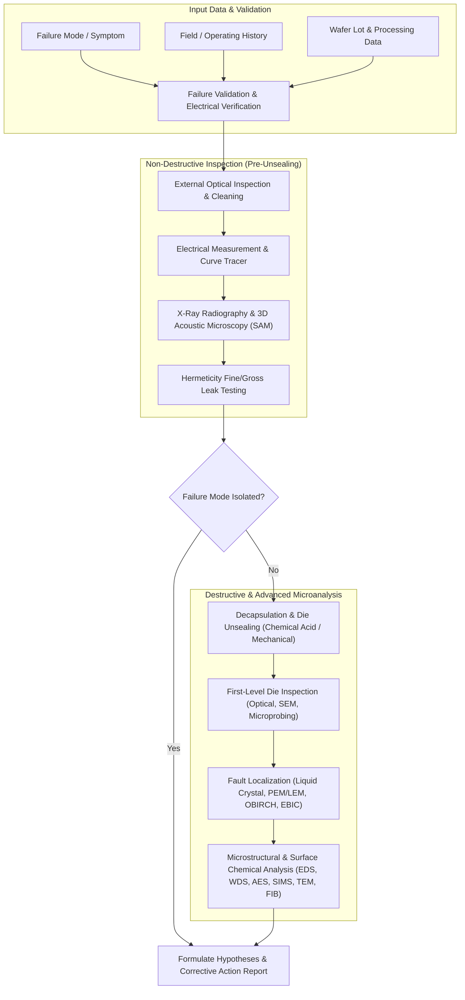
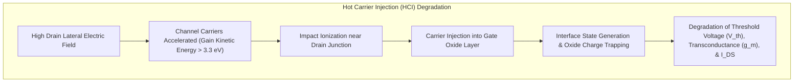
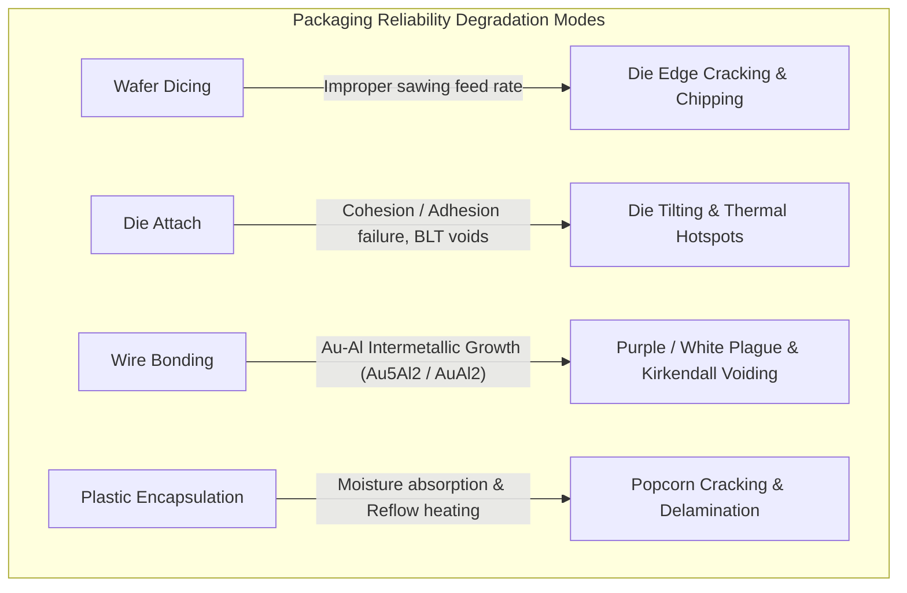

# Failure Analysis of Electronic Systems & Components — Bâzu (2011) Handbook & Reading Notes

## Overview & Foundations of Failure Analysis

### Distribution of System Failure Causes and Root Cause Philosophy

In the reliability engineering of electronic systems, failure analysis (FA) serves as the primary investigative discipline for diagnosing performance degradation and physical destruction. Historically, failure analysis is frequently terminated once the primary physical mechanism or failure mode is established, rather than persevering until the ultimate **root cause** is identified. Root cause determination requires tracing systemic, managerial, and human factors that enabled the physical defect to occur.

Fundamentally, all engineering failures are eventually traceable to human error categorized into three distinct classes:
1. **Errors of Knowledge**: Deficiencies in technical understanding, improper material selection, or incorrect mathematical modeling during design.
2. **Errors of Performance**: Operational oversights, poor workmanship, or procedural negligence during fabrication and assembly.
3. **Errors of Intent**: Direct acts of sabotage or deliberate non-compliance with quality standards.

- **Table 1.1 — Empirical Distribution of Failure Causes in Electronic Systems**:

  | Failure Cause Category | Approximate Contribution | Primary Manifestations |
  | :--- | :--- | :--- |
  | **Design Errors** | ~40–50% | Thermal miscalculations, rule violations, signal integrity issues |
  | **Manufacturing & Process Defects** | ~20–30% | Contamination, mask misalignment, incomplete curing, step coverage |
  | **Component Defects** | ~10–20% | Early-life infant mortality, latent material flaws, oxide pinholes |
  | **Operational / Environmental Stress** | ~10–15% | Overvoltage/overcurrent surges, thermal shock, vibration, moisture |
  | **Other / Unknown** | ~5–10% | Unreproducible field anomalies, multi-factor interactions |

---

### Risk Prioritization, Fault Trees, and Systems Reliability

#### Failure Mode and Effects Analysis (FMEA)

Failure Mode and Effects Analysis (FMEA) is a systematic methodology for identifying potential failure modes (FMs) within a component or system and prioritizing them according to their Risk Priority Number (RPN):

$$\text{RPN} = \text{Severity (S)} \times \text{Occurrence (O)} \times \text{Detection (D)}$$

- **Severity (S)**: Evaluates the seriousness of the failure consequence, rated on a scale from 1 (no operational impact) to 10 (critical safety/catastrophic hazard).
- **Occurrence (O)**: Rates the statistical frequency or probability of occurrence, ranging from 1 (rare/unlikely) to 10 (extremely high/inevitable).
- **Detection (D)**: Assesses the likelihood that planned quality controls or inspections will fail to detect the flaw prior to field release, rated from 1 (certain detection) to 10 (undetectable).

Although traditional FMEA is valuable, it acts primarily as a qualitative prediction tool. Its main limitations include subjective risk scoring, low accuracy in complex non-linear systems, and an inability to differentiate between distinct failure modes that happen to compute identical RPN values. To ensure comprehensive coverage, systems engineers utilize a 10-point checklist of failure modes:
1. Intended function is **not performed** at all.
2. Function is performed, but causes a **safety or regulatory violation**.
3. Function is performed at an **incorrect time** (availability failure).
4. Function is performed at an **incorrect location**.
5. Function is performed in an **incorrect manner** (efficiency loss).
6. Performance magnitude is **below planned threshold**.
7. Operating cost **exceeds design budget** (maintenance penalty).
8. An **unintended/undesirable function** is simultaneously activated.
9. Useful **operational lifetime** falls short of specifications.
10. System **support and repairability** are compromised.

#### Fault Tree Analysis (FTA) and Event Tree Analysis (ETA)

While FMEA focuses on single-point component failures, **Fault Tree Analysis (FTA)** uses a deductive graphical approach (employing AND/OR logic gates) to analyze combinations of simultaneous hardware, software, and human failures that result in a top-level system hazard. Conversely, **Event Tree Analysis (ETA)** employs an inductive forward-logic tree to track the chronological consequences propagating from a single initiating failure event.



In reliability modeling, failure analysis serves as the critical feedback loop that separates sub-populations affected by specific failure mechanisms. Physical models (Physics-of-Failure, PoF) evaluate degradation kinetics at the atomic level, whereas empirical models utilize statistical distributions (Weibull, Lognormal, Exponential) to fit time-to-failure data.

#### The Rule of Ten (Cost of Defects)

Defect correction costs escalate exponentially as a product advances through manufacturing levels. Under **The Rule of Ten**, locating and replacing a defective die costs an order of magnitude more at each subsequent assembly stage:

$$\text{Die / Wafer Level ($C$)} \longrightarrow \text{Board Level ($10C$)} \longrightarrow \text{System Field Level ($100C$)}$$

---

## Reliability Frameworks and Test Strategies

### Life Cycle Failures and Accelerated Knowledge-Based Testing

Across the lifecycle of an electronic component, failure analysis fulfills distinct strategic functions:
- **Development & Prototyping**: High stress during circuit debugging exposes component design weaknesses, enabling layout optimization.
- **Input Control & Qualification**: Reliability monitors screen incoming material lots; statistical deviations trigger batch rejections.
- **Fabrication & In-Line Testing**: Immediate priority is given to line-stopping failures to prevent scrapping entire wafer lots.
- **Field Operation**: Returned unit analysis delineates between intrinsic design flaws, misapplication, and environmental overstress.

- **Table 3.1 — Conceptual Models of Component & System Failure**:

  | Model Type | Mechanism & Behavior | Representative Example |
  | :--- | :--- | :--- |
  | **Stress–Strength** | Failure occurs immediately when applied stress exceeds intrinsic material strength; un-failed units suffer zero cumulative damage. | Collector-Emitter dielectric breakdown in power transistors during ESD overvoltage. |
  | **Damage–Endurance** | Irreversible damage accumulates continuously over time; performance remains nominal until accumulated damage crosses endurance threshold. | Electromigration void growth, thermal fatigue cracking, Time-Dependent Dielectric Breakdown (TDDB). |
  | **Challenge–Response** | Latent defect exists passively; failure triggers only when a specific conditional state or stimulus is applied. | Software logic deadlocks, rare bus arbitration collisions, ESD protection circuit misfiring. |
  | **Tolerance–Requirement** | Component operates nominally, but parameter drift places system outputs outside required tolerance band. | Operational amplifier input offset voltage drift, crystal oscillator frequency shift. |

#### Highly Accelerated Stress Test (HAST)

Traditional $85\ ^\circ\text{C} / 85\%\text{ RH}$ temperature-humidity testing requires $1000\text{ hours}$ of exposure. **Highly Accelerated Stress Testing (HAST)** accelerates moisture ingress by housing plastic-packaged ICs in a pressurized chamber ($45\text{ psi}$, $85\%\text{ RH}$) at elevated temperatures ($130\text{--}140\ ^\circ\text{C}$). Exposure to $140\ ^\circ\text{C}$ HAST for just $24\text{ hours}$ produces moisture degradation equivalent to $1000\text{ hours}$ of standard $85/85$ testing.

#### Standards-Based vs. Knowledge-Based Reliability Testing

Standardized qualification testing (e.g., MIL-STD) often applies arbitrary stress levels that fail to accelerate field-relevant failure mechanisms or generate unrealistic failure modes. In contrast, **Knowledge-Based Testing** establishes a tailored testing envelope by linking field stress profiles with specific physics-of-failure acceleration models:



---

## Failure Analysis Workflows and Analytical Techniques

### Non-Destructive and Destructive Analytical Workflows

The failure analysis workflow is divided into non-destructive inspection prior to package unsealing, followed by destructive decapsulation and physical/chemical characterization.



- **Table 4.1 — Comprehensive Microanalytical Tool Comparison**:

  | Tool / Technique | Destructive? | Primary Detection Output | Spatial Resolution | Key Failure Analysis Application |
  | :--- | :--- | :--- | :--- | :--- |
  | **External Inspection** | No | Visual defects, package cracks | $\sim 1\ \mu\text{m}$ | Lead integrity, seal cracks, package lead discolouration |
  | **X-Ray Radiography** | No | Internal wire bonds, die attach voids | $\sim 1\ \mu\text{m}$ | Wire sweep, broken bond wires, internal paddle voids |
  | **Scanning Acoustic Microscopy (SAM)** | No | Ultrasonic reflections (A/B/C-scans) | $\sim 10\ \mu\text{m}$ | Package delamination, die attach voids, popcorn cracks |
  | **Liquid Crystal Thermography** | No | Thermotropic phase change (Hot spots) | $\sim 1\ \mu\text{m}$ | Polysilicon shorts, leaky junctions, localized heating |
  | **Photoemission Microscopy (PEM/LEM)** | No | Recombination photon emission | $\sim 0.5\ \mu\text{m}$ | Avalanche breakdown, gate oxide shorts, hot electrons |
  | **OBIRCH** | No | Thermal resistance variations | $\sim 0.2\ \mu\text{m}$ | Metal line microbridges, high-resistance vias, voids |
  | **Voltage Contrast SEM** | No | Secondary electron energy shifts | $\sim 10\text{ nm}$ | Open metal lines, floating nodes, via chain opens |
  | **Auger Electron Spectroscopy (AES)** | Yes | Surface Auger electrons | $\sim 10\text{ nm}$ | Surface contamination ($< 5\text{ nm}$), bond pad non-bondability |
  | **SIMS / TOF-SIMS** | Yes | Sputtered secondary ion mass | $\sim 1\ \mu\text{m}$ | Ultra-trace dopant profiling ($\text{ppm}\text{--}\text{ppb}$), H/He analysis |
  | **Transmission Electron Microscopy (TEM)** | Yes | Transmitted electron diffraction | $\sim 0.08\text{ nm}$ | Atomic lattice imaging, ultrathin gate oxide breakdown paths |

---

## Wafer-Level Failure Mechanisms

### Oxide and Interface Reliability (HCI, TDDB, and Dielectric Breakdown)

Oxide layers ($\text{SiO}_2$) provide inter-layer dielectric isolation ($k = 3.9$) and gate insulation. Degradation of the $\text{Si-SiO}_2$ interface occurs via four primary charge mechanisms: fixed interface charge, oxide-trapped charge, interface-trapped charge, and mobile alkali ion charge ($\text{Na}^+, \text{K}^+$).



Hot Carrier Injection (HCI) is categorized into four distinct physical processes:
1. **Substrate Hot Electrons (SHE)**: Thermally generated substrate carriers accelerated toward the interface by vertical electric fields.
2. **Channel Hot Electrons (CHE)**: Channel carriers gaining high kinetic energy along a intense lateral field.
3. **Drain Avalanche Hot Carriers (DAHC)**: High-energy electron-hole pairs produced by avalanche plasma near the drain junction (most physically destructive mode).
4. **Source Side Hot Electrons (SSHE)**: Hot carriers injected near the source edge, inducing severe threshold voltage shifts and low-frequency noise degradation.

HCI degradation is minimized by introducing Lightly Doped Drain (LDD) extension profiles, deuterium post-metal annealing, and nitrogen-passivated gate dielectrics.

#### Dielectric Breakdown (DB) and Time-Dependent Dielectric Breakdown (TDDB)

Dielectric breakdown occurs when charge injection builds up localized trap density, creating a conductive percolation path through the oxide:
- **Intrinsic Breakdown**: Occurs at electric fields of $8\text{--}12\text{ MV/cm}$ in pristine thermal oxide when field strength exceeds molecular bond integrity.
- **Extrinsic Breakdown**: Occurs at lower fields ($5\text{--}6\text{ MV/cm}$) due to pre-existing pinholes, localized structural defects, or mobile ion contamination.

---

### Metal-Level Failure Mechanisms (Electromigration, Stress Migration, and Hillocks)

#### Electromigration (EM)

Electromigration is the transport of material resulting from the gradual momentum transfer between conducting electrons and diffusing metal atoms ("electron wind") under high current density ($J > 10^5\text{ A/cm}^2$).

$$\text{MTTF} = \frac{A}{J^n} \exp\left(\frac{E_a}{k T}\right) \quad \text{(Black's Equation)}$$

Mass divergence occurs at structural non-uniformities: vacancy accumulation on the cathode side produces voids (open circuits), whereas metal accumulation on the anode side produces hillocks and whiskers (short circuits). 

```
                 Electromigration Void vs. Hillock Divergence
 ─────────────────────────────────────────────────────────────────────────────
  [e⁻ Flow] ──►  (-) Cathode: Vacancy Accumulation ──► Void Formation (Open)
                 (+) Anode:   Atom Accumulation    ──► Hillock Growth (Short)
```

In modern submicron dual-damascene Cu interconnects, electromigration is governed primarily by diffusion along the top $\text{Cu}/\text{cap}$ dielectric interface rather than grain boundary diffusion. Copper's lower resistivity and higher melting point ($1085\ ^\circ\text{C}$ vs $660\ ^\circ\text{C}$ for Al) provide vastly superior EM lifetime. Electromigration resistance is enhanced by capping Cu with self-aligned cobalt tungsten phosphide ($\text{CoWP}$) barriers or doping with aluminum/manganese.

#### Hillocks, Voids, and Stress-Induced Voiding (SIV)

Compressive stress induced during thermal cycling due to high Coefficient of Thermal Expansion (CTE) mismatch between aluminum ($23\text{ ppm/K}$) and silicon ($2.6\text{ ppm/K}$) forces metal atoms to diffuse along grain boundaries to the surface, forming protuberances (hillocks) up to several micrometers high that short adjacent metal layers. Conversely, hydrostatic tensile stress causes vacancy coalescence, forming **Stress-Induced Voids (SIV)** beneath vias.

---

## Assembly and Packaging Reliability

### Packaging Process Step Failures and Mitigations



#### Die Attach Failure Modes

Die attach creates thermal, electrical, and mechanical bonds between the die and leadframe:
- **Cohesion Failure**: Internal fracture within the die attach material due to excessive voiding or improper Bond Line Thickness (BLT), diminishing thermal dissipation.
- **Adhesion Failure**: Delamination at the interface between the die backside and adhesive paste, caused by surface organic contamination.

#### Wire Bonding and Intermetallic Compounds

Gold wire bonding onto aluminum pads forms brittle gold-aluminum intermetallic compounds (IMCs) during high-temperature storage:
- **White Plague ($\text{Au}_5\text{Al}_2$)**: Low-conductivity phase causing electrical resistance build-up.
- **Purple Plague ($\text{AuAl}_2$)**: Brittle purple compound accompanied by **Kirkendall Voiding**, where differential diffusion rates between gold and aluminum leave sub-surface vacancies that coalesce into mechanical fractures.

#### Plastic Encapsulation, Popcorning, and Tin Whiskers

Plastic Encapsulation Compounds (EMC) absorb ambient moisture. During surface-mount reflow soldering ($245\text{--}260\ ^\circ\text{C}$), absorbed moisture rapidly vaporizes into high-pressure steam. Vapour pressure combined with CTE mismatch causes internal delamination at the die-paddle interface, expanding outward until the package ruptures ("**Popcorn Cracking**").

```
                     Popcorn Cracking Mechanism
 ─────────────────────────────────────────────────────────────────────────────
  1. Storage: Ambient moisture diffuses into porous epoxy moulding compound.
  2. Reflow: High temperature (260 °C) rapidly converts liquid H₂O to steam.
  3. Rupture: High internal pressure delaminates interface & cracks package body.
```

Pure electroplated tin coatings spontaneously grow thin monocrystalline filaments (**Tin Whiskers**) driven by compressive stress build-up from intermetallic ($\text{Cu}_6\text{Sn}_5$) formation at the leadframe interface. Tin whiskers grow up to several millimeters in length, bridging adjacent leads and causing catastrophic electrical shorts in high-reliability systems. Tin whisker formation is suppressed by alloying tin with lead ($\text{Pb}$) or bismuth, applying conformal coatings, or annealing electroplated leads.
