# 布鲁克纳米分析 EDS 高级应用培训综合全景教材 (三语合订本)
# Bruker Nano Analytics (BNA) EDS Advanced Application Training Comprehensive Manual (Trilingual Consolidated Edition)

> **版本标识 / Edition**: 2026 典藏合订版 (Comprehensive Consolidated Edition)  
> **语言模式 / Languages**: 中文规范 (Chinese) + 汉语拼音标调 (Hanyu Pinyin with Tonal Diacritics) + 专业技术英文 (English Technical Translation)  
> **适用范围 / Scope**: 扫描电镜微区成分分析 (SEM/EDS)、电子探针 (EPMA)、微电子失效分析与材料表征实验室  
> **原始课件 / Source Materials**: 274 页布鲁克官方高级应用培训全集 (QUANTAX EDS Hardware, Principles, Specimens, Quantification, and Carbon FAQ)

---

## 全书总目录 / Master Table of Contents
1. [模块一：QUANTAX EDS 硬件系统及工作原理 / Hardware System & Principles](#module-1-quantax-eds-硬件系统及工作原理)
2. [模块二：一、EDS 分析原理及分析技术 / Principles & Analytical Techniques](#module-2-一eds-分析原理及分析技术)
3. [模块三：二、EDS 分析对试样的要求及试样制备 / Specimen Requirements & Preparation](#module-3-二eds-分析对试样的要求及试样制备)
4. [模块四：三、EDS 定量分析方法与分析误差 / Quantitative Analysis & Errors](#module-4-三eds-定量分析方法与分析误差)
5. [模块五：碳元素异常分析及微区分析疑难解答 / Carbon Anomaly FAQ](#module-5-碳元素异常分析及微区分析疑难问题解答)
6. [附录：核心微束分析技术术语总览 / Master Technical Glossary](#附录核心微束分析技术术语总览--master-technical-glossary)

---

---

# Module 1: QUANTAX EDS 硬件系统及工作原理
# QUANTAX EDS Hardware System and Working Principles

---

## 目录 / Table of Contents
1. [系统整体构成 / Overall System Architecture](#1-系统整体构成--overall-system-architecture)
2. [SDD 硅漂移探测器结构与原理 / SDD Detector Structure & Operating Principles](#2-sdd-硅漂移探测器结构与原理--sdd-detector-structure--operating-principles)
3. [混合脉冲处理器 (SVE) 与信号链 / SVE Hybrid Pulse Processor & Signal Chain](#3-混合脉冲处理器-sve-与信号链--sve-hybrid-pulse-processor--signal-chain)
4. [工作站 PC 与扫描控制单元 (SCU / I/O Scan-Card)](#4-工作站-pc-与扫描控制单元-scu--io-scan-card)
5. [常见问题、故障排查与维护保养 / FAQs & Maintenance](#5-常见问题故障排查与维护保养--faqs--maintenance)
6. [能量轴校准操作指南 / Energy Axis Calibration Guide](#6-能量轴校准操作指南--energy-axis-calibration-guide)
7. [关键技术术语对照表 / Key Technical Glossary](#7-关键技术术语对照表--key-technical-glossary)

---

## 1. 系统整体构成 / Overall System Architecture

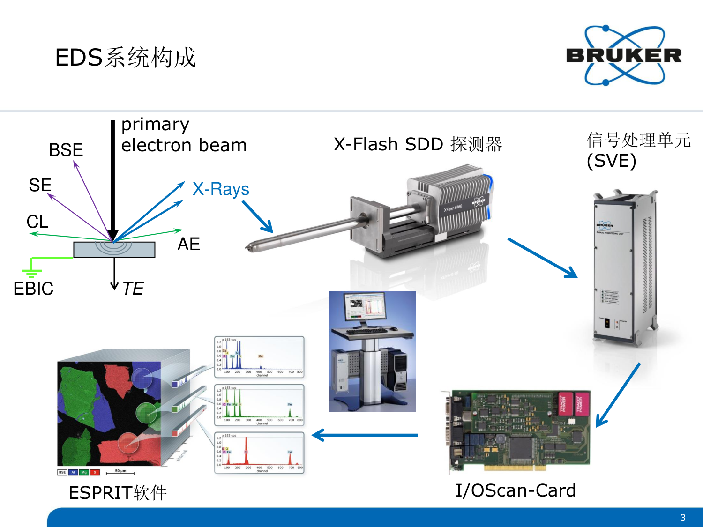

**[CN]**  
布鲁克 (Bruker) QUANTAX EDS 系统由四个核心子系统构成：  
1. X-Flash 硅漂移探测器 (SDD Detector)：安装于扫描电镜 (SEM) 样品室，负责捕获特征 X 射线光子并转换为初级电荷与微弱电压阶跃。  
2. 信号处理单元 (SVE, Signal Processing Unit)：高速混合脉冲处理器，负责噪声滤波、脉冲整形放大、幅度测量及多道脉冲幅度分析 (MCA)。  
3. 扫描控制卡 (I/O Scan-Card) / 信号扫描单元 (SCU)：接管扫描电镜电子束偏转线圈，实现电子束定点、线扫与面扫的数字化同步控制。  
4. PC 工作站与 ESPRIT 分析软件：提供谱图定性、定量计算算法 (P/B, ZAF, Phi-Rho-Z)、超谱成像 (HyperMap) 以及自动化报告生成。  

**[PY]**  
bù lǔ kè (Bruker) QUANTAX EDS xì tǒng yóu sì gè hé xīn zi xì tǒng gòu chéng：  
1. X-Flash guī piāo yí tàn cè qì (SDD Detector)： ān zhuāng yú sǎo miáo diàn jìng (SEM) yàng pǐn shì， fù zé bǔ huò tè zhēng X shè xiàn guāng zi bìng zhuǎn huàn wèi chū jí diàn hè yǔ wēi ruò diàn yā jiē yuè。  
2. xìn hào chǔ lǐ dān yuán (SVE, Signal Processing Unit)： gāo sù hùn hé mài chōng chǔ lǐ qì， fù zé zào shēng lǜ bō、 mài chōng zhěng xíng fàng dà、 fú dù cè liáng jí duō dào mài chōng fú dù fēn xī (MCA)。  
3. sǎo miáo kòng zhì kǎ (I/O Scan-Card) / xìn hào sǎo miáo dān yuán (SCU)： jiē guǎn sǎo miáo diàn jìng diàn zi shù piān zhuǎn xiàn quān， shí xiàn diàn zi shù dìng diǎn、 xiàn sǎo yǔ miàn sǎo de shù zì huà tóng bù kòng zhì。  
4. PC gōng zuò zhàn yǔ ESPRIT fēn xī ruǎn jiàn： tí gōng pǔ tú dìng xìng、 dìng liàng jì suàn suàn fǎ (P/B, ZAF, Phi-Rho-Z)、 chāo pǔ chéng xiàng (HyperMap) yǐ jí zì dòng huà bào gào shēng chéng。  

**[EN]**  
The Bruker QUANTAX EDS system comprises four core subsystems:  
1. X-Flash Silicon Drift Detector (SDD): Positioned in the SEM specimen chamber to collect characteristic X-ray photons and convert them into charge packets and corresponding voltage steps.  
2. Signal Processing Unit (SVE): A high-speed hybrid pulse processor performing noise discrimination, pulse shaping, amplitude measurement, and multichannel pulse-height analysis (MCA).  
3. Scanning Control Card (I/O Scan-Card) / Scanning Control Unit (SCU): Directly interfaces with the SEM deflection coils to coordinate digital beam positioning for point analysis, line scans, and elemental mapping.  
4. PC Workstation & ESPRIT Software: Hosts advanced analytical modules for spectral identification, quantitative matrix corrections (P/B, ZAF, Phi-Rho-Z), HyperMap spectral imaging, and automated reporting.

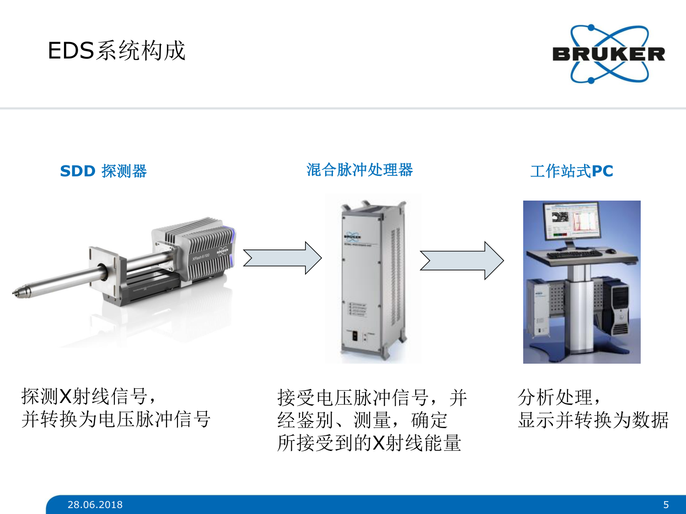

**[CN]**  
信号传递与转换链流程：  
• 探测器端：特征 X 射线入射至高纯硅晶体，通过内光电效应激发产生电子-空穴对，电荷收集形成电脉冲信号。  
• 脉冲处理器端：接受微弱前置放大脉冲，经基线恢复、成形滤波、幅度鉴别，确定每个光子的特征能量并送入对应通道计数值。  
• PC 软件端：多通道分析仪累积计数分布，生成横坐标为能量 (keV)、纵坐标为脉冲计数 (Counts) 的能谱图。  

**[PY]**  
xìn hào chuán dì yǔ zhuǎn huàn liàn liú chéng：  
• tàn cè qì duān： tè zhēng X shè xiàn rù shè zhì gāo chún guī jīng tǐ， tōng guò nèi guāng diàn xiào yìng jī fā chǎn shēng diàn zi - kōng xué duì， diàn hè shōu jí xíng chéng diàn mài chōng xìn hào。  
• mài chōng chǔ lǐ qì duān： jiē shòu wēi ruò qián zhì fàng dà mài chōng， jīng jī xiàn huī fù、 chéng xíng lǜ bō、 fú dù jiàn bié， què dìng měi gè guāng zi de tè zhēng néng liàng bìng sòng rù duì yìng tōng dào jì shù zhí。  
• PC ruǎn jiàn duān： duō tōng dào fēn xī yí lěi jī jì shù fēn bù， shēng chéng héng zuò biāo wèi néng liàng (keV)、 zòng zuò biāo wèi mài chōng jì shù (Counts) de néng pǔ tú。  

**[EN]**  
Signal Transduction and Processing Chain:  
• Detector Stage: Incoming characteristic X-ray photons interact with the high-purity silicon crystal via the photoelectric effect, generating electron-hole pairs collected to create small voltage steps.  
• Pulse Processor Stage: The weak preamplifier signals undergo baseline restoration, analog/digital filtering, and peak amplitude discrimination to map each event to its specific photon energy.  
• Software Stage: The multichannel analyzer accumulates pulse counts across 4,096 channels, yielding the final EDS energy spectrum (X-axis: energy in keV; Y-axis: counts per channel).

---

## 2. SDD 硅漂移探测器结构与原理 / SDD Detector Structure & Operating Principles

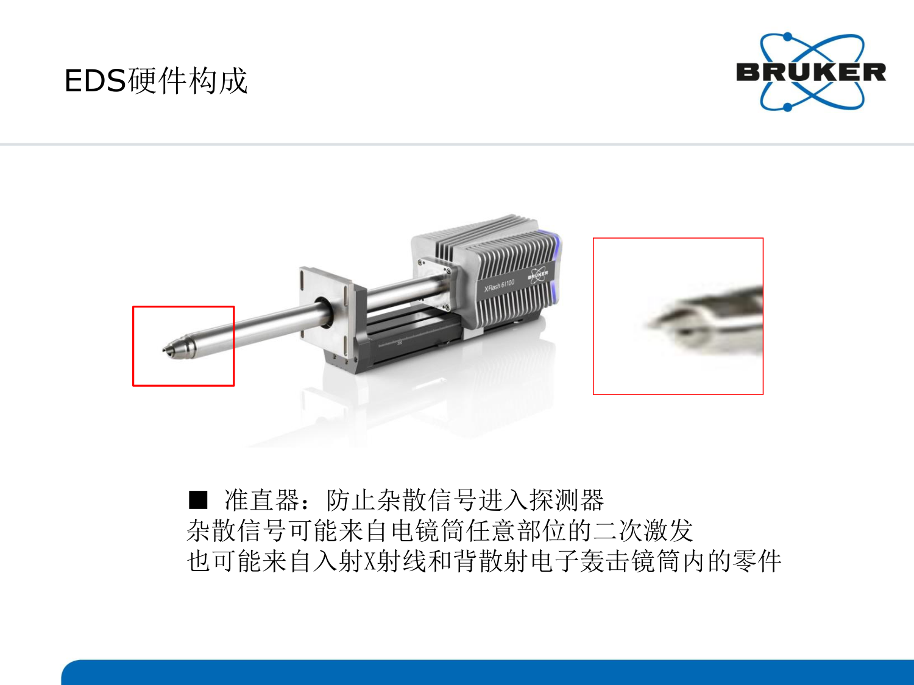

### 2.1 准直器 (Collimator)
**[CN]**  
准直器安装在探测器最前端，主要功能是防止非样品区域的杂散信号进入探测器。  
杂散信号的来源包括：  
• 入射高能电子束轰击电镜镜筒内壁、极靴零件或光阑边缘激发的杂散 X 射线；  
• 样品表面产生的高角度背散射电子 (BSE) 撞击样品室内部金属构件产生的二次激发荧光 X 射线。  
准直器限定了探测器的立体角接收视场，确保进入窗口的光子严格来源于电子束轰击的分析微区。  

**[PY]**  
zhǔn zhí qì ān zhuāng zài tàn cè qì zuì qián duān， zhǔ yào gōng néng shì fáng zhǐ fēi yàng pǐn qū yù de zá sàn xìn hào jìn rù tàn cè qì。  
zá sàn xìn hào de lái yuán bāo kuò：  
• rù shè gāo néng diàn zi shù hōng jī diàn jìng jìng tǒng nèi bì、 jí xuē líng jiàn huò guāng lán biān yuán jī fā de zá sàn X shè xiàn；  
• yàng pǐn biǎo miàn chǎn shēng de gāo jiǎo dù bèi sǎn shè diàn zi (BSE) zhuàng jī yàng pǐn shì nèi bù jīn shǔ gòu jiàn chǎn shēng de èr cì jī fā yíng guāng X shè xiàn。  
zhǔn zhí qì xiàn dìng le tàn cè qì de lì tǐ jiǎo jiē shōu shì chǎng， què bǎo jìn rù chuāng kǒu de guāng zi yán gé lái yuán yú diàn zi shù hōng jī de fēn xī wēi qū。  

**[EN]**  
The collimator is fitted at the front aperture of the detector tube. Its primary objective is to prevent stray radiation and spurious signals from reaching the active sensor.  
Sources of stray signals include:  
• Stray X-rays generated when primary electrons graze SEM column liners, pole piece surfaces, or aperture edges.  
• Secondary excitation fluorescence caused by high-energy backscattered electrons (BSE) striking internal chamber hardware.  
The collimator defines the precise acceptance solid angle, ensuring that detected photons originate exclusively from the beam-specimen interaction site.

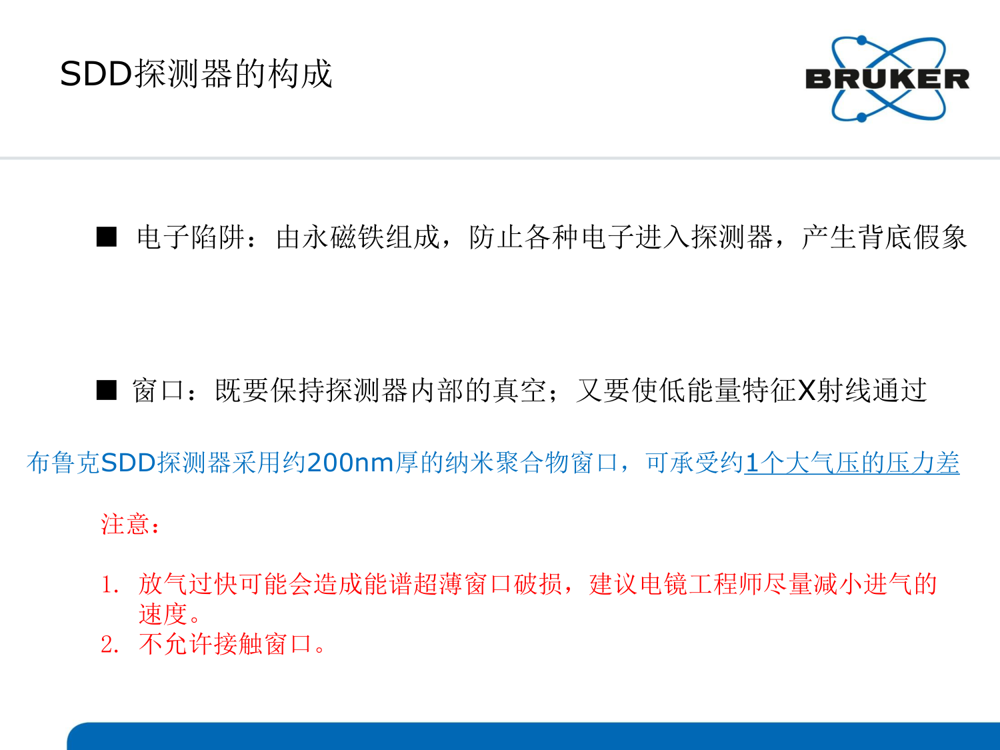

### 2.2 磁性电子陷阱 (Magnetic Electron Trap) 与超薄窗口 (Ultra-thin Window)
**[CN]**  
1. 电子陷阱 (Magnetic Electron Trap)：  
由小型永磁体组成强偏转磁场，其作用是将射向探测器的背散射电子 (BSE) 和二次电子 (SE) 强制偏转偏离探测芯片，防止电子穿透窗口进入硅芯片激发虚假连续背底或造成晶体辐射损伤。  
  
2. 超薄纳米聚合物窗口 (Moxtek Ultra-thin Window, AP3.3)：  
• 功能：隔离电镜样品室与探测器内部高真空腔体，同时具有极高低能 X 射线透射率。  
• 特性：厚度仅约 200 nm，可承受 1 个标准大气压的压差，能够透过超轻元素（如 Be, B, C, N, O, F）的特征 X 射线。  
• 使用警示：  
  1. 电镜样品室放气时必须严格控制进气阀门开度，避免剧烈气流冲击导致纳米薄膜破损破裂。  
  2. 严禁任何工具、棉签或手指物理接触窗口表面。  

**[PY]**  
1. diàn zi xiàn jǐng (Magnetic Electron Trap)：  
yóu xiǎo xíng yǒng cí tǐ zǔ chéng qiáng piān zhuǎn cí chǎng， qí zuò yòng shì jiāng shè xiàng tàn cè qì de bèi sǎn shè diàn zi (BSE) hé èr cì diàn zi (SE) qiáng zhì piān zhuǎn piān lí tàn cè xīn piàn， fáng zhǐ diàn zi chuān tòu chuāng kǒu jìn rù guī xīn piàn jī fā xū jiǎ lián xù bèi dǐ huò zào chéng jīng tǐ fú shè sǔn shāng。  
2. chāo báo nà mǐ jù hé wù chuāng kǒu (Moxtek Ultra-thin Window, AP3.3)：  
• gōng néng： gé lí diàn jìng yàng pǐn shì yǔ tàn cè qì nèi bù gāo zhēn kōng qiāng tǐ， tóng shí jù yǒu jí gāo dī néng X shè xiàn tòu shè lǜ。  
• tè xìng： hòu dù jǐn yuē 200 nm， kě chéng shòu 1 gè biāo zhǔn dà qì yā de yā chà， néng gòu tòu guò chāo qīng yuán sù（rú Be, B, C, N, O, F） de tè zhēng X shè xiàn。  
• shǐ yòng jǐng shì：  
1. diàn jìng yàng pǐn shì fàng qì shí bì xū yán gé kòng zhì jìn qì fá mén kāi dù， bì miǎn jù liè qì liú chōng jī dǎo zhì nà mǐ báo mó pò sǔn pò liè。  
2. yán jìn rèn hé gōng jù、 mián qiān huò shǒu zhǐ wù lǐ jiē chù chuāng kǒu biǎo miàn。  

**[EN]**  
1. Magnetic Electron Trap:  
Composed of permanent magnets that produce an intense localized magnetic field. It deflects incoming backscattered electrons (BSE) and secondary electrons (SE) away from the sensor face, preventing them from entering the silicon active volume where they would elevate the continuum background or cause sensor degradation.  
  
2. Ultra-Thin Polymer Window (Moxtek AP3.3):  
• Purpose: Seals the ultra-high internal vacuum of the detector while providing maximum transmission for low-energy soft X-rays.  
• Characteristics: Approximately 200 nm in thickness, mechanically engineered to sustain up to 1 atmosphere of pressure differential, permitting transmission of ultra-light elements down to Be, B, C, N, O, and F.  
• Operational Cautions:  
  1. When venting the SEM specimen chamber, gas intake must be gentle; sudden turbulent pressure surges will rupture the delicate ultra-thin membrane.  
  2. Physical contact with the window by tools, swabs, or fingers is strictly prohibited.

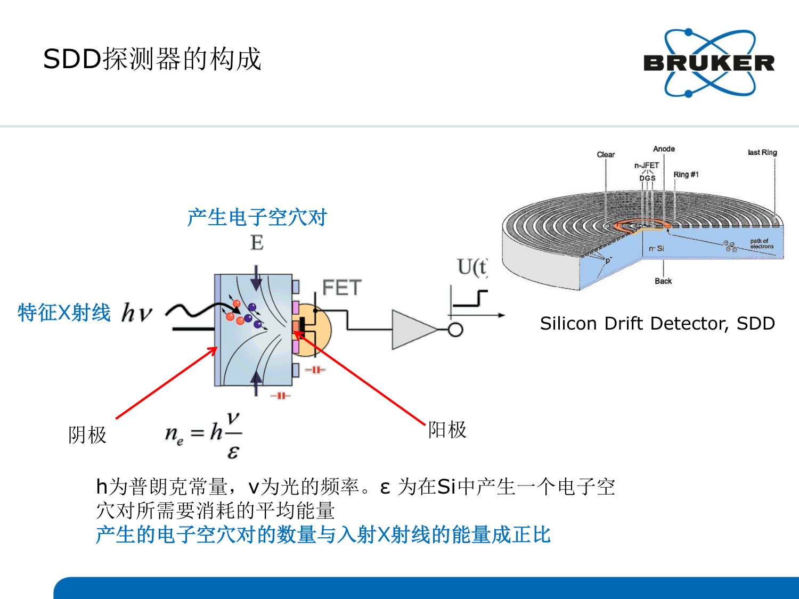

### 2.3 硅漂移芯片 (Silicon Drift Detector) 工作物理机制
**[CN]**  
硅漂移探测器 (SDD) 采用同心圆环状多电极阴极结构：  
1. 电子-空穴对产生机制：  
   入射特征 X 射线光子能量为 E = hν。光子完全被高纯硅吸收时，激发产生电子-空穴对。在硅晶体中，每激发一对电子-空穴对平均消耗能量 ε ≈ 3.8 eV (77K - 295K)。  
   产生电荷总量 Q 与光子能量严格成正比：  
   n = E / ε  
2. 电场引导与漂移：  
   芯片表面一系列同心环状阴极施加逐渐升高的反向电偏压，在晶体内部形成平滑倾斜的静电电位谷。产生的电子在漂移电场驱动下，以极短时间汇聚漂移至中心微小阳极。  
3. 极小结电容优势：  
   中心读出阳极的物理尺寸极小（微米级），使得探测器输出结电容 (Capacitance) 降低至飞法 (fF) 级别。相比传统大电容的 Si(Li) 探测器，SDD 的电子学噪声极低，能够在超高计数率 (>1,000,000 cps) 下保持卓越的能量分辨率，且仅需电热帕尔帖 (Peltier) 元件制冷，无需液氮维护。  

**[PY]**  
guī piāo yí tàn cè qì (SDD) cǎi yòng tóng xīn yuán huán zhuàng duō diàn jí yīn jí jié gòu：  
1. diàn zi - kōng xué duì chǎn shēng jī zhì：  
rù shè tè zhēng X shè xiàn guāng zi néng liàng wèi E = hν。 guāng zi wán quán bèi gāo chún guī xī shōu shí， jī fā chǎn shēng diàn zi - kōng xué duì。 zài guī jīng tǐ zhōng， měi jī fā yī duì diàn zi - kōng xué duì píng jūn xiāo hào néng liàng ε ≈ 3.8 eV (77K - 295K)。  
chǎn shēng diàn hè zǒng liàng Q yǔ guāng zi néng liàng yán gé chéng zhèng bǐ：  
n = E / ε  
2. diàn chǎng yǐn dǎo yǔ piāo yí：  
xīn piàn biǎo miàn yī xì liè tóng xīn huán zhuàng yīn jí shī jiā zhú jiàn shēng gāo de fǎn xiàng diàn piān yā， zài jīng tǐ nèi bù xíng chéng píng huá qīng xié de jìng diàn diàn wèi gǔ。 chǎn shēng de diàn zi zài piāo yí diàn chǎng qū dòng xià， yǐ jí duǎn shí jiān huì jù piāo yí zhì zhōng xīn wēi xiǎo yáng jí。  
3. jí xiǎo jié diàn róng yōu shì：  
zhōng xīn dú chū yáng jí de wù lǐ chǐ cùn jí xiǎo（wēi mǐ jí）， shǐ de tàn cè qì shū chū jié diàn róng (Capacitance) jiàng dī zhì fēi fǎ (fF) jí bié。 xiāng bǐ chuán tǒng dà diàn róng de Si(Li) tàn cè qì，SDD de diàn zi xué zào shēng jí dī， néng gòu zài chāo gāo jì shù lǜ (>1,000,000 cps) xià bǎo chí zhuó yuè de néng liàng fēn biàn lǜ， qiě jǐn xū diàn rè pà ěr tiē (Peltier) yuán jiàn zhì lěng， wú xū yè dàn wéi hù。  

**[EN]**  
The Silicon Drift Detector (SDD) utilizes a concentric ring electrode geometry:  
1. Electron-Hole Pair Generation:  
   An incoming characteristic X-ray photon with energy E = hν is absorbed in high-purity silicon, generating electron-hole pairs. In silicon, creating a single pair requires an average ionization energy of ε ≈ 3.8 eV.  
   The total generated charge Q is directly proportional to photon energy:  
   n = E / ε  
2. Charge Drift & Collection:  
   Progressively biased concentric cathode rings create a transversal electric drift field inside the wafer volume. Free electrons drift along the electrostatic valley toward a minute central readout anode.  
3. Ultra-Low Anode Capacitance Advantage:  
   Because the readout anode is microscopic, its output capacitance is reduced to the femtofarad (fF) regime. Compared to conventional Si(Li) detectors with large planar contact capacitances, the SDD achieves an exceptionally low electronic noise floor, enabling input count rates exceeding 1,000,000 cps while sustaining superior energy resolution with maintenance-free Peltier thermoelectric cooling instead of liquid nitrogen.

---

## 3. 混合脉冲处理器 (SVE) 与信号链 / SVE Hybrid Pulse Processor & Signal Chain

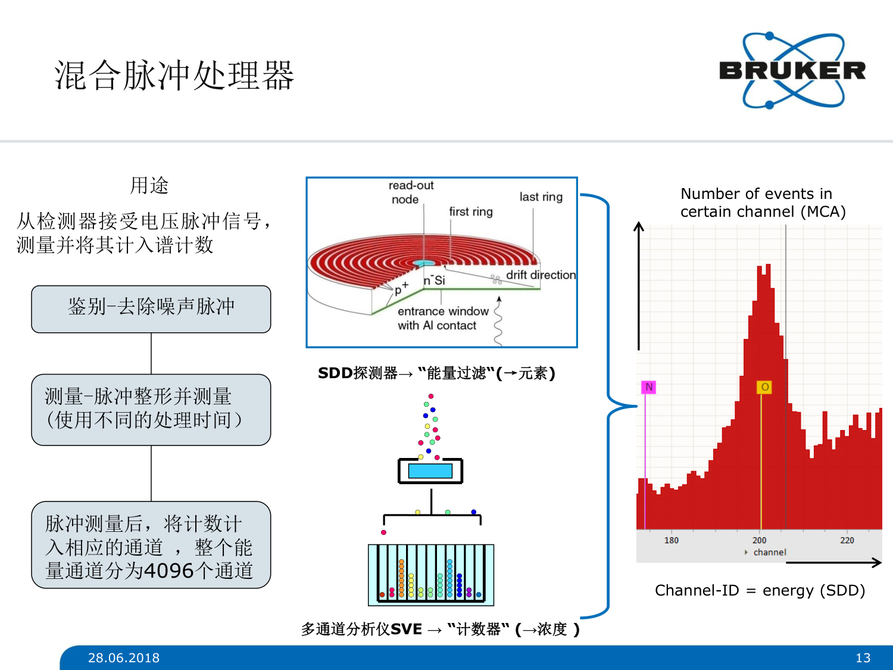

### 3.1 脉冲处理器功能
**[CN]**  
混合脉冲处理器 (SVE) 是能谱仪的大脑，负责：  
1. 噪声鉴别 (Noise Discrimination)：滤除低频热噪声与高频电磁干扰，设定阈值门限阻止零噪声脉冲进入计数系统。  
2. 脉冲成形与峰值检测 (Pulse Shaping & Peak Detection)：将前置放大器输出的阶跃信号转换为具有平顶或准高斯形态的双极性/单极性脉冲，成形时间越长能量分辨率越高，成形时间越短计数率吞吐量越大。  
3. 多通道分析 (Multi-Channel Analyzer, MCA)：  
   整个能量跨度被均匀划分为 4,096 个数字通道 (Channel)。脉冲幅度测量后转换为数字量，在对应的通道地址中加 1。  
   • 通道地址 (Channel ID) = X 射线能量 (定性依据，识别元素种类)。  
   • 累积事件数 (Event Count) = 信号强度 (定量依据，测算元素浓度)。  

**[PY]**  
hùn hé mài chōng chǔ lǐ qì (SVE) shì néng pǔ yí de dà nǎo， fù zé：  
1. zào shēng jiàn bié (Noise Discrimination)： lǜ chú dī pín rè zào shēng yǔ gāo pín diàn cí gān rǎo， shè dìng yù zhí mén xiàn zǔ zhǐ líng zào shēng mài chōng jìn rù jì shù xì tǒng。  
2. mài chōng chéng xíng yǔ fēng zhí jiǎn cè (Pulse Shaping & Peak Detection)： jiāng qián zhì fàng dà qì shū chū de jiē yuè xìn hào zhuǎn huàn wèi jù yǒu píng dǐng huò zhǔn gāo sī xíng tài de shuāng jí xìng / dān jí xìng mài chōng， chéng xíng shí jiān yuè zhǎng néng liàng fēn biàn lǜ yuè gāo， chéng xíng shí jiān yuè duǎn jì shù lǜ tūn tǔ liàng yuè dà。  
3. duō tōng dào fēn xī (Multi-Channel Analyzer, MCA)：  
zhěng gè néng liàng kuà dù bèi jūn yún huà fēn wèi 4,096 gè shù zì tōng dào (Channel)。 mài chōng fú dù cè liáng hòu zhuǎn huàn wéi shù zì liàng， zài duì yìng de tōng dào dì zhǐ zhōng jiā 1。  
• tōng dào dì zhǐ (Channel ID) = X shè xiàn néng liàng ( dìng xìng yī jù， shí bié yuán sù zhǒng lèi )。  
• lěi jī shì jiàn shù (Event Count) = xìn hào qiáng dù ( dìng liàng yī jù， cè suàn yuán sù nóng dù )。  

**[EN]**  
The SVE Hybrid Pulse Processor acts as the core analytical engine of the EDS system:  
1. Noise Discrimination: Rejects low-frequency thermal drift and high-frequency electromagnetic noise, establishing low-level discriminator thresholds to prevent noise triggers.  
2. Pulse Shaping & Peak Detection: Converts the preamplifier voltage step into quasi-Gaussian shaped pulses. Longer shaping times optimize energy resolution, whereas shorter shaping times maximize throughput count rate.  
3. Multichannel Pulse-Height Analysis (MCA):  
   The full energy range is digitized into 4,096 discrete channels. The measured peak amplitude indexes the corresponding channel memory address by +1 count.  
   • Channel ID = X-ray photon energy (Qualitative identification of elements).  
   • Channel Counts = Characteristic intensity (Quantitative measurement of concentration).

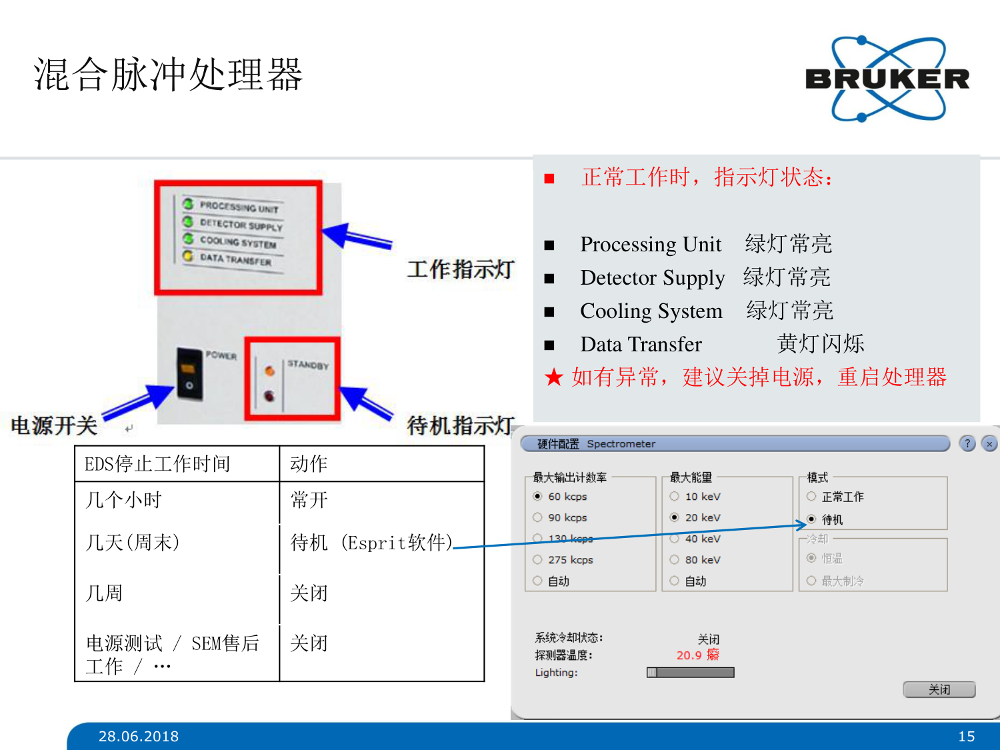

### 3.2 计数吞吐性能与面板指示灯状态
**[CN]**  
1. 处理速度指标：  
最高输入计数率 (Input Count Rate, ICR) 可达 1,500,000 cps (1500 kcps)，最高输出计数率 (Output Count Rate, OCR) 可达 600,000 cps (600 kcps)。死时间 (Dead Time) 随计数率升高而上升，常规微区定量推荐死时间控制在 20% ~ 40% 之间。  
  
2. 正常运行面板状态灯：  
• Processing Unit：绿色常亮 (处理器工作正常)。  
• Detector Supply：绿色常亮 (探测器高压与偏压供电正常)。  
• Cooling System：绿色常亮 (帕尔帖制冷温控处于最佳工作温度，通常为 -20°C 至 -30°C)。  
• Data Transfer：黄色闪烁 (正在向 PC 工作站进行实时数据通信传输)。  
★ 如有任何灯光指示异常，应先关闭 SVE 电源开关，等待 10 秒后重新冷启动。  
  
3. 能谱系统关机与待机保养建议：  
• 停用几个小时（日常午休/实验间隙）：保持常开 (Always On)。  
• 停用几天（周末）：在 ESPRIT 软件中点击 Standby 待机模式。  
• 停用几周（长期放假/出差）：正常关闭 SVE 硬件电源。  
• 扫描电镜售后维修、电源测试、雷暴断电隐患：必须彻底拔下电源插头并关闭系统。  

**[PY]**  
1. chǔ lǐ sù dù zhǐ biāo：  
zuì gāo shū rù jì shù lǜ (Input Count Rate, ICR) kě dá 1,500,000 cps (1500 kcps)， zuì gāo shū chū jì shù lǜ (Output Count Rate, OCR) kě dá 600,000 cps (600 kcps)。 sǐ shí jiān (Dead Time) suí jì shù lǜ shēng gāo ér shàng shēng， cháng guī wēi qū dìng liàng tuī jiàn sǐ shí jiān kòng zhì zài 20% ~ 40% zhī jiān。  
2. zhèng cháng yùn xíng miàn bǎn zhuàng tài dēng：  
• Processing Unit： lǜ sè cháng liàng ( chǔ lǐ qì gōng zuò zhèng cháng )。  
• Detector Supply： lǜ sè cháng liàng ( tàn cè qì gāo yā yǔ piān yā gōng diàn zhèng cháng )。  
• Cooling System： lǜ sè cháng liàng ( pà ěr tiē zhì lěng wēn kòng chǔ yú zuì jiā gōng zuò wēn dù， tōng cháng wèi -20°C zhì -30°C)。  
• Data Transfer： huáng sè shǎn shuò ( zhèng zài xiàng PC gōng zuò zhàn jìn xíng shí shí shù jù tōng xìn chuán shū )。  
★ rú yǒu rèn hé dēng guāng zhǐ shì yì cháng， yīng xiān guān bì SVE diàn yuán kāi guān， děng dài 10 miǎo hòu chóng xīn lěng qǐ dòng。  
3. néng pǔ xì tǒng guān jī yǔ dài jī bǎo yǎng jiàn yì：  
• tíng yòng jǐ gè xiǎo shí（rì cháng wǔ xiū / shí yàn jiàn xì）： bǎo chí cháng kāi (Always On)。  
• tíng yòng jǐ tiān（zhōu mò）： zài ESPRIT ruǎn jiàn zhōng diǎn jī Standby dài jī mó shì。  
• tíng yòng jǐ zhōu（cháng qī fàng jià / chū chāi）： zhèng cháng guān bì SVE yìng jiàn diàn yuán。  
• sǎo miáo diàn jìng shòu hòu wéi xiū、 diàn yuán cè shì、 léi bào duàn diàn yǐn huàn： bì xū chè dǐ bá xià diàn yuán chā tóu bìng guān bì xì tǒng。  

**[EN]**  
1. Throughput Specifications:  
Maximum Input Count Rate (ICR) reaches up to 1,500,000 cps (1,500 kcps) with Output Count Rates (OCR) up to 600,000 cps (600 kcps). System dead time increases with incoming flux; optimal quantitative analysis is typically conducted at dead times of 20% to 40%.  
  
2. Front Panel LED Diagnostics:  
• Processing Unit: Steady Green (Normal signal processor function).  
• Detector Supply: Steady Green (Stable bias and supply voltage).  
• Cooling System: Steady Green (Peltier cooler stabilized at cryogenic setpoint, typically -20°C to -30°C).  
• Data Transfer: Flashing Yellow (Active packet transmission to host PC).  
★ If anomalous LED patterns appear, power off the SVE main switch, wait 10 seconds, and perform a clean reboot.  
  
3. Standby and Shutdown Guidelines:  
• Inactive for several hours: Keep fully powered on.  
• Inactive for weekend: Engage "Standby" state in ESPRIT software.  
• Inactive for weeks: Turn off SVE hardware power switch.  
• SEM servicing / Power line diagnostics / Thunderstorms: Completely power down and disconnect from mains.

---

## 4. 工作站 PC 与扫描控制单元 (SCU / I/O Scan-Card)

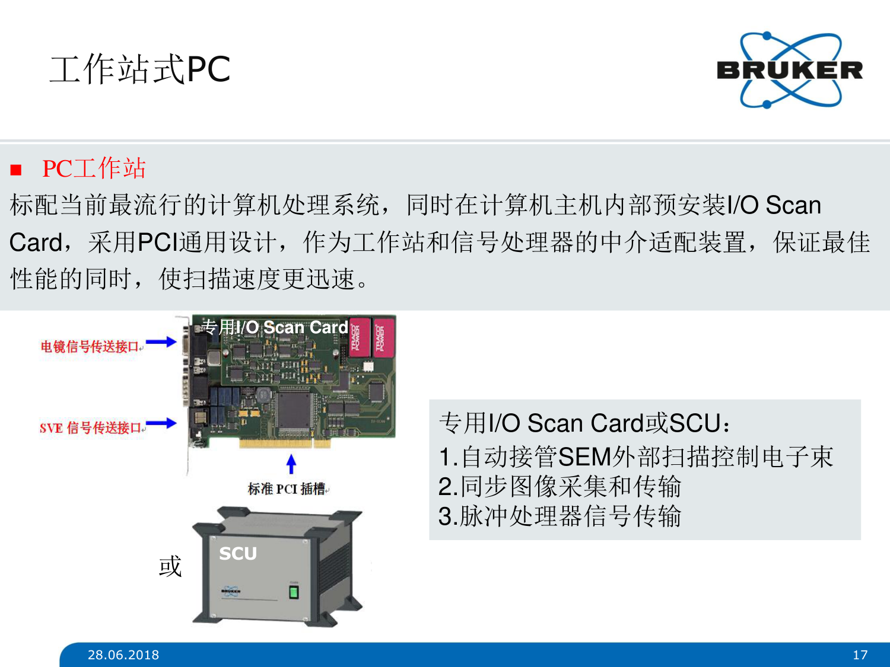

**[CN]**  
工作站硬件与扫描控制架构：  
1. PC 工作站：  
搭载专业多核工作站系统，预装 ESPRIT 分析软件包（如 ESPRIT 1.9 / 2.0），内建完整的特征 X 射线物理数据库、探测器效率曲线、原子散射截面与基体修正算法。  
2. 专用 I/O Scan Card / 信号扫描单元 (SCU)：  
• 自动接管 SEM 外部扫描控制：绕过电镜自带的低速显示卡，直接由能谱仪对电子枪偏转线圈施加高精度数模扫描信号。  
• 同步图像与能谱采集：在毫秒级像素驻留时间内，将同步采集的二次电子 (SE) 信号、背散射电子 (BSE) 信号与 X 射线事件关联至空间坐标 (X, Y)，实现全谱阵列存储（超谱成像 HyperMap，每个像素均包含完整 EDS 谱图）。  

**[PY]**  
gōng zuò zhàn yìng jiàn yǔ sǎo miáo kòng zhì jià gòu：  
1. PC gōng zuò zhàn：  
dā zài zhuān yè duō hé gōng zuò zhàn xì tǒng， yù zhuāng ESPRIT fēn xī ruǎn jiàn bāo（rú ESPRIT 1.9 / 2.0）， nèi jiàn wán zhěng de tè zhēng X shè xiàn wù lǐ shù jù kù、 tàn cè qì xiào lǜ qū xiàn、 yuán zi sǎn shè jié miàn yǔ jī tǐ xiū zhèng suàn fǎ。  
2. zhuān yòng I/O Scan Card / xìn hào sǎo miáo dān yuán (SCU)：  
• zì dòng jiē guǎn SEM wài bù sǎo miáo kòng zhì： rào guò diàn jìng zì dài de dī sù xiǎn shì kǎ， zhí jiē yóu néng pǔ yí duì diàn zi qiāng piān zhuǎn xiàn quān shī jiā gāo jīng dù shù mó sǎo miáo xìn hào。  
• tóng bù tú xiàng yǔ néng pǔ cǎi jí： zài háo miǎo jí xiàng sù zhù liú shí jiān nèi， jiāng tóng bù cǎi jí de èr cì diàn zi (SE) xìn hào、 bèi sǎn shè diàn zi (BSE) xìn hào yǔ X shè xiàn shì jiàn guān lián zhì kōng jiān zuò biāo (X, Y)， shí xiàn quán pǔ zhèn liè cún chǔ（chāo pǔ chéng xiàng HyperMap， měi gè xiàng sù jūn bāo hán wán zhěng EDS pǔ tú）。  

**[EN]**  
PC Workstation and Beam Scanning Architecture:  
1. Analytical PC Workstation:  
Equipped with ESPRIT software (ESPRIT 1.9 / 2.0) containing comprehensive fundamental physical parameters, detector quantum efficiency curves, and matrix correction models.  
2. Dedicated I/O Scan Card / Scanning Control Unit (SCU):  
• External Beam Control Takeover: Connects directly to the SEM deflection scan coils, applying high-speed digital scan DAC ramps.  
• Synchronized Multi-Signal Acquisition: Links secondary electron (SE), backscattered electron (BSE), and X-ray photon data to precise spatial coordinates (X, Y) within microsecond pixel dwell times, creating HyperMap spectral cubes where every pixel retains an independent spectrum.

---

## 5. 常见问题、故障排查与维护保养 / FAQs & Maintenance

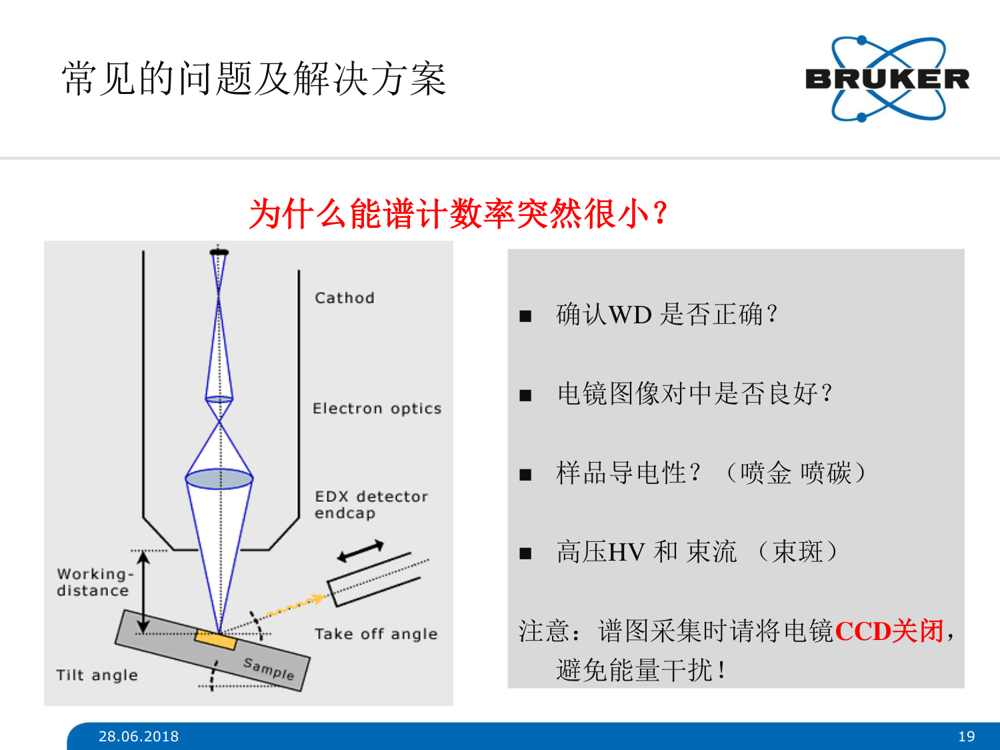

### 5.1 为什么能谱计数率突然明显偏小？
**[CN]**  
排查步骤与常见诱因：  
1. 工作距离 (WD) 是否处于 EDS 最佳几何聚焦位置？（例如电镜推荐分析高度 8.5 mm、10 mm 或 12 mm）。WD 偏移会导致探测器接收立体角严重减小。  
2. 电镜电子枪对中 (Gun Alignment) 是否正常？灯丝是否老化或饱和度衰减导致探针束流 (Probe Current) 剧降。  
3. 样品表面是否导电？若样品严重荷电（带负电荷），入射电子将被静电排斥减速，无法有效激发特征 X 射线。  
4. 高压 (HV) 是否满足该元素的临界激发能过压比 (Overvoltage Ratio, U = E0/Ec > 2)？  
5. 特别注意：在采集谱图时，请关闭电镜样品室内部红外 CCD 摄像机！CCD 发射的红外光子可能穿透超薄窗口进入探测器，产生严重干扰与能量偏移。  

**[PY]**  
pái chá bù zhòu yǔ cháng jiàn yòu yīn：  
1. gōng zuò jù lí (WD) shì fǒu chǔ yú EDS zuì jiā jǐ hé jù jiāo wèi zhì？（lì rú diàn jìng tuī jiàn fēn xī gāo dù 8.5 mm、10 mm huò 12 mm）。WD piān yí huì dǎo zhì tàn cè qì jiē shōu lì tǐ jiǎo yán zhòng jiǎn xiǎo。  
2. diàn jìng diàn zi qiāng duì zhōng (Gun Alignment) shì fǒu zhèng cháng？ dēng sī shì fǒu lǎo huà huò bǎo hé dù shuāi jiǎn dǎo zhì tàn zhēn shù liú (Probe Current) jù jiàng。  
3. yàng pǐn biǎo miàn shì fǒu dǎo diàn？ ruò yàng pǐn yán zhòng hé diàn（dài fù diàn hè）， rù shè diàn zi jiāng bèi jìng diàn pái chì jiǎn sù， wú fǎ yǒu xiào jī fā tè zhēng X shè xiàn。  
4. gāo yā (HV) shì fǒu mǎn zú gāi yuán sù de lín jiè jī fā néng guò yā bǐ (Overvoltage Ratio, U = E0/Ec > 2)？  
5. tè bié zhù yì： zài cǎi jí pǔ tú shí， qǐng guān bì diàn jìng yàng pǐn shì nèi bù hóng wài CCD shè xiàng jī！CCD fā shè de hóng wài guāng zi kě néng chuān tòu chāo báo chuāng kǒu jìn rù tàn cè qì， chǎn shēng yán zhòng gān rǎo yǔ néng liàng piān yí。  

**[EN]**  
Diagnostic Checklist for Sudden Count Rate Drop:  
1. Working Distance (WD): Verify that the sample height is positioned precisely at the calibrated EDS focal point (e.g. 8.5 mm or 10 mm). Off-axis vertical displacement drastically degrades solid angle collection.  
2. Electron Gun Alignment: Check filament saturation and beam alignment. Aging filaments or misaligned apertures cause sudden collapse of incident probe current.  
3. Sample Conductivity: Severe negative electrostatic charging repels primary incident electrons, collapsing excitation efficiency.  
4. Accelerating Voltage (HV): Ensure accelerating voltage satisfies the required overvoltage ratio (U = E0/Ec > 2).  
5. Crucial Precaution: Turn off the internal SEM chamber infrared CCD camera during acquisition! Stray near-IR photons can penetrate the ultra-thin window, causing severe baseline interference and peak artifacts.

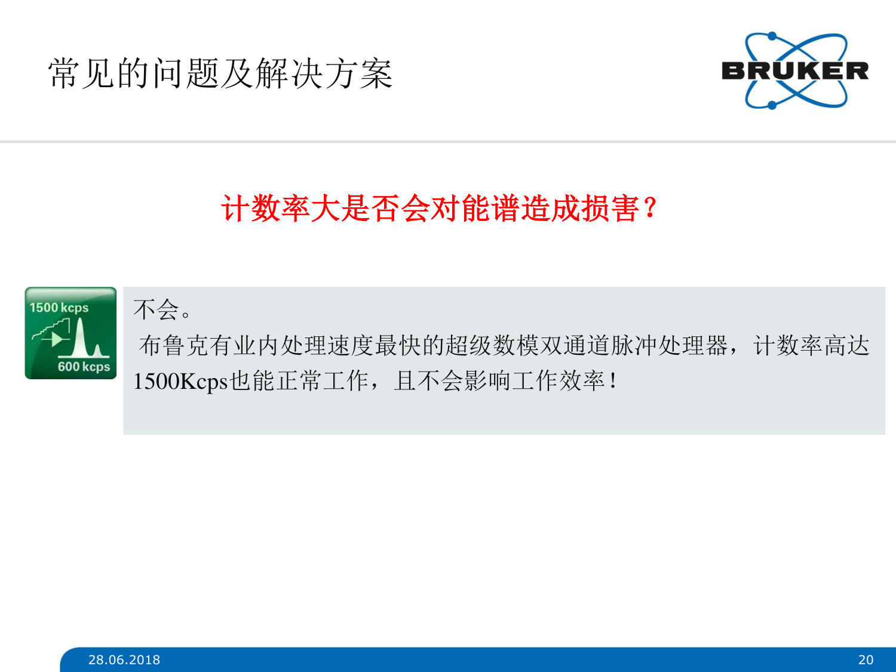

### 5.2 超大计数率是否会对 SDD 能谱仪造成损坏？
**[CN]**  
结论：不会损坏。  
布鲁克配有业内处理速度领先的双通道数模混合脉冲处理器，即使瞬时输入计数率高达 1,500 kcps (150万次/秒) 系统亦可正常工作，不会烧毁晶体或电路，且具备自动防堆积保护功能。  

**[PY]**  
jié lùn： bú huì sǔn huài。  
bù lǔ kè pèi yǒu yè nèi chǔ lǐ sù dù lǐng xiān de shuāng tōng dào shù mó hùn hé mài chōng chǔ lǐ qì， jí shǐ shùn shí shū rù jì shù lǜ gāo dá 1,500 kcps (150 wàn cì / miǎo ) xì tǒng yì kě zhèng cháng gōng zuò， bú huì shāo huǐ jīng tǐ huò diàn lù， qiě jù bèi zì dòng fáng duī jī bǎo hù gōng néng。  

**[EN]**  
Answer: No, it will not damage the instrument.  
Bruker SDD systems feature advanced hybrid pulse processors that operate reliably up to 1,500 kcps input flux without hardware degradation or sensor damage, incorporating automated pulse pile-up rejection circuits.

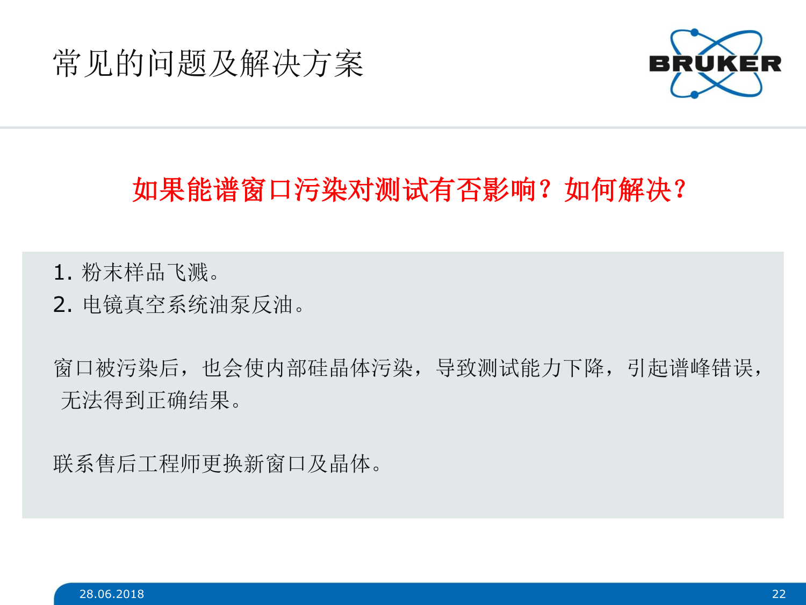

### 5.3 能谱工作对电镜高倍成像是否有干扰？窗口污染有何危害？
**[CN]**  
1. 电镜高倍成像干扰排查：  
正常情况下能谱不会干扰电镜成像。若出现微弱行扫描噪波，建议检查实验室地线网络，为能谱控制机柜与电镜提供独立的低阻抗接地。  
  
2. 窗口污染的危害与防范：  
• 污染来源：纳米粉末样品在抽真空或电子轰击下飞溅；油封机械泵返油导致碳氢化合物油膜冷凝于超薄窗口。  
• 后果：超薄窗口受到碳化油污或金属微尘污染后，低能 X 射线（C, N, O 等）被强烈吸收，且窗口外侧污染可能向内部硅晶体表面扩散，导致低能谱峰畸变、计数率暴跌并严重恶化定量准确度。  
• 处理方案：不可自行用溶剂清洗超薄窗口，必须联系布鲁克官方售后工程师在超净环境下进行晶体维护或更换组件。  

**[PY]**  
1. diàn jìng gāo bèi chéng xiàng gān rǎo pái chá：  
zhèng cháng qíng kuàng xià néng pǔ bú huì gān rǎo diàn jìng chéng xiàng。 ruò chū xiàn wēi ruò xíng sǎo miáo zào bō， jiàn yì jiǎn chá shí yàn shì dì xiàn wǎng luò， wèi néng pǔ kòng zhì jī guì yǔ diàn jìng tí gōng dú lì de dī zǔ kàng jiē dì。  
2. chuāng kǒu wū rǎn de wēi hài yǔ fáng fàn：  
• wū rǎn lái yuán： nà mǐ fěn mò yàng pǐn zài chōu zhēn kōng huò diàn zi hōng jī xià fēi jiàn； yóu fēng jī xiè bèng fǎn yóu dǎo zhì tàn qīng huà hé wù yóu mó lěng níng yú chāo báo chuāng kǒu。  
• hòu guǒ： chāo báo chuāng kǒu shòu dào tàn huà yóu wū huò jīn shǔ wēi chén wū rǎn hòu， dī néng X shè xiàn（C, N, O děng） bèi qiáng liè xī shōu， qiě chuāng kǒu wài cè wū rǎn kě néng xiàng nèi bù guī jīng tǐ biǎo miàn kuò sàn， dǎo zhì dī néng pǔ fēng jī biàn、 jì shù lǜ bào diē bìng yán zhòng è huà dìng liàng zhǔn què dù。  
• chǔ lǐ fāng àn： bù kě zì xíng yòng róng jì qīng xǐ chāo báo chuāng kǒu， bì xū lián xì bù lǔ kè guān fāng shòu hòu gōng chéng shī zài chāo jìng huán jìng xià jìn xíng jīng tǐ wéi hù huò gēng huàn zǔ jiàn。  

**[EN]**  
1. High-Magnification SEM Imaging Interference:  
EDS detectors operate passively without emitting magnetic or electrostatic fields that disturb electron trajectories. If image ripple or interference appears, inspect building ground loops and implement dedicated low-impedance grounding.  
  
2. Thin-Window Contamination Hazards:  
• Contamination Sources: Loose nanoparticle splashing during rapid evacuation, and hydrocarbon oil backstreaming from mechanical rotary pumps.  
• Consequences: Contaminants deposit an absorbing layer on the ultra-thin polymer window, heavily attenuating soft X-rays (Be, B, C, N, O) and distorting light-element peak ratios.  
• Remediation: Never attempt manual chemical cleaning of the delicate window; specialized service engineers must inspect and replace the window assembly under cleanroom protocols.

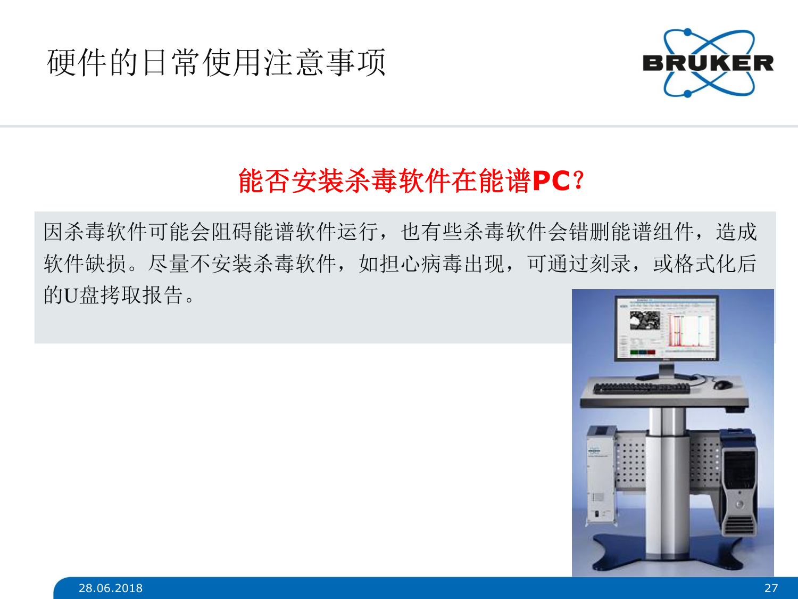

### 5.4 环境温湿度、BSE 探头防碰撞与杀毒软件注意事项
**[CN]**  
1. 环境存放条件：  
存放温度：-10 °C ~ +50 °C；环境相对湿度：< 90 % RH；工作供电：100 - 240 VAC, 50/60 Hz，整套系统总功耗约 50 W（包含 SDD 探头制冷）。实验室标准恒温恒湿空调即可满足。  
  
2. 外进型背散射电子 (BSE) 探头防碰撞：  
使用插入式 (Retractable) BSE 探头时，在机械推进 BSE 探头前，必须首先在电镜面板上确认能谱探头已后退至安全标尺位置，防止两个探头在样品台上方发生物理撞击！  
  
3. 能谱工作站 PC 杀毒软件使用禁忌：  
商业杀毒软件后台扫描可能占用高速实时总线中断，阻碍 I/O Scan-Card 数据包实时传输，甚至将 ESPRIT 的核心底层驱动 DLL 文件误报误删。建议能谱工作站专机专用，脱离公网运行，数据拷贝使用经过格式化杀毒的安全专用 U 盘。  

**[PY]**  
1. huán jìng cún fàng tiáo jiàn：  
cún fàng wēn dù：-10 °C ~ +50 °C； huán jìng xiāng duì shī dù：< 90 % RH； gōng zuò gōng diàn：100 - 240 VAC, 50/60 Hz， zhěng tào xì tǒng zǒng gōng hào yuē 50 W（bāo hán SDD tàn tóu zhì lěng）。 shí yàn shì biāo zhǔn héng wēn héng shī kōng tiáo jí kě mǎn zú。  
2. wài jìn xíng bèi sǎn shè diàn zi (BSE) tàn tóu fáng pèng zhuàng：  
shǐ yòng chā rù shì (Retractable) BSE tàn tóu shí， zài jī xiè tuī jìn BSE tàn tóu qián， bì xū shǒu xiān zài diàn jìng miàn bǎn shàng què rèn néng pǔ tàn tóu yǐ hòu tuì zhì ān quán biāo chǐ wèi zhì， fáng zhǐ liǎng gè tàn tóu zài yàng pǐn tái shàng fāng fā shēng wù lǐ zhuàng jī！  
3. néng pǔ gōng zuò zhàn PC shā dú ruǎn jiàn shǐ yòng jìn jì：  
shāng yè shā dú ruǎn jiàn hòu tái sǎo miáo kě néng zhàn yòng gāo sù shí shí zǒng xiàn zhōng duàn， zǔ ài I/O Scan-Card shù jù bāo shí shí chuán shū， shèn zhì jiāng ESPRIT de hé xīn dǐ céng qū dòng DLL wén jiàn wù bào wù shān。 jiàn yì néng pǔ gōng zuò zhàn zhuān jī zhuān yòng， tuō lí gōng wǎng yùn xíng， shù jù kǎo bèi shǐ yòng jīng guò gé shì huà shā dú de ān quán zhuān yòng U pán。  

**[EN]**  
1. Environmental Specifications:  
Storage temperature: -10 °C to +50 °C; Relative humidity: < 90% RH; Power: 100-240 VAC 50/60 Hz, total power consumption ~50 W (including Peltier active cooling).  
  
2. Retractable BSE Detector Collision Prevention:  
When inserting an external mechanical BSE detector, verify that the EDS detector nose has been retracted to its safe clearance mark to avoid severe mechanical collisions in the pole piece region!  
  
3. Workstation Antivirus Precautions:  
Third-party aggressive antivirus software can intercept kernel PCIe/USB interrupt threads, stalling high-rate acquisition, or mistakenly quarantine proprietary ESPRIT runtime libraries. Keep the analytical PC offline and use dedicated formatted USB drives for data transfers.

---

## 6. 能量轴校准操作指南 / Energy Axis Calibration Guide

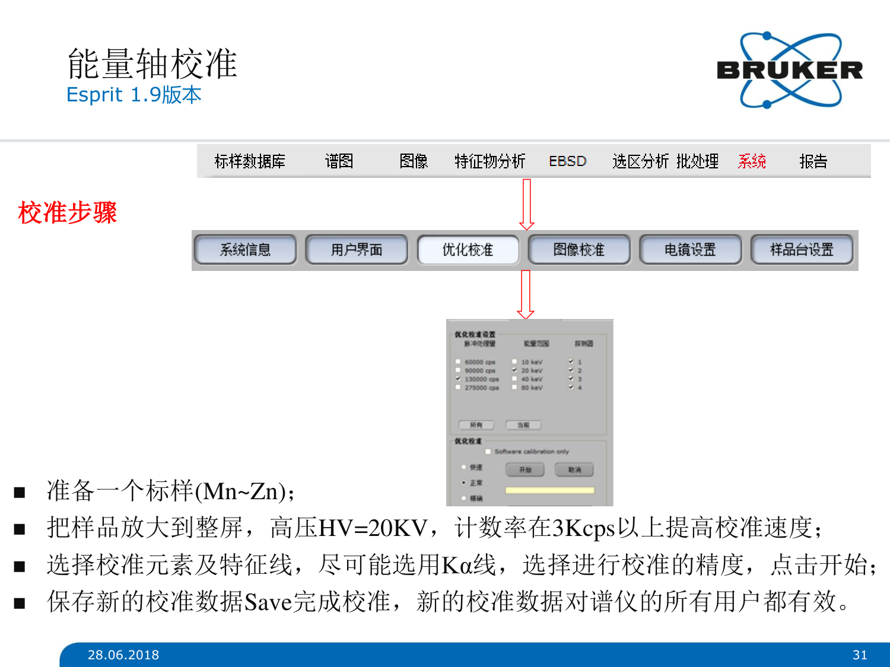

### 6.1 校准判定标准
**[CN]**  
何时必须进行能量轴校准？  
当实验谱图实测的特征 X 射线特征峰中心能量与理论线系能量的偏差绝对值 |ΔE| > 5 eV 时，必须立即执行能量轴校准！  
若偏差超过 5 eV，会导致定性分析自动寻峰误判元素（例如引起 S 与 Mo, Ti 与 V, Ba 与 Ti 的混淆），并严重影响去卷积拟合 (Peak Deconvolution) 与定量分析精度。  

**[PY]**  
hé shí bì xū jìn xíng néng liàng zhóu jiào zhǔn？  
dāng shí yàn pǔ tú shí cè de tè zhēng X shè xiàn tè zhēng fēng zhōng xīn néng liàng yǔ lǐ lùn xiàn xì néng liàng de piān chā jué duì zhí |ΔE| > 5 eV shí， bì xū lì jí zhí xíng néng liàng zhóu jiào zhǔn！  
ruò piān chā chāo guò 5 eV， huì dǎo zhì dìng xìng fēn xī zì dòng xún fēng wù pàn yuán sù（lì rú yǐn qǐ S yǔ Mo, Ti yǔ V, Ba yǔ Ti de hùn xiáo）， bìng yán zhòng yǐng xiǎng qù juǎn jī nǐ hé (Peak Deconvolution) yǔ dìng liàng fēn xī jīng dù。  

**[EN]**  
Energy Axis Calibration Criterion:  
A calibration is strictly required whenever the deviation between the observed peak centroid and theoretical line energy exceeds:  
|ΔE| > 5 eV  
Energy shifts greater than 5 eV induce misidentification during automated peak indexing (e.g., misclassifying S-K vs Mo-L, Ti-K vs Ba-L) and severely degrade peak deconvolution models.

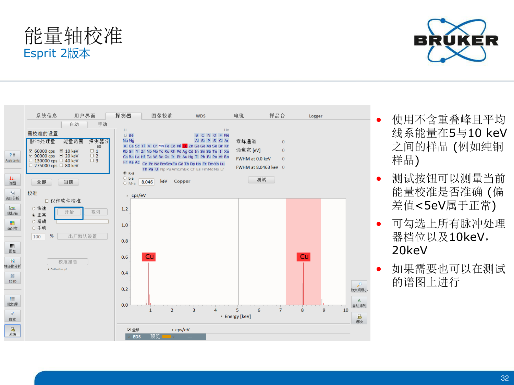

### 6.2 详细校准操作步骤 (Esprit 1.9 & Esprit 2.0)
**[CN]**  
标准化校准流程：  
1. 准备标准样品：  
   推荐选用高纯铜 (Pure Cu, 99.99%) 或铜-锌合金、纯锰 (Mn)。高纯 Cu 具有低能 Cu-Lα (0.930 keV) 与中能 Cu-Kα (8.040 keV)，非常适合进行跨能区的双点增益与零点校准。  
2. 设定电镜分析条件：  
   • 加速电压 HV = 20 kV（保证充分激发 Cu-Kα，Ec = 8.98 keV，过压比满足要求）；  
   • 调节样品台至标准分析工作距离 (WD)；  
   • 调整光阑与束流，使输入计数率在 3,000 cps (3 kcps) 以上，以快速累积统计计数。  
3. 软件校准执行 (ESPRIT 2.0)：  
   • 打开能量校准工具 (Energy Calibration Tool)；  
   • 点击 [Test] 按钮测量当前各成形时间档位下的实际能量偏差；  
   • 勾选所有脉冲处理器处理时间档位 (Shaping Time / Process Time P1 ~ P6) 以及 10 keV / 20 keV 范围；  
   • 点击 [Start Calibration]，软件自动进行多峰拟合与斜率/截距微调；  
   • 校准完成后点击 [Save] 保存校准配置文件，该校准参数即刻对系统所有用户生效。  

**[PY]**  
biāo zhǔn huà jiào zhǔn liú chéng：  
1. zhǔn bèi biāo zhǔn yàng pǐn：  
tuī jiàn xuǎn yòng gāo chún tóng (Pure Cu, 99.99%) huò tóng - xīn hé jīn、 chún měng (Mn)。 gāo chún Cu jù yǒu dī néng Cu-Lα (0.930 keV) yǔ zhōng néng Cu-Kα (8.040 keV)， fēi cháng shì hé jìn xíng kuà néng qū de shuāng diǎn zēng yì yǔ líng diǎn jiào zhǔn。  
2. shè dìng diàn jìng fēn xī tiáo jiàn：  
• jiā sù diàn yā HV = 20 kV（bǎo zhèng chōng fèn jī fā Cu-Kα，Ec = 8.98 keV， guò yā bǐ mǎn zú yāo qiú）；  
• tiáo jié yàng pǐn tái zhì biāo zhǔn fēn xī gōng zuò jù lí (WD)；  
• tiáo zhěng guāng lán yǔ shù liú， shǐ shū rù jì shù lǜ zài 3,000 cps (3 kcps) yǐ shàng， yǐ kuài sù lěi jī tǒng jì jì shù。  
3. ruǎn jiàn jiào zhǔn zhí xíng (ESPRIT 2.0)：  
• dǎ kāi néng liàng jiào zhǔn gōng jù (Energy Calibration Tool)；  
• diǎn jī [Test] àn niǔ cè liáng dāng qián gè chéng xíng shí jiān dàng wèi xià de shí jì néng liàng piān chā；  
• gōu xuǎn suǒ yǒu mài chōng chǔ lǐ qì chǔ lǐ shí jiān dàng wèi (Shaping Time / Process Time P1 ~ P6) yǐ jí 10 keV / 20 keV fàn wéi；  
• diǎn jī [Start Calibration]， ruǎn jiàn zì dòng jìn xíng duō fēng nǐ hé yǔ xié lǜ / jié jù wēi diào；  
• jiào zhǔn wán chéng hòu diǎn jī [Save] bǎo cún jiào zhǔn pèi zhì wén jiàn， gāi jiào zhǔn cān shù jí kè duì xì tǒng suǒ yǒu yòng hù shēng xiào。  

**[EN]**  
Standard Operating Procedure (SOP) for Calibration:  
1. Standard Specimen:  
   High-purity Copper (Cu, 99.99%) is strongly recommended. Cu provides both low-energy Cu-Lα (0.930 keV) and high-energy Cu-Kα (8.040 keV), enabling precise two-point zero and gain calibration.  
2. SEM Operating Conditions:  
   • High Voltage: HV = 20 kV (ensures optimal overvoltage excitation of Cu-Kα at 8.04 keV).  
   • Working Distance: Set accurately to calibrated EDS focal distance.  
   • Probe Current: Adjust beam current to achieve input count rates > 3,000 cps (3 kcps) for rapid counting statistics.  
3. ESPRIT 2.0 Execution Steps:  
   • Open the Energy Calibration dialog window.  
   • Press [Test] to evaluate current peak centroid offsets across active process times.  
   • Check all pulse processor shaping tiers (Process Times P1 through P6) across 10 keV and 20 keV ranges.  
   • Click [Start Calibration] to initiate automated spectral curve-fitting and electronic zero/gain calibration.  
   • Click [Save] to commit the new calibration matrix to system firmware for all users.

---

## 7. 关键技术术语对照表 / Key Technical Glossary

| 中文术语 (Chinese) | 汉语拼音 (Hanyu Pinyin) | 英文术语 (English) | 技术释义 (Technical Definition) |
| :--- | :--- | :--- | :--- |
| **硅漂移探测器** | guī piāo yí tàn cè qì | Silicon Drift Detector (SDD) | 基于同心环状阴极与中心微小阳极的高性能半导体 X 射线探测器 |
| **准直器** | zhǔn zhí qì | Collimator | 安装于探头前端用于遮挡镜筒内散射及杂散 X 射线的屏蔽装置 |
| **电子陷阱** | diàn zǐ xiàn jǐng | Magnetic Electron Trap | 利用磁场偏转背散射电子以保护硅晶体及消除连续背底假象的装置 |
| **超薄窗口** | chāo báo chuāng kǒu | Ultra-Thin Window (UTW) | 隔离真空并容许低能特征 X 射线穿透的高分子聚合物薄膜 (如 AP3.3) |
| **脉冲处理器** | mài chōng chǔ lǐ qì | Pulse Processor (SVE) | 负责信号基线恢复、成形放大与噪声鉴别的核心信号处理单元 |
| **多通道分析仪** | duō tōng dào fēn xī yí | Multi-Channel Analyzer (MCA) | 将模拟电压脉冲转换为多通道能谱计数值的数字处理系统 (4096 通道) |
| **输入计数率** | shū rù jì shù lǜ | Input Count Rate (ICR) | 探测器晶体单位时间内接收到的全部 X 射线光子脉冲总频次 |
| **输出计数率** | shū chū jì shù lǜ | Output Count Rate (OCR) | 脉冲处理器剔除堆积脉冲后有效计入谱图的脉冲频次 |
| **死时间** | sǐ shí jiān | Dead Time (%) | 信号处理器处于脉冲处理重置状态而无法记录新事件的时间比例 |
| **工作距离** | gōng zuò jù lí | Working Distance (WD) | 扫描电镜极靴下表面到样品上表面的垂直物理间距 |
| **能量轴校准** | néng liàng zhóu jiào zhǔn | Energy Axis Calibration | 对能谱能量刻度零点偏移与增益斜率进行精密校准的操作 (|ΔE| < 5 eV) |

---

# Module 2: 一、EDS 分析原理及分析技术
# Module 2: EDS Analytical Principles and Analytical Techniques

---

## 目录 / Table of Contents
1. [SEM/EDS 物理信号与特征 X 射线激发原理 / Physics of SEM Signals & Characteristic X-rays](#1-semeds-物理信号与特征-x-射线激发原理--physics-of-sem-signals--characteristic-x-rays)
2. [连续 X 射线（韧致辐射）与谱峰伪像 / Continuum X-rays & Spectral Artifacts](#2-连续-x-射线韧致辐射与谱峰伪像--continuum-x-rays--spectral-artifacts)
3. [扫描电镜 (SEM) 性能对能谱定量结果的影响 / SEM Performance Impact on EDS Results](#3-扫描电镜-sem-性能对能谱定量结果的影响--sem-performance-impact-on-eds-results)
4. [环境电镜 (ESEM) 与低真空电镜 (LV-SEM) 的气体裙散效应 / Gas Skirt Scattering in ESEM & LV-SEM](#4-环境电镜-esem-与低真空电镜-lv-sem-的气体裙散效应--gas-skirt-scattering-in-esem--lv-sem)
5. [能谱仪 (EDS) 的演进与 SDD 技术飞跃 / Evolution of EDS & SDD Innovations](#5-能谱仪-eds-的演进与-sdd-技术飞跃--evolution-of-eds--sdd-innovations)
6. [SEM/EDS 分析的主要核心特点 / Core Features of SEM/EDS Microanalysis](#6-semeds-分析的主要核心特点--core-features-of-semeds-microanalysis)
7. [EDS 关键分析条件的选择准则 / Selection Rules for Optimal Analytical Conditions](#7-eds-关键分析条件的选择准则--selection-rules-for-optimal-analytical-conditions)
8. [激发体积、空间分辨率与低电压分析技术 / Interaction Volume, Spatial Resolution & Low-kV Techniques](#8-激发体积空间分辨率与低电压分析技术--interaction-volume-spatial-resolution--low-kv-techniques)
9. [光束束流、活时间与死时间优化 / Beam Current, Live Time & Dead Time Optimization](#9-光束束流活时间与死时间优化--beam-current-live-time--dead-time-optimization)
10. [关键技术术语对照表 / Key Technical Glossary](#10-关键技术术语对照表--key-technical-glossary)

---

## 1. SEM/EDS 物理信号与特征 X 射线激发原理 / Physics of SEM Signals & Characteristic X-rays

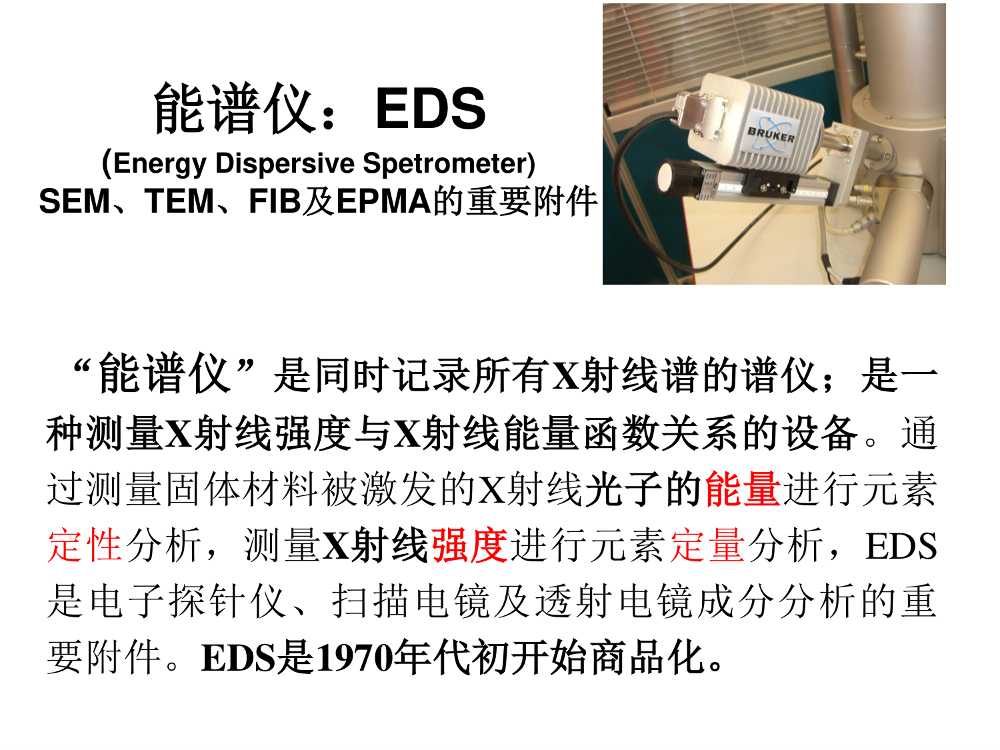

**[CN]**  
高能入射电子束与固体样品相互作用激发的物理信号：  
当能量为 E0 的初级聚焦电子束轰击固体样品表面时，电子在样品内部经历弹性散射与非弹性散射，激发出多种物理信号：  
1. 二次电子 (Secondary Electrons, SE)：能量通常小于 50 eV，主要由非弹性碰撞从原子外层激发，产生于样品极表层 (几纳米)，对表面微观形貌与粗糙度极度敏感。  
2. 背散射电子 (Backscattered Electrons, BSE)：能量接近入射电子能量 (高能弹性散射)，发射产率随样品原子序数 Z 增大而显著增加，提供成分衬度 (Atomic Number Contrast)。  
3. 特征 X 射线 (Characteristic X-rays)：入射高能电子使原子内壳层电子电离逸出，外层电子向内层空位跃迁时释放具有元素特征能量的光子 (ΔE = E外 - E内)。  
4. 连续 X 射线（韧致辐射 / Bremsstrahlung）：入射电子受原子核库仑场库仑减速辐射出的连续光谱。  
5. 俄歇电子 (Auger Electrons, AE)：内层电离后能量未以 X 射线形式辐射，而是直接转移激发发射的外层单能电子。  
6. 阴极发光 (Cathodoluminescence, CL)：价带-导带跃迁产生的光学光子。  

**[PY]**  
gāo néng rù shè diàn zi shù yǔ gù tǐ yàng pǐn xiāng hù zuò yòng jī fā de wù lǐ xìn hào：  
dāng néng liàng wèi E0 de chū jí jù jiāo diàn zi shù hōng jī gù tǐ yàng pǐn biǎo miàn shí， diàn zi zài yàng pǐn nèi bù jīng lì tán xìng sǎn shè yǔ fēi tán xìng sǎn shè， jī fā chū duō zhǒng wù lǐ xìn hào：  
1. èr cì diàn zi (Secondary Electrons, SE)： néng liàng tōng cháng xiǎo yú 50 eV， zhǔ yào yóu fēi tán xìng pèng zhuàng cóng yuán zi wài céng jī fā， chǎn shēng yú yàng pǐn jí biǎo céng ( jǐ nà mǐ )， duì biǎo miàn wēi guān xíng mào yǔ cū cāo dù jí dù mǐn gǎn。  
2. bèi sǎn shè diàn zi (Backscattered Electrons, BSE)： néng liàng jiē jìn rù shè diàn zi néng liàng ( gāo néng tán xìng sǎn shè )， fā shè chǎn lǜ suí yàng pǐn yuán zi xù shù Z zēng dà ér xiǎn zhù zēng jiā， tí gōng chéng fèn chèn dù (Atomic Number Contrast)。  
3. tè zhēng X shè xiàn (Characteristic X-rays)： rù shè gāo néng diàn zi shǐ yuán zi nèi ké céng diàn zi diàn lí yì chū， wài céng diàn zi xiàng nèi céng kòng wèi yuè qiān shí shì fàng jù yǒu yuán sù tè zhēng néng liàng de guāng zi (ΔE = E wài - E nèi )。  
4. lián xù X shè xiàn（rèn zhì fú shè / Bremsstrahlung）： rù shè diàn zi shòu yuán zǐ hé kù lún chǎng kù lún jiǎn sù fú shè chū de lián xù guāng pǔ。  
5. é xiē diàn zi (Auger Electrons, AE)： nèi céng diàn lí hòu néng liàng wèi yǐ X shè xiàn xíng shì fú shè， ér shì zhí jiē zhuǎn yí jī fā fā shè de wài céng dān néng diàn zi。  
6. yīn jí fā guāng (Cathodoluminescence, CL)： jià dài - dǎo dài yuè qiān chǎn shēng de guāng xué guāng zi。  

**[EN]**  
Physical Signals Generated by Electron-Matter Interactions:  
When a primary focused electron beam with accelerating energy E0 strikes a solid specimen, it undergoes elastic and inelastic scattering, generating diverse analytical signals:  
1. Secondary Electrons (SE): Kinetic energies typically < 50 eV, emitted via inelastic excitation of valence/conduction electrons within the uppermost nanometers, yielding high-resolution surface topographic contrast.  
2. Backscattered Electrons (BSE): High-energy elastically scattered primary electrons. The backscattering coefficient η scales monotonically with atomic number Z, generating compositional phase contrast.  
3. Characteristic X-rays: Incident electrons knock out inner-shell core electrons. The vacant orbital is filled by an outer-shell transition, emitting a photon whose discrete energy equals the shell binding energy difference (ΔE = E_outer - E_inner).  
4. Continuum X-rays (Bremsstrahlung): Continuous electromagnetic radiation emitted as decelerating electrons brake within atomic nuclear Coulomb fields.  
5. Auger Electrons (AE): Non-radiative de-excitation electrons carrying discrete element-specific kinetic energies from the outermost atomic layers.  
6. Cathodoluminescence (CL): UV-visible-NIR light emission generated by electron-hole recombination across semiconductor/insulator bandgaps.

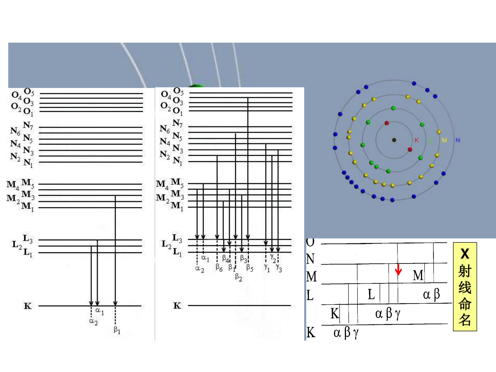

### 1.1 特征 X 射线线系跃迁命名与莫塞莱定律 (Moseley's Law)
**[CN]**  
原子壳层与 X 射线辐射机制：  
1. 壳层结构与线系：  
   原子核外电子分布在 K、L、M、N 等轨道。  
   • K 线系：内壳层空位位于 K 层 (n=1)。由 L 层电子向 K 层跃迁发射 Kα 射线；由 M 层电子向 K 层跃迁发射 Kβ 射线。  
   • L 线系：内层空位位于 L 层 (n=2)。由 M 层电子跃迁发射 Lα、Lβ，由 N 层电子跃迁发射 Lγ 射线。  
   • M 线系：内层空位位于 M 层 (n=3)。由外层电子向 M 层跃迁发射 Mα、Mβ 射线。  
2. 莫塞莱定律 (Moseley's Law)：  
   特征 X 射线频率 ν 与原子序数 Z 具有严格的单调递增代数关系：  
   sqrt(ν) = C * (Z - σ)  
   该定律证明了特征 X 射线能量是元素的原子物理固有常数，是定性识别元素种类的绝对基准。  
3. 荧光产额 (Fluorescence Yield, ω)：  
   内壳层电离后，产生特征 X 射线光子的几率称为荧光产额 ω，产生俄歇电子的几率称为俄歇跃迁率 (a)。  
   ω + a = 1  
   对于轻元素 (Z < 10)，俄歇跃迁占绝大多数，荧光产额 ω 极低 (ω < 0.01)；随原子序数增加，特征 X 射线辐射几率显著上升。  

**[PY]**  
yuán zi ké céng yǔ X shè xiàn fú shè jī zhì：  
1. ké céng jié gòu yǔ xiàn xì：  
yuán zǐ hé wài diàn zi fēn bù zài K、L、M、N děng guǐ dào。  
• K xiàn xì： nèi ké céng kòng wèi wèi yú K céng (n=1)。 yóu L céng diàn zi xiàng K céng yuè qiān fā shè Kα shè xiàn； yóu M céng diàn zi xiàng K céng yuè qiān fā shè Kβ shè xiàn。  
• L xiàn xì： nèi céng kòng wèi wèi yú L céng (n=2)。 yóu M céng diàn zi yuè qiān fā shè Lα、Lβ， yóu N céng diàn zi yuè qiān fā shè Lγ shè xiàn。  
• M xiàn xì： nèi céng kòng wèi wèi yú M céng (n=3)。 yóu wài céng diàn zi xiàng M céng yuè qiān fā shè Mα、Mβ shè xiàn。  
2. mò sāi lái dìng lǜ (Moseley's Law)：  
tè zhēng X shè xiàn pín lǜ ν yǔ yuán zi xù shù Z jù yǒu yán gé de dān diào dì zēng dài shù guān xì：  
sqrt(ν) = C * (Z - σ)  
gāi dìng lǜ zhèng míng liǎo tè zhēng X shè xiàn néng liàng shì yuán sù de yuán zi wù lǐ gù yǒu cháng shù， shì dìng xìng shí bié yuán sù zhǒng lèi de jué duì jī zhǔn。  
3. yíng guāng chǎn é (Fluorescence Yield, ω)：  
nèi ké céng diàn lí hòu， chǎn shēng tè zhēng X shè xiàn guāng zi de jī lǜ chēng wéi yíng guāng chǎn é ω， chǎn shēng é xiē diàn zi de jī lǜ chēng wéi é xiē yuè qiān lǜ (a)。  
ω + a = 1  
duì yú qīng yuán sù (Z < 10)， é xiē yuè qiān zhàn jué dà duō shù， yíng guāng chǎn é ω jí dī (ω < 0.01)； suí yuán zi xù shù zēng jiā， tè zhēng X shè xiàn fú shè jī lǜ xiǎn zhù shàng shēng。  

**[EN]**  
Atomic Shell De-excitation and Moseley's Law:  
1. Shell Structure & Line Designations:  
   Atomic electrons occupy K, L, M, and N quantum energy levels.  
   • K-Series: Core vacancy resides in the K shell (n=1). Transitions from L to K emit Kα photons; transitions from M to K emit Kβ photons.  
   • L-Series: Core vacancy resides in the L subshells (n=2). Transitions from M emit Lα and Lβ; transitions from N emit Lγ photons.  
   • M-Series: Core vacancy resides in the M shell (n=3), populated by transitions from upper subshells producing Mα and Mβ.  
2. Moseley's Law:  
   The frequency ν of characteristic X-rays correlates directly with atomic number Z:  
   sqrt(ν) = C * (Z - σ)  
   This fundamental law confirms that characteristic X-ray photon energies are elemental physical constants, establishing the invariant basis for chemical qualitative identification.  
3. Fluorescence Yield (ω):  
   The probability that an inner-shell ionization event terminates in characteristic photon emission is the fluorescence yield ω, competing with non-radiative Auger emission (a):  
   ω + a = 1  
   For light elements (Z < 10), Auger emission dominates overwhelmingly and ω is extremely low (ω < 0.01). Fluorescence yield increases sharply with atomic number Z.

---

## 2. 连续 X 射线（韧致辐射）与谱峰伪像 / Continuum X-rays & Spectral Artifacts

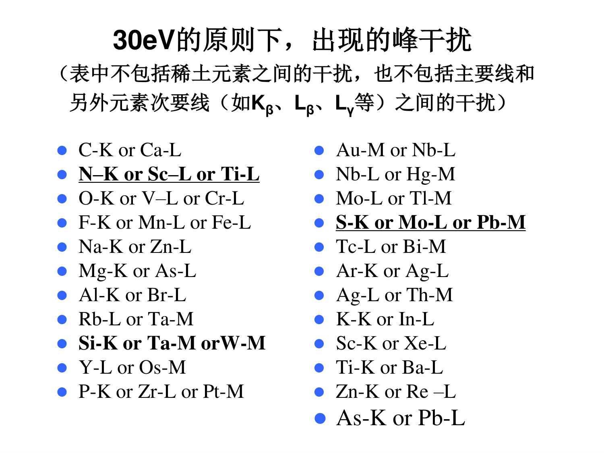

### 2.1 连续谱（韧致辐射）与杜安-亨特定律 (Duane-Hunt Limit)
**[CN]**  
连续 X 射线形成机理与能量截止极限：  
1. 韧致辐射 (Bremsstrahlung)：  
   入射电子穿透样品时，受原子核库仑电场偏转而减速。根据经典电动力学，带电粒子减速时必须向外辐射电磁波。由于电子每次减速损失的动能是随机连续分布的，因而形成连续能量分布的背底谱图。  
2. 杜安-亨特极限 (Duane-Hunt Limit, E_max)：  
   若入射电子在一次正面极端碰撞中将其全部动能瞬间完全转化为一个光子，该光子具有理论最高截止能量：  
   E_max = e * V0 (其中 V0 为电镜加速电压)  
   实测连续谱在 E_max 处计数骤降归零。这为实验人员校核电镜加速电压示值精度提供了直接依据。  

**[PY]**  
lián xù X shè xiàn xíng chéng jī lǐ yǔ néng liàng jié zhǐ jí xiàn：  
1. rèn zhì fú shè (Bremsstrahlung)：  
rù shè diàn zi chuān tòu yàng pǐn shí， shòu yuán zǐ hé kù lún diàn chǎng piān zhuǎn ér jiǎn sù。 gēn jù jīng diǎn diàn dòng lì xué， dài diàn lì zi jiǎn sù shí bì xū xiàng wài fú shè diàn cí bō。 yóu yú diàn zi měi cì jiǎn sù sǔn shī de dòng néng shì suí jī lián xù fēn bù de， yīn ér xíng chéng lián xù néng liàng fēn bù de bèi dǐ pǔ tú。  
2. dù ān - hēng tè jí xiàn (Duane-Hunt Limit, E_max)：  
ruò rù shè diàn zi zài yī cì zhèng miàn jí duān pèng zhuàng zhōng jiàng qí quán bù dòng néng shùn jiān wán quán zhuǎn huà wèi yí gè guāng zi， gāi guāng zi jù yǒu lǐ lùn zuì gāo jié zhǐ néng liàng：  
E_max = e * V0 ( qí zhōng V0 wèi diàn jìng jiā sù diàn yā )  
shí cè lián xù pǔ zài E_max chù jì shù zhòu jiàng guī líng。 zhè wèi shí yàn rén yuán jiào hé diàn jìng jiā sù diàn yā shì zhí jīng dù tí gōng le zhí jiē yī jù。  

**[EN]**  
Continuum Generation and the Duane-Hunt Limit:  
1. Bremsstrahlung Background:  
   As primary incident electrons penetrate the solid, they are decelerated in the Coulombic fields of target atomic nuclei. This deceleration radiates continuous electromagnetic energy. Because kinetic energy loss per interaction is stochastic, this manifests as a smooth continuum background across the spectrum.  
2. Duane-Hunt High-Energy Cutoff:  
   If an incident electron expends 100% of its kinetic energy in a single decelerating event, the resulting photon attains the theoretical maximum cutoff energy:  
   E_max = e * V0 (where V0 is the SEM accelerating voltage)  
   The continuum drops sharply to zero counts at E_max, providing an instantaneous in-situ calibration test of actual electron gun accelerating voltage.

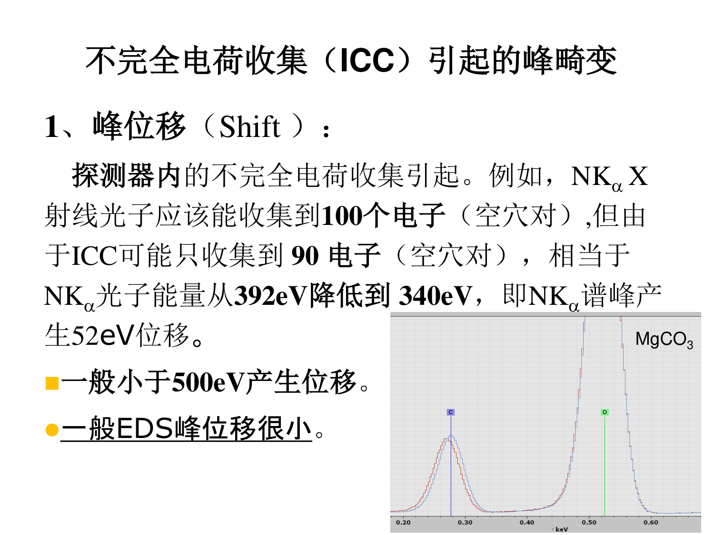

### 2.2 能谱常见伪峰与峰形畸变 (Spectral Artifacts & Deformations)
**[CN]**  
在能谱分析中，必须准确鉴别以下非样品固有特征峰的假象峰 (Artifact Peaks)：  
1. 逃逸峰 (Escape Peak, E_esc = E - 1.74 keV)：  
   当高能 X 射线光子（如 Fe-Kα, 6.40 keV）射入硅探测器时，可能激发硅晶体本身的 Si-Kα 特征 X 射线 (1.74 keV)。若该 Si-Kα 光子未被收集而是从探测器表面泄漏逃逸，探测器记录到的残余能量恰好为 (E - 1.74 keV)。软件通常可自动执行去逃逸峰算法。  
2. 堆积峰 / 和峰 (Sum Peak / Pile-up Peak, E_sum = 2E1 或 E1 + E2)：  
   当输入计数率过高时，两个光子在极短纳秒时间间隔内几乎同时射入探测器，脉冲处理器将其误识别为一个单脉冲，记录在两者能量之和的通道处（例如高计数纯 Ti 样品谱中在 2 * 4.51 = 9.02 keV 处出现明显的 Ti+Ti 堆积峰）。  
3. 不完全电荷收集 (Incomplete Charge Collection, ICC)：  
   发生在探测器死层或边缘微区，光生电子空穴对发生部分复合，导致谱峰向低能端漂移并形成不对称的低能拖尾“展台” (Shelf)。  
4. 系统峰 (System Peaks)：  
   镜筒内部构件被背散射电子打出的杂散信号，常见 Al, Fe, Cu, Zn 杂峰。  

**[PY]**  
zài néng pǔ fēn xī zhōng， bì xū zhǔn què jiàn bié yǐ xià fēi yàng pǐn gù yǒu tè zhēng fēng de jiǎ xiàng fēng (Artifact Peaks)：  
1. táo yì fēng (Escape Peak, E_esc = E - 1.74 keV)：  
dāng gāo néng X shè xiàn guāng zi（rú Fe-Kα, 6.40 keV） shè rù guī tàn cè qì shí， kě néng jī fā guī jīng tǐ běn shēn de Si-Kα tè zhēng X shè xiàn (1.74 keV)。 ruò gāi Si-Kα guāng zi wèi bèi shōu jí ér shì cóng tàn cè qì biǎo miàn xiè lòu táo yì， tàn cè qì jì lù dào de cán yú néng liàng qià hǎo wèi (E - 1.74 keV)。 ruǎn jiàn tōng cháng kě zì dòng zhí xíng qù táo yì fēng suàn fǎ。  
2. duī jī fēng / hé fēng (Sum Peak / Pile-up Peak, E_sum = 2E1 huò E1 + E2)：  
dāng shū rù jì shù lǜ guò gāo shí， liǎng gè guāng zi zài jí duǎn nà miǎo shí jiān jiàn gé nèi jī hū tóng shí shè rù tàn cè qì， mài chōng chǔ lǐ qì jiāng qí wù shí bié wèi yí gè dān mài chōng， jì lù zài liǎng zhě néng liàng zhī hé de tōng dào chù（lì rú gāo jì shù chún Ti yàng pǐn pǔ zhōng zài 2 * 4.51 = 9.02 keV chù chū xiàn míng xiǎn de Ti+Ti duī jī fēng）。  
3. bù wán quán diàn hè shōu jí (Incomplete Charge Collection, ICC)：  
fā shēng zài tàn cè qì sǐ céng huò biān yuán wēi qū， guāng shēng diàn zi kōng xué duì fā shēng bù fèn fù hé， dǎo zhì pǔ fēng xiàng dī néng duān piāo yí bìng xíng chéng bú duì chēng de dī néng tuō wěi“zhǎn tái” (Shelf)。  
4. xì tǒng fēng (System Peaks)：  
jìng tǒng nèi bù gòu jiàn bèi bèi sǎn shè diàn zi dǎ chū de zá sàn xìn hào， cháng jiàn Al, Fe, Cu, Zn zá fēng。  

**[EN]**  
Diagnostic Identification of Spectral Artifacts:  
1. Escape Peak (E_esc = E - 1.74 keV):  
   When an incoming photon (e.g. Fe-Kα at 6.40 keV) is absorbed in the silicon active layer, it may ionize a core Si atom, emitting a Si-Kα photon (1.74 keV). If this secondary Si photon escapes through the detector surface without depositing charge, the measured event registers at (E - 1.74 keV).  
2. Sum Peaks / Pulse Pile-up (E_sum = 2E1 or E1 + E2):  
   At elevated count rates, two independent X-ray photons arrive at the detector within the pulse shaping dead time window. The analog/digital circuit records them as a single combined voltage step, creating an artificial peak at exactly the sum of their energies (e.g., a pure Ti peak at 4.51 keV generates a pile-up peak at 9.02 keV).  
3. Incomplete Charge Collection (ICC):  
   Charge trapping near sensor contact edges or surface dead layers impedes 100% carrier collection, causing low-energy peak tailing and shelf artifacts, particularly conspicuous below 1 keV.  
4. System Stray Peaks:  
   Secondary fluorescence from chamber metal fittings struck by BSE, commonly producing stray Cu, Al, Fe, or Zn signals.

---

## 3. 扫描电镜 (SEM) 性能对能谱定量结果的影响 / SEM Performance Impact on EDS Results

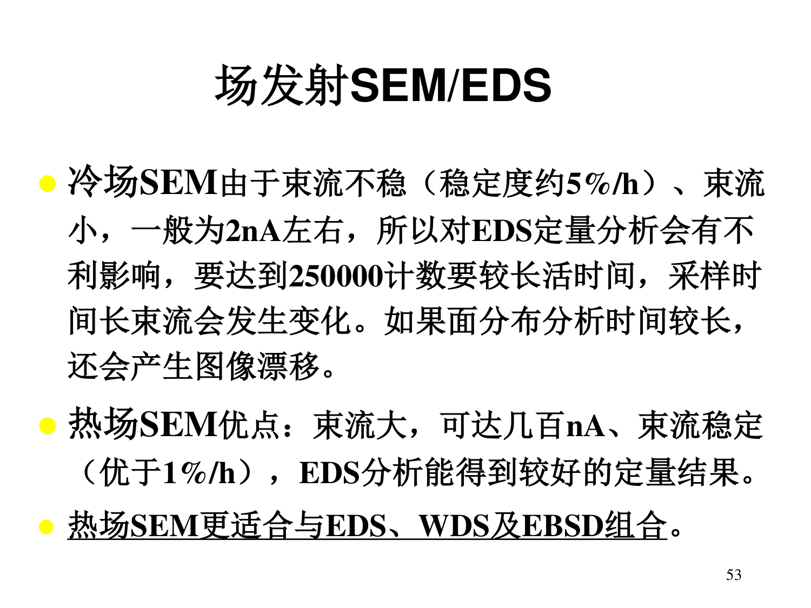

**[CN]**  
电子枪源类型对 EDS 能谱分析的核心影响：  
1. 钨 (W) 灯丝电镜：  
   • 优点：发射总束流大 (10^-10 ~ 10^-7 A)，束流长期稳定性极好 (稳定性优于 0.5% / 小时)，极适宜于高准确度的有标样微区定量分析。  
   • 缺点：电子源虚尺寸大，在高分辨率、低加速电压下束斑迅速扩展，纳米级微区空间分辨率差。  
2. 六硼化镧 (LaB6) 灯丝：  
   亮度为钨灯丝的 10 倍，真空度要求更高，束流稳定度较好，兼顾适中的束流与亚微米分析尺寸。  
3. 场发射扫描电镜 (FEG-SEM)：  
   • 肖特基热场发射 (Schottky Thermal FEG)：高亮度、束流稳定度高 (约 1% / 小时)，束斑可在纳米级汇聚，是现代高性能高空间分辨率能谱分析的最佳平台。  
   • 冷场发射 (Cold FEG)：电子源亮度极高，但阴极吸附气体分子会导致发射电流呈指数阶跃式衰减漂移 (漂移可达 5% / 小时)，需要定期进行灯丝闪烁加热 (Flashing) 清洁。冷场电镜若用于严格的长时间定量分析，必须每隔几分钟重新校准电子束基准电流。  

**[PY]**  
diàn zi qiāng yuán lèi xíng duì EDS néng pǔ fēn xī de hé xīn yǐng xiǎng：  
1. wū (W) dēng sī diàn jìng：  
• yōu diǎn： fā shè zǒng shù liú dà (10^-10 ~ 10^-7 A)， shù liú cháng qī wěn dìng xìng jí hǎo ( wěn dìng xìng yōu yú 0.5% / xiǎo shí )， jí shì yí yú gāo zhǔn què dù de yǒu biāo yàng wēi qū dìng liàng fēn xī。  
• quē diǎn： diàn zi yuán xū chǐ cùn dà， zài gāo fēn biàn lǜ、 dī jiā sù diàn yā xià shù bān xùn sù kuò zhǎn， nà mǐ jí wēi qū kōng jiān fēn biàn lǜ chà。  
2. liù péng huà lán (LaB6) dēng sī：  
liàng dù wèi wū dēng sī de 10 bèi， zhēn kōng dù yāo qiú gèng gāo， shù liú wěn dìng dù jiào hǎo， jiān gù shì zhōng de shù liú yǔ yà wēi mǐ fēn xī chǐ cùn。  
3. chǎng fā shè sǎo miáo diàn jìng (FEG-SEM)：  
• xiào tè jī rè chǎng fā shè (Schottky Thermal FEG)： gāo liàng dù、 shù liú wěn dìng dù gāo ( yuē 1% / xiǎo shí )， shù bān kě zài nà mǐ jí huì jù， shì xiàn dài gāo xìng néng gāo kōng jiān fēn biàn lǜ néng pǔ fēn xī de zuì jiā píng tái。  
• lěng chǎng fā shè (Cold FEG)： diàn zi yuán liàng dù jí gāo， dàn yīn jí xī fù qì tǐ fèn zǐ huì dǎo zhì fā shè diàn liú chéng zhǐ shù jiē yuè shì shuāi jiǎn piāo yí ( piāo yí kě dá 5% / xiǎo shí )， xū yào dìng qī jìn xíng dēng sī shǎn shuò jiā rè (Flashing) qīng jié。 lěng chǎng diàn jìng ruò yòng yú yán gé de zhǎng shí jiān dìng liàng fēn xī， bì xū měi gé jǐ fēn zhōng chóng xīn jiào zhǔn diàn zi shù jī zhǔn diàn liú。  

**[EN]**  
Impact of SEM Electron Source Architecture on Quantitative EDS:  
1. Tungsten (W) Hairpin Thermionic SEM:  
   • Strengths: Delivers substantial probe currents (10^-10 to 10^-7 A) with exceptional temporal stability (drift < 0.5% / hour), serving as the standard workhorse for high-accuracy standard-based quantitative EDS.  
   • Limitations: Large electron source cross-over size limits spatial resolution at low accelerating voltages.  
2. Lanthanum Hexaboride (LaB6) Source:  
   Provides 10x higher brightness than tungsten with moderate beam stability, balancing probe current density with sub-micron spatial resolution.  
3. Field Emission Gun (FEG-SEM):  
   • Schottky Thermal FEG: High brightness coupled with excellent probe current stability (~1% / hr drift). Maintains focused sub-nanometer beam probes with sufficient probe currents (pA to nA) for analytical EDS mapping.  
   • Cold FEG (CFEG): Delivers supreme electron brightness and smallest energy spread (0.3 eV), but suffers from significant temporal emission decay (~5% / hr drift) due to residual gas adsorption. Standard-based quantitative analysis on CFEG requires frequent beam current monitoring and periodic filament flashing.

---

## 4. 环境电镜 (ESEM) 与低真空电镜 (LV-SEM) 的气体裙散效应 / Gas Skirt Scattering in ESEM & LV-SEM

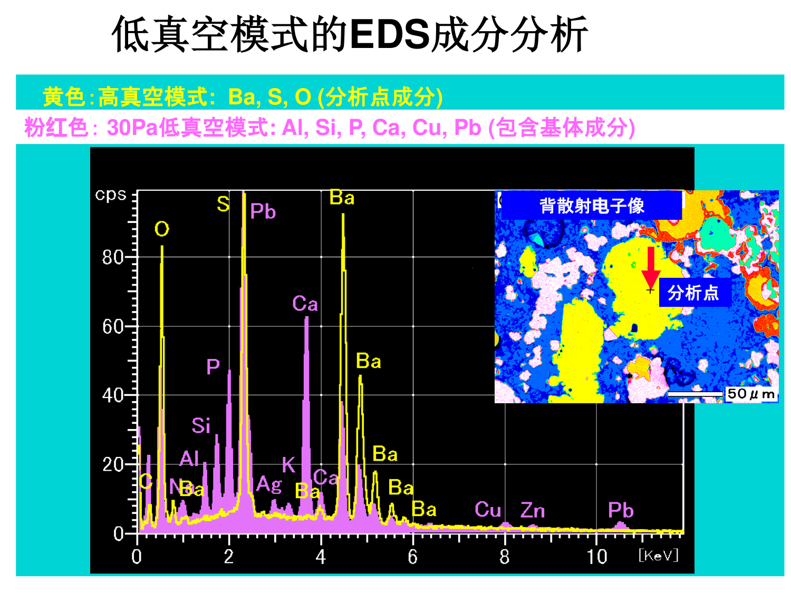

**[CN]**  
低真空与环境扫描电镜中的气体“裙散效应” (Gas Skirt Scattering)：  
1. 物理机理：  
   在低真空 (LV-SEM, 10 ~ 100 Pa) 或环境扫描电镜 (ESEM, 样品室气压可高达 3,000 Pa) 模式下，样品室内充入微量水蒸气或空气以消除绝缘样品的负电荷积累。  
   然而，初级电子束穿过气相环境时，大量高速电子与气体分子发生大角度弹性碰撞，形成向四周大范围发散的电子云“裙散区” (Gas Skirt)。  
2. 对能谱微区分析的致命破坏：  
   • 裙散电子的发散半径可达数百微米甚至数毫米！  
   • 虽然中心聚焦束斑轰击在微米级目标颗粒上，但外围裙散电子同时轰击了基底和其他相区，激发出远离分析点的基底元素 X 射线。  
   • 导致微区成分分析严重失真，背景元素虚假渗入。  
3. 应对措施：  
   在进行精确微区成分定量时，必须将样品室抽至高真空 (< 10^-3 Pa)；若样品不能抽高真空，应尽量缩短极靴到样品的间距 (气程最短化) 并压低气压。  

**[PY]**  
dī zhēn kōng yǔ huán jìng sǎo miáo diàn jìng zhōng de qì tǐ“qún sàn xiào yìng” (Gas Skirt Scattering)：  
1. wù lǐ jī lǐ：  
zài dī zhēn kōng (LV-SEM, 10 ~ 100 Pa) huò huán jìng sǎo miáo diàn jìng (ESEM, yàng pǐn shì qì yā kě gāo dá 3,000 Pa) mó shì xià， yàng pǐn shì nèi chōng rù wēi liàng shuǐ zhēng qì huò kōng qì yǐ xiāo chú jué yuán yàng pǐn de fù diàn hè jī lěi。  
rán ér， chū jí diàn zi shù chuān guò qì xiāng huán jìng shí， dà liàng gāo sù diàn zi yǔ qì tǐ fèn zǐ fā shēng dà jiǎo dù tán xìng pèng zhuàng， xíng chéng xiàng sì zhōu dà fàn wéi fā sàn de diàn zi yún“qún sàn qū” (Gas Skirt)。  
2. duì néng pǔ wēi qū fēn xī de zhì mìng pò huài：  
• qún sàn diàn zi de fā sàn bàn jìng kě dá shù bǎi wēi mǐ shèn zhì shù háo mǐ！  
• suī rán zhōng xīn jù jiāo shù bān hōng jī zài wēi mǐ jí mù biāo kē lì shàng， dàn wài wéi qún sàn diàn zi tóng shí hōng jī le jī dǐ hé qí tā xiāng qū， jī fā chū yuǎn lí fēn xī diǎn de jī dǐ yuán sù X shè xiàn。  
• dǎo zhì wēi qū chéng fèn fēn xī yán zhòng shī zhēn， bèi jǐng yuán sù xū jiǎ shèn rù。  
3. yìng duì cuò shī：  
zài jìn xíng jīng què wēi qū chéng fèn dìng liàng shí， bì xū jiāng yàng pǐn shì chōu zhì gāo zhēn kōng (< 10^-3 Pa)； ruò yàng pǐn bù néng chōu gāo zhēn kōng， yīng jǐn liàng suō duǎn jí xuē dào yàng pǐn de jiān jù ( qì chéng zuì duǎn huà ) bìng yā dī qì yā。  

**[EN]**  
The Gas Skirt Phenomenon in ESEM and Low-Vacuum SEM:  
1. Physical Mechanism:  
   In low-vacuum (LV-SEM, 10-100 Pa) or environmental SEM (ESEM, up to 3,000 Pa), ambient gas (water vapor or air) is intentionally introduced into the chamber to neutralize electrostatic charging on non-conductive specimens.  
   However, as the primary beam traverses the gas column, electrons undergo wide-angle elastic collisions with gas molecules, producing a broad halo of dispersed electrons surrounding the central probe—termed the "gas skirt".  
2. Impact on Analytical Integrity:  
   • The gas skirt can scatter electrons across radial distances spanning hundreds of microns to several millimeters!  
   • While the primary probe aims at a microscopic inclusion, peripheral skirt electrons excite spurious X-rays from surrounding matrix phases.  
   • This causes massive contamination of microspot spectra with matrix elements, undermining quantitative validity.  
3. Recommended Protocols:  
   For rigorous microspot quantification, operate exclusively under high vacuum (< 10^-3 Pa). If low-vacuum mode is mandatory, minimize gas pressure and shorten the working distance to reduce the beam gas interaction pathlength.

---

## 5. 能谱仪 (EDS) 的演进与 SDD 技术飞跃 / Evolution of EDS & SDD Innovations

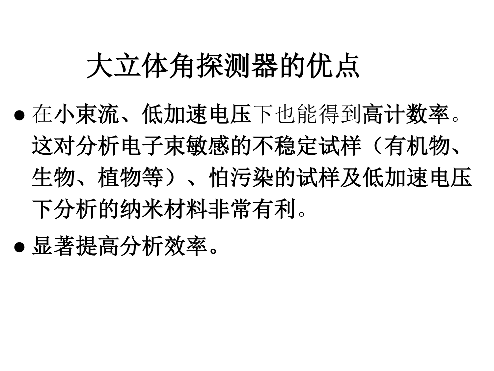

**[CN]**  
硅漂移探测器 (SDD) 替代传统 Si(Li) 探测器的技术革命：  
1. 彻底淘汰液氮杜瓦瓶：  
   传统锂漂移硅 Si(Li) 探测器为防止锂原子在室温下常温扩散迁移失效，必须 365 天浸泡在 -196 °C 液氮中。现代 SDD 仅需小型半导体帕尔帖 (Peltier) 元件温控至 -20 °C ~ -30 °C，彻底消除液氮依赖。  
2. 几何立体角 (Solid Angle, Ω = A / d^2) 飞跃：  
   Bruker 推出 30 mm²、60 mm²、100 mm² 以及多探头环形阵列 (FlatQUAD)，立体角成倍增大：  
   • 大立体角使探测器在微弱束流 (几 pA 到几十 pA) 下依然能够捕获极高计数率。  
   • 使得对电子束极敏感的有机材料、生物组织、卤化物、多孔催化剂在不发生热损伤与相分解的前提下完成高速超谱成像。  
3. 能量分辨率标准指标：  
   在标准 Mn-Kα (5.895 keV) 下全宽半高 (FWHM) 优于 123 ~ 127 eV，在超轻元素 C-Kα (277 eV) 和 F-Kα (677 eV) 处展现优异的分辨能力。  

**[PY]**  
guī piāo yí tàn cè qì (SDD) tì dài chuán tǒng Si(Li) tàn cè qì de jì shù gé mìng：  
1. chè dǐ táo tài yè dàn dù wǎ píng：  
chuán tǒng lǐ piāo yí guī Si(Li) tàn cè qì wèi fáng zhǐ lǐ yuán zi zài shì wēn xià cháng wēn kuò sàn qiān yí shī xiào， bì xū 365 tiān jìn pào zài -196 °C yè dàn zhōng。 xiàn dài SDD jǐn xū xiǎo xíng bàn dǎo tǐ pà ěr tiē (Peltier) yuán jiàn wēn kòng zhì -20 °C ~ -30 °C， chè dǐ xiāo chú yè dàn yī lài。  
2. jǐ hé lì tǐ jiǎo (Solid Angle, Ω = A / d^2) fēi yuè：  
Bruker tuī chū 30 mm²、60 mm²、100 mm² yǐ jí duō tàn tóu huán xíng zhèn liè (FlatQUAD)， lì tǐ jiǎo chéng bèi zēng dà：  
• dà lì tǐ jiǎo shǐ tàn cè qì zài wēi ruò shù liú ( jǐ pA dào jǐ shí pA) xià yī rán néng gòu bǔ huò jí gāo jì shù lǜ。  
• shǐ de duì diàn zi shù jí mǐn gǎn de yǒu jī cái liào、 shēng wù zǔ zhī、 lǔ huà wù、 duō kǒng cuī huà jì zài bù fā shēng rè sǔn shāng yǔ xiāng fēn jiě de qián tí xià wán chéng gāo sù chāo pǔ chéng xiàng。  
3. néng liàng fēn biàn lǜ biāo zhǔn zhǐ biāo：  
zài biāo zhǔn Mn-Kα (5.895 keV) xià quán kuān bàn gāo (FWHM) yōu yú 123 ~ 127 eV， zài chāo qīng yuán sù C-Kα (277 eV) hé F-Kα (677 eV) chù zhǎn xiàn yōu yì de fēn biàn néng lì。  

**[EN]**  
The Technological Paradigm Shift from Si(Li) to Silicon Drift Detectors (SDD):  
1. Elimination of Liquid Nitrogen Cryostats:  
   Conventional Si(Li) crystals suffered irreversible lithium precipitation at room temperature, requiring permanent liquid nitrogen cooling (-196 °C). Modern SDD devices utilize compact thermoelectric Peltier stages (-20 °C to -30 °C), eliminating cryogen handling hazards.  
2. Massive Solid Angle Enhancement (Ω = A / d^2):  
   Active sensor areas expanded from legacy 10 mm² to modern 30, 60, and 100 mm² chips (culminating in annular FlatQUAD geometries):  
   • Enlarged solid angles harvest abundant X-ray flux under ultra-low probe currents (down to a few pA).  
   • This permits non-destructive elemental mapping of beam-sensitive polymers, biological tissues, halides, and zeolites without thermal ablation or mass loss.  
3. Guaranteed Energy Resolution Metrics:  
   FWHM at Mn-Kα (5.895 keV) is routinely ≤ 123-127 eV, alongside refined low-energy resolution across C-Kα (277 eV) and F-Kα (677 eV).

---

## 6. SEM/EDS 分析的主要核心特点 / Core Features of SEM/EDS Microanalysis

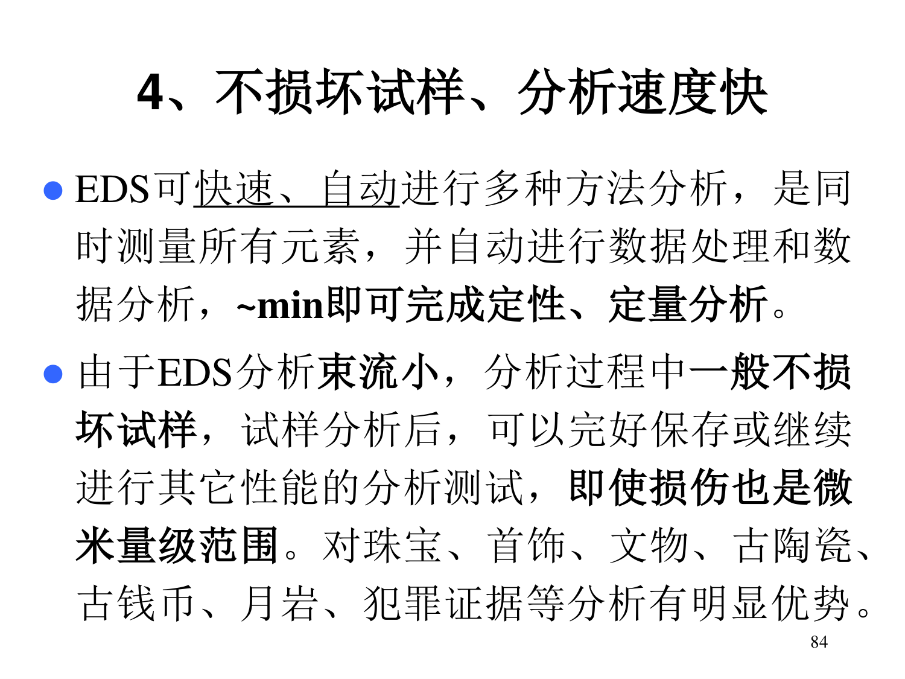

**[CN]**  
SEM/EDS 微区分析的四大核心优势与物理性能指标：  
1. 原位显微结构分析 (In-situ Microanalysis)：  
   将扫描电镜的高分辨形貌衬度 (SE/BSE) 与成分分析完美结合，实现“所见即所测”的微米-亚微米多相组织鉴别。  
2. 超宽元素分析范围：  
   标准薄窗能谱仪覆盖自铍 (Be, Z=4) 至锎 (Cf, Z=98) 的全元素周期表，覆盖轻元素、轻稀土、贵金属和锕系元素。  
3. 优良的微区定量分析准确度：  
   对于抛光平整、均质稳定的常规块状样品，中等原子序数无重叠主元素 (含量 > 20 wt%) 的无标样相对分析误差通常优于 ±2% ~ ±5%。  
4. 探测极限 (Limit of Detection, LOD)：  
   • EDS 的常规探测限一般为 0.1 wt% ~ 0.5 wt% (1,000 ppm ~ 5,000 ppm)。  
   • 相比之下，波谱仪 (WDS/EPMA) 凭借极高的峰背比 (P/B) 其探测限可优于 0.01 wt% (100 ppm)。对于痕量与微量杂质分析需借助 WDS，而主量与次量元素分析 EDS 效率更高。  

**[PY]**  
SEM/EDS wēi qū fēn xī de sì dà hé xīn yōu shì yǔ wù lǐ xìng néng zhǐ biāo：  
1. yuán wèi xiǎn wēi jié gòu fēn xī (In-situ Microanalysis)：  
jiāng sǎo miáo diàn jìng de gāo fēn biàn xíng mào chèn dù (SE/BSE) yǔ chéng fèn fēn xī wán měi jié hé， shí xiàn“suǒ jiàn jí suǒ cè” de wēi mǐ - yà wēi mǐ duō xiāng zǔ zhī jiàn bié。  
2. chāo kuān yuán sù fēn xī fàn wéi：  
biāo zhǔn báo chuāng néng pǔ yí fù gài zì pī (Be, Z=4) zhì kāi (Cf, Z=98) de quán yuán sù zhōu qī biǎo， fù gài qīng yuán sù、 qīng xī tǔ、 guì jīn shǔ hé ā xì yuán sù。  
3. yōu liáng de wēi qū dìng liàng fēn xī zhǔn què dù：  
duì yú pāo guāng píng zhěng、 jūn zhì wěn dìng de cháng guī kuài zhuàng yàng pǐn， zhōng děng yuán zi xù shù wú chóng dié zhǔ yuán sù ( hán liàng > 20 wt%) de wú biāo yàng xiāng duì fēn xī wù chā tōng cháng yōu yú ±2% ~ ±5%。  
4. tàn cè jí xiàn (Limit of Detection, LOD)：  
• EDS de cháng guī tàn cè xiàn yì bān wèi 0.1 wt% ~ 0.5 wt% (1,000 ppm ~ 5,000 ppm)。  
• xiāng bǐ zhī xià， bō pǔ yí (WDS/EPMA) píng jiè jí gāo de fēng bèi bǐ (P/B) qí tàn cè xiàn kě yōu yú 0.01 wt% (100 ppm)。 duì yú hén liàng yǔ wēi liàng zá zhì fēn xī xū jiè zhù WDS， ér zhǔ liàng yǔ cì liàng yuán sù fēn xī EDS xiào lǜ gèng gāo。  

**[EN]**  
Four Cardinal Pillars of Modern SEM/EDS Microanalysis:  
1. In-situ Microstructural Correlation:  
   Directly integrates nanoscale structural imaging (SE/BSE) with point, line, and HyperMap spectroscopy, realizing immediate correlation between phase morphology and chemical stoichiometry.  
2. Comprehensive Elemental Coverage:  
   Modern thin-window SDD platforms detect elements ranging from Beryllium (Be, Z=4) through Californium (Cf, Z=98).  
3. Robust Quantitative Accuracy:  
   For metallographically polished, stable, flat specimens, relative errors for unoverlapped major elements (> 20 wt%) under standardless corrections are typically within ±2% to ±5%.  
4. Limits of Detection (LOD):  
   • Standard EDS detection limits span 0.1 wt% to 0.5 wt% (1,000 ppm to 5,000 ppm).  
   • In contrast, Wavelength Dispersive Spectrometry (WDS/EPMA) achieves detection limits down to 0.01 wt% (100 ppm) due to an order-of-magnitude higher peak-to-background (P/B) ratio. EDS remains the preeminent choice for major/minor phase profiling.

---

## 7. EDS 关键分析条件的选择准则 / Selection Rules for Optimal Analytical Conditions

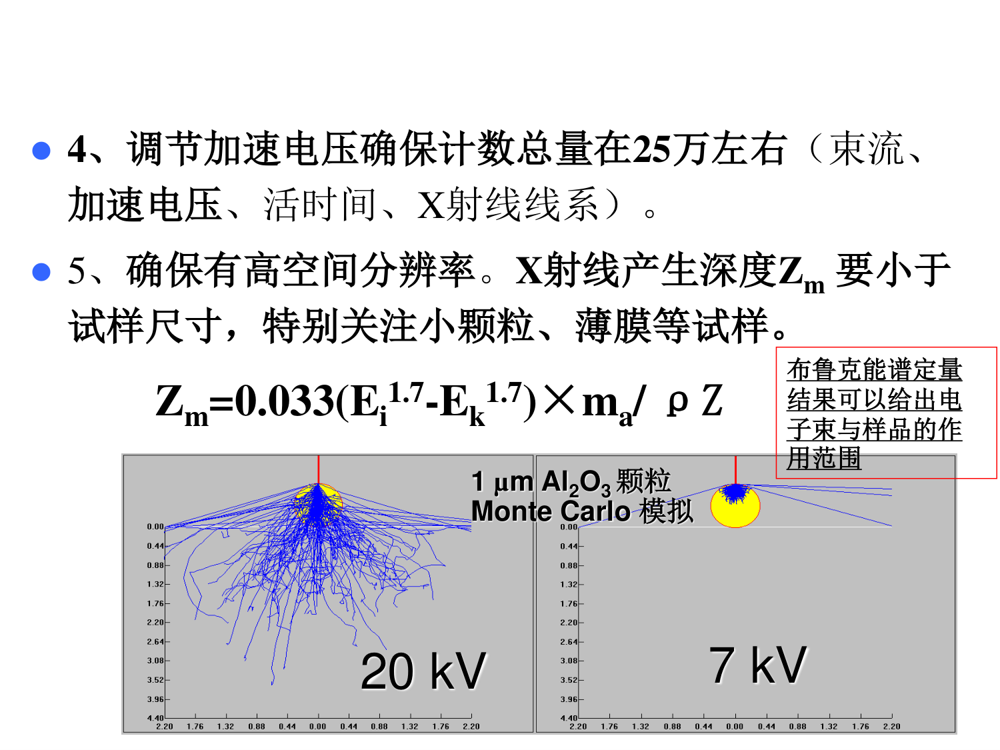

**[CN]**  
加速电压 (Accelerating Voltage, V0) 选择的铁律：  
1. 临界激发能门槛 (Critical Excitation Energy, Ec)：  
   入射电子能量 E0 必须高于目标壳层的临界电离激发能 Ec (E0 > Ec)，否则特征 X 射线产生几率为零！  
2. 最佳过压比准则 (Overvoltage Ratio, U = E0 / Ec = V0 / Vc)：  
   • 产生特征 X 射线最适宜的过压比为：U = 2 ~ 3。  
   • 当 U < 1.5 时，特征 X 射线电离截面极小，X 射线峰强度微弱，信噪比恶劣。  
   • 当 U > 5 时，入射电子入射深度过深，激发的 X 射线在样品内部被严重吸收，基体吸收校正误差急剧放大。  
3. 经典电压设定推荐：  
   • 定性通用分析：推荐选择 20 kV（20 kV 可以充分激发周期表中绝大多数元素的高能或中能特征线系，如 Fe-Kα, Cu-Kα, Mo-Kα, Au-Lα 等）。  
   • 超轻元素分析 (B, C, N, O)：强烈建议降低加速电压至 5 kV ~ 10 kV。低电压能大幅缩短出射吸收路径，减小基体自吸收。  

**[PY]**  
jiā sù diàn yā (Accelerating Voltage, V0) xuǎn zé de tiě lǜ：  
1. lín jiè jī fā néng mén kǎn (Critical Excitation Energy, Ec)：  
rù shè diàn zi néng liàng E0 bì xū gāo yú mù biāo ké céng de lín jiè diàn lí jī fā néng Ec (E0 > Ec)， fǒu zé tè zhēng X shè xiàn chǎn shēng jī lǜ wèi líng！  
2. zuì jiā guò yā bǐ zhǔn zé (Overvoltage Ratio, U = E0 / Ec = V0 / Vc)：  
• chǎn shēng tè zhēng X shè xiàn zuì shì yí de guò yā bǐ wèi：U = 2 ~ 3。  
• dāng U < 1.5 shí， tè zhēng X shè xiàn diàn lí jié miàn jí xiǎo，X shè xiàn fēng qiáng dù wēi ruò， xìn zào bǐ è liè。  
• dāng U > 5 shí， rù shè diàn zi rù shè shēn dù guò shēn， jī fā de X shè xiàn zài yàng pǐn nèi bù bèi yán zhòng xī shōu， jī tǐ xī shōu jiào zhèng wù chā jí jù fàng dà。  
3. jīng diǎn diàn yā shè dìng tuī jiàn：  
• dìng xìng tōng yòng fēn xī： tuī jiàn xuǎn zé 20 kV（20 kV kě yǐ chōng fèn jī fā zhōu qī biǎo zhōng jué dà duō shù yuán sù de gāo néng huò zhōng néng tè zhēng xiàn xì， rú Fe-Kα, Cu-Kα, Mo-Kα, Au-Lα děng）。  
• chāo qīng yuán sù fēn xī (B, C, N, O)： qiáng liè jiàn yì jiàng dī jiā sù diàn yā zhì 5 kV ~ 10 kV。 dī diàn yā néng dà fú suō duǎn chū shè xī shōu lù jìng， jiǎn xiǎo jī tǐ zì xī shōu。  

**[EN]**  
Golden Rules for SEM Accelerating Voltage Selection:  
1. Critical Ionization Threshold (Ec):  
   The incident electron accelerating energy E0 must strictly exceed the ionization threshold of the target core shell (E0 > Ec); below this threshold, characteristic X-ray generation is physically impossible.  
2. Optimal Overvoltage Ratio (U = E0 / Ec = V0 / Vc):  
   • The optimal working overvoltage ratio is: U = 2 to 3.  
   • When U < 1.5, inner-shell ionization cross-sections collapse, leading to diminished peak counts and poor signal-to-noise ratios.  
   • When U > 5, primary electrons penetrate too deeply, compounding X-ray self-absorption through the specimen matrix and amplifying correction errors.  
3. Universal Voltage Guidelines:  
   • General Qualitative Survey: 20 kV is universally adopted, providing sufficient overvoltage to excite at least one prominent line (K, L, or M) across the entire periodic table.  
   • Light Element Optimization (B, C, N, O): Lower high voltage to 5 kV - 10 kV to compress the interaction depth, minimizing internal self-absorption losses.

---

## 8. 激发体积、空间分辨率与低电压分析技术 / Interaction Volume, Spatial Resolution & Low-kV Techniques

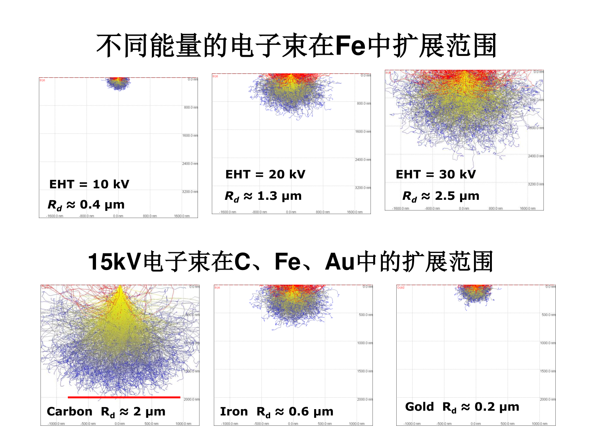

### 8.1 相互作用体积与卡斯泰因 (Castaing) 穿透深度公式
**[CN]**  
相互作用体积 (Interaction Volume) 与分析空间分辨率：  
1. 梨形作用区 (Pear-shaped Volume)：  
   电子束射入样品后并不保持聚焦细针形态，而是向周围发生强烈侧向多次散射，在轻基体中形成宽大的“梨形”扩展区，在重金属基体中呈扁半球形。  
2. 卡斯泰因最大 X 射线激发深度公式 (Castaing Formula)：  
   Zm = 0.033 * (V0^1.7 - Vc^1.7) * (A / (ρ * Z))  (单位：μm)  
   其中 V0 为加速电压 (kV)，Vc 为临界激发能 (kV)，A 为平均原子量，ρ 为密度 (g/cm³)，Z 为原子序数。  
   • 在 20 kV 下轰击钢 (Fe, 密度 ~7.8 g/cm³)，X 射线激发深度与横向扩展尺寸约为 1.5 ~ 2 μm！  
   • 若样品为低密度聚合物或铝合金，激发范围可深达 4 ~ 6 μm。  
   • 这意味着：电镜图像虽然能看清 50 nm 的微细颗粒，但若采用 20 kV 分析，收集到的能谱信号将 99% 来自颗粒下方的基底基体！  

**[PY]**  
xiāng hù zuò yòng tǐ jī (Interaction Volume) yǔ fēn xī kōng jiān fēn biàn lǜ：  
1. lí xíng zuò yòng qū (Pear-shaped Volume)：  
diàn zi shù shè rù yàng pǐn hòu bìng bù bǎo chí jù jiāo xì zhēn xíng tài， ér shì xiàng zhōu wéi fā shēng qiáng liè cè xiàng duō cì sǎn shè， zài qīng jī tǐ zhōng xíng chéng kuān dà de“lí xíng” kuò zhǎn qū， zài zhòng jīn shǔ jī tǐ zhōng chéng biǎn bàn qiú xíng。  
2. kǎ sī tài yīn zuì dà X shè xiàn jī fā shēn dù gōng shì (Castaing Formula)：  
Zm = 0.033 * (V0^1.7 - Vc^1.7) * (A / (ρ * Z)) ( dān wèi：μm)  
qí zhōng V0 wèi jiā sù diàn yā (kV)，Vc wèi lín jiè jī fā néng (kV)，A wèi píng jūn yuán zi liàng，ρ wèi mì dù (g/cm³)，Z wèi yuán zi xù shù。  
• zài 20 kV xià hōng jī gāng (Fe, mì dù ~7.8 g/cm³)，X shè xiàn jī fā shēn dù yǔ héng xiàng kuò zhǎn chǐ cùn yuē wèi 1.5 ~ 2 μm！  
• ruò yàng pǐn wèi dī mì dù jù hé wù huò lǚ hé jīn， jī fā fàn wéi kě shēn dá 4 ~ 6 μm。  
• zhè yì wèi zhe： diàn jìng tú xiàng suī rán néng kàn qīng 50 nm de wēi xì kē lì， dàn ruò cǎi yòng 20 kV fēn xī， shōu jí dào de néng pǔ xìn hào jiāng 99% lái zì kē lì xià fāng de jī dǐ jī tǐ！  

**[EN]**  
Physical Dimensions of the Interaction Volume and Castaing Formulation:  
1. Pear-Shaped Scattering Regime:  
   Primary electrons undergo continuous multi-stage elastic collisions within the sample, expanding laterally into a macroscopic "pear-shaped" volume in light matrices or a hemispherical envelope in dense metals.  
2. Castaing X-ray Generation Depth Formula:  
   Zm = 0.033 * (V0^1.7 - Vc^1.7) * (A / (ρ * Z))  (μm)  
   Where V0 is accelerating voltage (kV), Vc is critical excitation energy (kV), A is atomic weight, ρ is mass density (g/cm³), and Z is atomic number.  
   • Under 20 kV in steel (ρ ~ 7.8 g/cm³), the spatial resolution envelope spans ~1.5 to 2 μm!  
   • In low-density polymers or light alloys, the generation envelope extends down to 4 - 6 μm.  
   • Analytical Implication: While SEM electron optics easily resolve a 50 nm inclusion, probing it at 20 kV yields an EDS spectrum dominated 99% by the underlying substrate!

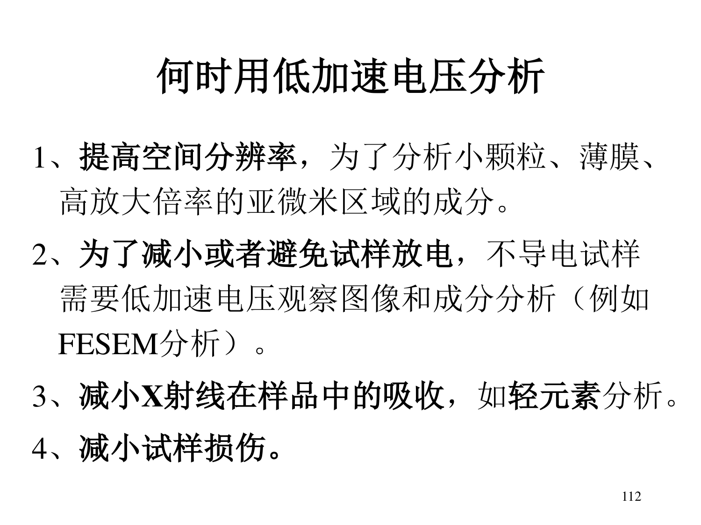

### 8.2 亚微米与纳米尺度分析策略：超低加速电压 (Low-kV EDS)
**[CN]**  
如何实现纳米级/亚微米薄膜与微小颗粒的真实微区成分分析？  
1. 压低加速电压至 3 kV ~ 7 kV：  
   • 将电子穿透深度从数微米剧烈压缩至 100 nm ~ 200 nm 范围内。  
   • 相互作用体积缩小两到三个数量级，实现真正意义上的表面薄膜与纳米颗粒独立分析。  
2. 改用低能量 L 线系或 M 线系：  
   当 Z ≥ 32 时，高能量 K 射线在低电压下无法激发，此时转而选择过渡金属的 L 线系 (例如 Fe-Lα, 0.705 keV; Cu-Lα, 0.930 keV) 或重元素的 M 线系 (如 Au-Mα, 2.12 keV) 进行定性与定量。  
3. 超薄碳膜影响：  
   在低电压下轻元素极度敏感，样品表面镀碳厚度必须控制在 5 ~ 10 nm 以内，否则 20 nm 碳层将吸收掉超过 10% 的 N-Kα 强度并产生碳本底虚增。  

**[PY]**  
rú hé shí xiàn nà mǐ jí / yà wēi mǐ báo mó yǔ wēi xiǎo kē lì de zhēn shí wēi qū chéng fèn fēn xī？  
1. yā dī jiā sù diàn yā zhì 3 kV ~ 7 kV：  
• jiāng diàn zi chuān tòu shēn dù cóng shù wēi mǐ jù liè yā suō zhì 100 nm ~ 200 nm fàn wéi nèi。  
• xiāng hù zuò yòng tǐ jī suō xiǎo liǎng dào sān gè shù liàng jí， shí xiàn zhēn zhèng yì yì shàng de biǎo miàn báo mó yǔ nà mǐ kē lì dú lì fēn xī。  
2. gǎi yòng dī néng liàng L xiàn xì huò M xiàn xì：  
dāng Z ≥ 32 shí， gāo néng liàng K shè xiàn zài dī diàn yā xià wú fǎ jī fā， cǐ shí zhuǎn ér xuǎn zé guò dù jīn shǔ de L xiàn xì ( lì rú Fe-Lα, 0.705 keV; Cu-Lα, 0.930 keV) huò zhòng yuán sù de M xiàn xì ( rú Au-Mα, 2.12 keV) jìn xíng dìng xìng yǔ dìng liàng。  
3. chāo báo tàn mó yǐng xiǎng：  
zài dī diàn yā xià qīng yuán sù jí dù mǐn gǎn， yàng pǐn biǎo miàn dù tàn hòu dù bì xū kòng zhì zài 5 ~ 10 nm yǐ nèi， fǒu zé 20 nm tàn céng jiāng xī shōu diào chāo guò 10% de N-Kα qiáng dù bìng chǎn shēng tàn běn dǐ xū zēng。  

**[EN]**  
Nanoscale Spatial Resolution Strategies via Low-kV EDS:  
1. Lowering Accelerating Voltage (3 kV - 7 kV):  
   • Compresses penetration depth from microns down to 100 - 200 nm.  
   • Diminishes the excitation volume by 2-3 orders of magnitude, isolating nanoscale films and interface layers from substrate interference.  
2. Utilizing Low-Energy L and M Characteristic Series:  
   For elements with Z ≥ 32 where K-shells cannot be excited below 7 kV, analyze low-energy L-lines (e.g. Fe-Lα at 0.705 keV) or M-lines (e.g. Au-Mα at 2.12 keV).  
3. Thin Conductive Coating Rigor:  
   Under low kV excitation, conductive carbon coatings must not exceed 5-10 nm; thicker 20 nm layers attenuate >10% of N-Kα photons while distorting carbon quantification.

---

## 9. 光束束流、活时间与死时间优化 / Beam Current, Live Time & Dead Time Optimization

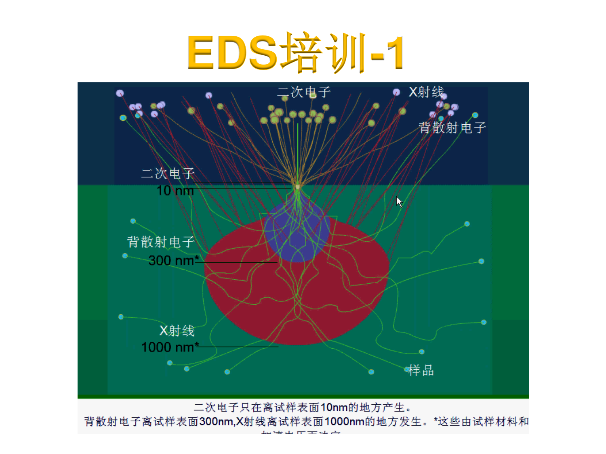

**[CN]**  
谱仪时间参数与几何对中准则：  
1. 实时间 (Real Time, RT)、活时间 (Live Time, LT) 与死时间 (Dead Time, DT)：  
   • 实时间 (RT)：实验人员手表计量的真实物理流逝时间。  
   • 死时间 (DT)：脉冲成形与基线复位期间系统处于忙碌阻塞状态的时间比例：  
     DT(%) = (RT - LT) / RT * 100%  
   • 活时间 (LT)：脉冲处理器实际有效接收并处理计数的纯工作时间。定量分析时能谱仪必须严格根据活时间进行计数率归一化。  
2. 最佳死时间工作区间：  
   • 常规微区定量分析推荐死时间维持在 20% ~ 40% 之间。  
   • 死时间 < 10%：束流过小，统计计数累积过慢，泊松统计涨落大。  
   • 死时间 > 60%：计数率过饱和，脉冲堆积失真严重，死时间校正模型误差增大。  
3. 统计计数充足性法则：  
   全谱累积总计数建议达到 250,000 counts (25万计数) 以上，以保证主要特征峰的峰面积统计相对偏差小于 1%。  
4. 工作距离 (Working Distance, WD) 几何对齐：  
   EDS 探测器准直孔具有严格的共焦几何焦点。操作者必须严格将样品微区聚焦在厂家标定的标准工作距离处（如 8.5 mm、10 mm 或 12 mm）。垂直高度偏离 1 mm 即可导致计数率衰减数倍并破坏定量检出限。  

**[PY]**  
pǔ yí shí jiān cān shù yǔ jǐ hé duì zhōng zhǔn zé：  
1. shí shí jiān (Real Time, RT)、 huó shí jiān (Live Time, LT) yǔ sǐ shí jiān (Dead Time, DT)：  
• shí shí jiān (RT)： shí yàn rén yuán shǒu biǎo jì liàng de zhēn shí wù lǐ liú shì shí jiān。  
• sǐ shí jiān (DT)： mài chōng chéng xíng yǔ jī xiàn fù wèi qī jiān xì tǒng chǔ yú máng lù zǔ sè zhuàng tài de shí jiān bǐ lì：  
DT(%) = (RT - LT) / RT * 100%  
• huó shí jiān (LT)： mài chōng chǔ lǐ qì shí jì yǒu xiào jiē shōu bìng chǔ lǐ jì shù de chún gōng zuò shí jiān。 dìng liàng fēn xī shí néng pǔ yí bì xū yán gé gēn jù huó shí jiān jìn xíng jì shù lǜ guī yī huà。  
2. zuì jiā sǐ shí jiān gōng zuò qū jiān：  
• cháng guī wēi qū dìng liàng fēn xī tuī jiàn sǐ shí jiān wéi chí zài 20% ~ 40% zhī jiān。  
• sǐ shí jiān < 10%： shù liú guò xiǎo， tǒng jì jì shù lěi jī guò màn， pō sōng tǒng jì zhǎng luò dà。  
• sǐ shí jiān > 60%： jì shù lǜ guò bǎo hé， mài chōng duī jī shī zhēn yán zhòng， sǐ shí jiān jiào zhèng mó xíng wù chā zēng dà。  
3. tǒng jì jì shù chōng zú xìng fǎ zé：  
quán pǔ lěi jī zǒng jì shù jiàn yì dá dào 250,000 counts (25 wàn jì shù ) yǐ shàng， yǐ bǎo zhèng zhǔ yào tè zhēng fēng de fēng miàn jī tǒng jì xiāng duì piān chā xiǎo yú 1%。  
4. gōng zuò jù lí (Working Distance, WD) jǐ hé duì qí：  
EDS tàn cè qì zhǔn zhí kǒng jù yǒu yán gé de gòng jiāo jǐ hé jiāo diǎn。 cāo zuò zhě bì xū yán gé jiāng yàng pǐn wēi qū jù jiāo zài chǎng jiā biāo dìng de biāo zhǔn gōng zuò jù lí chù（rú 8.5 mm、10 mm huò 12 mm）。 chuí zhí gāo dù piān lí 1 mm jí kě dǎo zhì jì shù lǜ shuāi jiǎn shù bèi bìng pò huài dìng liàng jiǎn chū xiàn。  

**[EN]**  
Temporal and Geometric Parameters for Quantitative Rigor:  
1. Real Time (RT), Live Time (LT), and Dead Time (DT):  
   • Real Time (RT): Clock elapsed physical duration.  
   • Dead Time (DT): Fraction of time the pulse processor is actively digitizing pulses and unavailable for new events:  
     DT(%) = (RT - LT) / RT * 100%  
   • Live Time (LT): True operational window during which events are validly accumulated. All quantitative intensity normalization relies on Live Time.  
2. Optimal Dead Time Operational Regime:  
   • Standard quantification target dead time: 20% to 40%.  
   • Dead Time < 10%: Insufficient probe current, needlessly inflating counting time.  
   • Dead Time > 60%: System saturation, inducing pulse pile-up distortion and dead-time correction non-linearities.  
3. Total Count Sufficiency Rule:  
   Accumulate ≥ 250,000 total spectral counts to suppress Poisson counting uncertainty (1 / sqrt(N)) below 1% for major peak integrations.  
4. Working Distance (WD) Precision:  
   EDS collimators are focused onto a fixed spatial intersection with the SEM optical axis. Always align the sample surface height to the calibrated working distance (e.g. 8.5 mm or 10 mm). A 1 mm vertical displacement degrades collection solid angle and quantitative repeatability.

---

## 10. 关键技术术语对照表 / Key Technical Glossary

| 中文术语 (Chinese) | 汉语拼音 (Hanyu Pinyin) | 英文术语 (English) | 技术释义 (Technical Definition) |
| :--- | :--- | :--- | :--- |
| **特征 X 射线** | tè zhēng X shè xiàn | Characteristic X-ray | 内层电子电离后外层电子跃迁辐射出的具有元素特征特征能量的光子 |
| **韧致辐射** | rèn zhì fú shè | Bremsstrahlung / Continuum | 入射电子在靶原子核库仑场减速过程中发射的连续背景 X 射线 |
| **临界激发能** | lín jiè jī fā néng | Critical Excitation Energy (Ec) | 电离特定原子壳层所需消耗的最低能量门槛 |
| **过压比** | guò yā bǐ | Overvoltage Ratio (U = E0/Ec) | 入射电子能量与临界激发能之比，最佳定量取值范围为 2 ~ 3 |
| **荧光产额** | yíng guāng chǎn é | Fluorescence Yield (ω) | 内壳层空位通过发射特征 X 射线退激发的概率几率 |
| **相互作用体积** | xiāng hù zuò yòng tǐ jī | Interaction Volume | 高能电子束在样品内部发生弹性/非弹性散射所扩散激发的空间三维区域 |
| **逃逸峰** | táo yì fēng | Escape Peak | 探测器硅晶体自身 Si-Kα (1.74 keV) 光子泄漏导致的伪峰 (E - 1.74 keV) |
| **和峰 / 堆积峰** | hé fēng / duī jī fēng | Sum Peak / Pulse Pile-up | 两个光子几乎同时到达被误记录为双倍能量脉冲的假象峰 |
| **气体裙散效应** | qì tǐ qún sàn xiào yìng | Gas Skirt Scattering | 低真空/环境电镜下气体分子碰撞造成入射电子大范围发散的伪像效应 |
| **活时间** | huó shí jiān | Live Time (LT) | 能谱系统无死时间阻断、真正用于计数测量的纯时间 |

---

# Module 3: 二、EDS 分析对试样的要求及试样制备
# Module 3: Specimen Requirements and Specimen Preparation for EDS Analysis

---

## 目录 / Table of Contents
1. [准确定量对分析试样的五大核心要求 / Five Cardinal Specimen Requirements](#1-准确定量对分析试样的五大核心要求--five-cardinal-specimen-requirements)
2. [绝缘试样的荷电效应物理机制与诊断 / Physics & Diagnostics of Specimen Charging](#2-绝缘试样的荷电效应物理机制与诊断--physics--diagnostics-of-specimen-charging)
3. [导电镀膜技术与碳膜 (C-Coating) 的必然性 / Conductive Coating & Why Carbon is Mandatory](#3-导电镀膜技术与碳膜-c-coating-的必然性--conductive-coating--why-carbon-is-mandatory)
4. [试样装载、导电粘结与粉末团聚防范 / Mounting, Conductive Adhesives & Powder Dispersion](#4-试样装载导电粘结与粉末团聚防范--mounting-conductive-adhesives--powder-dispersion)
5. [试样表面平整度、粗糙度与 X 射线检出角 / Surface Flatness, Roughness & Take-off Angle](#5-试样表面平整度粗糙度与-x-射线检出角--surface-flatness-roughness--take-off-angle)
6. [传统金相研磨抛光与真空镶嵌工艺 / Metallographic Polishing & Vacuum Embedding](#6-传统金相研磨抛光与真空镶嵌工艺--metallographic-polishing--vacuum-embedding)
7. [先进氩离子束截面抛光技术 (BIB / CP) / Broad Ion Beam (BIB) Cross-Section Polishing](#7-先进氩离子束截面抛光技术-bib--cp--broad-ion-beam-bib-cross-section-polishing)
8. [关键技术术语对照表 / Key Technical Glossary](#8-关键技术术语对照表--key-technical-glossary)

---

## 1. 准确定量对分析试样的五大核心要求 / Five Cardinal Specimen Requirements

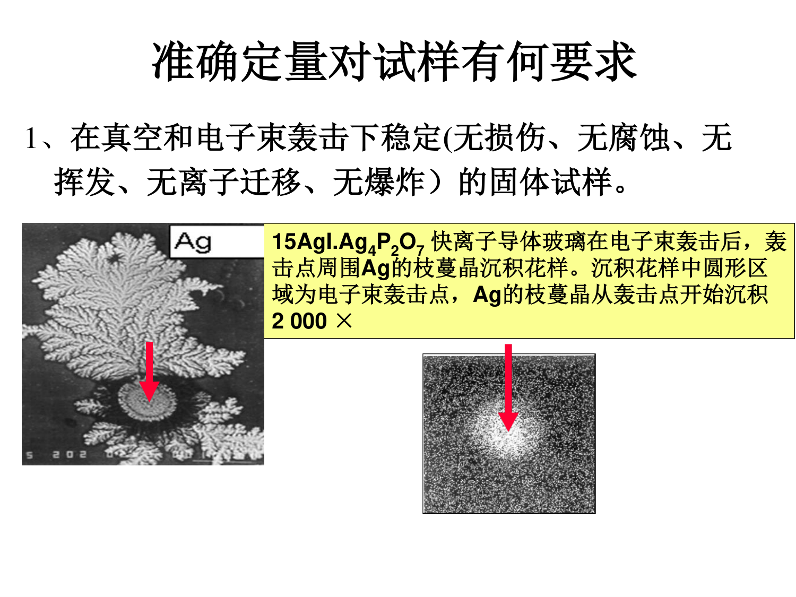

**[CN]**  
严格准确定量分析对试样的五项基本原则：  
1. 真空与电子束轰击下的稳定性：  
   试样在 10^-3 ~ 10^-5 Pa 高真空与高能电子轰击下必须保持固态稳定：无热损伤软化、无化学腐蚀氧化、无挥发升华、无碱金属离子迁移 (如含 Na 玻璃中 Na+ 向基底深处受电场迁移)、无分解放气或爆裂。  
2. 试样宏观与微观尺寸充足：  
   试样分析微区尺寸必须大于 X 射线的激发相互作用体积 (通常要求分析相直径 > 2 ~ 5 μm)。若颗粒过小，电子束侧向散射将穿透颗粒激发基底载体，导致定量失效。  
3. 试样表面严格抛光平整且垂直于电子束：  
   标准定量修正物理模型 (ZAF, Phi-Rho-Z) 均建立在“理想平整表面且初级电子束垂直入射 (90° 法向入射)”的前提假设上。倾斜或凹凸表面会严重改变 X 射线射出路径。  
4. 分析相成分均匀、无微观杂质污染、无强磁性：  
   磁性样品会导致扫描电镜物镜磁场发生畸变，造成电子束散焦甚至碰撞极靴。  
5. 优良的导电性与导热性：  
   能将电子束注入的大量负电荷与热量迅速导出至样品台地线。  

**[PY]**  
yán gé zhǔn què dìng liàng fēn xī duì shì yàng de wǔ xiàng jī běn yuán zé：  
1. zhēn kōng yǔ diàn zi shù hōng jī xià de wěn dìng xìng：  
shì yàng zài 10^-3 ~ 10^-5 Pa gāo zhēn kōng yǔ gāo néng diàn zi hōng jī xià bì xū bǎo chí gù tài wěn dìng： wú rè sǔn shāng ruǎn huà、 wú huà xué fǔ shí yǎng huà、 wú huī fā shēng huá、 wú jiǎn jīn shǔ lí zi qiān yí ( rú hán Na bō lí zhōng Na+ xiàng jī dǐ shēn chù shòu diàn chǎng qiān yí )、 wú fēn jiě fàng qì huò bào liè。  
2. shì yàng hóng guān yǔ wēi guān chǐ cùn chōng zú：  
shì yàng fēn xī wēi qū chǐ cùn bì xū dà yú X shè xiàn de jī fā xiāng hù zuò yòng tǐ jī ( tōng cháng yāo qiú fēn xī xiāng zhí jìng > 2 ~ 5 μm)。 ruò kē lì guò xiǎo， diàn zi shù cè xiàng sǎn shè jiāng chuān tòu kē lì jī fā jī dǐ zài tǐ， dǎo zhì dìng liàng shī xiào。  
3. shì yàng biǎo miàn yán gé pāo guāng píng zhěng qiě chuí zhí yú diàn zi shù：  
biāo zhǔn dìng liàng xiū zhèng wù lǐ mó xíng (ZAF, Phi-Rho-Z) jūn jiàn lì zài“lǐ xiǎng píng zhěng biǎo miàn qiě chū jí diàn zi shù chuí zhí rù shè (90° fǎ xiàng rù shè )” de qián tí jiǎ shè shàng。 qīng xié huò āo tū biǎo miàn huì yán zhòng gǎi biàn X shè xiàn shè chū lù jìng。  
4. fēn xī xiāng chéng fēn jūn yún、 wú wēi guān zá zhì wū rǎn、 wú qiáng cí xìng：  
cí xìng yàng pǐn huì dǎo zhì sǎo miáo diàn jìng wù jìng cí chǎng fā shēng jī biàn， zào chéng diàn zi shù sàn jiāo shèn zhì pèng zhuàng jí xuē。  
5. yōu liáng de dǎo diàn xìng yǔ dǎo rè xìng：  
néng jiāng diàn zi shù zhù rù de dà liàng fù diàn hè yǔ rè liàng xùn sù dǎo chū zhì yàng pǐn tái dì xiàn。  

**[EN]**  
Five Cardinal Specimen Requirements for Quantitative EDS:  
1. High Vacuum and Electron Beam Stability:  
   The specimen must remain structurally and chemically stable under high vacuum (10^-3 to 10^-5 Pa) and concentrated beam irradiation: exhibiting zero thermal ablation, zero volatile desorption, zero ion migration (e.g. electric-field-induced Na+ drift in silicate glasses), zero degassing, and zero explosive micro-fracture.  
2. Sufficient Phase Dimensions Exceeding Excitation Volume:  
   Target phase regions must be larger than the lateral X-ray interaction volume (typically > 2 to 5 μm). Probing sub-micron inclusions leads to beam breakout into the underlying matrix, invalidating bulk matrix corrections.  
3. Specimen Surface Metallographically Flat & Perpendicular:  
   Standard analytical correction models (ZAF, Phi-Rho-Z) presume an optically planar surface perpendicular to the primary incident beam (90° normal incidence). Surface roughness distorts absorption geometry.  
4. Local Homogeneity, Cleanliness, and Non-Magnetic Properties:  
   Strong ferromagnetism distorts the SEM objective lens magnetic field, producing severe astigmatism or posing physical attraction risks to the pole piece.  
5. High Electrical and Thermal Conductivity:  
   Rapidly conducts absorbed electronic charge and dissipated thermal energy to ground.

---

## 2. 绝缘试样的荷电效应物理机制与诊断 / Physics & Diagnostics of Specimen Charging

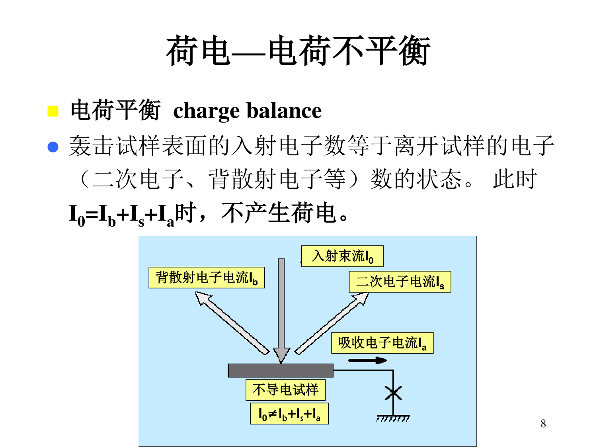

### 2.1 样品电荷平衡方程式 (Charge Balance)
**[CN]**  
固体试样表面的电荷平衡关系：  
注入试样的总束流 I_beam 与逸出/导出电流满足节点守恒：  
I_beam = I_SE + I_BSE + I_absorbed  
其中：  
• I_SE 为发射的二次电子电流；  
• I_BSE 为发射的背散射电子电流；  
• I_absorbed 为通过样品导电通路流入大地的吸收电流。  
  
1. 绝缘样品的负荷电积累：  
对于陶瓷、矿物、玻璃、高分子等非导电样品，吸收电流通路被阻断 (I_absorbed ≈ 0)。由于二次电子产率 δ 与背散射系数 η 之和通常小于 1 (δ + η < 1)，多余的入射电子不断在试样表面积聚，形成高达数百至数千伏特的负静电势 (V_surface < 0)。  
2. 荷电对测试的破坏性恶果：  
• 电子束偏转与图像畸变：强静电场排斥入射电子束，导致束斑漂移、图像扭曲、周期性放电闪烁或完全无法成像。  
• 有效加速电压剧烈跌落：实际轰击样品的有效能量变为 V_eff = V0 - |V_surface|。导致高能特征 X 射线激发几率暴跌甚至归零。  
• 杜安-亨特极限 (Duane-Hunt Limit) 诊断：谱图高能截止端点从标称加速电压 V0 向左侧低能端发生严重收缩偏移，这是确诊样品荷电的最科学判据！  

**[PY]**  
gù tǐ shì yàng biǎo miàn de diàn hè píng héng guān xì：  
zhù rù shì yàng de zǒng shù liú I_beam yǔ yì chū / dǎo chū diàn liú mǎn zú jié diǎn shǒu héng：  
I_beam = I_SE + I_BSE + I_absorbed  
qí zhōng：  
• I_SE wèi fā shè de èr cì diàn zi diàn liú；  
• I_BSE wèi fā shè de bèi sǎn shè diàn zi diàn liú；  
• I_absorbed wèi tōng guò yàng pǐn dǎo diàn tōng lù liú rù dà dì de xī shōu diàn liú。  
1. jué yuán yàng pǐn de fù hè diàn jī lěi：  
duì yú táo cí、 kuàng wù、 bō lí、 gāo fēn zǐ děng fēi dǎo diàn yàng pǐn， xī shōu diàn liú tōng lù bèi zǔ duàn (I_absorbed ≈ 0)。 yóu yú èr cì diàn zi chǎn lǜ δ yǔ bèi sǎn shè xì shù η zhī hé tōng cháng xiǎo yú 1 (δ + η < 1)， duō yú de rù shè diàn zi bù duàn zài shì yàng biǎo miàn jī jù， xíng chéng gāo dá shù bǎi zhì shù qiān fú tè de fù jìng diàn shì (V_surface < 0)。  
2. hé diàn duì cè shì de pò huài xìng è guǒ：  
• diàn zi shù piān zhuǎn yǔ tú xiàng jī biàn： qiáng jìng diàn chǎng pái chì rù shè diàn zi shù， dǎo zhì shù bān piāo yí、 tú xiàng niǔ qū、 zhōu qī xìng fàng diàn shǎn shuò huò wán quán wú fǎ chéng xiàng。  
• yǒu xiào jiā sù diàn yā jù liè diē luò： shí jì hōng jī yàng pǐn de yǒu xiào néng liàng biàn wèi V_eff = V0 - |V_surface|。 dǎo zhì gāo néng tè zhēng X shè xiàn jī fā jī lǜ bào diē shèn zhì guī líng。  
• dù ān - hēng tè jí xiàn (Duane-Hunt Limit) zhěn duàn： pǔ tú gāo néng jié zhǐ duān diǎn cóng biāo chēng jiā sù diàn yā V0 xiàng zuǒ cè dī néng duān fā shēng yán zhòng shōu suō piān yí， zhè shì què zhěn yàng pǐn hé diàn de zuì kē xué pàn jù！  

**[EN]**  
Physical Mechanism of Electrostatic Charging:  
Electron conservation at the specimen surface follows the charge balance equation:  
I_beam = I_SE + I_BSE + I_absorbed  
Where:  
• I_SE is emitted secondary electron current;  
• I_BSE is emitted backscattered electron current;  
• I_absorbed is the absorbed current conducted to ground.  
  
1. Negative Electrostatic Charge Buildup:  
In non-conductive ceramics, glasses, minerals, and polymers, the conduction path is severed (I_absorbed ≈ 0). Because total electron emission yield (δ + η) is typically < 1 at conventional voltages, excess incident electrons accumulate on the surface, generating negative potentials (V_surface < 0) reaching kilovolts.  
2. Catastrophic Effects on Microanalysis:  
• Beam Deflection & Image Distortion: Surface electrostatic fields deflect the incoming beam probe, inducing extreme image distortion, abnormal glare, flashing discharges, or total loss of imaging.  
• Effective Accelerating Voltage Collapse: The true landing energy collapses to V_eff = V0 - |V_surface|. This suppresses high-energy X-ray ionization cross-sections.  
• Duane-Hunt Cutoff Diagnostic: The high-energy continuum boundary shifts leftward away from the nominal gun voltage V0. Observing this cutoff depression provides the definitive diagnostic indicator of active specimen charging.

---

## 3. 导电镀膜技术与碳膜 (C-Coating) 的必然性 / Conductive Coating & Why Carbon is Mandatory

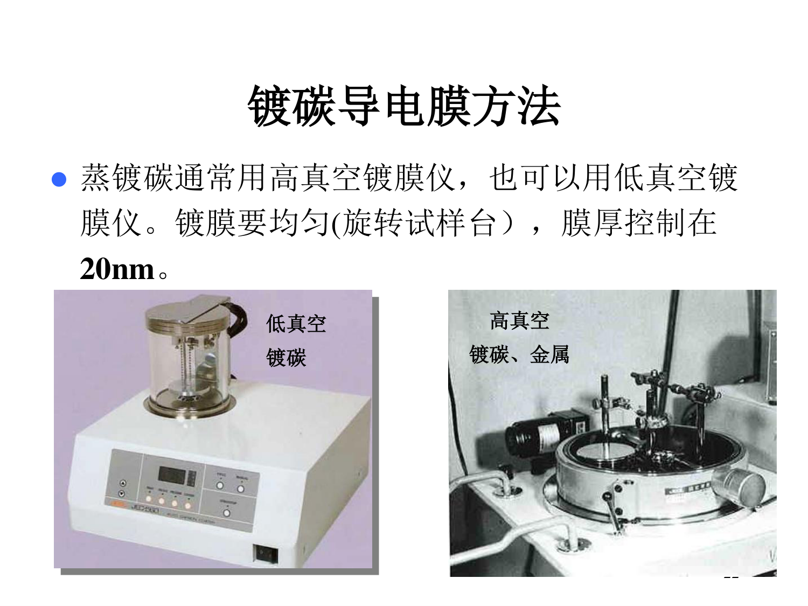

**[CN]**  
为什么 EDS/WDS 成分定量分析必须蒸镀高纯碳膜，而严禁镀金 (Au)？  
1. 原子序数低，电子阻止本领小：  
   碳的原子序数仅为 Z = 6，密度小。蒸镀 10 ~ 20 nm 的超薄碳膜对入射高能电子的能量损失极小，背散射损失可忽略不计。  
2. X 射线自吸收损失低：  
   碳对基体元素释放出的中高能特征 X 射线透射率极高，几乎不产生额外的基体吸收畸变。  
3. 谱线极简，杜绝重叠干扰峰：  
   碳原子核外仅有 K 层电子，其特征谱线全谱仅有一根低能 C-Kα 峰 (0.277 keV)，不会干扰常规金属及非金属元素。  
   反之，若采用离子溅射镀金 (Au)：  
   • Au 属于超重元素 (Z = 79)，具有密集的 M 线系 (Au-Mα = 2.12 keV, Au-Mβ = 2.20 keV)；  
   • Au-M 峰与许多重要元素线系发生严重谱线重叠：严重遮蔽 Nb-Lα (2.166 keV)、Zr-L、P-Kα (2.013 keV)、S-Kα (2.307 keV)！  
   • 镀金层还会强烈吸收低能轻元素特征 X 射线，彻底摧毁定量分析准确度。  
4. 镀碳操作要点：  
   必须使用高真空碳丝蒸发镀膜仪或脉冲碳棒镀膜仪，在真空度优于 10^-2 Pa 条件下蒸发。膜厚控制在 10 ~ 15 nm 为宜。  

**[PY]**  
wèi shén me EDS/WDS chéng fèn dìng liàng fēn xī bì xū zhēng dù gāo chún tàn mó， ér yán jìn dù jīn (Au)？  
1. yuán zi xù shù dī， diàn zi zǔ zhǐ běn lǐng xiǎo：  
tàn de yuán zi xù shù jǐn wèi Z = 6， mì dù xiǎo。 zhēng dù 10 ~ 20 nm de chāo báo tàn mó duì rù shè gāo néng diàn zi de néng liàng sǔn shī jí xiǎo， bèi sǎn shè sǔn shī kě hū lüè bù jì。  
2. X shè xiàn zì xī shōu sǔn shī dī：  
tàn duì jī tǐ yuán sù shì fàng chū de zhōng gāo néng tè zhēng X shè xiàn tòu shè lǜ jí gāo， jī hū bù chǎn shēng é wài de jī tǐ xī shōu jī biàn。  
3. pǔ xiàn jí jiǎn， dù jué chóng dié gān rǎo fēng：  
tàn yuán zǐ hé wài jǐn yǒu K céng diàn zi， qí tè zhēng pǔ xiàn quán pǔ jǐn yǒu yī gēn dī néng C-Kα fēng (0.277 keV)， bú huì gān rǎo cháng guī jīn shǔ jí fēi jīn shǔ yuán sù。  
fǎn zhī， ruò cǎi yòng lí zi jiàn shè dù jīn (Au)：  
• Au shǔ yú chāo zhòng yuán sù (Z = 79)， jù yǒu mì jí de M xiàn xì (Au-Mα = 2.12 keV, Au-Mβ = 2.20 keV)；  
• Au-M fēng yǔ xǔ duō zhòng yào yuán sù xiàn xì fā shēng yán zhòng pǔ xiàn chóng dié： yán zhòng zhē bì Nb-Lα (2.166 keV)、Zr-L、P-Kα (2.013 keV)、S-Kα (2.307 keV)！  
• dù jīn céng hái huì qiáng liè xī shōu dī néng qīng yuán sù tè zhēng X shè xiàn， chè dǐ cuī huǐ dìng liàng fēn xī zhǔn què dù。  
4. dù tàn cāo zuò yào diǎn：  
bì xū shǐ yòng gāo zhēn kōng tàn sī zhēng fā dù mó yí huò mài chōng tàn bàng dù mó yí， zài zhēn kōng dù yōu yú 10^-2 Pa tiáo jiàn xià zhēng fā。 mó hòu kòng zhì zài 10 ~ 15 nm wèi yí。  

**[EN]**  
Why High-Purity Carbon Evaporation is Mandatory for Quantitative EDS (Prohibiting Gold Sputtering):  
1. Low Atomic Number and Minimal Stopping Power:  
   Carbon has Z = 6. A 10-20 nm carbon layer exerts negligible deceleration on primary incident electrons and induces minimal backscatter attenuation.  
2. Exceptional X-ray Transmission:  
   Carbon is virtually transparent to incoming high-energy characteristic photons from underlying matrix elements, minimizing absorption corrections.  
3. Simple Spectral Line Series without Overlaps:  
   Carbon emits solely a single soft C-Kα line (0.277 keV), leaving the remaining spectral continuum completely unencumbered.  
   Conversely, Sputtered Gold (Au, Z=79):  
   • Gold exhibits dense, intense M-series lines (Au-Mα at 2.12 keV, Au-Mβ at 2.20 keV).  
   • Au-M lines fatally overlap crucial elemental lines: obliterating Nb-Lα (2.166 keV), Zr-L, P-Kα (2.013 keV), and S-Kα (2.307 keV)!  
   • Gold heavily attenuates soft matrix X-rays, invalidating quantitative matrix correction algorithms.  
4. Carbon Coating Protocols:  
   Utilize high-vacuum thermal carbon-thread or pulsed carbon-rod evaporators under vacuum < 10^-2 Pa, calibrating film thickness to 10-15 nm.

---

## 4. 试样装载、导电粘结与粉末团聚防范 / Mounting, Conductive Adhesives & Powder Dispersion

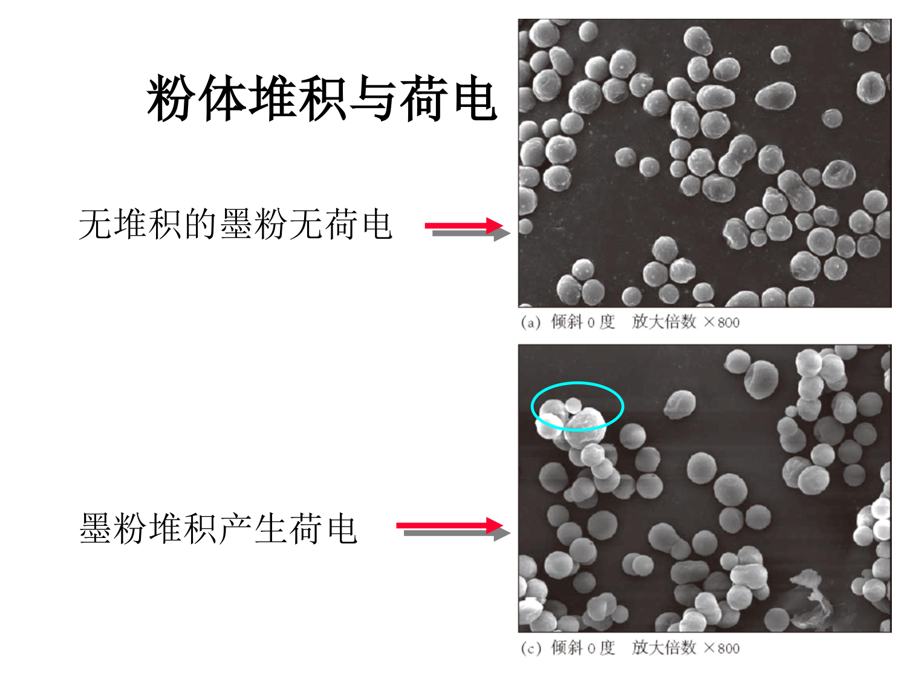

**[CN]**  
试样装载与导电导流通路构建规范：  
1. 试样导电接地三要素：  
   • 试样必须通过导电双面胶带（导电碳胶带）、高纯银导电胶 (Silver Paste) 或高纯铜胶带与金属样品台牢固连接。  
   • 使用银胶时必须警惕：银导电胶中的溶剂必须完全挥发烘干；银胶涂抹不可过多，避免飞溅；特别注意 Ag-L 线系 (3.0 keV 附近) 的潜在谱峰干扰。  
2. 避免大块绝缘胶带裸露：  
   不可在试样周围遗留大面积裸露的双面碳胶带，裸露胶带在电子束边缘杂散轰击下会挥发有机物，造成镜筒严重碳污染。  
3. 超细粉体样品的团聚与堆积荷电：  
   • 堆积危害：若将粉体厚厚堆积在胶带上，颗粒之间接触热阻与电阻极大，内部被困电荷无法导出，在束流轰击下会产生剧烈放电，并导致颗粒喷溅污染极靴与能谱窗口！  
   • 正确粉体制样：采用无水乙醇超声分散 10 ~ 15 分钟，用微量移液枪滴注于高纯单晶硅片 (Si substrate) 或高纯铝载网上，室温挥发干燥后薄膜镀碳。单个颗粒孤立平铺，彻底杜绝放电与飞溅。  

**[PY]**  
shì yàng zhuāng zài yǔ dǎo diàn dǎo liú tōng lù gòu jiàn guī fàn：  
1. shì yàng dǎo diàn jiē dì sān yào sù：  
• shì yàng bì xū tōng guò dǎo diàn shuāng miàn jiāo dài（dǎo diàn tàn jiāo dài）、 gāo chún yín dǎo diàn jiāo (Silver Paste) huò gāo chún tóng jiāo dài yǔ jīn shǔ yàng pǐn tái láo gù lián jiē。  
• shǐ yòng yín jiāo shí bì xū jǐng tì： yín dǎo diàn jiāo zhōng de róng jì bì xū wán quán huī fā hōng gān； yín jiāo tú mǒ bù kě guò duō， bì miǎn fēi jiàn； tè bié zhù yì Ag-L xiàn xì (3.0 keV fù jìn ) de qián zài pǔ fēng gān rǎo。  
2. bì miǎn dà kuài jué yuán jiāo dài luǒ lù：  
bù kě zài shì yàng zhōu wéi yí liú dà miàn jī luǒ lù de shuāng miàn tàn jiāo dài， luǒ lù jiāo dài zài diàn zi shù biān yuán zá sàn hōng jī xià huì huī fā yǒu jī wù， zào chéng jìng tǒng yán zhòng tàn wū rǎn。  
3. chāo xì fěn tǐ yàng pǐn de tuán jù yǔ duī jī hé diàn：  
• duī jī wēi hài： ruò jiāng fěn tǐ hòu hòu duī jī zài jiāo dài shàng， kē lì zhī jiàn jiē chù rè zǔ yǔ diàn zǔ jí dà， nèi bù bèi kùn diàn hè wú fǎ dǎo chū， zài shù liú hōng jī xià huì chǎn shēng jù liè fàng diàn， bìng dǎo zhì kē lì pēn jiàn wū rǎn jí xuē yǔ néng pǔ chuāng kǒu！  
• zhèng què fěn tǐ zhì yàng： cǎi yòng wú shuǐ yǐ chún chāo shēng fēn sàn 10 ~ 15 fēn zhōng， yòng wēi liàng yí yè qiāng dī zhù yú gāo chún dān jīng guī piàn (Si substrate) huò gāo chún lǚ zài wǎng shàng， shì wēn huī fā gān zào hòu báo mó dù tàn。 dān gè kē lì gū lì píng pū， chè dǐ dù jué fàng diàn yǔ fēi jiàn。  

**[EN]**  
Standardized Specimen Mounting and Grounding Protocols:  
1. Conductive Pathway Architecture:  
   • Secure the specimen to the aluminum mount using double-sided conductive carbon tape, high-purity colloidal silver paste, or copper tape.  
   • Caution with Silver Paste: Allow organic solvents to completely outgas under a warming lamp prior to chamber entry; avoid smearing paste near analysis microspots; monitor for Ag-L peak interference near 3.0 keV.  
2. Mitigating Exposed Adhesive Outgassing:  
   Trim excess carbon tape. Large exposed tape areas degas volatile hydrocarbons under peripheral beam skirts, contaminating vacuum components.  
3. Fine Powder Agglomeration and Electrostatic Ejection Hazards:  
   • Hazards of Powder Heaps: Thickly piled powders suffer massive inter-particle thermal and electrical resistance. Trapped internal charge builds explosive repulsive forces, causing loose particles to violently eject and contaminate the pole piece and detector window!  
   • Standard Powder Dispersion: Disperse powders in anhydrous ethanol via ultrasonic bath for 10-15 minutes. Drop-cast a dilute aliquot onto a mirror-polished silicon wafer or ultra-flat aluminum stub, air-dry, and deposit a ~10 nm carbon coating.

---

## 5. 试样表面平整度、粗糙度与 X 射线检出角 / Surface Flatness, Roughness & Take-off Angle

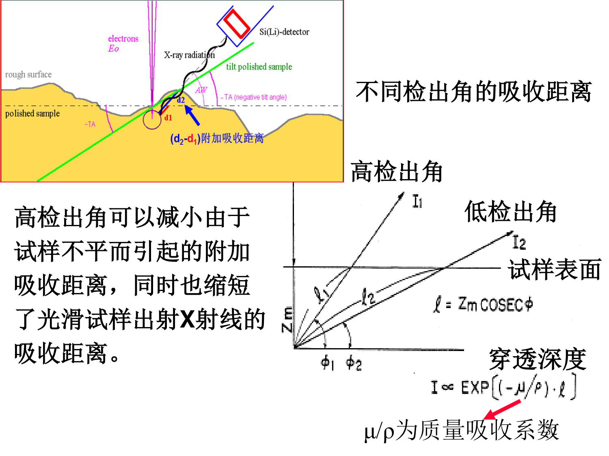

**[CN]**  
X 射线检出角 (Take-off Angle, ψ) 与表面粗糙度的几何修正物理：  
1. 检出角定义 (Take-off Angle, ψ)：  
   样品水平分析表面与能谱探测器中心光轴之间的夹角。在常规扫描电镜中，检出角通常固定在 30° ~ 40° 之间 (例如 35°)。  
2. 试样平整度的致命影响：  
   • X 射线在基体内部逸出的吸收路径长度为：d = z * csc(ψ) = z / sin(ψ) (其中 z 为激发深度)。  
   • 检出角 ψ 越大，吸收路径 d 越短，X 射线吸收修正量越小，低能 X 射线检出效率越高。  
3. 粗糙断口与粉末表面的“遮挡效应” (Shadowing Effect)：  
   若样品表面凸凹不平（如金属断口、撕裂表面）：  
   • 微观突起会直接遮挡探测器的视线，导致特征 X 射线被山丘状地形完全阻挡吸收；  
   • 局部倾角发生剧烈变化，导致局部有效检出角 ψ 偏离仪器标称值，造成标准 ZAF 吸收校正因子计算完全失真。  
   • 应对法则：粗糙不平试样严禁用常规标准有标样法定量，必须采用峰背比法 (P/B-ZAF) 或将结果强制归一化 (Normalization)。  

**[PY]**  
X shè xiàn jiǎn chū jiǎo (Take-off Angle, ψ) yǔ biǎo miàn cū cāo dù de jǐ hé xiū zhèng wù lǐ：  
1. jiǎn chū jiǎo dìng yì (Take-off Angle, ψ)：  
yàng pǐn shuǐ píng fēn xī biǎo miàn yǔ néng pǔ tàn cè qì zhōng xīn guāng zhóu zhī jiān de jiā jiǎo。 zài cháng guī sǎo miáo diàn jìng zhōng， jiǎn chū jiǎo tōng cháng gù dìng zài 30° ~ 40° zhī jiān ( lì rú 35°)。  
2. shì yàng píng zhěng dù de zhì mìng yǐng xiǎng：  
• X shè xiàn zài jī tǐ nèi bù yì chū de xī shōu lù jìng cháng dù wèi：d = z * csc(ψ) = z / sin(ψ) ( qí zhōng z wèi jī fā shēn dù )。  
• jiǎn chū jiǎo ψ yuè dà， xī shōu lù jìng d yuè duǎn，X shè xiàn xī shōu xiū zhèng liàng yuè xiǎo， dī néng X shè xiàn jiǎn chū xiào lǜ yuè gāo。  
3. cū cāo duàn kǒu yǔ fěn mò biǎo miàn de“zhē dǎng xiào yìng” (Shadowing Effect)：  
ruò yàng pǐn biǎo miàn tū āo bù píng（rú jīn shǔ duàn kǒu、 sī liè biǎo miàn）：  
• wēi guān tū qǐ huì zhí jiē zhē dǎng tàn cè qì de shì xiàn， dǎo zhì tè zhēng X shè xiàn bèi shān qiū zhuàng dì xíng wán quán zǔ dǎng xī shōu；  
• jú bù qīng jiǎo fā shēng jù liè biàn huà， dǎo zhì jú bù yǒu xiào jiǎn chū jiǎo ψ piān lí yí qì biāo chēng zhí， zào chéng biāo zhǔn ZAF xī shōu jiào zhèng yīn zi jì suàn wán quán shī zhēn。  
• yìng duì fǎ zé： cū cāo bù píng shì yàng yán jìn yòng cháng guī biāo zhǔn yǒu biāo yàng fǎ dìng liàng， bì xū cǎi yòng fēng bèi bǐ fǎ (P/B-ZAF) huò jiāng jié guǒ qiáng zhì guī yī huà (Normalization)。  

**[EN]**  
Geometric Physics of X-ray Take-off Angle (ψ) and Rough Surface Shadowing:  
1. Definition of Take-off Angle (ψ):  
   The geometric angle formed between the specimen horizontal surface plane and the central optical axis of the EDS detector collimator (typically 30° to 40° in standard SEM chambers, e.g. 35°).  
2. Physical Consequence of Flatness:  
   • The matrix absorption path length traversed by an emerging photon is: d = z * csc(ψ) = z / sin(ψ) (where z is generation depth).  
   • A higher take-off angle ψ compresses absorption distance d, minimizing matrix absorption corrections and maximizing light element collection efficiency.  
3. Shadowing Artifacts on Rough Fracture Surfaces:  
   On rough, non-planar surfaces (e.g. metallurgical fractures, granular aggregates):  
   • Topographic ridges cast geometric shadows over the detector aperture, severely absorbing or completely cutting off the emergent X-ray beam.  
   • Local surface tilt shifts the true take-off angle unpredictably, throwing standard ZAF absorption correction equations out of calibration.  
   • Operational Rule: Never apply standard-based ZAF models to unpolished rough specimens; employ the Peak-to-Background (P/B-ZAF) correction method or normalized quantitative ratios.

---

## 6. 传统金相研磨抛光与真空镶嵌工艺 / Metallographic Polishing & Vacuum Embedding

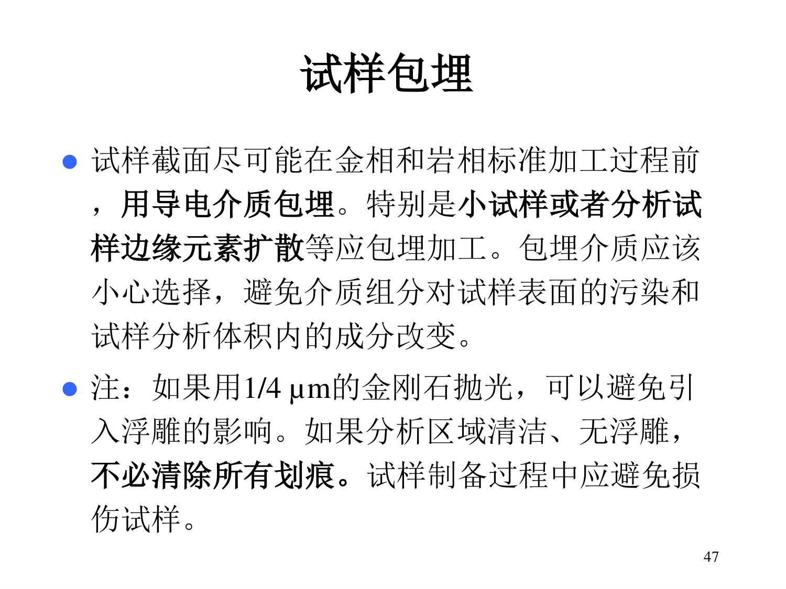

**[CN]**  
标准金相制样全流程工艺规范：  
1. 试样镶嵌 (Mounting)：  
   • 热压导电镶嵌：采用导电酚醛树脂（含铜粉或碳粉填充），在 150 °C、30 MPa 热镶机中固化成型，获得理想的导电基体与边缘保护。  
   • 真空冷镶嵌 (Vacuum Impregnation)：针对具有微孔、蜂窝孔洞、裂纹或疏松腐蚀产物的样品，将低粘度环氧树脂置于真空干燥箱中抽负压，利用压差将树脂强制灌入微孔中固化，防止研磨液与抛光膏藏匿于孔隙中。  
2. 逐级机械研磨与抛光 (Grinding & Polishing)：  
   • 研磨：由粗到细选用 SiC 碳化硅砂纸 (400# -> 800# -> 1200# -> 2000#)，每道工序旋转 90° 磨痕方向，彻底去除前道深划痕。  
   • 金刚石研磨膏微抛：依次使用 3 μm、1 μm、0.25 μm 金刚石悬浮液在呢绒布盘上低速抛光。  
   • 终极超细精抛：采用胶体二氧化硅 (Colloidal Silica, 0.04 μm) 进行振动抛光，彻底去除机械加工硬化变质层。  
3. 绝对严禁腐蚀！：  
   金相学中为了在光学显微镜下看清晶界通常会使用硝酸酒精或王水进行化学腐蚀。  
   但是：用于定量 EDS 分析的试样严禁化学腐蚀！  
   • 腐蚀会在相界处产生微观凹坑和台阶，破坏表面平整度；  
   • 化学腐蚀会选择性浸出特定活性微量元素，导致测出的成分严重失真。  

**[PY]**  
biāo zhǔn jīn xiàng zhì yàng quán liú chéng gōng yì guī fàn：  
1. shì yàng xiāng qiàn (Mounting)：  
• rè yā dǎo diàn xiāng qiàn： cǎi yòng dǎo diàn fēn quán shù zhī（hán tóng fěn huò tàn fěn tián chōng）， zài 150 °C、30 MPa rè xiāng jī zhōng gù huà chéng xíng， huò dé lǐ xiǎng de dǎo diàn jī tǐ yǔ biān yuán bǎo hù。  
• zhēn kōng lěng xiāng qiàn (Vacuum Impregnation)： zhēn duì jù yǒu wēi kǒng、 fēng wō kǒng dòng、 liè wén huò shū sōng fǔ shí chǎn wù de yàng pǐn， jiāng dī zhān dù huán yǎng shù zhī zhì yú zhēn kōng gān zào xiāng zhōng chōu fù yā， lì yòng yā chà jiāng shù zhī qiáng zhì guàn rù wēi kǒng zhōng gù huà， fáng zhǐ yán mó yè yǔ pāo guāng gāo cáng nì yú kǒng xì zhōng。  
2. zhú jí jī xiè yán mó yǔ pāo guāng (Grinding & Polishing)：  
• yán mó： yóu cū dào xì xuǎn yòng SiC tàn huà guī shā zhǐ (400# -> 800# -> 1200# -> 2000#)， měi dào gōng xù xuán zhuǎn 90° mó hén fāng xiàng， chè dǐ qù chú qián dào shēn huà hén。  
• jīn gāng shí yán mó gāo wēi pāo： yī cì shǐ yòng 3 μm、1 μm、0.25 μm jīn gāng shí xuán fú yè zài ní róng bù pán shàng dī sù pāo guāng。  
• zhōng jí chāo xì jīng pāo： cǎi yòng jiāo tǐ èr yǎng huà guī (Colloidal Silica, 0.04 μm) jìn xíng zhèn dòng pāo guāng， chè dǐ qù chú jī xiè jiā gōng yìng huà biàn zhì céng。  
3. jué duì yán jìn fǔ shí！：  
jīn xiàng xué zhōng wèi le zài guāng xué xiǎn wēi jìng xià kàn qīng jīng jiè tōng cháng huì shǐ yòng xiāo suān jiǔ jīng huò wáng shuǐ jìn xíng huà xué fǔ shí。  
dàn shì： yòng yú dìng liàng EDS fēn xī de shì yàng yán jìn huà xué fǔ shí！  
• fǔ shí huì zài xiāng jiè chù chǎn shēng wēi guān āo kēng hé tái jiē， pò huài biǎo miàn píng zhěng dù；  
• huà xué fǔ shí huì xuǎn zé xìng jìn chū tè dìng huó xìng wēi liàng yuán sù， dǎo zhì cè chū de chéng fèn yán zhòng shī zhēn。  

**[EN]**  
Standard Metallographic Specimen Preparation Protocol:  
1. Specimen Mounting:  
   • Hot Conductive Compression: Mount specimen using conductive phenolic resins (copper/carbon filled) at 150 °C and 30 MPa, achieving robust electrical grounding and edge retention.  
   • Vacuum Cold Impregnation: For porous ceramics, catalyst coatings, or fragile corrosion scales, impregnate with low-viscosity epoxy under a vacuum bell jar. Vacuum draws out trapped air and drives resin deep into voids, preventing grinding slurry entrapment.  
2. Sequential Grinding & Polishing:  
   • Grinding: Sequential SiC abrasive papers (400# -> 800# -> 1200# -> 2000#), rotating 90° between steps to eliminate residual scratches.  
   • Diamond Suspension Polishing: Diamond pastes (3 μm -> 1 μm -> 0.25 μm) on rotating napped cloths.  
   • Final Chemo-Mechanical Polish: Vibratory polishing with 0.04 μm alkaline colloidal silica to eradicate surface residual stress and mechanical deformation layers.  
3. Strict Prohibition of Chemical Etching!:  
   While optical metallography requires chemical etching (e.g. Nital) to reveal grain boundaries, chemical etching is strictly forbidden for quantitative EDS specimens!  
   • Etchants induce microscopic relief steps at phase boundaries, disrupting local planarity and take-off angles.  
   • Chemical reactions preferentially leach out reactive alloying elements, severely biasing quantitative stoichiometry.

---

## 7. 先进氩离子束截面抛光技术 (BIB / CP) / Broad Ion Beam (BIB) Cross-Section Polishing

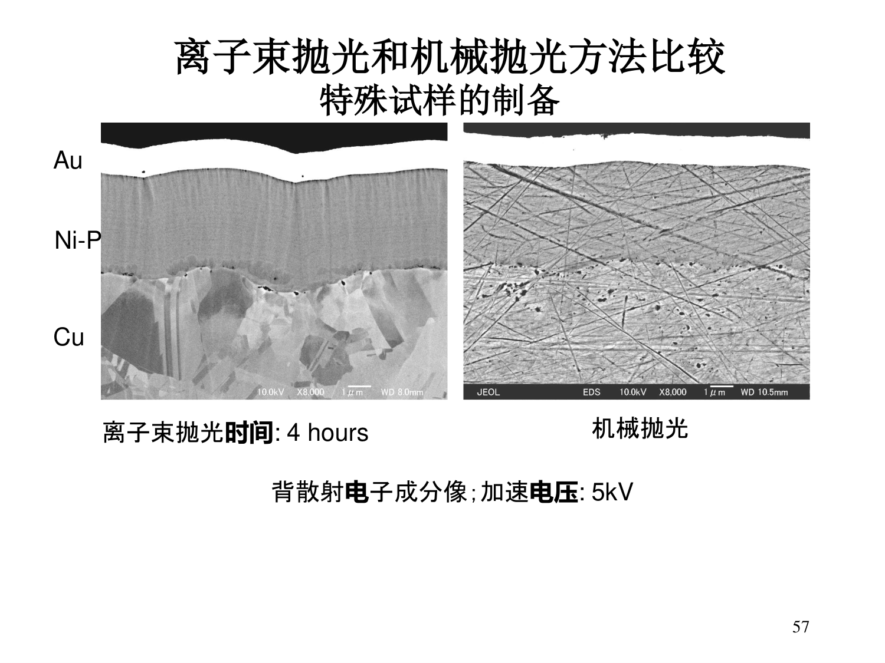

**[CN]**  
先进氩离子束截面抛光 (Broad Ion Beam, BIB / Cross-section Polisher, CP) 技术：  
1. 传统机械抛光对复合材料的局限性：  
   当样品由硬度差异极大的多相组成（例如软金属铜基底上的脆性硬质陶瓷涂层、锂电池软碳多孔极片、半导体焊点）：  
   • 机械研磨容易产生相界倒边 (Edge Rounding)、磨料颗粒嵌塞嵌入软基体、微孔被划痕金属涂抹堵塞 (Smearing)。  
2. 宽束氩离子抛光原理 (BIB/CP)：  
   • 采用经过精密微米级遮挡板 (Masking Shield) 遮蔽的高能氩离子束 (Ar+, 能量 1 ~ 8 keV)；  
   • 以微掠射角剥蚀样品边缘突出部分，通过纯物理原子级溅射剥离材料；  
   • 获得近乎原子级镜面平整度的无应力、无磨痕、无磨料嵌入的高纯截面。  
3. EDS 分析对比优势：  
   • 截面平整度极高，各多层镀膜相界面边界极其锐利；  
   • 彻底杜绝了金刚石磨料 (C) 或氧化铝磨料 (Al) 残留带来的虚假定性假峰；  
   • 是半导体封装器件、新能源锂电极片微区分析的黄金标准制样方案。  

**[PY]**  
xiān jìn yà lí zi shù jié miàn pāo guāng (Broad Ion Beam, BIB / Cross-section Polisher, CP) jì shù：  
1. chuán tǒng jī xiè pāo guāng duì fù hé cái liào de jú xiàn xìng：  
dāng yàng pǐn yóu yìng dù chā yì jí dà de duō xiāng zǔ chéng（lì rú ruǎn jīn shǔ tóng jī dǐ shàng de cuì xìng yìng zhì táo cí tú céng、 lǐ diàn chí ruǎn tàn duō kǒng jí piàn、 bàn dǎo tǐ hàn diǎn）：  
• jī xiè yán mó róng yì chǎn shēng xiāng jiè dào biān (Edge Rounding)、 mó liào kē lì qiàn sāi qiàn rù ruǎn jī tǐ、 wēi kǒng bèi huà hén jīn shǔ tú mǒ dǔ sè (Smearing)。  
2. kuān shù yà lí zi pāo guāng yuán lǐ (BIB/CP)：  
• cǎi yòng jīng guò jīng mì wēi mǐ jí zhē dǎng bǎn (Masking Shield) zhē bì de gāo néng yà lí zi shù (Ar+, néng liàng 1 ~ 8 keV)；  
• yǐ wēi lüè shè jiǎo bō shí yàng pǐn biān yuán tū chū bù fèn， tōng guò chún wù lǐ yuán zi jí jiàn shè bō lí cái liào；  
• huò dé jìn hū yuán zi jí jìng miàn píng zhěng dù de wú yīng lì、 wú mó hén、 wú mó liào qiàn rù de gāo chún jié miàn。  
3. EDS fēn xī duì bǐ yōu shì：  
• jié miàn píng zhěng dù jí gāo， gè duō céng dù mó xiāng jiè miàn biān jiè jí qí ruì lì；  
• chè dǐ dù jué le jīn gāng shí mó liào (C) huò yǎng huà lǚ mó liào (Al) cán liú dài lái de xū jiǎ dìng xìng jiǎ fēng；  
• shì bàn dǎo tǐ fēng zhuāng qì jiàn、 xīn néng yuán lǐ diàn jí piàn wēi qū fēn xī de huáng jīn biāo zhǔn zhì yàng fāng àn。  

**[EN]**  
Broad Ion Beam (BIB / CP) Cross-Sectioning Technology:  
1. Deficiencies of Mechanical Polishing on Heterogeneous Couples:  
   When specimens comprise constituents with wide hardness disparities (e.g. brittle ceramic thermal barrier coatings on ductile superalloys, porous battery electrodes, or microelectronic solder joints):  
   • Mechanical polishing produces phase relief, edge rounding, abrasive particle embedding, and mechanical smearing across micro-pores.  
2. Broad Ion Beam (BIB) Operating Principle:  
   • High-purity argon ions (Ar+, 1-8 keV) strike the specimen edge past a high-precision tungsten masking shield.  
   • Physical atomic sputtering shears away exposed material at glancing incidence, fabricating a planar cross-section free of mechanical strain and abrasive embeds.  
3. Unmatched Advantages for Quantitative EDS:  
   • Delivers razor-sharp interfaces across multilayer heterostructures without topographic relief steps.  
   • Eliminates spurious artifact peaks caused by embedded diamond (C) or alumina (Al2O3) polishing residues.  
   • Represents the gold-standard specimen preparation benchmark for advanced microelectronics packaging and battery electrode diagnostics.

---

## 8. 关键技术术语对照表 / Key Technical Glossary

| 中文术语 (Chinese) | 汉语拼音 (Hanyu Pinyin) | 英文术语 (English) | 技术释义 (Technical Definition) |
| :--- | :--- | :--- | :--- |
| **荷电效应** | hè diàn xiào yìng | Specimen Charging | 绝缘样品表面因吸收电子无法导出而积累负静电荷的物理现象 |
| **电荷平衡** | diàn hè píng héng | Charge Balance | 注入电子束流与二次电子、背散射电子及吸收电流的代数平衡守恒 |
| **导电镀碳** | dǎo diàn dù tàn | Conductive Carbon Coating | 在绝缘材料表面蒸镀 10-15nm 高纯碳膜以提供导电通路的工艺 |
| **检出角** | jiǎn chū jiǎo | Take-off Angle (ψ) | 样品水平表面与能谱探测器中心光轴之间的立体空间夹角 |
| **遮挡效应** | zhē dǎng xiào yìng | Shadowing Effect | 粗糙表面微观凸起遮挡 X 射线导致信号无法到达探测器的几何假象 |
| **真空镶嵌** | zhēn kōng xiāng qiàn | Vacuum Impregnation | 在真空负压下将低粘度环氧树脂注入多孔疏松材料内部的制样方法 |
| **氩离子束截面抛光** | yà lí zǐ shù jié miàn pāo guāng | Broad Ion Beam Polishing (BIB/CP) | 利用高能 Ar+ 离子物理溅射加工超平滑无应力金相截面的精密技术 |
| **峰背比法** | fēng bèi bǐ fǎ | Peak-to-Background Method (P/B) | 适用于粗糙/不平整/粉末试样的无标样定量能谱修正算法 |
| **离子迁移** | lí zǐ qiān yí | Ion Migration | 电子束照射下含碱金属玻璃等样品内部轻金属离子向深层电场漂移的现象 |

---

# Module 4: 三、EDS 定量分析方法与分析误差
# Module 4: EDS Quantitative Analysis Methods and Analytical Errors

---

## 目录 / Table of Contents
1. [定性分析原理、自动寻峰与谱峰去卷积 (Deconvolution)](#1-定性分析原理自动寻峰与谱峰去卷积-deconvolution)
2. [定量分析基本原理与基体效应 (Matrix Effects)](#2-定量分析基本原理与基体效应-matrix-effects)
3. [经典 ZAF 基体校正物理模型 / Classical ZAF Matrix Correction Model](#3-经典-zaf-基体校正物理模型--classical-zaf-matrix-correction-model)
4. [深度分布函数 Phi-Rho-Z [Φ(ρz)] 与 XPP 模型 / Phi-Rho-Z & XPP Models](#4-深度分布函数-phi-rho-z-φρz-与-xpp-模型--phi-rho-z--xpp-models)
5. [粗糙不平试样与峰背比定量法 (P/B-ZAF) / P/B Method for Rough Surfaces](#5-粗糙不平试样与峰背比定量法-pb-zaf--pb-method-for-rough-surfaces)
6. [有标样定量 vs 无标样定量与计算策略 / Standard-based vs Standardless](#6-有标样定量-vs-无标样定量与计算策略--standard-based-vs-standardless)
7. [超轻元素 (Z < 10) 定量分析难点与优化方案 / Light Element Microanalysis](#7-超轻元素-z--10-定量分析难点与优化方案--light-element-microanalysis)
8. [误差来源、泊松统计置信度与检出限 / Error Analysis, Counting Statistics & LOD](#8-误差来源泊松统计置信度与检出限--error-analysis-counting-statistics--lod)
9. [国家标准 GB/T 25189 误差等级与数据保留位数 / National Standards & Significant Digits](#9-国家标准-gbt-25189-误差等级与数据保留位数--national-standards--significant-digits)
10. [关键技术术语对照表 / Key Technical Glossary](#10-关键技术术语对照表--key-technical-glossary)

---

## 1. 定性分析原理、自动寻峰与谱峰去卷积 (Deconvolution)

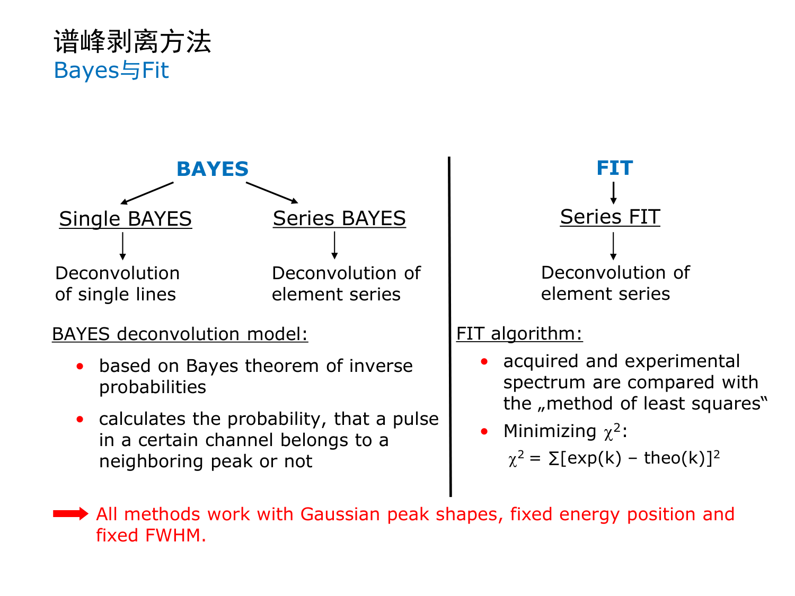

**[CN]**  
定性分析的核心依据与复杂谱峰剥离 (Deconvolution)：  
1. 定性物理基础：  
   依据莫塞莱定律，特征 X 射线光子能量 E 与原子序数 Z 满足严格的一一对应关系：  
   E = c1 * (Z - c2)^2  
   通过多道脉冲幅度分析器测定谱峰中心能量位置，即可精确判定样品中存在的化学元素种类。  
2. 谱峰重叠 (Peak Overlaps) 的挑战：  
   由于硅探测器的能量分辨率约为 123 ~ 130 eV，在复杂合金和矿物中经常遭遇严重谱线重叠：  
   • Ti-Kβ (4.931 keV) 与 V-Kα (4.952 keV) 重叠；  
   • Ba-Lα (4.465 keV) 与 Ti-Kα (4.510 keV) 重叠；  
   • S-Kα (2.307 keV)、Pb-Mα (2.342 keV) 与 Mo-Lα (2.293 keV) 严重重叠；  
   • Si-Kα (1.740 keV) 与 W-Mα (1.775 keV) 重叠。  
3. 谱峰剥离去卷积算法 (Bayes Deconvolution)：  
   ESPRIT 软件采用贝叶斯去卷积 (Bayes Deconvolution) 与非线性最小二乘拟合算法。该算法结合探测器特征响应函数、高斯峰展宽模型及理论自然线宽，将紧密重叠的复合波形数学分离为各单元素的纯净高斯峰分量，精确求解各元素的纯净积分计数率。  

**[PY]**  
dìng xìng fēn xī de hé xīn yī jù yǔ fù zá pǔ fēng bō lí (Deconvolution)：  
1. dìng xìng wù lǐ jī chǔ：  
yī jù mò sāi lái dìng lǜ， tè zhēng X shè xiàn guāng zi néng liàng E yǔ yuán zi xù shù Z mǎn zú yán gé de yī yī duì yìng guān xì：  
E = c1 * (Z - c2)^2  
tōng guò duō dào mài chōng fú dù fēn xī qì cè dìng pǔ fēng zhōng xīn néng liàng wèi zhì， jí kě jīng què pàn dìng yàng pǐn zhōng cún zài de huà xué yuán sù zhǒng lèi。  
2. pǔ fēng chóng dié (Peak Overlaps) de tiǎo zhàn：  
yóu yú guī tàn cè qì de néng liàng fēn biàn lǜ yuē wèi 123 ~ 130 eV， zài fù zá hé jīn hé kuàng wù zhōng jīng cháng zāo yù yán zhòng pǔ xiàn chóng dié：  
• Ti-Kβ (4.931 keV) yǔ V-Kα (4.952 keV) chóng dié；  
• Ba-Lα (4.465 keV) yǔ Ti-Kα (4.510 keV) chóng dié；  
• S-Kα (2.307 keV)、Pb-Mα (2.342 keV) yǔ Mo-Lα (2.293 keV) yán zhòng chóng dié；  
• Si-Kα (1.740 keV) yǔ W-Mα (1.775 keV) chóng dié。  
3. pǔ fēng bō lí qù juǎn jī suàn fǎ (Bayes Deconvolution)：  
ESPRIT ruǎn jiàn cǎi yòng bèi yè sī qù juǎn jī (Bayes Deconvolution) yǔ fēi xiàn xìng zuì xiǎo èr chéng nǐ hé suàn fǎ。 gāi suàn fǎ jié hé tàn cè qì tè zhēng xiǎng yìng hán shù、 gāo sī fēng zhǎn kuān mó xíng jí lǐ lùn zì rán xiàn kuān， jiāng jǐn mì chóng dié de fù hé bō xíng shù xué fēn lí wèi gè dān yuán sù de chún jìng gāo sī fēng fèn liàng， jīng què qiú jiě gè yuán sù de chún jìng jī fēn jì shù lǜ。  

**[EN]**  
Qualitative Identification and Advanced Spectral Deconvolution:  
1. Physical Basis for Qualitative Identification:  
   Grounded in Moseley's fundamental law, characteristic X-ray photon energy E corresponds uniquely to atomic number Z:  
   E = c1 * (Z - c2)^2  
   By locating the centroid channel of each Gaussian peak, constituent elemental species are unambiguously identified.  
2. The Challenge of Peak Overlaps:  
   Because the energy resolution of semiconductor SDDs spans ~123 to 130 eV, overlapping peaks are common in complex materials:  
   • Ti-Kβ (4.931 keV) overlapping V-Kα (4.952 keV);  
   • Ba-Lα (4.465 keV) overlapping Ti-Kα (4.510 keV);  
   • S-Kα (2.307 keV), Pb-Mα (2.342 keV), and Mo-Lα (2.293 keV) mutually interfering;  
   • Si-Kα (1.740 keV) overlapping W-Mα (1.775 keV).  
3. Bayes Deconvolution Framework:  
   ESPRIT software employs advanced Bayesian deconvolution and non-linear least squares multi-peak fitting. By incorporating detector response functions, electronic noise broadening, and intrinsic Fano factors, the algorithm mathematically strips overlapping multiplets into individual Gaussian components, extracting true net intensities.

---

## 2. 定量分析基本原理与基体效应 (Matrix Effects)

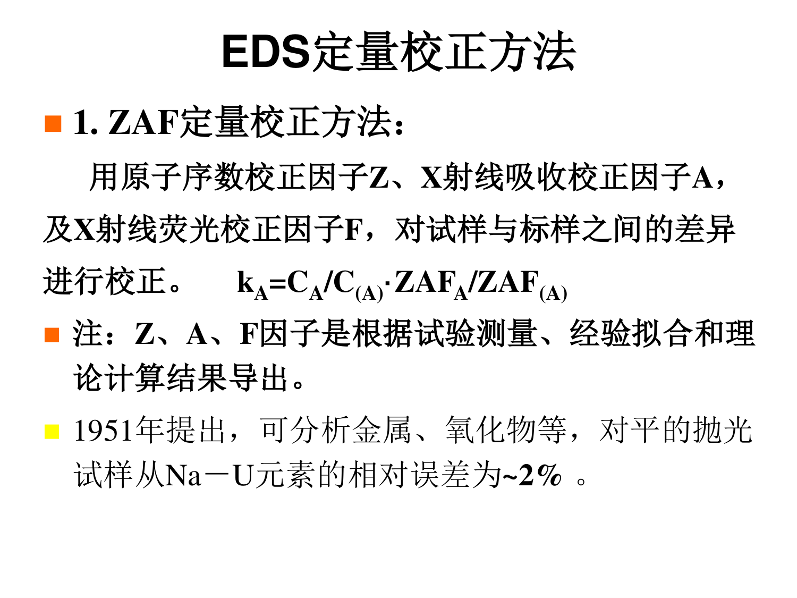

**[CN]**  
从卡斯泰因 (Castaing) 一级近似到现代基体校正：  
1. 卡斯泰因一级近似公式 (1951)：  
   卡斯泰因提出：未知样品中元素 A 的质量分数 CA，在一级近似下等于未知样品的特征 X 射线净强度 I_unk 与纯元素标准样品净强度 I_std 之比：  
   k_A = I_unk / I_std ≈ C_A  
2. 为什么原生强度不等于检测强度？（必须进行基体校正）：  
   在实际多元体系中，由于样品中存在其他共存元素（基体 Matrix），导致上述简单线性关系彻底失效：  
   • 原子序数效应 (Z 效应)：不同元素的原子核对入射电子的减速阻止能力及背散射损失率截然不同；  
   • 吸收效应 (A 效应)：元素 A 激发的 X 射线在向外逸出样品表面的过程中，会被基体中其他重元素剧烈自吸收；  
   • 荧光效应 (F 效应)：基体中高能量特征 X 射线（如 Fe-Kα, 6.40 keV）在穿过样品时，可能次级激发能量较低的邻近元素（如 Cr-Kα, 5.41 keV），导致低能元素强度发生虚假增益。  
   因此，必须引入基体修正系数对原始 k 比值进行严密修正。  

**[PY]**  
cóng kǎ sī tài yīn (Castaing) yī jí jìn sì dào xiàn dài jī tǐ xiào zhèng：  
1. kǎ sī tài yīn yī jí jìn sì gōng shì (1951)：  
kǎ sī tài yīn tí chū： wèi zhī yàng pǐn zhōng yuán sù A de zhì liàng fēn shù CA， zài yī jí jìn sì xià děng yú wèi zhī yàng pǐn de tè zhēng X shè xiàn jìng qiáng dù I_unk yǔ chún yuán sù biāo zhǔn yàng pǐn jìng qiáng dù I_std zhī bǐ：  
k_A = I_unk / I_std ≈ C_A  
2. wèi shén me yuán shēng qiáng dù bù děng yú jiǎn cè qiáng dù？（bì xū jìn xíng jī tǐ xiào zhèng）：  
zài shí jì duō yuán tǐ xì zhōng， yóu yú yàng pǐn zhōng cún zài qí tā gòng cún yuán sù（jī tǐ Matrix）， dǎo zhì shàng shù jiǎn dān xiàn xìng guān xì chè dǐ shī xiào：  
• yuán zi xù shù xiào yìng (Z xiào yìng )： bù tóng yuán sù de yuán zǐ hé duì rù shè diàn zi de jiǎn sù zǔ zhǐ néng lì jí bèi sǎn shè sǔn shī lǜ jié rán bù tóng；  
• xī shōu xiào yìng (A xiào yìng )： yuán sù A jī fā de X shè xiàn zài xiàng wài yì chū yàng pǐn biǎo miàn de guò chéng zhōng， huì bèi jī tǐ zhōng qí tā zhòng yuán sù jù liè zì xī shōu；  
• yíng guāng xiào yìng (F xiào yìng )： jī tǐ zhōng gāo néng liàng tè zhēng X shè xiàn（rú Fe-Kα, 6.40 keV） zài chuān guò yàng pǐn shí， kě néng cì jí jī fā néng liàng jiào dī de lín jìn yuán sù（rú Cr-Kα, 5.41 keV）， dǎo zhì dī néng yuán sù qiáng dù fā shēng xū jiǎ zēng yì。  
yīn cǐ， bì xū yǐn rù jī tǐ xiū zhèng xì shù duì yuán shǐ k bǐ zhí jìn xíng yán mì xiū zhèng。  

**[EN]**  
From Castaing's First Approximation to Modern Matrix Correction:  
1. Castaing's First Approximation (1951):  
   Raimond Castaing posited that the mass concentration CA of element A in an unknown specimen approximately equals the net intensity ratio of the unknown (I_unk) to a pure elemental standard (I_std):  
   k_A = I_unk / I_std ≈ C_A  
2. Why Raw Intensity Ratios Diverge from True Concentration (Matrix Effects):  
   In complex multi-element solids, surrounding elements (the matrix) severely alter radiation yield through three distinct physical processes:  
   • Atomic Number Effect (Z): Differences in electron stopping power and backscattering losses alter primary inner-shell ionization rates.  
   • Absorption Effect (A): Photons generated at depth are partially re-absorbed by heavier matrix constituents prior to escaping the surface.  
   • Secondary Fluorescence Effect (F): Characteristic photons of higher energy (e.g. Fe-Kα at 6.40 keV) photoionize lower-energy core levels of neighboring atoms (e.g. Cr-Kα at 5.41 keV), artificially inflating Cr emission.  
   Consequently, raw k-ratios must be transformed via rigorous matrix correction models.

---

## 3. 经典 ZAF 基体校正物理模型 / Classical ZAF Matrix Correction Model

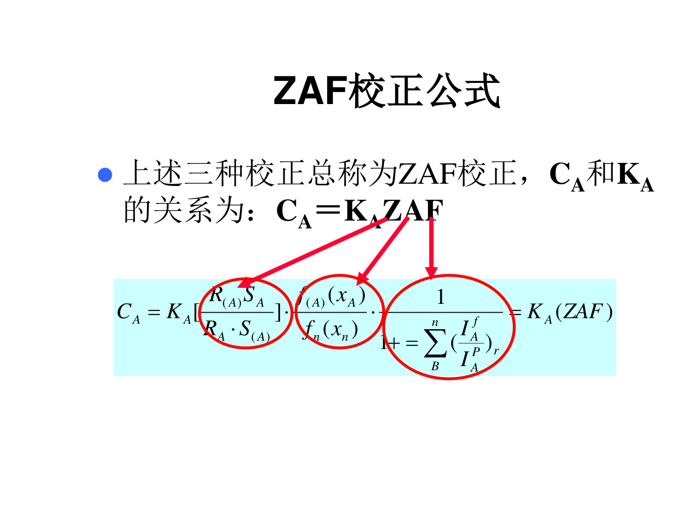

**[CN]**  
经典 ZAF 修正法的三大物理算子分解：  
定量总修正公式表达为：  
C_A = [Z * A * F]_A * k_A  
  
1. 原子序数修正因子 (Atomic Number Factor, Z)：  
   Z_A = (R_A / R_std) * (S_std / S_A)  
   • 阻止本领 S (Stopping Power)：基于贝特 (Bethe) 连续减速假说，描述电子穿行单位质量厚度时的能量耗散率 (dE/dρx)。  
   • 背散射损失因子 R (Backscatter Loss Factor)：衡量入射电子未耗尽能量即反弹逸出样品表面带走的能量损失比率。  
2. 吸收修正因子 (Absorption Factor, A)：  
   A_A = f(χ_unk) / f(χ_std)  
   其中 χ = (μ/ρ) * csc(ψ)，μ/ρ 为对目标谱线的基体质量吸收系数，ψ 为能谱仪检出角。吸收校正是所有修正项中绝对数值最大、对定量准确度起决定性影响的一项。  
3. 荧光修正因子 (Fluorescence Factor, F)：  
   F_A = (1 + Σ γ_AB)_unk / (1 + Σ γ_AB)_std  
   扣除由基体其他元素引起的二次特征 X 射线荧光增益，恢复真实的初级电子碰撞电离产额。  

**[PY]**  
jīng diǎn ZAF xiū zhèng fǎ de sān dà wù lǐ suàn zi fēn jiě：  
dìng liàng zǒng xiū zhèng gōng shì biǎo dá wèi：  
C_A = [Z * A * F]_A * k_A  
1. yuán zi xù shù xiū zhèng yīn zi (Atomic Number Factor, Z)：  
Z_A = (R_A / R_std) * (S_std / S_A)  
• zǔ zhǐ běn lǐng S (Stopping Power)： jī yú bèi tè (Bethe) lián xù jiǎn sù jiǎ shuō， miáo shù diàn zi chuān xíng dān wèi zhì liàng hòu dù shí de néng liàng hào sàn lǜ (dE/dρx)。  
• bèi sǎn shè sǔn shī yīn zi R (Backscatter Loss Factor)： héng liáng rù shè diàn zi wèi hào jìn néng liàng jí fǎn tán yì chū yàng pǐn biǎo miàn dài zǒu de néng liàng sǔn shī bǐ lǜ。  
2. xī shōu xiū zhèng yīn zi (Absorption Factor, A)：  
A_A = f(χ_unk) / f(χ_std)  
qí zhōng χ = (μ/ρ) * csc(ψ)，μ/ρ wèi duì mù biāo pǔ xiàn de jī tǐ zhì liàng xī shōu xì shù，ψ wèi néng pǔ yí jiǎn chū jiǎo。 xī shōu jiào zhèng shì suǒ yǒu xiū zhèng xiàng zhōng jué duì shù zhí zuì dà、 duì dìng liàng zhǔn què dù qǐ jué dìng xìng yǐng xiǎng de yī xiàng。  
3. yíng guāng xiū zhèng yīn zi (Fluorescence Factor, F)：  
F_A = (1 + Σ γ_AB)_unk / (1 + Σ γ_AB)_std  
kòu chú yóu jī tǐ qí tā yuán sù yǐn qǐ de èr cì tè zhēng X shè xiàn yíng guāng zēng yì， huī fù zhēn shí de chū jí diàn zi pèng zhuàng diàn lí chǎn é。  

**[EN]**  
Mathematical Architecture of the Classical ZAF Formulation:  
The true mass fraction is computed iteratively via:  
C_A = [Z * A * F]_A * k_A  
  
1. Atomic Number Factor (Z):  
   Z_A = (R_A / R_std) * (S_std / S_A)  
   • Stopping Power (S): Governed by the Bethe continuous deceleration equation, detailing electron energy dissipation per unit mass thickness (dE/dρx).  
   • Backscatter Factor (R): Corrects for the fraction of primary electron kinetic energy lost when backscattered electrons escape into vacuum.  
2. Absorption Factor (A):  
   A_A = f(χ_unk) / f(χ_std)  
   Where χ = (μ/ρ) * csc(ψ), μ/ρ represents the matrix mass absorption coefficient, and ψ is the X-ray take-off angle. Absorption is overwhelmingly the dominant correction magnitude.  
3. Characteristic Fluorescence Factor (F):  
   F_A = (1 + Σ γ_AB)_unk / (1 + Σ γ_AB)_std  
   Corrects for indirect characteristic X-ray enhancement caused by secondary photoionization from higher-energy matrix photons.

---

## 4. 深度分布函数 Phi-Rho-Z [Φ(ρz)] 与 XPP 模型 / Phi-Rho-Z & XPP Models

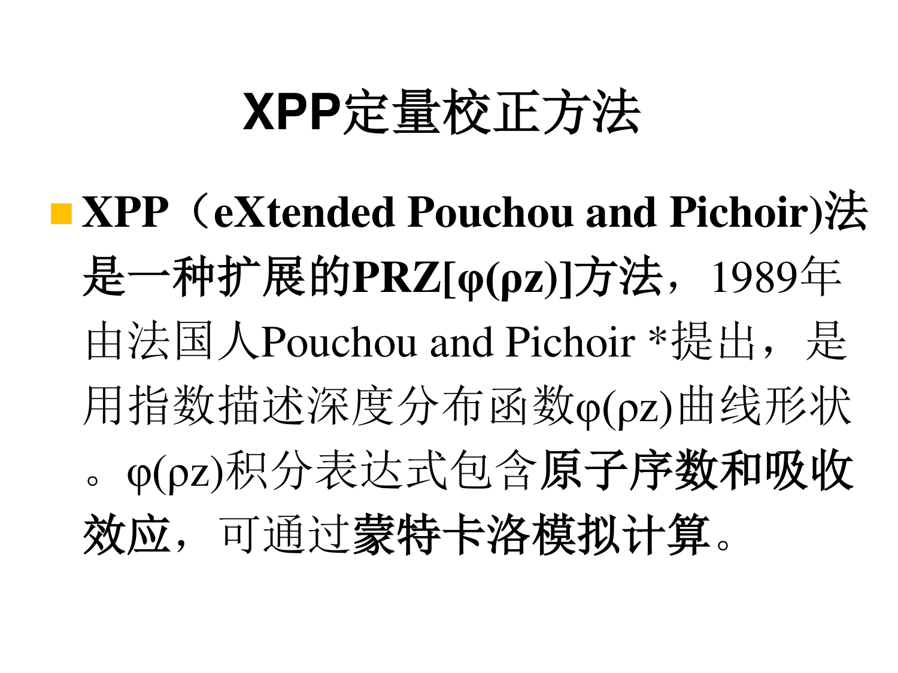

**[CN]**  
现代 Φ(ρz) 深度分布函数与 XPP 校正算法：  
1. Φ(ρz) 的物理定义：  
   Φ(ρz) 表示在质量深度 ρz (单位：g/cm² 或 mg/cm²) 的超薄层内产生的特征 X 射线强度，与一个置于真空中的孤立超薄独立层产生强度的比值。  
2. 对传统 ZAF 模型的重大超越：  
   • ZAF 模型简单假定吸收与电离沿深度呈单调指数衰减，在表层附近存在巨大偏差。  
   • Φ(ρz) 模型直接通过双抛物线方程 (Pouchou & Pichoir) 或高斯分布方程，精确描绘了电子束射入样品后从表层电离 (Φ0)、经历多次散射达到极大值峰值 (Rm)、再逐渐衰减降为零的完整物理全貌。  
3. 扩展 XPP 算法 (eXtended Pouchou and Pichoir)：  
   布鲁克 ESPRIT 软件默认推荐的核心算法。XPP 针对轻元素长波长 X 射线吸收剧烈、低加速电压 (3 ~ 5 kV) 浅表层电离以及倾斜表面的复杂边界条件进行了全面优化，其定量准确度在国际微束分析界公认显著超越传统 ZAF。  

**[PY]**  
xiàn dài Φ(ρz) shēn dù fēn bù hán shù yǔ XPP jiào zhèng suàn fǎ：  
1. Φ(ρz) de wù lǐ dìng yì：  
Φ(ρz) biǎo shì zài zhì liàng shēn dù ρz ( dān wèi：g/cm² huò mg/cm²) de chāo báo céng nèi chǎn shēng de tè zhēng X shè xiàn qiáng dù， yǔ yí gè zhì yú zhēn kōng zhōng de gū lì chāo báo dú lì céng chǎn shēng qiáng dù de bǐ zhí。  
2. duì chuán tǒng ZAF mó xíng de zhòng dà chāo yuè：  
• ZAF mó xíng jiǎn dān jiǎ dìng xī shōu yǔ diàn lí yán shēn dù chéng dān diào zhǐ shù shuāi jiǎn， zài biǎo céng fù jìn cún zài jù dà piān chā。  
• Φ(ρz) mó xíng zhí jiē tōng guò shuāng pāo wù xiàn fāng chéng (Pouchou & Pichoir) huò gāo sī fēn bù fāng chéng， jīng què miáo huì le diàn zi shù shè rù yàng pǐn hòu cóng biǎo céng diàn lí (Φ0)、 jīng lì duō cì sǎn shè dá dào jí dà zhí fēng zhí (Rm)、 zài zhú jiàn shuāi jiǎn jiàng wèi líng de wán zhěng wù lǐ quán mào。  
3. kuò zhǎn XPP suàn fǎ (eXtended Pouchou and Pichoir)：  
bù lǔ kè ESPRIT ruǎn jiàn mò rèn tuī jiàn de hé xīn suàn fǎ。XPP zhēn duì qīng yuán sù cháng bō zhǎng X shè xiàn xī shōu jù liè、 dī jiā sù diàn yā (3 ~ 5 kV) qiǎn biǎo céng diàn lí yǐ jí qīng xié biǎo miàn de fù zá biān jiè tiáo jiàn jìn xíng le quán miàn yōu huà， qí dìng liàng zhǔn què dù zài guó jì wēi shù fēn xī jiè gōng rèn xiǎn zhù chāo yuè chuán tǒng ZAF。  

**[EN]**  
The Modern Φ(ρz) Depth Distribution Function and XPP Paradigm:  
1. Physical Definition of Φ(ρz):  
   Φ(ρz) defines the local characteristic X-ray generation rate within an infinitesimal layer at mass depth ρz, normalized to the emission of an isolated unsupported thin film in vacuum.  
2. Transcending Classical ZAF Limitations:  
   • Classical ZAF assumes an idealized exponential absorption profile, failing dramatically near surface boundaries.  
   • The Φ(ρz) model (parameterized via Pouchou & Pichoir double-parabolic or Gaussian equations) realistically traces the trajectory: starting from surface ionization Φ0, rising to maximum generation at depth Rm, and trailing off to zero.  
3. The Extended XPP Model:  
   The gold-standard algorithm in Bruker ESPRIT. XPP provides superior correction for soft light-element X-rays, ultra-low accelerating voltages (3-5 kV), and near-surface generation profiles, outperforming classical ZAF across non-ideal specimens.

---

## 5. 粗糙不平试样与峰背比定量法 (P/B-ZAF) / P/B Method for Rough Surfaces

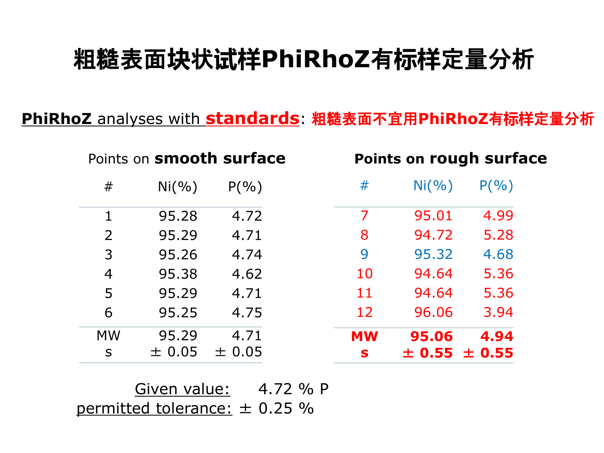

**[CN]**  
断口、粉末与粗糙不平试样的救星：P/B-ZAF 峰背比定量校正法：  
1. 传统 ZAF 在粗糙断口上的彻底失败：  
   对于断口、粗糙机械加工面、磨损颗粒，局部表面起伏倾角未知且伴随严重的几何微观遮挡。此时入射角不是 90°，出射检出角 ψ 也非标称值，传统 ZAF 计算出的吸收校正量完全错误，元素总和常常大幅偏离 100% (可能低至 50% 或高达 150%)。  
2. 峰背比 (Peak-to-Background, P/B) 的神奇不变性：  
   • 在特定能量 E 处，特征峰强度 P 与紧邻该能量处的连续谱背底强度 B，具有极其相似的产生深度分布；  
   • 当试样发生倾斜、高低起伏或局部被凹坑遮挡时，特征峰光子 P 与连续背底光子 B 受到的基体吸收衰减比例几乎完全等价！  
   • 两者相除得到峰背比 (P/B)，粗糙度引起的几何遮挡与吸收畸变被数学完全抵消消除！  
3. P/B-ZAF 无标样定量分析应用：  
   斯塔瑟姆 (Statham) 提出的 P/B-ZAF 算法，利用物理计算出的特征峰与同能区韧致辐射背底截面，不需要真实物理标样即可直接对粗糙断口、粉末颗粒进行无标样定量分析，成功将粗糙样品的相对分析误差控制在工程允许的 ±5% ~ ±10% 范围内。  

**[PY]**  
duàn kǒu、 fěn mò yǔ cū cāo bù píng shì yàng de jiù xīng：P/B-ZAF fēng bèi bǐ dìng liàng jiào zhèng fǎ：  
1. chuán tǒng ZAF zài cū cāo duàn kǒu shàng de chè dǐ shī bài：  
duì yú duàn kǒu、 cū cāo jī xiè jiā gōng miàn、 mó sǔn kē lì， jú bù biǎo miàn qǐ fú qīng jiǎo wèi zhī qiě bàn suí yán zhòng de jǐ hé wēi guān zhē dǎng。 cǐ shí rù shè jiǎo bú shì 90°， chū shè jiǎn chū jiǎo ψ yě fēi biāo chēng zhí， chuán tǒng ZAF jì suàn chū de xī shōu jiào zhèng liàng wán quán cuò wù， yuán sù zǒng hé cháng cháng dà fú piān lí 100% ( kě néng dī zhì 50% huò gāo dá 150%)。  
2. fēng bèi bǐ (Peak-to-Background, P/B) de shén qí bù biàn xìng：  
• zài tè dìng néng liàng E chù， tè zhēng fēng qiáng dù P yǔ jǐn lín gāi néng liàng chù de lián xù pǔ bèi dǐ qiáng dù B， jù yǒu jí qí xiāng sì de chǎn shēng shēn dù fēn bù；  
• dāng shì yàng fā shēng qīng xié、 gāo dī qǐ fú huò jú bù bèi āo kēng zhē dǎng shí， tè zhēng fēng guāng zi P yǔ lián xù bèi dǐ guāng zi B shòu dào de jī tǐ xī shōu shuāi jiǎn bǐ lì jī hū wán quán děng jià！  
• liǎng zhě xiāng chú dé dào fēng bèi bǐ (P/B)， cū cāo dù yǐn qǐ de jǐ hé zhē dǎng yǔ xī shōu jī biàn bèi shù xué wán quán dǐ xiāo xiāo chú！  
3. P/B-ZAF wú biāo yàng dìng liàng fēn xī yìng yòng：  
sī tǎ sè mǔ (Statham) tí chū de P/B-ZAF suàn fǎ， lì yòng wù lǐ jì suàn chū de tè zhēng fēng yǔ tóng néng qū rèn zhì fú shè bèi dǐ jié miàn， bù xū yào zhēn shí wù lǐ biāo yàng jí kě zhí jiē duì cū cāo duàn kǒu、 fěn mò kē lì jìn xíng wú biāo yàng dìng liàng fēn xī， chéng gōng jiāng cū cāo yàng pǐn de xiāng duì fēn xī wù chā kòng zhì zài gōng chéng yǔn xǔ de ±5% ~ ±10% fàn wéi nèi。  

**[EN]**  
The Peak-to-Background (P/B-ZAF) Method for Unpolished & Rough Specimens:  
1. Complete Breakdown of ZAF on Fractures:  
   On metallographic fracture facets, powder agglomerates, and unpolished surfaces, local surface inclinations are stochastic and shadowed. Because the true local take-off angle ψ is unknown, classical ZAF calculations fail catastrophically, yielding totals fluctuating wildly from 50% to 150%.  
2. The Geometric Invariance of the Peak-to-Background Ratio:  
   • For a given characteristic line, the net peak intensity (P) and the adjacent continuum bremsstrahlung background (B) originate from nearly identical generation depth distributions.  
   • When local topography tilts or shadows the analysis site, both the peak photons (P) and local continuum photons (B) undergo virtually identical attenuation!  
   • Dividing P by B cancels out geometric shadowing and roughness-induced absorption distortions.  
3. Statham's P/B-ZAF Standardless Protocol:  
   By coupling calculated continuous background cross-sections with physical ionization parameters, the P/B-ZAF method performs robust standardless quantification on rough fracture surfaces and irregular powders without standards, suppressing relative errors to within ±5% to ±10%.

---

## 6. 有标样定量 vs 无标样定量与计算策略 / Standard-based vs Standardless

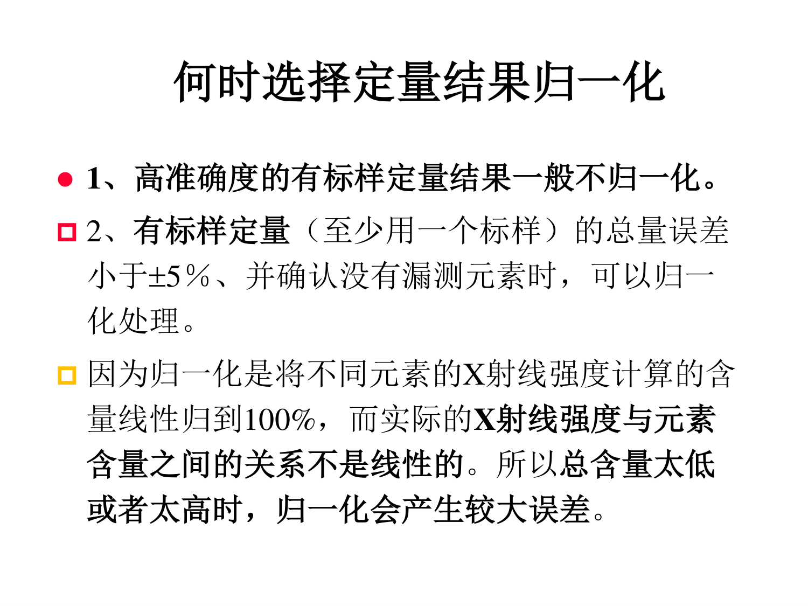

**[CN]**  
定量策略对比与特殊计算模型选择：  
1. 有标样定量 (Standard-Based Quantitative Analysis)：  
   • 在完全相同的电镜工作条件 (相同 HV、相同束流、相同几何光路) 下，同时采集已知化学成分的“有证标准参考物质 (CRM)”与未知样品的谱图。  
   • 消除仪器电子学漂移与理论物理截面误差，分析平整样品的相对误差可优于 1% ~ 2%。当主元素相对误差严格要求 < 2% 时，必须采用有标样定量。  
2. 无标样定量 (Standardless Quantitative Analysis)：  
   • 依赖软件内建的高纯物理计算数据库与预置标样强度库。操作极其简便快速，无需每次寻找标样插样对比。  
   • 现代高性能 SDD 配合 XPP 模型，无标样定量对中等原子序数元素的相对误差已可稳定控制在 ±2% ~ ±5% 之内。  
3. 特殊定量计算模式：  
   • 全元素分析 (All Elements)：金属、耐热合金、半导体等纯元素体系的首选。  
   • 氧化物计算模式 (Oxide Stoichiometry)：矿物、地质岩石、玻璃、水泥中，氧通常以化学计量比离子结合。软件通过阳离子价态自动配比氧含量（如 SiO2, Al2O3, CaO, Fe2O3），有效规避直接测定轻元素 O 的巨大自吸收误差。  
   • 差值法 (Difference Method, Cx = 1 - ΣCi)：试样中含有无法直接激发的超轻元素 (如 H, Li) 或某种已知不可测成分时，由 100% 减去其他已测元素之和得出该成分含量。  
4. 归一化 (Normalization) 的科学原则：  
   • 有标样分析严禁随意归一化！有标样分析的总量 (Total wt%) 是检验测试质量的最核心指标（合格范围通常为 98.5% ~ 101.5%）。若总量异常，提示束流漂移或遗漏元素。  
   • 无标样分析与不平试样强制必须进行归一化计算 (总量锁定为 100%)。  

**[PY]**  
dìng liàng cè lüè duì bǐ yǔ tè shū jì suàn mó xíng xuǎn zé：  
1. yǒu biāo yàng dìng liàng (Standard-Based Quantitative Analysis)：  
• zài wán quán xiāng tóng de diàn jìng gōng zuò tiáo jiàn ( xiāng tóng HV、 xiāng tóng shù liú、 xiāng tóng jǐ hé guāng lù ) xià， tóng shí cǎi jí yǐ zhī huà xué chéng fèn de“yǒu zhèng biāo zhǔn cān kǎo wù zhì (CRM)” yǔ wèi zhī yàng pǐn de pǔ tú。  
• xiāo chú yí qì diàn zi xué piāo yí yǔ lǐ lùn wù lǐ jié miàn wù chā， fēn xī píng zhěng yàng pǐn de xiāng duì wù chā kě yōu yú 1% ~ 2%。 dāng zhǔ yuán sù xiāng duì wù chā yán gé yāo qiú < 2% shí， bì xū cǎi yòng yǒu biāo yàng dìng liàng。  
2. wú biāo yàng dìng liàng (Standardless Quantitative Analysis)：  
• yī lài ruǎn jiàn nèi jiàn de gāo chún wù lǐ jì suàn shù jù kù yǔ yù zhì biāo yàng qiáng dù kù。 cāo zuò jí qí jiǎn biàn kuài sù， wú xū měi cì xún zhǎo biāo yàng chā yàng duì bǐ。  
• xiàn dài gāo xìng néng SDD pèi hé XPP mó xíng， wú biāo yàng dìng liàng duì zhōng děng yuán zi xù shù yuán sù de xiāng duì wù chā yǐ kě wěn dìng kòng zhì zài ±2% ~ ±5% zhī nèi。  
3. tè shū dìng liàng jì suàn mó shì：  
• quán yuán sù fēn xī (All Elements)： jīn shǔ、 nài rè hé jīn、 bàn dǎo tǐ děng chún yuán sù tǐ xì de shǒu xuǎn。  
• yǎng huà wù jì suàn mó shì (Oxide Stoichiometry)： kuàng wù、 dì zhì yán shí、 bō lí、 shuǐ ní zhōng， yǎng tōng cháng yǐ huà xué jì liàng bǐ lí zi jié hé。 ruǎn jiàn tōng guò yáng lí zi jià tài zì dòng pèi bǐ yǎng hán liàng（rú SiO2, Al2O3, CaO, Fe2O3）， yǒu xiào guī bì zhí jiē cè dìng qīng yuán sù O de jù dà zì xī shōu wù chā。  
• chā zhí fǎ (Difference Method, Cx = 1 - ΣCi)： shì yàng zhōng hán yǒu wú fǎ zhí jiē jī fā de chāo qīng yuán sù ( rú H, Li) huò mǒu zhǒng yǐ zhī bù kě cè chéng fèn shí， yóu 100% jiǎn qù qí tā yǐ cè yuán sù zhī hé dé chū gāi chéng fèn hán liàng。  
4. guī yī huà (Normalization) de kē xué yuán zé：  
• yǒu biāo yàng fēn xī yán jìn suí yì guī yī huà！ yǒu biāo yàng fēn xī de zǒng liàng (Total wt%) shì jiǎn yàn cè shì zhì liàng de zuì hé xīn zhǐ biāo（hé gé fàn wéi tōng cháng wèi 98.5% ~ 101.5%）。 ruò zǒng liàng yì cháng， tí shì shù liú piāo yí huò yí lòu yuán sù。  
• wú biāo yàng fēn xī yǔ bù píng shì yàng qiáng zhì bì xū jìn xíng guī yī huà jì suàn ( zǒng liàng suǒ dìng wèi 100%)。  

**[EN]**  
Quantitative Methodology Comparison and Calculation Paradigms:  
1. Standard-Based Quantitative Analysis:  
   • Measures unknown specimens against Certified Reference Materials (CRMs) under identical electron-optical conditions (identical HV, probe current, and WD).  
   • Cancels theoretical cross-section uncertainties, achieving relative errors < 1% to 2% on polished standards. Mandated when major element tolerances are tighter than 2%.  
2. Standardless Quantitative Analysis:  
   • Relies on factory-calibrated physical libraries and stored efficiency profiles. Eliminates cumbersome daily standard exchanges.  
   • Modern Bruker SDDs utilizing XPP achieve standardless relative errors within ±2% to ±5% for unoverlapped medium-Z major elements.  
3. Specialized Stoichiometric Matrix Models:  
   • All-Element Analysis: Default model for alloys and intermetallics.  
   • Stoichiometric Oxide Mode: In silicate minerals, ceramics, and geomaterials, oxygen is calculated stoichiometrically via cation oxidation states (e.g. SiO2, Al2O3, FeO, CaO). This circumvents massive direct oxygen absorption uncertainties.  
   • Difference Mode (Cx = 1 - ΣCi): Solves for light elements undetectable by EDS (e.g. H, Li, Be) or bound crystal water by subtracting measured totals from 100%.  
4. Scientific Principles of Normalization:  
   • Standard-Based Totals Must Not Be Normalized Arbitrarily! The raw analytical total (acceptable window: 98.5% to 101.5%) serves as the primary diagnostic check of beam stability.  
   • Standardless Analyses and Rough Specimens Require 100% Normalization.

---

## 7. 超轻元素 (Z < 10) 定量分析难点与优化方案 / Light Element Microanalysis

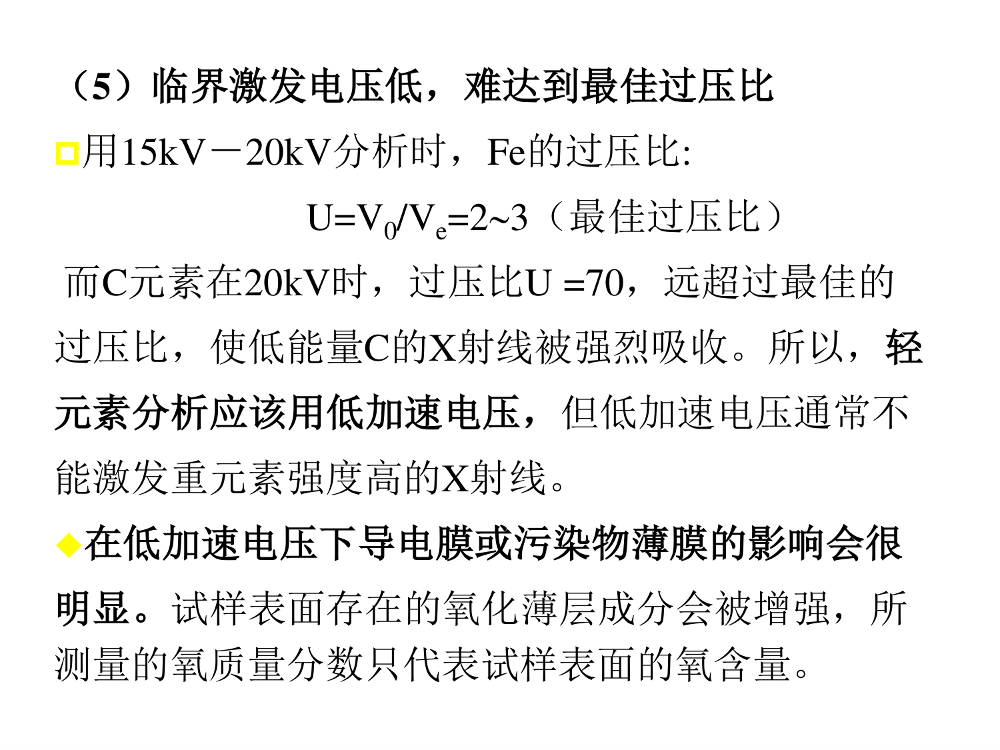

**[CN]**  
轻元素 (Z < 10: Be, B, C, N, O, F) 定量分析的五大物理瓶颈与实战解法：  
1. 五大物理瓶颈：  
   • 波长极长、能量极低 (E < 1 keV)：试样基体及微量表面污染薄膜对轻元素 X 射线的自吸收系数呈几何级数暴增。  
   • 荧光产额 ωk 极低：内层电离后主要发生俄歇发射，X 射线发射几率通常不足 0.1% ~ 1%。  
   • 严重谱线重叠干扰：过渡金属的高能级 L、M 线系（如 Ti-L, Cr-L, Fe-L, Ba-M 等）密集簇拥在 0.2 ~ 1.0 keV 区间，与 B, C, N, O, F 的 K 峰发生毁灭性重叠。  
   • 化学位移与谱峰畸变 (Chemical Shift)：轻元素仅有最外层价电子参与成键。形成不同化合物（如单质碳、金刚石、SiC、碳化物、碳酸盐）时，化学键能导致特征峰位偏移数个电子伏特并改变峰形对称性。  
   • 过压比难以适配：轻元素临界激发能极低 (如 C-K 为 284 eV)，在 20 kV 下过压比 U = 20/0.284 ≈ 70！严重偏离最佳过压比 (U = 2~3)，导致电子深入基体而激发的轻元素 X 射线几乎全军覆没被吸收在深层。  
2. 优化对策：  
   • 降低加速电压至 5 kV ~ 7 kV，缩短光子出射路径；  
   • 选用化学结构及配位数高度相近的有证标样进行同相定标校正；  
   • 严格去除表面油污，镀碳膜厚度精准控制在 10 nm 以下。  

**[PY]**  
qīng yuán sù (Z < 10: Be, B, C, N, O, F) dìng liàng fēn xī de wǔ dà wù lǐ píng jǐng yǔ shí zhàn xiè fǎ：  
1. wǔ dà wù lǐ píng jǐng：  
• bō cháng jí zhǎng、 néng liàng jí dī (E < 1 keV)： shì yàng jī tǐ jí wēi liàng biǎo miàn wū rǎn báo mó duì qīng yuán sù X shè xiàn de zì xī shōu xì shù chéng jǐ hé jí shù bào zēng。  
• yíng guāng chǎn é ωk jí dī： nèi céng diàn lí hòu zhǔ yào fā shēng é xiē fā shè，X shè xiàn fā shè jī lǜ tōng cháng bù zú 0.1% ~ 1%。  
• yán zhòng pǔ xiàn chóng dié gān rǎo： guò dù jīn shǔ de gāo néng jí L、M xiàn xì（rú Ti-L, Cr-L, Fe-L, Ba-M děng） mì jí cù yōng zài 0.2 ~ 1.0 keV qū jiān， yǔ B, C, N, O, F de K fēng fā shēng huǐ miè xìng chóng dié。  
• huà xué wèi yí yǔ pǔ fēng jī biàn (Chemical Shift)： qīng yuán sù jǐn yǒu zuì wài céng jià diàn zi cān yù chéng jiàn。 xíng chéng bù tóng huà hé wù（rú dān zhì tàn、 jīn gāng shí、SiC、 tàn huà wù、 tàn suān yán） shí， huà xué jiàn néng dǎo zhì tè zhēng fēng wèi piān yí shù gè diàn zi fú tè bìng gǎi biàn fēng xíng duì chèn xìng。  
• guò yā bǐ nán yǐ shì pèi： qīng yuán sù lín jiè jī fā néng jí dī ( rú C-K wèi 284 eV)， zài 20 kV xià guò yā bǐ U = 20/0.284 ≈ 70！ yán zhòng piān lí zuì jiā guò yā bǐ (U = 2~3)， dǎo zhì diàn zi shēn rù jī tǐ ér jī fā de qīng yuán sù X shè xiàn jī hū quán jūn fù mò bèi xī shōu zài shēn céng。  
2. yōu huà duì cè：  
• jiàng dī jiā sù diàn yā zhì 5 kV ~ 7 kV， suō duǎn guāng zi chū shè lù jìng；  
• xuǎn yòng huà xué jié gòu jí pèi wèi shù gāo dù xiāng jìn de yǒu zhèng biāo yàng jìn xíng tóng xiāng dìng biāo jiào zhèng；  
• yán gé qù chú biǎo miàn yóu wū， dù tàn mó hòu dù jīng zhǔn kòng zhì zài 10 nm yǐ xià。  

**[EN]**  
Five Physical Hurdles of Light Element (Z < 10: Be, B, C, N, O, F) Microanalysis:  
1. Five Fundamental Physical Impediments:  
   • Ultra-Soft Photon Energies (E < 1 keV): Matrix mass absorption coefficients (μ/ρ) escalate by orders of magnitude, causing extreme self-attenuation.  
   • Depressed Fluorescence Yield (ωk < 0.01): Non-radiative Auger transitions dominate, leaving <1% photon yield.  
   • Complex Spectral Overlaps: Heavy-metal L and M multiplet cascades (e.g. Ti-L, Cr-L, Fe-L, Ba-M) congest the 0.2-1.0 keV window, obscuring B, C, N, and O peaks.  
   • Chemical Bonding Shifts: Valence orbital hybridization in varied compounds (graphite vs diamond vs SiC vs carbonates) induces multi-eV centroid shifts and peak asymmetry.  
   • Overvoltage Mismatch: At 20 kV, the overvoltage ratio for carbon (Ec = 0.284 keV) surges to U ≈ 70, vastly overshooting optimal values (U = 2-3) and trapping photons deep inside the matrix.  
2. Practical Corrective Protocols:  
   • Lower gun accelerating voltage to 5 kV - 7 kV to compress electron penetration.  
   • Utilize matrix-matched reference standards possessing identical bonding states.  
   • Clean specimens thoroughly and constrain carbon coating thickness to < 10 nm.

---

## 8. 误差来源、泊松统计置信度与检出限 / Error Analysis, Counting Statistics & LOD

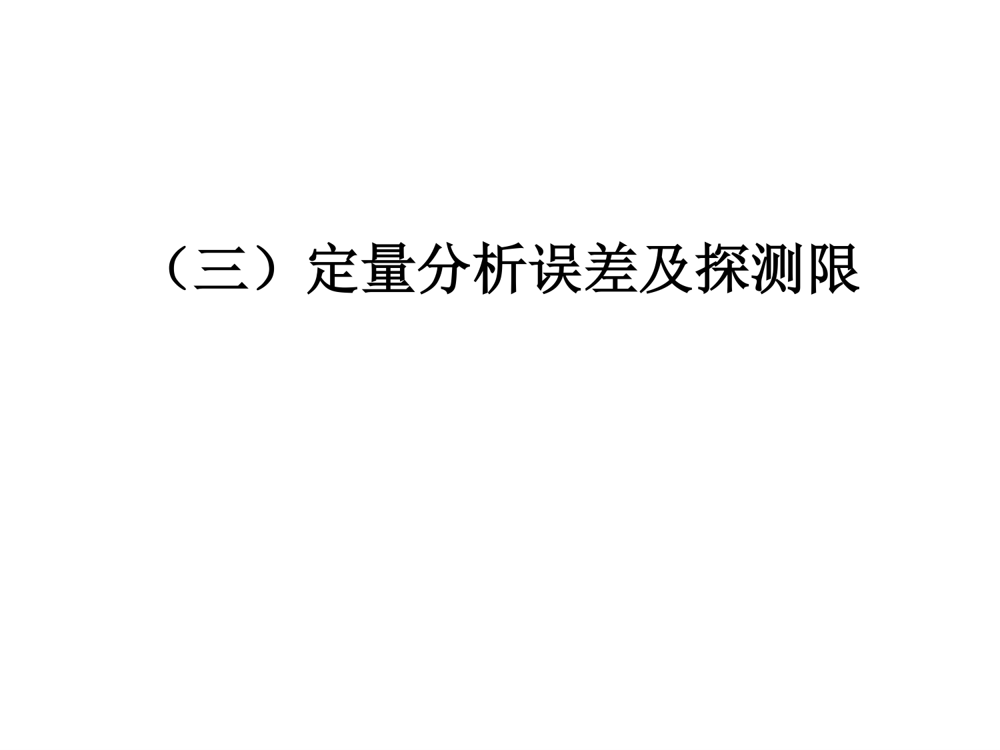

### 8.1 X 射线计数的泊松统计涨落与置信区间
**[CN]**  
X 射线计数统计物理规律与误差限度：  
1. 泊松分布 (Poisson Distribution)：  
   特征 X 射线的产生与探测属于独立的随机量子事件，光子计数 N 严格服从泊松统计规律。对于能谱大计数累积，泊松分布逼近对称高斯分布。  
2. 计数标准偏差 (Standard Deviation, σ)：  
   σ = sqrt(N)  
   相对统计波动 (Relative Standard Deviation) 为：  
   RSD = σ / N = 1 / sqrt(N)  
   • 当单峰累积计数 N = 100 counts 时，相对波动高达 10%！  
   • 当单峰累积计数 N = 10,000 counts 时，相对波动压缩至 1%。  
   • 当单峰累积计数 N = 100,000 counts 时，相对波动进一步降至 0.31%。  
3. 置信区间物理判据：  
   • 1σ 置信度：测定值落在 [N ± 1σ] 范围的概率为 68.3%。  
   • 2σ 置信度：测定值落在 [N ± 2σ] 范围的概率为 95.4%。  
   • 3σ 置信度：测定值落在 [N ± 3σ] 范围的概率为 99.7%（科学实验判定的真值可靠门槛）。  

**[PY]**  
X shè xiàn jì shù tǒng jì wù lǐ guī lǜ yǔ wù chā xiàn dù：  
1. pō sōng fēn bù (Poisson Distribution)：  
tè zhēng X shè xiàn de chǎn shēng yǔ tàn cè shǔ yú dú lì de suí jī liàng zǐ shì jiàn， guāng zi jì shù N yán gé fú cóng pō sōng tǒng jì guī lǜ。 duì yú néng pǔ dà jì shù lěi jī， pō sōng fēn bù bī jìn duì chèn gāo sī fēn bù。  
2. jì shù biāo zhǔn piān chā (Standard Deviation, σ)：  
σ = sqrt(N)  
xiāng duì tǒng jì bō dòng (Relative Standard Deviation) wèi：  
RSD = σ / N = 1 / sqrt(N)  
• dāng dān fēng lěi jī jì shù N = 100 counts shí， xiāng duì bō dòng gāo dá 10%！  
• dāng dān fēng lěi jī jì shù N = 10,000 counts shí， xiāng duì bō dòng yā suō zhì 1%。  
• dāng dān fēng lěi jī jì shù N = 100,000 counts shí， xiāng duì bō dòng jìn yí bù jiàng zhì 0.31%。  
3. zhì xìn qū jiān wù lǐ pàn jù：  
• 1σ zhì xìn dù： cè dìng zhí luò zài [N ± 1σ] fàn wéi de gài lǜ wèi 68.3%。  
• 2σ zhì xìn dù： cè dìng zhí luò zài [N ± 2σ] fàn wéi de gài lǜ wèi 95.4%。  
• 3σ zhì xìn dù： cè dìng zhí luò zài [N ± 3σ] fàn wéi de gài lǜ wèi 99.7%（kē xué shí yàn pàn dìng de zhēn zhí kě kào mén kǎn）。  

**[EN]**  
Statistical Physics of X-ray Counting Uncertainty:  
1. Poisson Distribution Foundation:  
   Characteristic X-ray emission and photon registration constitute discrete stochastic quantum events governed by Poisson statistics, converging to a Gaussian distribution at elevated counts.  
2. Standard Deviation and Relative Uncertainty:  
   σ = sqrt(N)  
   Relative standard deviation is given by:  
   RSD = σ / N = 1 / sqrt(N)  
   • At N = 100 counts, counting uncertainty is a massive 10%!  
   • At N = 10,000 counts, counting uncertainty is suppressed to 1.0%.  
   • At N = 100,000 counts, uncertainty reaches high analytical precision at 0.31%.  
3. Confidence Intervals:  
   • 1σ Interval: 68.3% probability of bounding the true mean.  
   • 2σ Interval: 95.4% probability of bounding the true mean.  
   • 3σ Interval: 99.7% probability (universal threshold for scientific rigor).

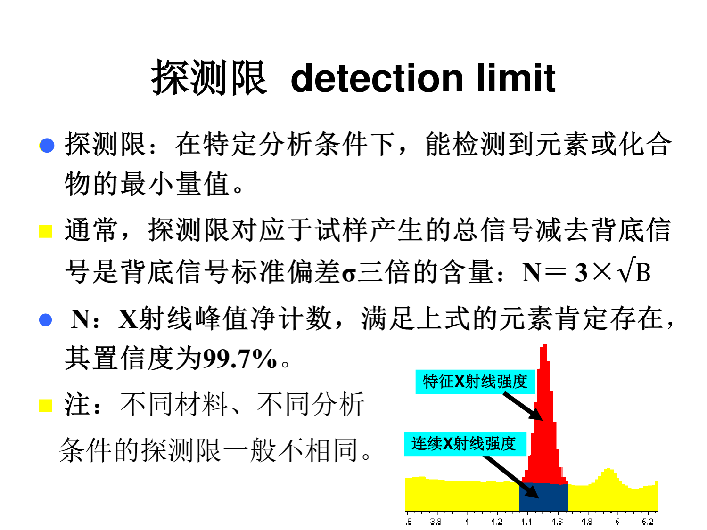

### 8.2 探测极限 (Limit of Detection, LOD) 计算公式
**[CN]**  
最低检出限 (Detection Limit, CDL) 公式：  
依据国际纯粹与应用化学联合会 (IUPAC) 3σ 准则，在特征峰位背景计数值为 IB、标准样品净峰强度为 Istd 条件下，该元素的极限检出浓度为：  
C_DL = (3 * sqrt(I_B)) / (I_std - I_B) * C_std  
• 背景背底计数越多，检出下限越差（噪声大）；  
• 延长采集活时间与加大探针束流，可按 sqrt(t) 比例持续压低检出极限；  
• 在常规 SEM/EDS 分析条件下，主量元素检测限通常在 0.1 wt% (1000 ppm) 附近。  

**[PY]**  
zuì dī jiǎn chū xiàn (Detection Limit, CDL) gōng shì：  
yī jù guó jì chún cuì yǔ yìng yòng huà xué lián hé huì (IUPAC) 3σ zhǔn zé， zài tè zhēng fēng wèi bèi jǐng jì shù zhí wèi IB、 biāo zhǔn yàng pǐn jìng fēng qiáng dù wèi Istd tiáo jiàn xià， gāi yuán sù de jí xiàn jiǎn chū nóng dù wèi：  
C_DL = (3 * sqrt(I_B)) / (I_std - I_B) * C_std  
• bèi jǐng bèi dǐ jì shù yuè duō， jiǎn chū xià xiàn yuè chà（zào shēng dà）；  
• yán cháng cǎi jí huó shí jiān yǔ jiā dà tàn zhēn shù liú， kě àn sqrt(t) bǐ lì chí xù yā dī jiǎn chū jí xiàn；  
• zài cháng guī SEM/EDS fēn xī tiáo jiàn xià， zhǔ liàng yuán sù jiǎn cè xiàn tōng cháng zài 0.1 wt% (1000 ppm) fù jìn。  

**[EN]**  
Analytical Formulation for the Limit of Detection (LOD):  
Adhering to the IUPAC 3σ criterion, with background continuum intensity IB and standard net intensity Istd, the minimum detectable concentration CDL is:  
C_DL = (3 * sqrt(I_B)) / (I_std - I_B) * C_std  
• Elevated continuum background noise degrades detection limits.  
• Extending live time and optimizing beam current suppresses LOD proportionally to 1 / sqrt(t).  
• Under routine operating conditions, EDS limits of detection typically reside around 0.1 wt% (1,000 ppm).

---

## 9. 国家标准 GB/T 25189 误差等级与数据保留位数 / National Standards & Significant Digits

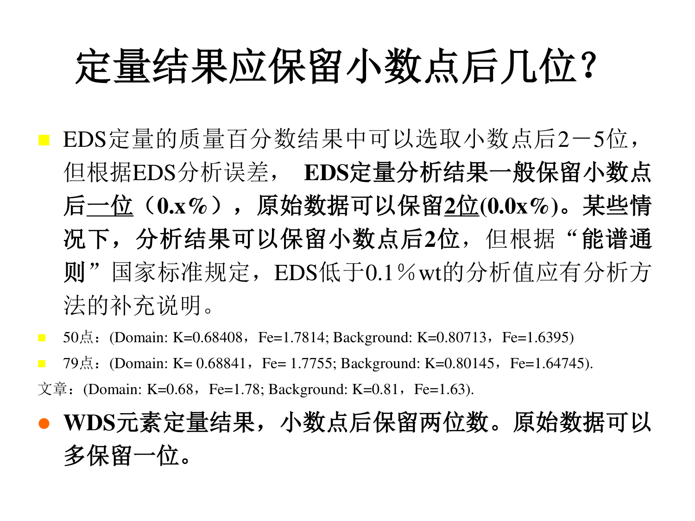

**[CN]**  
国家标准 GB/T 25189 对能谱仪定量误差的强制技术规定与有效数字规范：  
1. 相对误差 (Relative Error, RE%) 允许公差阈值：  
   根据国家标准 GB/T 25189《微束分析 能谱法定量分析通用规范》，在样品平整抛光、无重叠峰的标准条件下：  
   • 高含量元素 (质量分数 > 20 wt%)：允许相对误差 RE ≤ ±5% (有标样时优于 ±2%)。  
   • 中等含量元素 (质量分数 3 wt% ~ 20 wt%)：允许相对误差 RE ≤ ±10%。  
   • 低含量元素 (质量分数 1 wt% ~ 3 wt%)：允许相对误差 RE ≤ ±30%。  
   • 微量元素 (质量分数 < 1 wt%)：允许相对误差 RE ≤ ±50%。  
2. 分析结果小数点后保留位数的科学规范：  
   • 软件虽然能输出小数点后 4 位或 5 位数据 (例如 12.34567 wt%)，但这是纯计算机数值拟合结果，完全不具备物理意义！  
   • 依据 EDS 固有的测量误差与统计方差，常规主量元素定量报告中：严格保留小数点后 1 位或最多 2 位有效数字（例如 12.3 wt% 或 12.34 wt%），严禁在检测报告中保留过量虚假有效位数！  

**[PY]**  
guó jiā biāo zhǔn GB/T 25189 duì néng pǔ yí dìng liàng wù chā de qiáng zhì jì shù guī dìng yǔ yǒu xiào shù zì guī fàn：  
1. xiāng duì wù chā (Relative Error, RE%) yǔn xǔ gōng chāi yù zhí：  
gēn jù guó jiā biāo zhǔn GB/T 25189《 wēi shù fēn xī néng pǔ fǎ dìng liàng fēn xī tōng yòng guī fàn》， zài yàng pǐn píng zhěng pāo guāng、 wú chóng dié fēng de biāo zhǔn tiáo jiàn xià：  
• gāo hán liàng yuán sù ( zhì liàng fēn shù > 20 wt%)： yǔn xǔ xiāng duì wù chā RE ≤ ±5% ( yǒu biāo yàng shí yōu yú ±2%)。  
• zhōng děng hán liàng yuán sù ( zhì liàng fēn shù 3 wt% ~ 20 wt%)： yǔn xǔ xiāng duì wù chā RE ≤ ±10%。  
• dī hán liàng yuán sù ( zhì liàng fēn shù 1 wt% ~ 3 wt%)： yǔn xǔ xiāng duì wù chā RE ≤ ±30%。  
• wēi liàng yuán sù ( zhì liàng fēn shù < 1 wt%)： yǔn xǔ xiāng duì wù chā RE ≤ ±50%。  
2. fēn xī jié guǒ xiǎo shù diǎn hòu bǎo liú wèi shù de kē xué guī fàn：  
• ruǎn jiàn suī rán néng shū chū xiǎo shù diǎn hòu 4 wèi huò 5 wèi shù jù ( lì rú 12.34567 wt%)， dàn zhè shì chún jì suàn jī shù zhí nǐ hé jié guǒ， wán quán bù jù bèi wù lǐ yì yì！  
• yī jù EDS gù yǒu de cè liáng wù chā yǔ tǒng jì fāng chà， cháng guī zhǔ liàng yuán sù dìng liàng bào gào zhōng： yán gé bǎo liú xiǎo shù diǎn hòu 1 wèi huò zuì duō 2 wèi yǒu xiào shù zì（lì rú 12.3 wt% huò 12.34 wt%）， yán jìn zài jiǎn cè bào gào zhōng bǎo liú guò liàng xū jiǎ yǒu xiào wèi shù！  

**[EN]**  
National Standard GB/T 25189 Regulatory Error Allowances and Significant Digits:  
1. Permissible Relative Error (RE%) Thresholds:  
   Per national microbeam standard GB/T 25189 under standardized polished specimen conditions:  
   • Major Constituents (> 20 wt%): Permissible RE ≤ ±5% (improving to < ±2% with standards).  
   • Minor Constituents (3 wt% to 20 wt%): Permissible RE ≤ ±10%.  
   • Low-Concentration Constituents (1 wt% to 3 wt%): Permissible RE ≤ ±30%.  
   • Trace Constituents (< 1 wt%): Permissible RE ≤ ±50%.  
2. Rigorous Guidelines on Significant Digits:  
   • Analytical software algorithms routinely compute values to 4 or 5 decimal places (e.g. 12.34567 wt%); these excess digits are mathematical artifacts devoid of physical meaning!  
   • Rooted in the physical limits of counting statistics and matrix corrections, EDS quantitative reports must quote concentrations to at most 1 to 2 decimal places (e.g. 12.3 wt% or 12.34 wt%). Presenting excessive decimal places violates analytical protocols.

---

## 10. 关键技术术语对照表 / Key Technical Glossary

| 中文术语 (Chinese) | 汉语拼音 (Hanyu Pinyin) | 英文术语 (English) | 技术释义 (Technical Definition) |
| :--- | :--- | :--- | :--- |
| **谱峰去卷积** | pǔ fēng qù juǎn jī | Peak Deconvolution | 利用贝叶斯算法将重叠多重特征峰数学分离为各单峰的拟合处理过程 |
| **基体效应** | jī tǐ xiào yìng | Matrix Effects | 样品内部共存元素通过原子序数、自吸收和二次荧光改变 X 射线强度的物理效应 |
| **ZAF 校正** | ZAF jiào zhèng | ZAF Correction | 分别由原子序数 (Z)、吸收 (A) 和荧光 (F) 三因子构成的经典基体修正法 |
| **深度分布函数** | shēn dù fēn bù hán shù | Phi-Rho-Z [Φ(ρz)] | 描述特征 X 射线沿试样质量厚度产生的深度分布全貌物理函数 |
| **峰背比法** | fēng bèi bǐ fǎ | P/B Method (Statham) | 适用于粗糙断口和颗粒试样、消除几何遮挡与倾斜吸收误差的比值修正法 |
| **有证标准物质** | yǒu zhèng biāo zhǔn wù zhì | Certified Reference Material (CRM) | 经国家行政部门认证、具有高纯均质定值并附有溯源证书的标准样品 |
| **无标样定量** | wú biāo yàng dìng liàng | Standardless Quantification | 依托预置数据库与第一性原理计算模型直接将谱图转换为成分百分比的方法 |
| **归一化** | guī yī huà | Normalization | 在定量计算中将所有被测元素的百分含量线性缩放使代数总和等于 100% |
| **化学位移** | huà xué wèi yí | Chemical Shift | 原子外层化学键结合能变化引起低能特征 X 射线峰位微小偏移的物理现象 |
| **探测下限** | tàn cè xià xiàn | Limit of Detection (LOD / 3σ) | 在 99.7% 置信度下能够从连续背景噪声中可靠鉴别出的最低元素浓度极限 |

---

# Module 5: 碳元素异常分析及微区分析疑难问题解答
# Module 5: Carbon Element Anomaly Analysis and Microanalysis FAQ

---

## 目录 / Table of Contents
1. [问题一：为什么能谱分析中碳 (C) 元素测定值普遍偏高？ / Question 1: Why is Carbon Over-Quantified?](#问题一为什么能谱分析中碳-c-元素测定值普遍偏高--question-1-why-is-carbon-over-quantified)
2. [问题二：SEM-EDS 分析碳化硅 (SiC) 时碳含量偏低的原因？ / Question 2: Why is Carbon Underestimated in SiC?](#问题二sem-eds-分析碳化硅-sic-时碳含量偏低的原因--question-2-why-is-carbon-underestimated-in-sic)
3. [问题三：为什么 TEM-EDS 的薄区分析结果比 SEM-EDS 更准确？ / Question 3: Why is TEM-EDS More Accurate than SEM-EDS for Thin Foils?](#问题三为什么-tem-eds-的薄区分析结果比-sem-eds-更准确--question-3-why-is-tem-eds-more-accurate-than-sem-eds-for-thin-foils)
4. [关键技术术语对照表 / Key Technical Glossary](#4-关键技术术语对照表--key-technical-glossary)

---

## 问题一：为什么能谱分析中碳 (C) 元素测定值普遍偏高？ / Question 1: Why is Carbon Over-Quantified?

**[CN]**  
在扫描电镜能谱 (SEM-EDS) 以及电子探针 (EPMA) 分析中，即便是分析完全不含碳的高纯纯金属（如纯 Fe、纯 Cu、纯 Al），能谱图上也经常会出现显著的 C-Kα 特征峰，测算出的碳含量显著高于真实成分。  
主要原因包括：  
1. 试样表面吸附的有机污染物：  
   试样暴露在空气中时，表面会自发物理吸附一层纳米级的有机挥发物分子、碳氢化合物或手部分泌的油脂汗液。  
2. 电镜样品室内部残余气体在电子束下的裂解积聚 (电子束诱导沉积 EBID)：  
   扫描电镜真空系统中不可避免存在极微量的残余碳氢化合物蒸汽（来源于机械泵真空油的微量返油、橡胶密封圈放气或样品台润滑油脂）。  
   高能聚焦电子束持续轰击试样表面某一点时，强烈的电子碰撞使扩散至分析区域的碳氢气体分子化学键断裂，生成不挥发的无定形固态碳（非晶碳）在轰击点不断沉积堆积，形成肉眼可见的“碳污染黑斑” (Carbon Contamination Spot)。  
3. 制样装载中引入的人为碳源：  
   如果试样固定使用了双面导电碳胶带、导电碳胶、或为了消除绝缘荷电而蒸镀了碳导电膜层，当电子束散射或光阑边缘杂散电子照射到碳胶区域时，会产生强烈的特征碳信号。  
防范对策：  
• 测试前对试样进行超声清洗并充分干燥；  
• 配备样品室等离子清洗仪 (Plasma Cleaner) 或液氮冷阱 (Cold Trap / Anti-contamination Device)，原位去除真空油雾分子；  
• 采用线扫描或高速漂移面扫描代替长时间点分析，降低局部碳积聚速率。  

**[PY]**  
zài sǎo miáo diàn jìng néng pǔ (SEM-EDS) yǐ jí diàn zi tàn zhēn (EPMA) fēn xī zhōng， jí biàn shì fēn xī wán quán bù hán tàn de gāo chún chún jīn shǔ（rú chún Fe、 chún Cu、 chún Al）， néng pǔ tú shàng yě jīng cháng huì chū xiàn xiǎn zhù de C-Kα tè zhēng fēng， cè suàn chū de tàn hán liàng xiǎn zhù gāo yú zhēn shí chéng fèn。  
zhǔ yào yuán yīn bāo kuò：  
1. shì yàng biǎo miàn xī fù de yǒu jī wū rǎn wù：  
shì yàng bào lù zài kōng qì zhōng shí， biǎo miàn huì zì fā wù lǐ xī fù yī céng nà mǐ jí de yǒu jī huī fā wù fèn zǐ、 tàn qīng huà hé wù huò shǒu bù fèn mì de yóu zhī hàn yè。  
2. diàn jìng yàng pǐn shì nèi bù cán yú qì tǐ zài diàn zi shù xià de liè jiě jī jù ( diàn zi shù yòu dǎo chén jī EBID)：  
sǎo miáo diàn jìng zhēn kōng xì tǒng zhōng bù kě bì miǎn cún zài jí wēi liàng de cán yú tàn qīng huà hé wù zhēng qì（lái yuán yú jī xiè bèng zhēn kōng yóu de wēi liàng fǎn yóu、 xiàng jiāo mì fēng quān fàng qì huò yàng pǐn tái rùn huá yóu zhī）。  
gāo néng jù jiāo diàn zi shù chí xù hōng jī shì yàng biǎo miàn mǒu yì diǎn shí， qiáng liè de diàn zi pèng zhuàng shǐ kuò sàn zhì fēn xī qū yù de tàn qīng qì tǐ fèn zǐ huà xué jiàn duàn liè， shēng chéng bù huī fā de wú dìng xíng gù tài tàn（fēi jīng tàn） zài hōng jī diǎn bù duàn chén jī duī jī， xíng chéng ròu yǎn kě jiàn de“tàn wū rǎn hēi bān” (Carbon Contamination Spot)。  
3. zhì yàng zhuāng zài zhōng yǐn rù de rén wéi tàn yuán：  
rú guǒ shì yàng gù dìng shǐ yòng le shuāng miàn dǎo diàn tàn jiāo dài、 dǎo diàn tàn jiāo、 huò wèi le xiāo chú jué yuán hé diàn ér zhēng dù le tàn dǎo diàn mó céng， dāng diàn zi shù sǎn shè huò guāng lán biān yuán zá sàn diàn zi zhào shè dào tàn jiāo qū yù shí， huì chǎn shēng qiáng liè de tè zhēng tàn xìn hào。  
fáng fàn duì cè：  
• cè shì qián duì shì yàng jìn xíng chāo shēng qīng xǐ bìng chōng fèn gān zào；  
• pèi bèi yàng pǐn shì děng lí zi qīng xǐ yí (Plasma Cleaner) huò yè dàn lěng jǐng (Cold Trap / Anti-contamination Device)， yuán wèi qù chú zhēn kōng yóu wù fèn zǐ；  
• cǎi yòng xiàn sǎo miáo huò gāo sù piāo yí miàn sǎo miáo dài tì zhǎng shí jiān diǎn fēn xī， jiàng dī jú bù tàn jī jù sù lǜ。  

**[EN]**  
In SEM-EDS and EPMA microanalysis, even when examining high-purity carbon-free metals (such as 99.99% pure Fe, Cu, or Al), an unmistakable C-Kα peak routinely appears, yielding carbon concentrations markedly above actual values.  
Root Causes:  
1. Adsorbed Surface Hydrocarbon Contaminants:  
   Specimens exposed to ambient atmosphere rapidly adsorb airborne hydrocarbons, organic aerosols, and sebum oils.  
2. Residual Hydrocarbon Cracking under Beam Irradiation (EBID):  
   High-vacuum SEM chambers harbor trace partial pressures of volatile hydrocarbons originating from rotary roughing pump oil backstreaming, viton O-ring outgassing, and stage stage lubricants.  
   Under a stationary focused electron probe, primary and secondary electrons dissociate these gaseous hydrocarbon molecules, precipitating non-volatile amorphous carbon onto the beam impact site—manifesting as a macroscopic "black square" or contamination dot.  
3. Conductive Carbon Adhesives and Coatings:  
   Employing double-sided conductive carbon tabs, carbon paste, or deliberate thermal carbon evaporation introduces exogenous carbon. Peripheral beam skirts and high-angle BSE scattering excite these carbonaceous reservoirs.  
Corrective Actions:  
• Perform thorough ultrasonic solvent degreasing and oven baking prior to insertion;  
• Utilize chamber plasma cleaners or liquid nitrogen cold traps (anticontamination baffles) to condense residual hydrocarbons;  
• Utilize fast-frame mapping or spatial raster scanning rather than prolonged static point analyses.

---

## 问题二：SEM-EDS 分析碳化硅 (SiC) 时碳含量偏低的原因？ / Question 2: Why is Carbon Underestimated in SiC?

**[CN]**  
为什么在常规 15 ~ 20 kV 加速电压下分析碳化硅 (SiC) 陶瓷时，实测碳 (C) 的质量百分比经常明显低于理论化学计量比 (理论碳含量约 29.95 wt%)？  
1. 超轻元素低能量 X 射线极易受重基体强烈吸收：  
   碳是原子序数很小的超轻元素 (Z=6)，其特征 X 射线 C-Kα 能量仅为 0.277 keV (超软 X 射线)。而与其结合的硅元素原子序数较大 (Z=14)。硅对能量低于自身吸收限的超软 X 射线具有惊人的质量吸收系数 (μ/ρ 极大)！  
2. 高加速电压导致入射深度深、出射路径过长：  
   • 当选用 15 kV 或 20 kV 分析时，入射电子深入 SiC 内部达 1.5 ~ 2.5 μm；  
   • 产生于样品深处的 C-Kα 光子在向表面逸出的途中，99% 以上被周围致密的硅原子所吸收吸收，只有极表层几百纳米内的极少数碳光子能侥幸逃逸到真空中进入探测器；  
   • 基体吸收校正因子 A 的计算极其敏感，微小的模型误差都会被指数级放大，导致定量计算严重压低碳的计算含量。  
3. 解决策略：超低加速电压分析 (Low-kV EDS)：  
   分析碳化硅等难熔碳化物中的碳元素时，强烈建议将电镜加速电压压低至 3 kV ~ 5 kV：  
   • 5 kV 下电子穿透深度被强制压缩在 200 nm 以内；  
   • 碳特征 X 射线从超浅表层逸出，在基体中的吸收路径极大缩短；  
   • 结合化学成分相近的 SiC 单晶有证标样进行校正，可获得高度准确的碳定量分析结果。  

**[PY]**  
wèi shén me zài cháng guī 15 ~ 20 kV jiā sù diàn yā xià fēn xī tàn huà guī (SiC) táo cí shí， shí cè tàn (C) de zhì liàng bǎi fēn bǐ jīng cháng míng xiǎn dī yú lǐ lùn huà xué jì liàng bǐ ( lǐ lùn tàn hán liàng yuē 29.95 wt%)？  
1. chāo qīng yuán sù dī néng liàng X shè xiàn jí yì shòu zhòng jī tǐ qiáng liè xī shōu：  
tàn shì yuán zi xù shù hěn xiǎo de chāo qīng yuán sù (Z=6)， qí tè zhēng X shè xiàn C-Kα néng liàng jǐn wèi 0.277 keV ( chāo ruǎn X shè xiàn )。 ér yǔ qí jié hé de guī yuán sù yuán zi xù shù jiào dà (Z=14)。 guī duì néng liàng dī yú zì shēn xī shōu xiàn de chāo ruǎn X shè xiàn jù yǒu jīng rén de zhì liàng xī shōu xì shù (μ/ρ jí dà )！  
2. gāo jiā sù diàn yā dǎo zhì rù shè shēn dù shēn、 chū shè lù jìng guò cháng：  
• dāng xuǎn yòng 15 kV huò 20 kV fēn xī shí， rù shè diàn zi shēn rù SiC nèi bù dá 1.5 ~ 2.5 μm；  
• chǎn shēng yú yàng pǐn shēn chù de C-Kα guāng zi zài xiàng biǎo miàn yì chū de tú zhōng，99% yǐ shàng bèi zhōu wéi zhì mì de guī yuán zi suǒ xī shōu xī shōu， zhǐ yǒu jí biǎo céng jǐ bǎi nà mǐ nèi de jí shǎo shù tàn guāng zi néng jiǎo xìng táo yì dào zhēn kōng zhōng jìn rù tàn cè qì；  
• jī tǐ xī shōu jiào zhèng yīn zi A de jì suàn jí qí mǐn gǎn， wēi xiǎo de mó xíng wù chā dū huì bèi zhǐ shù jí fàng dà， dǎo zhì dìng liàng jì suàn yán zhòng yā dī tàn de jì suàn hán liàng。  
3. jiě jué cè lüè： chāo dī jiā sù diàn yā fēn xī (Low-kV EDS)：  
fēn xī tàn huà guī děng nán róng tàn huà wù zhōng de tàn yuán sù shí， qiáng liè jiàn yì jiāng diàn jìng jiā sù diàn yā yā dī zhì 3 kV ~ 5 kV：  
• 5 kV xià diàn zi chuān tòu shēn dù bèi qiáng zhì yā suō zài 200 nm yǐ nèi；  
• tàn tè zhēng X shè xiàn cóng chāo qiǎn biǎo céng yì chū， zài jī tǐ zhōng de xī shōu lù jìng jí dà suō duǎn；  
• jié hé huà xué chéng fèn xiāng jìn de SiC dān jīng yǒu zhèng biāo yàng jìn xíng jiào zhèng， kě huò dé gāo dù zhǔn què de tàn dìng liàng fēn xī jié guǒ。  

**[EN]**  
Why is carbon systematically under-quantified when analyzing silicon carbide (SiC) under standard 15-20 kV accelerating voltages (theoretical carbon fraction ~29.95 wt%)?  
1. Severe Matrix Mass Absorption of Soft X-rays:  
   Carbon is an ultra-light element (Z=6) whose soft C-Kα radiation possesses an energy of only 0.277 keV. Conversely, silicon is a significantly heavier matrix constituent (Z=14). Silicon exhibits an enormous mass absorption coefficient (μ/ρ) for 0.277 keV photons.  
2. Excessive Escape Pathlengths at Elevated Accelerating Voltages:  
   • Operating at 15 kV to 20 kV drives incident electrons to penetration depths of 1.5 to 2.5 μm within SiC.  
   • Over 99% of C-Kα photons generated in the lower half of the excitation tear-drop are completely re-absorbed by silicon atoms before reaching the surface.  
   • The exponential absorption correction factor A becomes mathematically unstable, causing algorithms to severely underestimate the true carbon mass fraction.  
3. Remediation Protocol: Low Accelerating Voltage (Low-kV EDS):  
   When analyzing carbon in refractory carbides, reduce the accelerating voltage to 3 kV - 5 kV:  
   • At 5 kV, penetration depth is strictly confined within the uppermost ~150-200 nm.  
   • Escape pathlengths are minimized, drastically reducing internal absorption losses.  
   • Calibrating against a stoichiometric single-crystal SiC standard yields accurate carbon quantification.

---

## 问题三：为什么 TEM-EDS 的薄区分析结果比 SEM-EDS 更准确？ / Question 3: Why is TEM-EDS More Accurate than SEM-EDS for Thin Foils?

**[CN]**  
为什么透射电镜能谱 (TEM-EDS) 在微区薄膜、纳米界面分析中，定量结果和空间分辨率显著优于扫描电镜能谱 (SEM-EDS)？  
1. 试样几何形态的本质差异（薄膜 vs 块体）：  
   • TEM 试样是经过双喷电解或 FIB 精确减薄的超薄切片，厚度通常在 10 ~ 100 nm 之间；  
   • SEM 试样通常是半无限大的块状样品 (Bulk Specimen)。  
2. 相互作用体积与侧向扩展的代际差距：  
   • 在 SEM 块体样品中，高能电子在几微米深度内经历剧烈的前向与背向多次散射，形成宽达数微米的“梨形”扩展区。纳米级薄层结构被深层基体庞大信号完全淹没。  
   • 在 TEM 中，加速电压高达 200 ~ 300 kV，高速电子束以极高动能直接“穿透”几十纳米的超薄试样，电子在样品内部几乎不发生侧向扩展 (Beam Spreading 极小)。空间分辨率直接逼近束斑物理直径 (纳米至亚纳米级)。  
3. 基体吸收与荧光校正极其简便（克里夫-洛里默薄膜近似）：  
   • 在 TEM 超薄膜中，由于试样极薄，激发的特征 X 射线在逸出时几乎不受任何基体自吸收，也不发生二次特征荧光激发！  
   • 定量分析无需繁琐迭代复杂的 ZAF 吸收校正，直接应用线性克里夫-洛里默薄膜公式 (Cliff-Lorimer Thin Film Approximation)：  
     (CA / CB) = k_AB * (IA / IB)  
     其中 k_AB 为克里夫-洛里默因子。这使得 TEM-EDS 在定量分析薄膜、偏析晶界、多层界面和纳米析出相时具有无与伦比的精度与准确度。  

**[PY]**  
wèi shén me tòu shè diàn jìng néng pǔ (TEM-EDS) zài wēi qū báo mó、 nà mǐ jiè miàn fēn xī zhōng， dìng liàng jié guǒ hé kōng jiān fēn biàn lǜ xiǎn zhù yōu yú sǎo miáo diàn jìng néng pǔ (SEM-EDS)？  
1. shì yàng jǐ hé xíng tài de běn zhì chā yì（báo mó vs kuài tǐ）：  
• TEM shì yàng shì jīng guò shuāng pēn diàn jiě huò FIB jīng què jiǎn báo de chāo báo qiē piàn， hòu dù tōng cháng zài 10 ~ 100 nm zhī jiān；  
• SEM shì yàng tōng cháng shì bàn wú xiàn dà de kuài zhuàng yàng pǐn (Bulk Specimen)。  
2. xiāng hù zuò yòng tǐ jī yǔ cè xiàng kuò zhǎn de dài jì chā jù：  
• zài SEM kuài tǐ yàng pǐn zhōng， gāo néng diàn zi zài jī wēi mǐ shēn dù nèi jīng lì jù liè de qián xiàng yǔ bèi xiàng duō cì sǎn shè， xíng chéng kuān dá shù wēi mǐ de“lí xíng” kuò zhǎn qū。 nà mǐ jí báo céng jié gòu bèi shēn céng jī tǐ páng dà xìn hào wán quán yān mò。  
• zài TEM zhōng， jiā sù diàn yā gāo dá 200 ~ 300 kV， gāo sù diàn zi shù yǐ jí gāo dòng néng zhí jiē“chuān tòu” jǐ shí nà mǐ de chāo báo shì yàng， diàn zi zài yàng pǐn nèi bù jī hū bù fā shēng cè xiàng kuò zhǎn (Beam Spreading jí xiǎo )。 kōng jiān fēn biàn shuài zhí jiē bī jìn shù bān wù lǐ zhí jìng ( nà mǐ zhì yà nà mǐ jí )。  
3. jī tǐ xī shōu yǔ yíng guāng jiào zhèng jí qí jiǎn biàn（kè lǐ fū - luò lǐ mò báo mó jìn sì）：  
• zài TEM chāo báo mó zhōng， yóu yú shì yàng jí báo， jī fā de tè zhēng X shè xiàn zài yì chū shí jī hū bù shòu rèn hé jī tǐ zì xī shōu， yě bù fā shēng èr cì tè zhēng yíng guāng jī fā！  
• dìng liàng fēn xī wú xū fán suǒ dié dài fù zá de ZAF xī shōu jiào zhèng， zhí jiē yìng yòng xiàn xìng kè lǐ fū - luò lǐ mò báo mó gōng shì (Cliff-Lorimer Thin Film Approximation)：  
(CA / CB) = k_AB * (IA / IB)  
qí zhōng k_AB wèi kè lǐ fū - luò lǐ mò yīn zi。 zhè shǐ de TEM-EDS zài dìng liàng fēn xī báo mó、 piān xī jīng jiè、 duō céng jiè miàn hé nà mǐ xī chū xiāng shí jù yǒu wú yǔ lún bǐ de jīng dù yǔ zhǔn què dù。  

**[EN]**  
Why does Transmission Electron Microscopy EDS (TEM-EDS) demonstrate superior spatial resolution and quantitative accuracy over SEM-EDS for nanoscale thin films and interfaces?  
1. Fundamental Specimen Geometry (Thin Foil vs Bulk Matrix):  
   • TEM specimens are transparent electron foils thinned via electropolishing or FIB to thicknesses < 10 to 100 nm.  
   • SEM specimens are semi-infinite bulk blocks.  
2. Elimination of Lateral Beam Spreading:  
   • In bulk SEM specimens, continuous multiple scattering balloons the primary beam into a broad interaction volume spanning microns. Signals from nanolayers are overwhelmed by the substrate.  
   • In TEM, operating at 200-300 kV, relativistic electrons transmit through the thin foil before significant lateral scattering occurs (minimal beam broadening). Analytical spatial resolution directly mirrors probe diameter (sub-nanometer to nanometer).  
3. Near-Zero Absorption & Fluorescence (Cliff-Lorimer Thin-Film Regime):  
   • Within ultra-thin foils, emerging X-rays suffer virtually zero matrix self-absorption and zero secondary fluorescence.  
   • Iterative ZAF non-linear corrections collapse into the straightforward, linear Cliff-Lorimer approximation:  
     (CA / CB) = k_AB * (IA / IB)  
     Where k_AB is the Cliff-Lorimer sensitivity factor. This grants TEM-EDS unmatched quantitative fidelity when profiling grain boundary segregation, interfacial diffusion layers, and nanoscale precipitates.

---

## 4. 关键技术术语对照表 / Key Technical Glossary

| 中文术语 (Chinese) | 汉语拼音 (Hanyu Pinyin) | 英文术语 (English) | 技术释义 (Technical Definition) |
| :--- | :--- | :--- | :--- |
| **电子束诱导沉积** | diàn zǐ shù yòu dǎo chén jī | Electron Beam Induced Deposition (EBID) | 电子轰击裂解真空腔内残余碳氢气体并在局部沉积无定形碳的污染现象 |
| **非晶碳污染** | fēi jīng tàn wū rǎn | Amorphous Carbon Contamination | 在高密度电子轰击下凝聚于样品分析表面形成黑色黑斑的碳污染聚合物 |
| **超轻元素** | chāo qīng yuán sù | Ultra-Light Elements (Z < 10) | 原子序数小于 10 的元素 (Be, B, C, N, O, F)，其 X 射线受基体吸收极重 |
| **质量吸收系数** | zhì liàng xī shōu xì shù | Mass Absorption Coefficient (μ/ρ) | 描述特定元素基体对特定波长 X 射线辐射单位质量阻止衰减强弱的物理常数 |
| **低电压能谱分析** | dī diàn yǎ néng pǔ fēn xī | Low-kV EDS Analysis | 采用 3 ~ 7 kV 低加速电压以压缩激发深度、减少吸收并提高轻元素精度的技术 |
| **克里夫-洛里默公式** | kè lǐ fū - luò lǐ mò gōng shì | Cliff-Lorimer Approximation | TEM 薄膜能谱定量中基于无吸收假设、直接将强度比与浓度比线性关联的公式 |
| **束斑扩展** | shù bān kuò zhǎn | Beam Spreading (b) | 高速电子穿透超薄透射试样时发生小角度前向散射导致束径微小展宽的现象 |

---

## 附录：核心微束分析技术术语总览 / Master Technical Glossary

/ Master Technical Glossary Matrix

| 中文术语 (Chinese) | 汉语拼音 (Hanyu Pinyin) | 英文术语 (English) | 核心应用场景与物理定义 (Physical Context) |
| :--- | :--- | :--- | :--- |
| **硅漂移探测器** | guī piāo yí tàn cè qì | Silicon Drift Detector (SDD) | 基于同心环状阴极与微小阳极的高性能半导体 X 射线探测器，微电容允许超高计数率与帕尔帖电制冷 |
| **特征 X 射线** | tè zhēng X shè xiàn | Characteristic X-ray | 入射电子击出内层电子后外层电子向内跃迁释放的单能光子，光子能量等于壳层结合能之差 (定性依据) |
| **韧致辐射 / 连续谱** | rèn zhì fú shè / lián xù pǔ | Bremsstrahlung / Continuum | 入射电子在靶原子核库仑场减速过程中向外辐射的连续背景 X 射线，上限截止于杜安-亨特极限 |
| **杜安-亨特极限** | dù ān - hēng tè jí xiàn | Duane-Hunt Limit (E_max) | 连续谱高能截止端点 (E_max = e * V0)，用于现场精确校准电镜真实加速电压或诊断样品荷电程度 |
| **相互作用体积** | xiāng hù zuò yòng tǐ jī | Interaction Volume | 高能电子束射入固体内部经历多次弹性/非弹性散射所扩散的三维梨形激发区，决定了微区分析空间分辨率 |
| **过压比** | guò yā bǐ | Overvoltage Ratio (U = E0/Ec) | 入射电子动能与目标壳层临界激发能之比，定量分析最佳工作区间推荐控制在 U = 2 ~ 3 |
| **死时间** | sǐ shí jiān | Dead Time (%) | 混合脉冲处理器忙于信号成形测量而无法响应新光子事件的时间比例，常规定量推荐 20% ~ 40% |
| **检出角** | jiǎn chū jiǎo | Take-off Angle (ψ) | 样品分析基准水平面与能谱仪准直光轴的几何空间夹角 (常规 SEM 为 30° ~ 40°)，决定基体吸收路径 |
| **荷电效应** | hè diàn xiào yìng | Specimen Charging | 绝缘试样表面电子无法导出接地而积聚负静电荷的物理现象，导致束斑漂移、图像畸变与有效加速电压跌落 |
| **导电镀碳** | dǎo diàn dù tàn | Conductive Carbon Coating | 在绝缘非金属材料表面热蒸镀 10 ~ 15 nm 高纯碳层，提供导电通路且不引入重叠假峰的标准制样规范 |
| **谱峰去卷积** | pǔ fēng qù juǎn jī | Peak Deconvolution | 基于贝叶斯算法将重叠多重特征峰数学分解为独立单峰的高级拟合算法 (如分离 Ba-L/Ti-K, S-K/Mo-L) |
| **ZAF 基体校正** | ZAF jī tǐ jiào zhèng | ZAF Matrix Correction | 分别由原子序数阻止/背散射因子 (Z)、基体自吸收因子 (A) 和二次荧光增强因子 (F) 构成的经典修正方程 |
| **深度分布函数** | shēn dù fēn bù hán shù | Phi-Rho-Z [Φ(ρz)] / XPP | 描述 X 射线沿质量深度产生与出射全貌的现代高级物理模型，在轻元素与低电压分析中远胜传统 ZAF |
| **峰背比法** | fēng bèi bǐ fǎ | P/B-ZAF Method (Statham) | 利用特征峰与同能量连续谱背景受粗糙度遮挡衰减几乎相同的物理特性，专用于粗糙断口与粉末的定量法 |
| **有证标准物质** | yǒu zhèng biāo zhǔn wù zhì | Certified Reference Material (CRM) | 经国家计量部门批准、具备权威溯源证书与已知化学成分的标准样品，高精度定量分析之基石 |
| **探测下限** | tàn cè xià xiàn | Limit of Detection (LOD / 3σ) | 在 99.7% 统计置信度下能从连续背景噪声中可靠鉴别的最低杂质浓度，EDS 常规为 0.1 wt% (1000 ppm) |
| **克里夫-洛里默公式** | kè lǐ fū - luò lǐ mò gōng shì | Cliff-Lorimer Approximation | 透射电镜 (TEM) 超薄切片中基于无吸收无荧光假设、直接建立强度比与浓度比线性对应关系的公式 |
