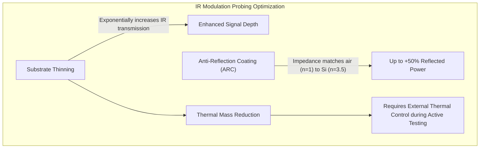
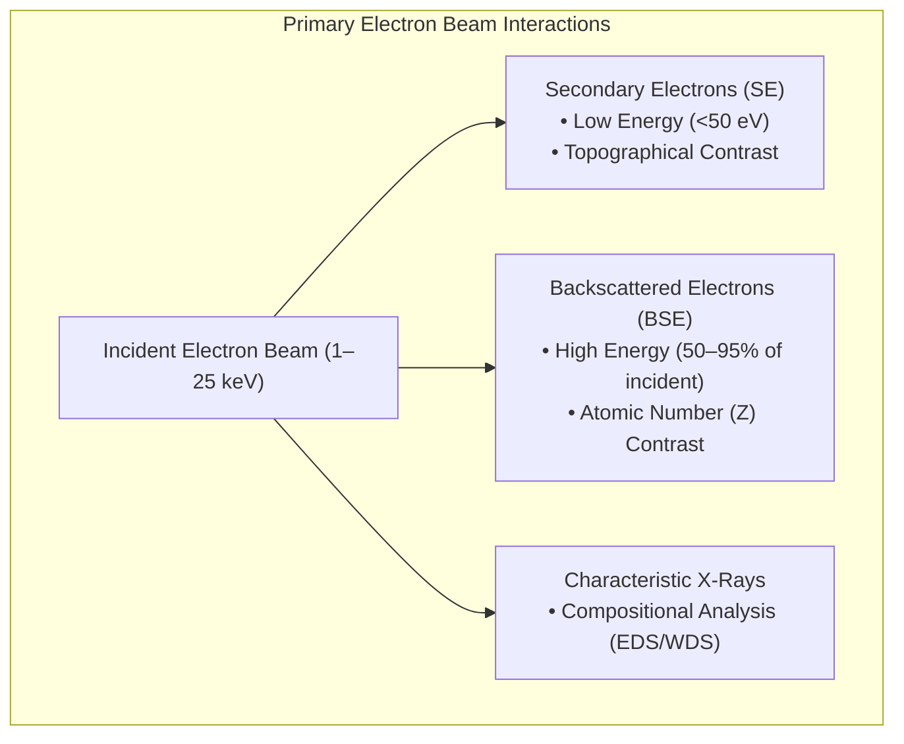
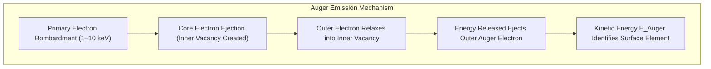
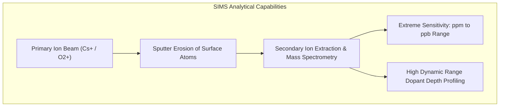

# Failure Analysis of Integrated Circuits — Comprehensive Handbook & Reading Notes

## Electrical Fault Isolation

### Backside Probing & IR Modulation-Based Optical Probing

Electrical fault isolation on modern flip-chip packaged integrated circuits (ICs) requires advanced backside techniques to access signals without disturbing multi-layer BEOL interconnects. Two primary backside methodologies are employed for speed path measurements, design debug, and frequency-sensitive failure analysis:

1. **Backside FIB Milling and Probing**: Focused Ion Beam (FIB) milling drills precisely positioned micro-access holes from the silicon substrate backside. The holes are milled with an inverted pyramid profile (aspect ratio $\sim 1: 1$) to expose Metal-1 or polysilicon conductors for direct probing. The low aspect ratio facilitates mechanical or electron-beam (e-beam) probing without complex probe-tip fabrication. Alignment is achieved by overlaying a backside infrared (IR) optical image with the live FIB image using shared fiducials. Although mechanical/e-beam probing is slow and labor-intensive, it remains the only method capable of providing absolute quantitative DC and AC voltage amplitude measurements on flip-chip devices.
2. **IR Modulation-Based Optical Probing**: Provides a non-contact optical probe by passing a laser beam through the silicon substrate into active device diffusion regions.

```
                    IR Laser Beam Modulation Types
 ─────────────────────────────────────────────────────────────────────────────
  • Amplitude Modulation (Franz-Keldysh Effect): Electric field shifts band gap
  • Phase Shift / Propagation Delay: Refractive index shifts with carrier density
  • Polarization Change: Restricted to optically active materials (e.g., GaAs)
```

As the IR probe beam traverses a transistor's active diffusion region, three types of optical modulation can occur depending on device geometry, material properties, and switching state:
- **Amplitude Modulation**: Driven by the Franz-Keldysh effect, where electric fields across reverse-biased PN junctions subtly shift the effective band gap energy. When the probe wavelength ($\sim 1.06\ \mu\text{m}$) aligns near the band gap, absorption varies proportionally with junction field strength (modulation depth $\sim 1 : 100,000$). This enables waveform measurement in conventional CMOS devices, though signal acquisition demands robust noise suppression.
- **Phase Shift Modulation**: Detects localized refractive index shifts caused by charge carrier density variations during switching. Most pronounced in bipolar and Current-Mode Logic (CML) circuits. Interferometric comparison with a reference beam passing through adjacent static silicon cancels thermal drift. However, signal depth is weak in standard CMOS due to smaller relative carrier density swings.
- **Polarization Modulation**: Restricted to optically anisotropic materials such as GaAs, offering limited utility in silicon CMOS.

Measurement bandwidth in IR optical probing is governed by laser pulse width and stimulus jitter. Typical laser pulse widths yield a temporal resolution of $\sim 50\text{ ps}$, suitable for high-speed timing and propagation delay debug.



To maximize IR optical signal collection, substrate silicon is thinned. Because bulk silicon has a high refractive index ($n \approx 3.5$) compared to air ($n = 1$), applying an Anti-Reflection Coating (ARC) to polished silicon surfaces increases reflected IR power by up to $50\%$. However, substrate thinning reduces thermal mass, requiring temperature control during active electrical testing.

---

## Physical and Structural Analysis

### Optical and Infrared Microscopy

In standard optical microscopy, the objective lens forms a real image of the sample at the focal plane, which is projected onto a camera detector or ocular lens. Resolution and Depth of Field (DOF) are inversely coupled: higher resolution (higher numerical aperture, NA) inherently narrows the DOF. Confocal microscopy overcomes this restriction by reconstructing 3D focused composite images across multiple focal planes.

Working distance is critical in package-level failure analysis. High-NA lenses have short working distances, making them ideal for bare wafer inspection but difficult to use on packaged ICs. Package inspection utilizes long-working-distance lenses with slightly lower NA, whereas mechanical micro-probing requires ultra-long working distance objectives to accommodate probe manipulators.

```
                    Microscopy Lens Trade-Offs
 ─────────────────────────────────────────────────────────────────────────────
  Lens Type             | Resolution (NA) | Working Distance | Depth of Field
  ──────────────────────┼─────────────────┼──────────────────┼───────────────
  High NA (Wafer Inspection) | High (NA > 0.8) | Very Short       | Narrow
  Long Working Distance  | Moderate        | Long             | Moderate
  Ultra-Long (Probing)   | Low             | Ultra-Long       | Wide
```

Infrared (IR) microscopy enables non-destructive backside inspection through silicon. Although IR resolution is diffraction-limited due to longer wavelengths than visible light, it is essential for flip-chip failure analysis. IR radiation slightly above silicon's band gap energy acts as an **active probe** by generating electron-hole pairs, whereas longer wavelengths (lower photon energy) serve as an **electrically passive probe**.

---

### Scanning Electron Microscopy (SEM) and Electron Interactions

In Scanning Electron Microscopy (SEM), primary electrons interact with the sample matrix, generating Secondary Electrons (SE) and Backscattered Electrons (BSE).



While secondary electrons yield high-resolution surface topography, backscattered electrons provide strong atomic number ($Z$) contrast because high-$Z$ nuclei backscatter electrons more efficiently. BSEs retain $50\text{--}95\%$ of incident beam energy and are captured using segmented solid-state detectors. Because BSE trajectories are directional, they excel at detecting heavy metal distribution, such as lead-rich phases in solder joints.

Key operating variables in SEM include:
- **Accelerating Potential (1–25 keV)**: Higher voltage improves diffraction-limited resolution but increases interaction volume and sample charging. Beam energies of $5\text{--}25\text{ keV}$ are standard for conductive samples, whereas $1\text{--}5\text{ keV}$ (or $\sim 1\text{ keV}$) is preferred for insulating materials to mitigate charging.
- **Beam Current**: Lower current yields a smaller electron spot size (higher spatial resolution) but reduces signal-to-noise ratio (SNR).
- **Working Distance & Tilt**: Shorter working distance improves spot focus and resolution. Sample tilting increases secondary electron emission, improving SNR and 3D perspective.

To prevent image artifacts from sample charging, conductive grounding paths are established. For deprocessed ICs where internal ground lines are severed, thin conductive coatings (e.g., Chromium for FESEM, Carbon for EDS) are sputtered onto the sample surface.

Focused Ion Beam (FIB) systems complement SEM by enabling localized cross-sectioning, TEM lamella preparation, and high-sensitivity SIMS chemical imaging, despite having larger spot sizes than FESEM.

Advanced node failures with No Visual Defect (NVD)—such as dopant fluctuation anomalies—require Scanning Capacitance Microscopy (SCM) to map localized electrical carrier profiles at nanometer scales.

---

## Chemical and Elemental Microanalysis

### Chemical Analysis Analytical Framework

All microanalytical techniques operate within a common four-part framework: incident radiation, physical sample interaction, emitted/attenuated flux, and signal detection.

```
                    Microanalytical Technique Comparison
 ─────────────────────────────────────────────────────────────────────────────
  Technique | Incident  | Detected     | Spatial Res. | Sensitivity | Primary Application
  ──────────┼───────────┼──────────────┼──────────────┼─────────────┼─────────────────────────
  EDS       | Electrons | X-rays       | ~1 µm        | ~0.1%       | Bulk elemental analysis
  WDS       | Electrons | X-rays       | ~1 µm        | ~0.01%      | Trace element detection
  AES       | Electrons | Auger e⁻     | ~10 nm       | ~0.1–1%     | Near-surface elemental
  SIMS      | Ions      | Sec. Ions    | ~1 µm        | ppm–ppb     | High-sensitivity profiles
  FTIR      | IR photons| Abs. IR      | ~10 µm       | ~1%         | Organic bond identification
```

- **Energy Dispersive X-ray Spectroscopy (EDS)**: Coupled directly to SEMs for general-purpose elemental analysis. Incident electrons generate characteristic X-rays from an interaction volume extending several micrometers deep. Sensitivity is $\sim 0.1\%$, but resolution is limited for thin surface films and light elements ($Z < 11$).
- **Wavelength Dispersive Spectroscopy (WDS)**: Uses crystal diffraction to separate X-ray wavelengths, yielding higher energy resolution, reduced peak overlap, and superior sensitivity ($\sim 0.01\%$) compared to EDS, at the expense of longer acquisition times.
- **Fourier Transform Infrared Spectroscopy (FTIR)**: Identifies organic contamination and polymer structures by measuring vibrational absorption modes (stretching and bending) of chemical bonds (e.g., $C=O$, $C-H$, $O-H$). Microspot FTIR focuses analysis to areas as small as several micrometers, making it vital for package assembly defect isolation.
- **X-ray Photoelectron Spectroscopy (XPS/ESCA)**: Measures photoelectrons ejected by monochromatic X-rays. Determines binding energies to identify elemental chemical states and oxidation shifts in the top $1\text{--}5\text{ nm}$ of a surface.
- **Ion Chromatography & RGA**: Ion chromatography extracts non-localized ionic contaminants via boiling water extraction. Residual Gas Analysis (RGA) ruptures hermetic package cavities in vacuum to quantify internal moisture and gas composition via mass spectrometry.

---

### Auger Electron Spectroscopy (AES)

Auger Electron Spectroscopy (AES) provides near-surface elemental analysis within the uppermost $2\text{--}5\text{ nm}$ ($20\text{--}50\ \text{\AA}$) of a sample, achieving spatial resolution down to $20\text{ nm}$ ($200\ \text{\AA}$).



The Auger process begins when a primary electron ejects an inner-shell electron. An outer-shell electron relaxes into the vacancy, transferring excess energy to eject a second outer-shell electron (the Auger electron). The kinetic energy of the Auger electron ($E_{\text{Auger}}$) is characteristic of the parent atom:

$$E_{\text{Auger}} \approx E_K - E_{L_1} - E_{L_{2,3}}$$

AES spectra are typically displayed in differential mode ($dN(E)/dE$) to isolate sharp Auger peaks from the high secondary electron background. Combining AES with noble gas ($\text{Ar}^+$) ion sputtering enables depth profiling of thin interfacial films.

```
                 AES Depth Profile Application: Bond Pad Contamination
 ─────────────────────────────────────────────────────────────────────────────
   [Native Oxide / Organic Residue]  ──► Top 2–5 nm: C, O, F peaks
  ─────────────────────────────────────────────────────────────────────────────
   [Interfacial Fluoride / Oxide]    ──► Sputter Depth 10 nm: Al, O, F (AlF3)
  ─────────────────────────────────────────────────────────────────────────────
   [Clean Metal Pad Bulk]           ──► Sputter Depth 50 nm: Pure Al Signal
```

Key failure analysis applications of AES include:
- **Bond Pad Non-Bondability**: Detecting residual oxide ($\text{SiO}_2$), fluorinated residues ($\text{AlF}_x\text{O}_y$), or organic films on aluminum pads that prevent wire bonding.
- **Leadframe Interfacial Contamination**: Identifying nickel out-diffusion through gold plating layers on leadframes, which oxidizes and causes bond lifting.
- **Solder Dewetting & Die Attach Failure**: Mapping thin oxide interlayers or silicon contamination on die-attach gold backing.

---

### Secondary Ion Mass Spectrometry (SIMS)

Secondary Ion Mass Spectrometry (SIMS) uses a primary ion beam ($\text{Cs}^+$ or $\text{O}_2^+$, $1\text{--}20\text{ keV}$) to sputter the sample surface. A fraction of sputtered species is ionized and analyzed by a mass spectrometer.



SIMS detects all elements from Hydrogen to Uranium, providing sensitivity in the $\text{ppm}\text{--}\text{ppb}$ range. Variable ion beam current density enables depth profiling from shallow surface layers to deep junctions. Ion-implanted reference standards are used to quantify dopant concentrations ($\text{B}, \text{P}, \text{As}$) and mobile ion contaminants ($\text{Na}, \text{K}, \text{Cl}$) with repeatability approaching $1\%$.
