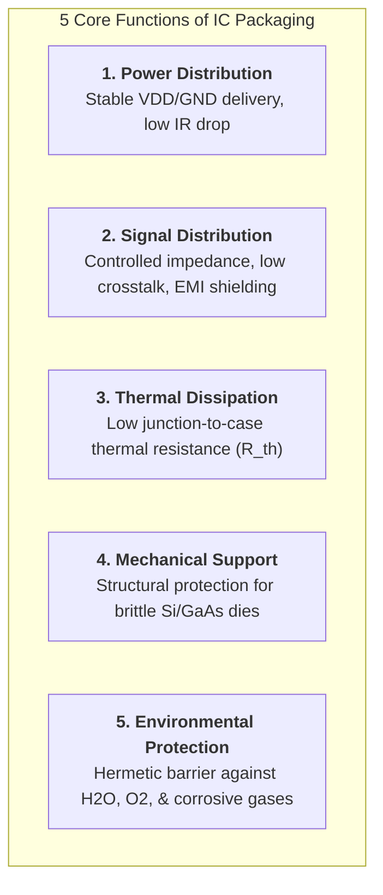
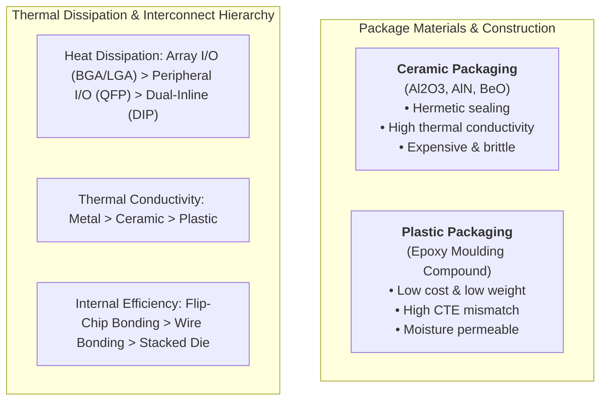
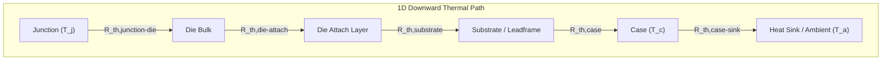

# Reliability Technology for Integrated Circuit Packaging — Comprehensive Handbook & Reading Notes

## Core Functions of IC Packaging

Integrated Circuit (IC) packaging serves as the critical physical bridge between microscopic semiconductor devices and macroscopic electronic systems. Modern IC packaging fulfills five fundamental, interdependent engineering functions:

1. **Power Distribution**: Packaging must guarantee efficient, low-impedance power delivery from external voltage regulators to internal chip blocks, meeting stringent $I\cdot R$ drop and transient switching noise requirements across diverse functional domains.
2. **Signal Distribution**: Packaging interconnections must minimize high-frequency signal attenuation, propagation delay, and impedance discontinuities, while preventing external electromagnetic interference (EMI) and internal signal crosstalk. As operating frequencies enter the multi-gigahertz regime, the IC package becomes a primary source of electromagnetic radiation. Package structural design—such as embedded ground planes and conductive enclosures—provides effective EMI shielding.
3. **Thermal Dissipation**: Active semiconductor junctions generate concentrated thermal energy. Packaging establishes a low thermal resistance path to evacuate heat into the ambient environment. In high-power chips, excessive junction temperatures induce electrical parameter drift and accelerate failure mechanisms (e.g., electromigration, dielectric breakdown).
4. **Mechanical Support**: Monocrystalline silicon ($\text{Si}$) and gallium arsenide ($\text{GaAs}$) are thin, brittle semiconductor materials with low fracture toughness. The packaging substrate and encapsulant provide mechanical rigidity to withstand handling stresses, board-level assembly, and operational shock/vibration.
5. **Environmental Protection**: Unpassivated aluminum bond pads and moisture-sensitive dielectric films are vulnerable to atmospheric corrosion and ionic contamination. Packaging provides a protective barrier against moisture, oxygen, and corrosive industrial gases.

---

## Industry Impact & Reliability Metrics

Packaging accounts for a dominant fraction of the total volume, electrical parasitics, thermal resistance, and overall manufacturing cost of modern electronic components.

- **Table 1.1 — Impact of Packaging on System and Component Metrics**:

  | Performance / Physical Metric | Contribution Attributable to IC Packaging |
  | :--- | :--- |
  | **Electronic Component Volume** | **70–90%** of final component footprint and volume |
  | **System Signal Delays** | **>50%** of total delay governed by package interconnect length |
  | **Interconnect Resistance** | **>55%** of total parasitics introduced by packaging leads |
  | **Thermal Performance Anomalies** | **>60%** of thermal failures rooted in package interfaces |
  | **Overall Component Failures** | **>50%** of field failures caused by packaging defects |
  | **Total Component Cost** | **30–80%** of total manufacturing cost consumed by packaging |

---

## Package Architectural Classification

### Ceramic vs. Plastic Packaging

- **Ceramic Packaging**: Utilizes inorganic substrates ($\text{Al}_2\text{O}_3$, $\text{AlN}$, $\text{BeO}$) that offer exceptional mechanical rigidity, chemical inertness, high thermal conductivity, and hermetic sealing. However, ceramic processing incurs high material costs, high processing temperatures, and mechanical brittleness.
- **Plastic Packaging**: Dominates consumer electronics due to low cost, light weight, and small form factor (mass is approximately half that of ceramic packages). However, plastic compounds exhibit higher moisture permeability, lower thermal conductivity ($1/50\text{th}$ of ceramic), and significant thermo-mechanical stress from Coefficient of Thermal Expansion (CTE) mismatch.

---

## Packaging Materials & Thermo-Electrical Properties

### Substrate and Enclosure Materials

- **Table 2.1 — Electrical and Thermal Properties of Key Packaging Substrates & Metals**:

  | Material Class | Specific Material | Electrical Insulation / Conductivity | Thermal Conductivity [$W/(m\cdot K)$] | CTE [$ppm/^\circ\text{C}$] | Key Application Notes |
  | :--- | :--- | :--- | :--- | :--- | :--- |
  | **Semiconductor** | Silicon ($\text{Si}$) | Substrate | ~150 | 2.6 | Reference die material |
  | **Semiconductor** | Gallium Arsenide ($\text{GaAs}$) | Substrate | ~44 | 5.7 | High-frequency compound semi |
  | **Ceramic** | Alumina ($\text{Al}_2\text{O}_3$) | Insulator ($k \approx 9.8$) | ~20–30 | 6.5 | Standard ceramic substrate |
  | **Ceramic** | Aluminum Nitride ($\text{AlN}$) | Insulator ($k \approx 8.8$) | ~170–200 | 4.5 | High-power, low-CTE ceramic |
  | **Ceramic** | Silicon Carbide ($\text{SiC}$) | Insulator ($k \approx 10.0$) | ~270 | 3.7 | High dielectric constant limits speed |
  | **Metal** | Copper ($\text{Cu}$) | Conductor ($>10^7\text{ S/m}$) | ~400 | 17.0 | High thermal/electrical leadframes |
  | **Metal** | Aluminum ($\text{Al}$) | Conductor | ~230 | 23.0 | Lightweight metal enclosure |
  | **Metal** | Molybdenum ($\text{Mo}$) | Conductor | ~138 | 5.0 | Low CTE metal matching Si |
  | **Metal** | Tungsten ($\text{W}$) | Conductor | ~174 | 4.5 | Low CTE metal matching Si |
  | **Metal Alloy** | Copper-Tungsten ($\text{Cu-W}$) | Conductor | ~180–200 | 6.5–8.0 | Tailored CTE for high-power lids |
  | **Metal Alloy** | Copper-Moly ($\text{Cu-Mo}$) | Conductor | ~160–200 | 6.0–9.0 | Tailored CTE heat spreaders |
  | **Organic** | FR4 Epoxy Glass | Breakdown ~30–40 kV/mm | ~0.3 | 14–17 | Standard PCB substrate |
  | **Encapsulant** | Epoxy Moulding Compound | Breakdown ~20 kV/mm | 0.1–2.0 | 15–25 | Plastic body encapsulation |

---

## Thermal Resistance Modeling

Heat generated within the active transistor region flows through internal package layers into the ambient heat sink.

Thermal resistance ($R_{\text{th}}$) is modeled analogous to Ohm's Law:

$$\Delta T = T_j - T_a = P_d \times \sum R_{\text{th}}$$

- **Standard Single Path Model**: Assumes primary heat flow dissipates downward through the die attach and substrate into the PCB.
- **Dual Thermal Resistance Model**: Required for hermetic metal/ceramic packages where top-side heat spreaders create parallel upward thermal conduction paths.
- **Multi-Heat Source Model**: Accounts for thermal coupling between multiple active dies in multi-chip modules (MCMs) and 3D System-in-Package (SiP) assemblies.

---

## Environmental & Radiation Reliability Controls

1. **Internal Moisture Limit**: Moisture sealed inside a package cavity accelerates aluminum corrosion and causes parameter instability. Internal moisture content must be maintained below $5000\text{ ppm}$ ($\text{v/v}$); exceeding $5000\text{ ppm}$ constitutes a hermeticity failure.
2. **Alpha-Particle Soft Errors**: Low-melting-point glass sealing fillers containing zirconium silicate and underfill materials can emit trace alpha particles ($150\text{--}200\text{ cph/cm}^2$). Alpha radiation interacts with boron ($^{10}\text{B}$) within silicon, generating electron-hole pairs that flip memory cell logic states (Soft Error Rate, SER). Low-alpha fillers ($< 0.001\text{ cph/cm}^2$) are mandatory for high-density memory packages.
