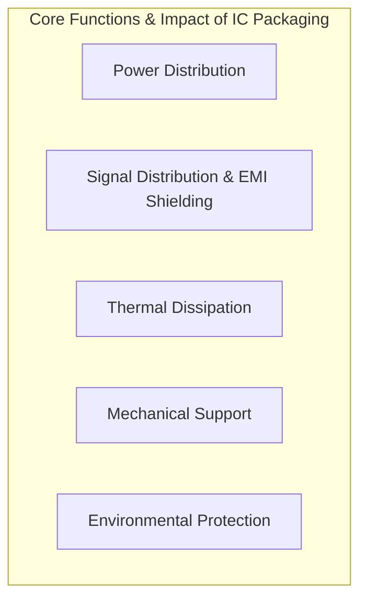
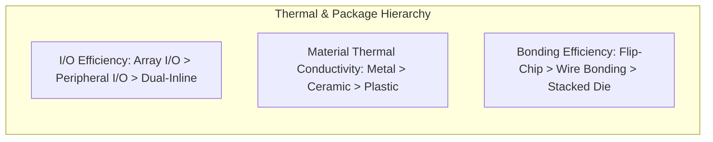

# Reliability Technology for Integrated Circuit Packaging — Reading Notes

---

## Basic Functions of IC Packaging

- **[Ch.]** Power Distribution: Packaging must ensure effective communication between the internal chip and external circuits, and meet the power distribution requirements within different sections of the package. *(2026-06-25)*

- **[Ch.]** Signal Distribution: Packaging interconnections must minimise signal loss and delay, and prevent external signal interference and internal signal crosstalk. With improvements in packaging integration, Electromagnetic Compatibility (EMC) of ICs becomes increasingly important — the package often serves as a source of radiation in electronic systems. Effective Electromagnetic Interference (EMI) shielding can be achieved through the design of the package structure. *(2026-06-25)*

- **[Ch.]** Thermal Dissipation: Packaging provides a low thermal resistance path for heat dissipation from the chip, efficiently expelling heat generated during operation. Power consumption causes temperature rise, which is more pronounced in high-power chips. To prevent beyond-tolerance electrical parameter drift due to high temperature, heat generated in the active region must be dissipated as quickly as possible through packaging, ensuring stable functional performance and long-term reliability. *(2026-06-25)*

- **[Ch.]** Mechanical Support: The external packaging structure provides mechanical support for the internal chip. IC semiconductor materials such as silicon (Si) and gallium arsenide (GaAs) are very thin and brittle, requiring substrates with greater mechanical strength and protective encapsulating materials to meet assembly process requirements and ensure long-term use. *(2026-06-25)*

- **[Ch.]** Environmental Protection: Packaging acts as a barrier against moisture and other harmful gases, minimising the impact of external environmental factors on chip performance. For example, aluminium metallisation wiring bonding windows on the chip surface without passivation layer protection are prone to contamination and corrosion, leading to open circuits. Appropriate packaging structures and materials are necessary to prevent moisture intrusion. *(2026-06-25)*

---

## Key Industry Statistics

> **Why Packaging Matters — By the Numbers**

| Metric | Packaging's Contribution |
|--------|--------------------------|
| Volume of electronic component | **70–90%** determined by packaging |
| Signal delays | **>50%** related to packaging |
| Increased resistance | **>55%** related to packaging |
| Thermal performance anomalies | **>60%** related to packaging |
| Component failures | **>50%** related to packaging |
| Total component cost | **30–80%** accounted for by packaging |

*(Source: IC manufacturing statistics [3])* *(2026-06-25)*

---

## Package Types & Structures

- **[Ch.]** Ceramic packaging exhibits excellent overall thermal, electrical, mechanical, and dimensional properties. Common materials include Al₂O₃, AlN, and BeO, with parameters spanning a range of dielectric constants, thermal conductivities, and coefficients of thermal expansion (CTE). Greatest advantage: hermetic sealing and material stability. Drawbacks: high packaging process costs, brittleness, and limited resistance to mechanical shock. *(2026-06-25)*

- **[Ch.]** Plastic packaging advantages: low cost, small weight, and small size — mass is approximately half that of ceramic packages, and the smaller size greatly reduces signal delay. Shortcomings: internal stress from thermal mismatch, susceptibility to deformation at high temperatures, low thermal conductivity (1/50 of ceramic), and poor moisture resistance. *(2026-06-25)*

- **[Ch.]** Packaging material developments:

  | Sector | Emerging Materials |
  |--------|--------------------|
  | Civilian | New epoxy packaging materials, composite packaging materials, environmentally friendly packaging materials |
  | High reliability | AlN, SiC–Al alloys, Si–Al alloys (high density/heat dissipation); nano-silver and nano-copper (high power) |

  *(2026-06-25)*

---

## Failure Mechanisms & Reliability

- **[Ch.]** Main reasons for the diminishing trend of technological advancement as integration and performance increase: *(2026-06-25)*
  1. **Physical limits:** Feature sizes of transistors are approaching atomic dimensions and process limits, leading to increasingly severe quantum effects and short-channel effects.
  2. **Reliability:** Increasing power density makes device cooling difficult. Thermal stress and strain from process steps such as annealing and thermal cycling lead to more reliability issues.
  3. **Interconnect dominance:** Starting from the 180 nm process node, chip performance is more determined by interconnect length than device scaling — performance gains from scaling are offset by delays caused by longer interconnects.

- **[Ch.]** TSV applications are divided into two categories: *(2026-06-25)*
  1. **3D IC integration** — Using TSV and flip-chip microbump technology to stack chips.
  2. **3D Si integration** — Using TSV to stack wafers/chips without a bump process.

---

## Thermal Management

- **[Ch.]** Heat dissipation efficiency by I/O terminal type: **Array I/O > Peripheral I/O > Dual-inline I/O.** *(2026-06-25)*

- **[Ch.]** Thermal conductivity ranking of packaging materials: **Metal > Ceramic > Plastic.** *(2026-06-25)*

- **[Ch.]** Heat dissipation efficiency by internal chip packaging method: **Flip-chip bonding > Wire bonding > Stacked die.** *(2026-06-25)*

- **[Ch.]** Packaging materials and EMI: EMI of IC packaging manifests in two aspects: (1) mutual EMI caused by multi-chip assembly structures (transistor switching noise); (2) impact of internal coating materials on electromagnetic shielding effectiveness. *(2026-06-25)*

- **[Ch.]** Internal moisture content must typically be kept below 5000 ppm; exceeding this threshold is considered a failure. *(2026-06-25)*

- **[Ch.]** Zirconium silicate filling materials in low melting point glass can emit alpha-particle radiation at rates of 150–200 cph/cm². Underfill materials at the bottom of flip-chip packages can also emit alpha particles — these can interact with the ¹⁰B element within chips and cause soft errors in the IC. *(2026-06-25)*

---

## Materials & Processes

### Electrical Properties of Package Materials

- **[Ch.2]** Organic adhesive materials: typical organic adhesives include conductive adhesives (conductivity >10⁶ S/m, high-performance up to 10⁷ S/m) and non-conductive adhesives (insulating bonding materials for adhesion purposes only). Both provide mechanical bonding while enabling electrical conduction and thermal transfer as applicable. *(2026-06-25)*

- **[Ch.2]** Substrate materials — organic: conventional insulating substrates include fiberglass (FR4) and phenolic resin (FR3). Breakdown voltage of epoxy resin in fiberglass is ~30 kV/mm; substrates containing inorganic fillers and glass cloth can approach 40 kV/mm. *(2026-06-25)*

- **[Ch.2]** Substrate materials — ceramic: includes AlN, Al₂O₃, and SiC. *(2026-06-25)*

  | Material | Electrical Insulation | Thermal Conductivity | Notes |
  |----------|----------------------|----------------------|-------|
  | Al₂O₃ (Alumina) | Good | Relatively low | Widely used |
  | AlN (Aluminium Nitride) | Good | High | Well-suited for high power, multi-lead, large packages. Drawbacks: high sintering temperature, complex fabrication, elevated cost |
  | SiC (Silicon Carbide) | Good (εᵣ = 10) | High | High dielectric constant limits use to low-frequency packages only |

- **[Ch.2]** Metal enclosure materials: conventional conductors include Al, Cu, Mo, W, Cu-W alloys, and Cu-Mo alloys with electrical conductivity >10⁷ S/m. Metal enclosures serve as large-area ground planes to reduce capacitance and inductance between signal lines, minimising crosstalk and electrical noise. Advantages: excellent thermal conductivity, low propagation delay, and superior EMI/RFI shielding. *(2026-06-25)*

- **[Ch.2]** Moulding and potting materials: epoxy is the most common moulding material with a breakdown voltage of ~20 kV/mm. Potting materials include organic silicone compounds with widely varying insulation performance, waterproofing, temperature resistance, optical properties, adhesion, and hardness. *(2026-06-25)*

### Impact of Interconnect Structure on Electrical Conductivity

- **[Ch.2]** Main interconnect structures in packaging: gold wire bonding, aluminium wire bonding, copper wire bonding, bump bonding, TSV, and RDL. *(2026-06-25)*

- **[Ch.2]** Gold wire bonding: widely used but prone to forming harmful intermetallic compounds at high temperatures. *(2026-06-25)*

- **[Ch.2]** Aluminium wire bonding: low cost technique. Aluminium wire is easily oxidised during wedge bonding, forming a hard oxide film that degrades both electrical performance and mechanical integrity of the bond. *(2026-06-25)*

- **[Ch.2]** Copper wire bonding: good mechanical properties with excellent electrical and thermal conductivity. Suitable as a replacement for expensive gold wire and mechanically weaker aluminium wire — allows reduced pad pitch. Drawback: tendency to oxidise may reduce bondability and conductivity. *(2026-06-25)*

---

### Thermal Properties of Package Materials

- **[Ch.2]** Organic adhesive materials: typically use 2 or more polymers as base matrix. Non-conductive adhesives use fillers such as silica and PTFE; conductive adhesives use epoxy resin, unsaturated polyester, or silicone rubber with fillers such as carbon, metals, and metal oxides. Adding high thermal conductivity fillers can decrease mechanical properties — commercial silicone adhesives achieve only 0.4–0.8 W/(m·K), insufficient for high power density packaging. *(2026-06-25)*

- **[Ch.2]** Substrate materials: thermal conductivity of the substrate directly affects the package thermal resistance and internal device temperature. Ceramics offer higher thermal conductivity than typical organic materials, providing better heat dissipation than plastics. *(2026-06-25)*

- **[Ch.2]** Metal enclosure materials — Table 2.2: *(2026-06-25)*

  | Material | Thermal Conductivity W/(m·K) | CTE (ppm/°C) | Notes |
  |----------|------------------------------|--------------|-------|
  | Copper (Cu) | ~400 | ~17 | Excellent thermal/electrical conductor |
  | Aluminium (Al) | ~230 | ~23 | Lightweight |
  | Molybdenum (Mo) | ~138 | ~5 | Low CTE |
  | Tungsten (W) | ~174 | ~4.5 | Very low CTE |
  | Cu-W alloy | ~180–200 | ~6–8 | Tunable CTE/conductivity |
  | Cu-Mo alloy | ~160–200 | ~6–9 | Tunable CTE/conductivity |

- **[Ch.2]** Plastic and potting materials: thermal conductivity is relatively low, typically 0.1–2 W/(m·K). Performance can be improved by adding fillers such as AlN coated with silica. Glass transition temperature (Tg) of plastic materials is usually below 200°C. *(2026-06-25)*

---

### Thermal Resistance Models

- **[Ch.2]** Junction-to-case thermal resistance: for most devices, heat from the junction dissipates primarily downward through the substrate. *(2026-06-25)*

- **[Ch.2]** Dual thermal resistance model: for some metal and ceramic hermetic packages, when the chip contacts the top of the enclosure via a thermal conductive pad, upward heat flow cannot be ignored. *(2026-06-25)*

- **[Ch.2]** Multi heat source thermal resistance model: where heat dissipates primarily downward, the coupling effects between multiple heat sources must be considered. *(2026-06-25)*

---

### Thermal Expansion and Interface Thermal Mismatch

- **[Ch.2]** Table 2.3 — Coefficient of Thermal Expansion (CTE) for typical package materials: *(2026-06-25)*

  | Material | CTE (ppm/°C) |
  |----------|-------------|
  | Silicon (Si) | ~2.6 |
  | GaAs | ~5.7 |
  | Al₂O₃ (Alumina) | ~6–7 |
  | AlN | ~4.5 |
  | SiC | ~3.7 |
  | BeO | ~7 |
  | Kovar (Fe-Ni-Co) | ~5.9 |
  | Copper (Cu) | ~17 |
  | Aluminium (Al) | ~23 |
  | Molybdenum (Mo) | ~5 |
  | Tungsten (W) | ~4.5 |
  | Cu-W (10/90) | ~6.5 |
  | Cu-Mo | ~7 |
  | FR4 (epoxy/glass) | ~14–17 (in-plane) |
  | Polyimide | ~12–16 |
  | Solder (SnPb) | ~24 |
  | Gold (Au) | ~14 |
