# Hitachi High-Technologies – Scanning Electron Microscope Handbook
## Complete Exhaustive Technical Transcription — All 96 Pages

> **Source**: Hitachi High-Technologies Corporation — *Introduction to Scanning Electron Microscopy (SEM Handbook)*
> **Image Source Directory**: `../Hitachi_Images/`
> **Total Pages**: 96 Source Photos (`hitachi_photo_01.jpg` to `hitachi_photo_96.jpg`)

---

## Master Table of Contents

| Chapter | Title & Subsections | Page Range |
|:-------:|:--------------------|:----------:|
| **Chapter 1** | **What is the SEM?** | **pp. 1–6** |
| 1.1 | What Can We Do with a SEM? (Scale reference, UV-blocking fibers, Cross-sectional EDX) | pp. 1–3 |
| 1.2 | Principle and Structure of the SEM (Signal emissions, Column components, Lens optics) | pp. 4–6 |
| **Chapter 2** | **Sample Preparation** | **pp. 7–10** |
| 2.1 | Tools and Materials (Specimen stubs, Conductive pastes, Carbon tapes) | p. 7 |
| 2.2 | Sampling Procedures (Bulk, Powders, Glass/Wafer cleavage) | pp. 7–8 |
| 2.3 | Metal Coating (Au, Au-Pd, Pt-Pd, Pt, Cr, Carbon evaporation) | p. 9 |
| 2.4 | Ion Milling (Broad Ion Beam BIB Flat Milling & Cross-Section Masking) | p. 10 |
| **Chapter 3** | **Let's Try Observation with a SEM!** | **pp. 11–19** |
| 3.1 | Machined Products & Materials (Metals, Polymers, Powders, Toners, Cosmetics) | pp. 11–14 |
| 3.2 | Electronics & Energy (ArF Resist, SRAM Voltage Contrast, 3D NAND, LIB Batteries, Zeolites) | pp. 15–16 |
| 3.3 | Biological Samples (Insects, Cool-Stage Botany, Diatoms, Stem Cells, Bacteria, Viruses) | pp. 17–18 |
| 3.4 | Foodstuffs (Starches, Dairy, Cool-Stage Spinach, Cryo-Gel Matrix) | p. 19 |
| **Chapter 4** | **What Causes These Image Problems?** | **pp. 20–24** |
| 4.0 | Symptom vs. Cause Diagnostic Cross-Reference Chart | p. 20 |
| 4.1 | Cause A: Charge-Up Mechanisms, Manifestations, and Countermeasures | p. 21 |
| 4.2 | Cause B: Hydrocarbon Contamination Dynamics and Beam Blanking | p. 22 |
| 4.3 | Cause C: Thermal Beam Damage & Cause D: External Disturbances (Vibration / Magnetic) | p. 23 |
| 4.4 | Cause E: Mechanical & Optical Alignment Troubles | p. 24 |
| **Chapter 5** | **Types of SEM** | **pp. 25–26** |
| 5.1 | Field Emission SEM Lineup (SU9000 In-Lens, Regulus Semi-In-Lens, SU7000, SU5000) | p. 25 |
| 5.2 | Hi-SEM & Tabletop Lineup (SU3800, SU3900 Large Chamber, FlexSEM 1000II, TM4000Plus) | p. 26 |
| **Chapter 6** | **Frequently Asked Questions About Scanning Electron Microscopy** | **pp. 27–94** |
| 6.1 | Electron Beam Formation & Aberration Theory | pp. 30–36 |
| 6.2 | Evacuation Systems & Differential Vacuum Pumping | pp. 37–38 |
| 6.3 | Generation, Detection, and Use of SEM Signals (SE1–4, BSE, ExB Filter, VC) | pp. 39–49 |
| 6.4 | Viewing Conditions for Acquiring Good SEM Images (kV, Probe Current, WD, Aperture) | pp. 50–59 |
| 6.5 | Principle and Applications of Low Vacuum SEM (Charge neutralization, VP-BSE) | pp. 60–63 |
| 6.6 | Principle and Applications of STEM (BF-STEM, DF-STEM, HAADF Z-Contrast) | pp. 64–72 |
| 6.7 | Generating and Detecting X-rays & Elemental Analysis (EDX/WDX, Moseley Law) | pp. 73–80 |
| 6.8 | Improving the Precision of X-ray Analysis (Overvoltage, Escape depth, Dead time) | pp. 81–85 |
| 6.9 | Other Analytical Equipment (EBSD Crystallography, Cathodoluminescence CL) | pp. 86–94 |

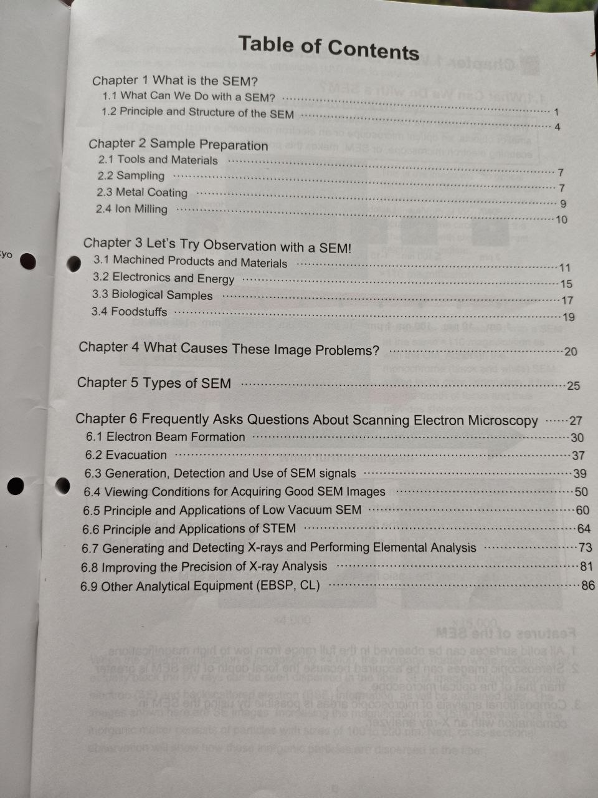
*p.TOC — Table of Contents (Photo 96)*

---

# Chapter 1 — What is the SEM? (pp. 1–6)

## 1.1 What Can We Do with a SEM? (p. 1)


*p.1 — Chapter 1: What is the SEM? — 1.1 What Can We Do with a SEM? (Photo 94)*

The average human naked eye can discern objects down to approximately 0.1 mm (100 μm). To resolve smaller microscopic and nanoscopic entities, optical microscopes (OM) and electron microscopes (EM) are essential.

### Spatial Scale Reference

| Specimen / Structure | Physical Dimension | Applicable Viewing Modality |
|----------------------|--------------------|-----------------------------|
| **Honeybee** | 15 mm | Naked human eye / Stereomicroscope |
| **Water flea (*Daphnia*)** | ≤ 2 mm | Naked eye / Low-magnification OM |
| **Human hair diameter** | 60–100 μm | Optical microscope |
| **Lactobacillus bacterium** | 1–15 μm | Optical / Scanning electron microscope |
| **Viruses (Influenza, Bacteriophage)** | ≤ 100 nm | Field Emission SEM / TEM |
| **DNA double helix diameter** | 2 nm | High-Resolution FE-SEM / STEM / TEM |

```
Observable Resolution Scale:
[Naked Eye]           : ~1 mm to macroscopic
[Optical Microscope]  : ~1 um to 100 mm  (Diffraction limit: ~200 nm)
[Electron Microscope] : 0.1 nm to 100 mm (Sub-nanometer to atomic resolution)
```

> **Comparison: SEM vs. TEM**:
> - **Scanning Electron Microscope (SEM)**: Scans a converged, finely focused electron probe across solid surfaces to acquire high-depth-of-field 3D surface topography and sub-surface compositional distributions.
> - **Transmission Electron Microscope (TEM)**: Transmits high-energy electrons (100–300 kV) through ultra-thin specimens (< 100 nm) to reveal internal atomic lattice structures, crystal defects, and diffraction contrast.

### Core Strengths of the SEM
1. **Wide Magnification Dynamic Range**: Seamless continuous zoom from macro inspection (x10) to ultra-high nanostructure imaging (> x500,000).
2. **Extreme Depth of Focus**: Provides stereoscopic 3D images with focal depth over 100 times greater than optical microscopes.
3. **Micro-Area Chemical Analysis**: Coupled with Energy Dispersive X-ray Spectrometry (EDX), provides qualitative and quantitative elemental identification of sub-micron regions.

---

### p. 2 — Fiber Used to Block UV Rays: Optical Microscope vs. SEM Comparison

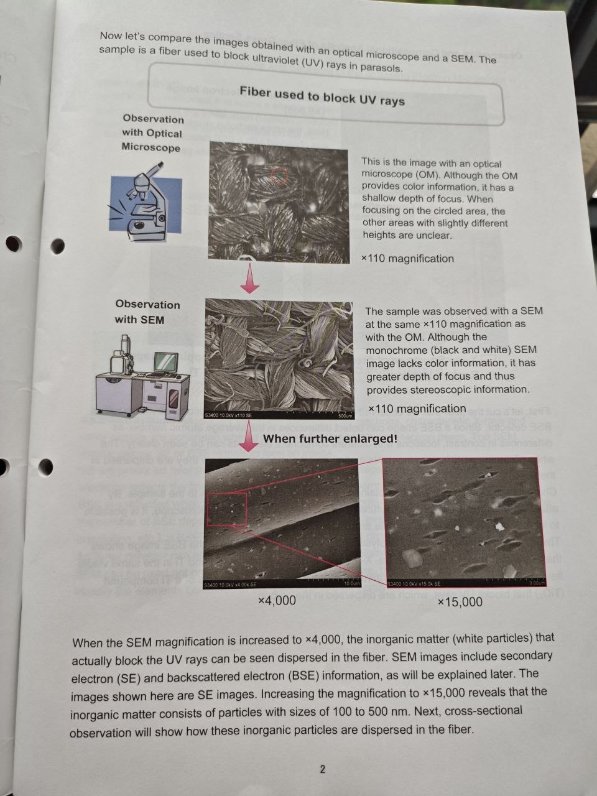
*p.2 — Fiber Used to Block UV Rays: Optical Microscope vs. SEM Comparison (Photo 95)*

A parasol textile fiber engineered with inorganic UV-blocking shielding agents was evaluated:

- **Optical Microscope (x110)**: Provides true color information, but exhibits extremely shallow depth of field. Only a narrow focal plane remains in focus; all higher or lower fiber strands are severely blurred.
- **Scanning Electron Microscope (x110)**: Displays monochromatic greyscale images, but maintains razor-sharp focus across all overlapping fiber strands due to large focal depth.
- **SEM Higher Magnifications**:
  - **x4,000**: Bright inorganic mineral particles embedded within the synthetic polymer fiber core become distinctly visible.
  - **x15,000**: Resolves individual inorganic particles measuring 100 to 500 nm in diameter dispersed uniformly along the fiber matrix.

---

### p. 3 — Cross-Sectional Observation and Compositional EDX Analysis of UV-Blocking Fiber


*p.3 — Fiber Cross Section: Compositional BSE Image, EDX Spectrum, and Titanium/Carbon Elemental Maps (Photo 93)*

1. **Backscattered Electron (BSE) Cross-Section (x5,000)**: Sliced perpendicular to its axis. BSE imaging detects variations in average atomic number ($Z$) as distinct brightness contrast. The high-$Z$ mineral particles glisten brightly against the darker organic carbon polymer matrix.
2. **EDX Spectrum**: Characteristic X-ray emission peaks identify:
   - **Carbon (C Kα)** at ~0.28 keV (dominant polymer backbone).
   - **Titanium (Ti Kα, Kβ)** at ~4.51 keV and 4.93 keV.
3. **Elemental Mapping**: Multi-channel X-ray mapping proves that the embedded UV-blocking particles consist of Titanium Dioxide ($TiO_2$, rutile/anatase nanoparticles) uniformly dispersed within the carbonaceous synthetic yarn.

---

## 1.2 Principle and Structure of the SEM (pp. 4–6)

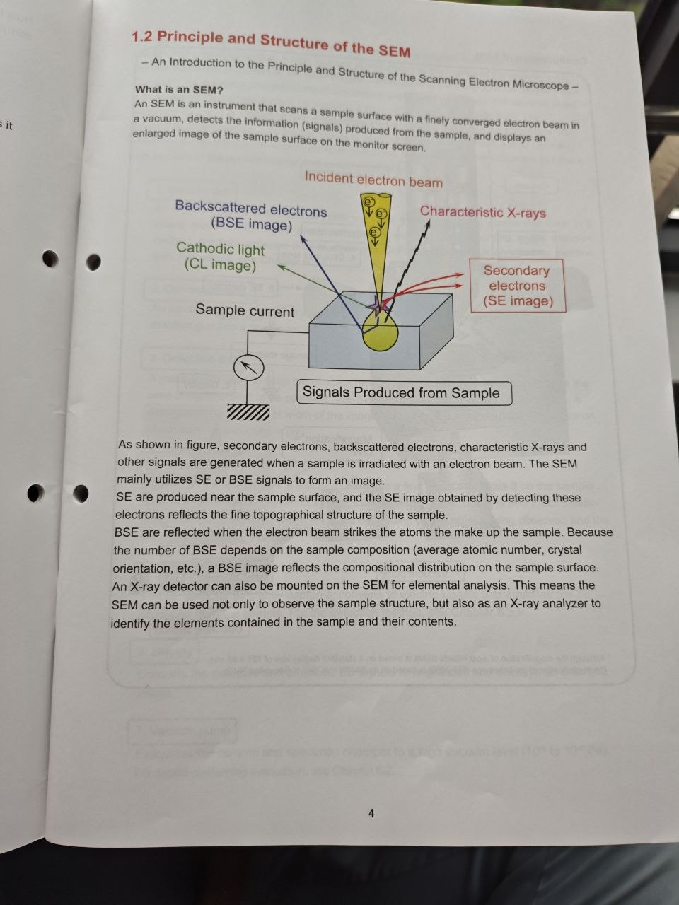
*p.4 — 1.2 Principle of SEM: Electron-Matter Interactions and Emitted Signal Types (Photo 92)*

When a finely converged primary electron beam strikes a solid sample in high vacuum, multiple radiation signals are generated:

```
                  Incident Primary Beam (E0 = 0.5 - 30 keV)
                                  ||
                                  \/
                 ==================================== (Sample Surface)
                 /        |                |                [Auger] /      [SE1/SE2]        [BSE]        \ [Cathodoluminescence]
     (0.5-1 nm)       (1-10 nm)       (0.1-1 um)        (Bandgap Photons)
                          |                |
                          +----------------+
                                  |
                      [Characteristic X-Rays]
                        (Quantitative EDX)
                                  |
                       [Specimen Current I_ab]
```

- **Secondary Electrons (SE)**: Low-energy electrons (< 50 eV) emitted from the top 1 to 10 nm of the sample surface. Highly sensitive to surface tilt, edges, and micro-roughness.
- **Backscattered Electrons (BSE)**: High-energy primary electrons elastically scattered through large angles (> 90°). Signal intensity scales directly with atomic number $Z$.
- **Characteristic X-rays**: Emitted when core-shell electron vacancies are filled by outer-shell electrons, generating discrete photon energies unique to each element.
- **Cathodoluminescence (CL)**: Visible, ultraviolet, and infrared light photons emitted via radiative recombination of electron-hole pairs across electronic bandgaps and crystal defect centers.

---

### p. 5 — Configuration of the SEM System

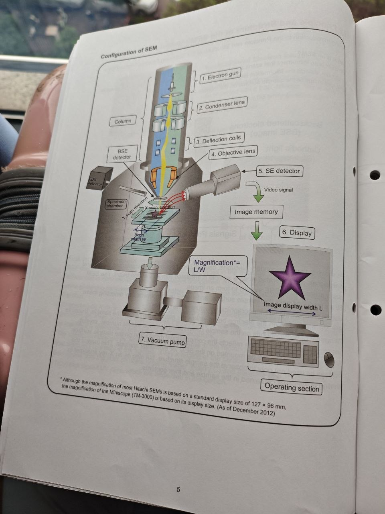
*p.5 — Structural Architecture of the Scanning Electron Microscope (Photo 90)*

```
[ ELECTRON OPTICAL COLUMN ]
  ├── 1. Electron Gun (CFE / Schottky / W-filament)
  ├── 2. First & Second Condenser Lenses (Beam Convergence & Probe Current Control)
  ├── 3. Deflection Scan Coils (X/Y Raster Scanning & Dynamic Stigmation)
  └── 4. Objective Lens (Fine Probe Focusing onto Specimen)

[ SPECIMEN CHAMBER & DETECTORS ]
  ├── Specimen Goniometer Stage (5-Axis Motorized X, Y, Z, Tilt, Rotation)
  ├── Backscattered Electron Detector (Annular Multi-Quadrant Diode / Scintillator)
  ├── Energy Dispersive X-ray Detector (EDX Silicon Drift Detector SDD)
  ├── Secondary Electron Detector (Everhart-Thornley E-T Scintillator-PMT)
  └── Vacuum Pumping Subsystem (Sputter Ion Pumps, Turbo Molecular Pump, Dry Scroll)

[ ELECTRONIC CONSOLE & DISPLAY ]
  └── Magnification Formula: M = L / W
      (Where L = Display Image Width, W = Primary Electron Beam Scan Width on Specimen)
```

---

### p. 6 — Detailed Descriptions of SEM Column Components

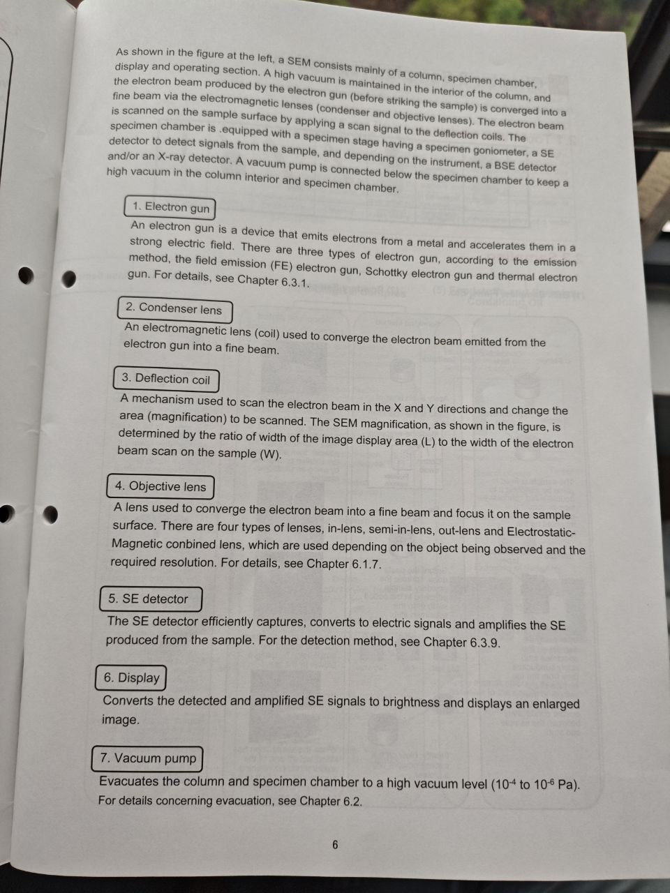
*p.6 — Operational Functions of SEM Subsystems 1 through 7 (Photo 91)*

| # | System Component | Physical Function & Operating Principle |
|---|------------------|-----------------------------------------|
| **1** | **Electron Gun** | Emits electrons from a cathode source and accelerates them through an electrostatic extraction/acceleration field (0.1 to 30 kV). Categories: Cold Field Emission (CFE), Schottky Thermal FE, and Thermionic Tungsten/LaB6. |
| **2** | **Condenser Lens** | Electromagnetic lens system that controls total primary beam demagnification and regulates probe current ($I_p$) entering the objective lens aperture. |
| **3** | **Deflection Coils** | Double-deflection electromagnetic coils that scan the electron beam in a synchronized 2D raster grid across the sample surface ($X$ fast scan, $Y$ slow scan). |
| **4** | **Objective Lens** | Final high-precision optical lens that focuses the demagnified electron probe into a nanometer-scale spot onto the specimen plane. Lens geometries: Out-Lens, Semi-In-Lens, In-Lens, and Compound Magnetic-Electrostatic. |
| **5** | **Secondary Electron Detector** | Everhart-Thornley detector equipped with a positive bias grid (+250 V), scintillator (+10 kV), light pipe, and photomultiplier tube (PMT) to convert secondary electrons into high-gain video signals. |
| **6** | **Display & Image Processor** | Digital image memory frame grabber that maps amplified detector voltage levels to pixel greyscale brightness (8-bit to 16-bit depth). |
| **7** | **Vacuum Subsystem** | Differential vacuum pumping array maintaining Ultra-High Vacuum ($10^{-8}$ to $10^{-9} 	ext{ Pa}$) in the gun chamber and high/variable vacuum ($10^{-4}$ to $300 	ext{ Pa}$) in the specimen chamber. |

---

# Chapter 2 — Sample Preparation (pp. 7–10)

## 2.1 Tools and Materials & 2.2 Sampling (p. 7)

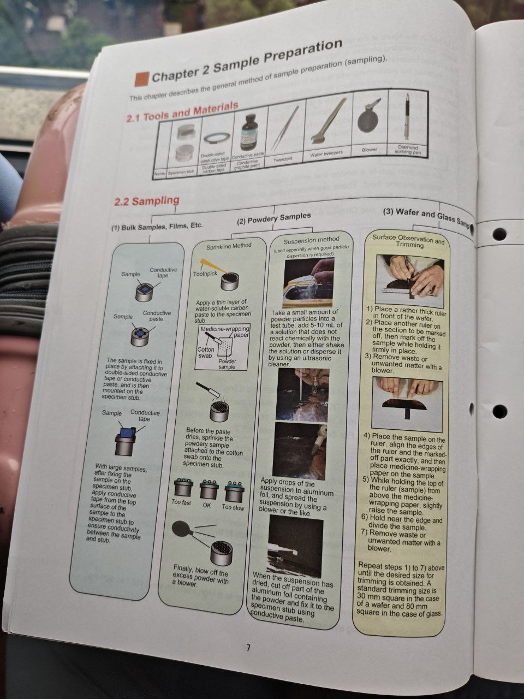
*p.7 — Chapter 2 Sample Preparation — 2.1 Tools and Materials, 2.2 Sampling (Photo 89)*

### 2.1 Tools and Materials

| Tool | Material / Features | Practical SEM Application |
|------|---------------------|---------------------------|
| **Specimen stub** | Nonmagnetic aluminum alloy with standard M4 threaded base on Hitachi SEMs. | Specimen mounting base. Selected in various diameters and shapes (flat stub, cross-section stub, 45° tilt stub). |
| **Double-sided conductive tape** | Carbon conductive tape (standard) or copper conductive tape. | Fixing the sample securely to the specimen stub and providing electrical grounding between sample and stub. |
| **Conductive paste** | Carbon paste / silver paste (solvent-based or water-soluble). | Firmly fixing samples for high-magnification observation (> x50,000). Water-soluble paste is used for samples susceptible to organic solvents. |
| **Conductive graphite paint** | Colloidal graphite dispersion. | Providing wide-area grounding bridges on large insulating samples to eliminate floating potentials. |
| **Tweezers & Wafer tweezers** | Nonmagnetic stainless steel / Teflon-coated tips. | Handling samples cleanly without contaminating the observation surface with skin oils or scratches. |
| **Blower** | Rubber hand dust blower / dry nitrogen duster. | Removing loose particulates, cutting debris, and excess powder from the sample surface or cross-section. |
| **Diamond scribing pen** | Hard diamond tip with precision handle. | Scribing guide lines on silicon wafers, glass substrates, or ceramic samples prior to mechanical cleavage. |

---

### 2.2 Sampling Procedures

#### (1) Bulk Samples, Films, and Plates
- Mount the specimen onto the stub using double-sided conductive carbon tape or conductive paste.
- For large or thick insulating samples, apply a continuous strip of conductive carbon tape or a line of colloidal silver/carbon paste from the top observation surface edge down to the metallic specimen stub to ensure electrical grounding.

#### (2) Powdery Samples
- **Sprinkling Method**: Apply a uniform thin layer of water-soluble carbon paste onto the specimen stub. Using a cotton swab or micro-spatula, gently sprinkle the powder over the stub before the paste dries. Tap off and blow away all excess unbonded particles with a dust blower.
- **Suspension Method (for optimal dispersion)**: Place a small quantity of powder in a test tube, add 5 to 10 mL of an inert, non-reacting solvent (ethanol, isopropyl alcohol, or pure water), and disperse using an ultrasonic bath for 3 to 5 minutes. Dispense drops onto clean aluminum foil, allow to dry completely, cut a small square of foil, and affix it to the stub with conductive paste.

#### (3) Wafer and Glass Cleavage (Cross-Section Preparation)
1. Place a thick stainless steel ruler beneath the wafer along the target cleavage plane.
2. Align a second ruler on top and score a single precise 5 mm line near the sample edge using a diamond scribing pen.
3. Blow away all diamond scoring debris.
4. Position the scored notch exactly along the fulcrum edge of the ruler.
5. Place clean weighing paper over the sample, apply gentle downward pressure on the body, and bend the overhang downward to achieve a clean crystalline mirror cleavage.

---

## p. 8 — Biological Samples and Foodstuffs Preparation

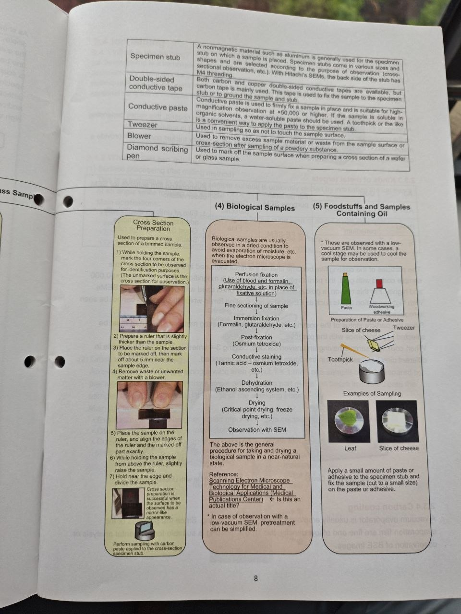
*p.8 — Biological Sample Cross Section Prep, Chemical Pretreatment Flowchart, Foodstuffs & Oils (Photo 88)*

### (4) Biological Sample Cross-Section & Chemical Pretreatment

Biological samples contain high moisture content and volatile components that evaporate in high vacuum, causing collapse and severe deformation. Chemical fixation, dehydration, and critical point drying are required:

```
[Perfusion Fixation] (Blood flush + Formalin / Glutaraldehyde buffer)
       │
       ▼
[Fine Sectioning of Sample] (Micro-dissection into 1-2 mm cubes)
       │
       ▼
[Immersion Fixation] (2-2.5% Glutaraldehyde in phosphate buffer, 2-4 hours)
       │
       ▼
[Post-Fixation] (1% Osmium Tetroxide OsO4, 1-2 hours for lipid/membrane stabilization)
       │
       ▼
[Conductive Staining] (Tannic acid - Osmium tetroxide conductive en bloc staining)
       │
       ▼
[Dehydration] (Graded ethanol series: 50% -> 70% -> 80% -> 90% -> 95% -> 100% Ethanol)
       │
       ▼
[Drying] (Critical Point Drying CPD with liquid CO2, or t-Butyl Alcohol Freeze Drying)
       │
       ▼
[Observation with SEM] (Metal sputter coating -> High-vacuum FE-SEM / Low-vacuum SEM)
```

> **Note on Low-Vacuum SEM**: When using a Variable Pressure (Low-Vacuum) SEM with a Peltier cooling stage (-20°C), chemical dehydration and critical point drying can be simplified or omitted.

### (5) Foodstuffs, Oily Samples, and Hydrated Materials
- Cut samples to small dimensions (3 to 5 mm).
- Mount directly using woodworking adhesive or water-soluble paste on the specimen stub.
- Observe immediately in Low-Vacuum (VP-SEM) mode or with a Cryo-SEM stage (-120°C) to preserve water and lipid phases without shrinkage.

---

## 2.3 Metal Coating (p. 9)

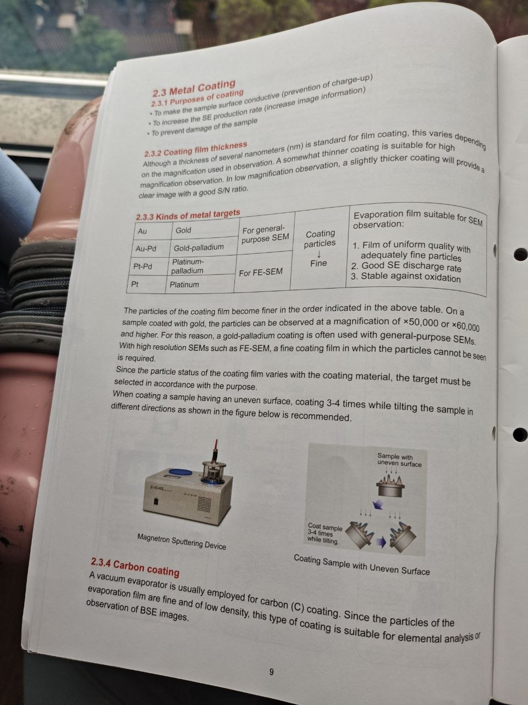
*p.9 — 2.3 Metal Coating: Purposes, Thickness, Metal Targets, Carbon Evaporation (Photo 86)*

### 2.3.1 Purposes of Metal Coating
1. **Confer Electrical Conductivity**: Imparts a conductive surface pathway on non-conductive specimens, preventing charge accumulation (charge-up artifacts).
2. **Increase Secondary Electron (SE) Yield**: Heavy metals (Au, Pt) have high secondary electron emission coefficients, significantly enhancing signal-to-noise ratio (S/N) and image contrast.
3. **Prevent Thermal and Beam Damage**: Conducts heat away from delicate polymer, biological, or semiconductor photoresist structures during electron beam bombardment.

### 2.3.2 Recommended Coating Film Thickness
- **Standard Observation (x1,000 to x20,000)**: 5 to 10 nm thickness provides robust conductivity and high contrast.
- **High-Resolution Observation (x50,000 to x500,000)**: 1 to 3 nm ultra-thin coating prevents masking of fine nanostructures.

### 2.3.3 Sputter Target Material Comparison

| Metal Target | Chemical Symbol | Grain Size | Recommended SEM Instrument | Applications |
|--------------|-----------------|------------|----------------------------|--------------|
| **Gold** | Au | Medium (~5–10 nm) | Tungsten-filament SEM (W-SEM) | General low/medium magnification imaging (< x30,000). |
| **Gold-Palladium** | Au-Pd | Fine (~3–5 nm) | Tungsten & LaB6 SEM | General-purpose high-contrast imaging up to x60,000. |
| **Platinum-Palladium** | Pt-Pd | Very Fine (~1.5–2 nm) | Field Emission SEM (FE-SEM) | High-resolution nanostructure observation (> x100,000). |
| **Platinum** | Pt | Ultra-Fine (~1–1.5 nm) | Cold / Schottky FE-SEM | Ultra-high resolution FE-SEM observation up to x500,000. |
| **Chromium / Tungsten** | Cr / W | Sub-nanometer (< 1 nm) | Ultra-High Resolution FE-SEM | Extreme surface imaging of catalysts, thin films, and ICs. |

### 2.3.4 Carbon Coating for EDX and BSE
- Carbon (C) evaporation is conducted in a high-vacuum carbon coater via resistive thermal evaporation or carbon arc discharge.
- **Why Carbon for EDX/BSE?** Carbon has low atomic number ($Z=6$), producing minimal X-ray absorption lines and negligible interference with characteristic X-ray peaks of interest, while leaving backscattered electron compositional contrast intact.

---

## 2.4 Ion Milling (p. 10)


*p.10 — 2.4 Ion Milling: 2.4.1 Principles, 2.4.2 Flat Milling & Cross-Section Milling (Photo 87)*

### 2.4.1 What is Ion Beam Milling?
Broad Ion Beam (BIB) milling utilizes an energetic argon ion beam ($Ar^+$, ~1 mm diameter, accelerated at 1 to 8 kV) discharged from a Penning ion gun to gently sputter away surface atoms. Unlike mechanical polishing, ion milling introduces **no mechanical stresses, smear layers, abrasive embedment, or surface micro-cracks**.

### 2.4.2 BIB Ion Milling Modes

#### (1) Flat Milling (Surface Planar Milling)
- The $Ar^+$ ion beam is directed at a shallow grazing angle (0° to 30°) onto the sample while the specimen stage continuously rotates at high speed.
- **Applications**:
  - Removal of native surface oxide layers, chemical stains, and mechanical polishing scratches over a 5 mm diameter field.
  - Relief polishing to reveal crystalline grain boundaries, multi-phase structures, and orientation-dependent etch patterns.

#### (2) Cross-Section Milling (Mask Shielding Method)
- A high-precision tungsten or molybdenum shielding mask is placed directly over the sample, exposing only the target edge (~10 to 50 μm overhang).
- The broad $Ar^+$ ion beam irradiates the sample vertically. Atoms outside the mask boundary are sputtered away, creating an ultra-flat, mirror-finish cross-section (~1 mm wide x 500 μm deep).
- **Applications**:
  - Semiconductor multi-layer interconnects, Cu wire bonds, and BGA solder ball interfaces.
  - Soft/hard composite boundaries (e.g., polymer battery separators laminated to copper/aluminum current collectors).
  - Stress-sensitive papers, optical multi-layer coated films, and brittle ceramics.

---

# Chapter 3 — Let's Try Observation with a SEM! (pp. 11–19)

## 3.1 Machined Products and Materials (1) – Metals and Electronic Materials (p. 11)

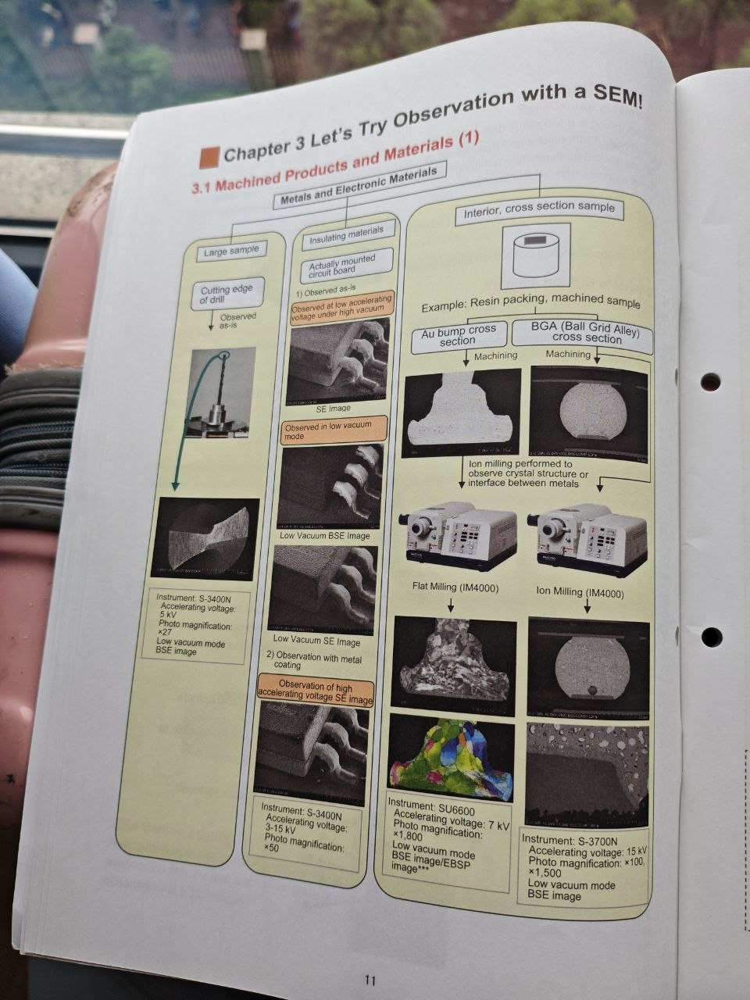
*p.11 — 3.1 Machined Products and Materials (1): Metals and Electronic Materials Observation Flowchart (Photo 85)*

### Observation Pathways for Metallic & Electronic Specimens

```
[Metallic / Electronic Sample]
       │
       ├─► [Large / Bulky Conductive Sample: Cutting Edge of Drill]
       │        ├─► Direct Observation (No Pretreatment)
       │        └─► Instrument: S-3400N | Acc Voltage: 5 kV | Mag: x27 | Mode: Low Vacuum | Signal: BSE
       │
       ├─► [Insulating Multi-layer Substrate: Printed Circuit Board PCB]
       │        ├─► Option A: Low Accelerating Voltage (0.5 - 1.0 kV) -> Direct SE Observation
       │        ├─► Option B: Low Vacuum Mode (30 - 60 Pa) -> Low-Vac BSE / Low-Vac SE Image
       │        └─► Option C: Metal Sputter Coating (Pt/Au, 10 nm) -> High Acc Voltage (15 kV, x50)
       │
       ├─► [Interior Micro-structure / Cross-Section: Gold Bump (Au Bump)]
       │        ├─► Cross-sectioning by IM4000 Ion Milling (Flat / Cross-section Mode)
       │        └─► Instrument: SU6600 | Acc Voltage: 7 kV | Mag: x1,800 | Mode: Low Vac | Signal: BSE / EBSP
       │
       └─► [Package Solder Interconnect: Ball Grid Array (BGA) Cross-Section]
                ├─► Mechanical Pre-grind -> IM4000 Ion Beam Polish
                └─► Instrument: S-3700N | Acc Voltage: 15 kV | Mag: x100, x1,500 | Signal: Compositional BSE
```

---

## 3.1 Machined Products and Materials (2) – Polymeric Materials (p. 12)


*p.12 — 3.1 Machined Products and Materials (2): Polymeric Materials Observation Workflow (Photo 84)*

### Polymer Observation Categories

#### (1) Heat-Sensitive Polymers: Membrane Filters
- **Low Vacuum Observation**: S-3400N | 10 kV | x5,000 | Low Vacuum SE image (eliminates thermal distortion and charge-up without coating).
- **Ultra-Low Voltage Deceleration Mode**: SU8000 Cold FE-SEM | Landing Voltage: 100 V | x50,000 | Deceleration Mode SE image (achieves extreme surface sensitivity and zero beam degradation).

#### (2) Insulating Elastomers: Vulcanized Rubber
- **Compositional Dispersion**: S-3400N | 5 kV | x1,000 | Low Vacuum BSE image (reveals carbon black and silica filler distribution).
- **Topographical Surface**: S-3400N | 5 kV | x1,000 | ESED (Environmental Secondary Electron Detector) (shows fine surface micro-cracks).

#### (3) Liquid / Emulsion Polymers: Polystyrene Latex
- **Cryogenic Freeze-Fracture**: SU8000 FE-SEM | 1 kV | x1,000 | Cryo-Stage (-120°C) | Rapid liquid nitrogen plunge freezing preserves spherical emulsion geometry without drying collapse.

> **Key Technology Callouts**:
> - **Deceleration Mode**: Applies a negative retarding bias (-1 to -5 kV) to the specimen stage, decelerating high-energy primary electrons just before sample impact to landing energies of 50 to 500 eV. This preserves the beam brightness of high-voltage optics while eliminating sample damage and charging.
> - **Cryogenic SEM System**: Liquid nitrogen cryo-transfer chamber and cold specimen stage (-120°C to -160°C) permitting direct observation of hydrated, solvent-rich, or volatile liquid emulsions.
> - **EBSP (Electron Backscatter Pattern / EBSD)**: Captures electron backscatter diffraction Kikuchi patterns from crystal lattice planes to map crystallographic orientation and grain boundaries at sub-micron resolution.

---

## 3.1 Powders, Microparticles and Nanomaterials (p. 13)


*p.13 — 3.1 Machined Products and Materials: Powders, Microparticles, and Nanomaterials (Photo 83)*

| Sample Scale | Example Sample | Preparation Method | Instrument & Operating Conditions | Imaging / Analytical Output |
|--------------|----------------|--------------------|-----------------------------------|-----------------------------|
| **Micron-Order** (1–50 μm) | Cosmetic foundation powder | Sprinkling method on double-sided carbon tape | S-3400N Variable Pressure SEM<br>Acc Voltage: 5 kV<br>Magnification: x3,000 | Low-Vacuum BSE image + **EDX Multi-Element Color Mapping** (Si, Ti, Fe, Al, Mg). |
| **Submicron-Order** (100–900 nm) | Fine metallic submicron particles | Sprinkling method on carbon paste | W-SEM (S-3400N): 15 kV, x30,000<br>FE-SEM (SU8000): 5 kV, x100,000 | High-resolution SE images showing fine particle morphology and sintering necks. |
| **Nano-Order** (1–50 nm) | Precious metal catalyst nanoparticles | Carbon paste dispersion + Ultra-thin Pt coating | SU8000 Cold FE-SEM<br>Acc Voltage: 20 kV<br>Magnification: x300,000 | High-resolution SE image showing 2 to 5 nm catalyst particles anchored on support matrix. |
| **1D Nanomaterials** | Multi-walled Carbon Nanotubes (MWCNT) | Ethanol suspension droplet on micro-grid | SU8000 / SU9000 In-Lens FE-SEM<br>Acc Voltage: 30 kV<br>Magnification: x120,000 | Dual SE Surface Mode + **STEM Transmission Lattice Mode** showing hollow tube core. |

---

## 3.1 Toners and Cosmetics (p. 14)

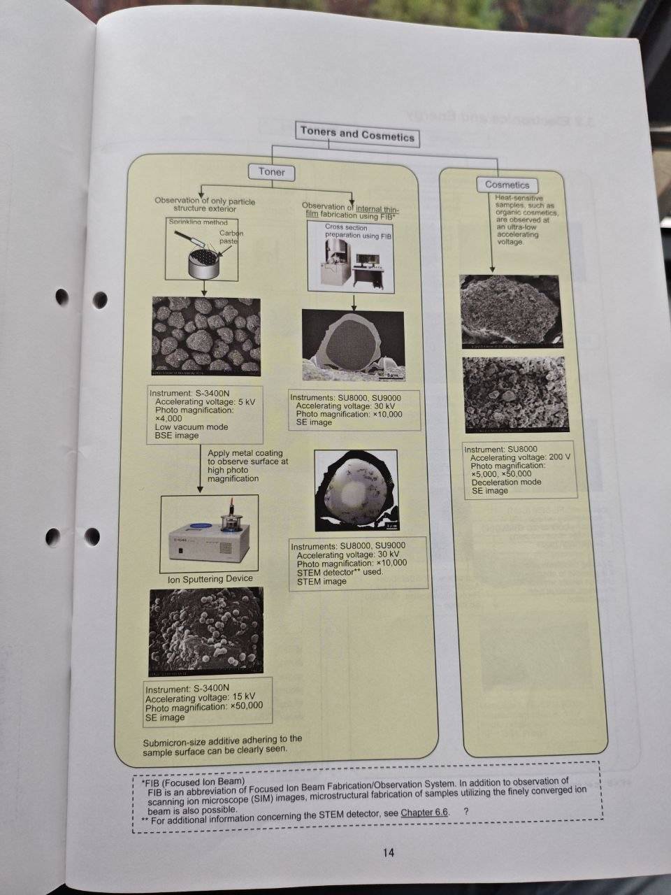
*p.14 — 3.1 Toners and Cosmetics: Surface Morphology, Additive Dispersion, FIB/STEM Cross-Section (Photo 81)*

### Toner Characterization Techniques
1. **Outer Surface Morphology (Low Vacuum)**: S-3400N | 5 kV | x4,000 | Low Vacuum BSE image (shows overall resin particle roundness and external additive presence).
2. **High-Magnification Additive Particle Observation**: S-3400N with Pt sputter coating | 15 kV | x50,000 | Secondary electron image clearly revealing submicron silica ($SiO_2$) and titania ($TiO_2$) fluidizing additives on resin surface.
3. **Internal Core Cross-Section via FIB**: SU8000 / SU9000 | 30 kV | x10,000 | FIB-cut cross-section showing internal wax domains, pigment dispersion, and resin encapsulation.
4. **Bright-Field STEM Transmission Cross-Section**: SU8000 / SU9000 | 30 kV | x10,000 | High-contrast STEM image showing internal nanometer pigment distribution.

### Cosmetics Characterization
- **Heat-Sensitive Organic Cosmetics**: SU8000 Cold FE-SEM | Ultra-low voltage: 200 V | x5,000 and x50,000 | Deceleration Mode SE image revealing organic flake surfaces and lipid coatings without thermal damage.

> **FIB (Focused Ion Beam)**: System utilizing a focused liquid metal gallium ion source ($Ga^+$) to perform nanometer-scale micro-machining, localized cross-sectioning, and TEM thin-lamella lift-out.

---

## 3.2 Electronics and Semiconductor Devices (p. 15)


*p.15 — 3.2 Electronics: Semiconductor Surface Observation, Voltage Contrast, 3D NAND Flash, Dopant Profiling (Photo 82)*

### Semiconductor Surface & Cross-Section Analysis Workflows

#### (1) Non-Destructive Wafer Surface Observation
- **ArF Immersion Photoresist Patterning**: FE-SEM (Cold Cathode) | Landing Voltage: 100 V | x70,000 | Deceleration Mode SE. *Eliminates resist line shrinkage and pattern collapse during high-magnification CD measurement.*
- **SRAM Voltage Contrast (VC) Defect Localization**: FE-SEM (Cold Cathode) | Landing Voltage: 500 V | x50,000 | SE + BSE mixed mode. *Defective open vias appear dark due to positive charge buildup, while grounded good vias appear bright (secondary electron emission).*
- **3D NAND Flash Memory Top Surface Array**: Cold FE-SEM | 10 kV | x300,000 | Secondary electron image showing channel holes and memory cell dimensions.

#### (2) Precision Cross-Sectional Analysis
- **SiC Power Device P-N Junction Dopant Profiling**: Cold FE-SEM | 1 kV | x5,000 | Ultra-low voltage SE image. *Reveals electrical potential differences and dopant concentration gradients ($p$, $n$, $n^-$ drift layers) as distinct brightness contrast.*
- **3D NAND Flash Multi-Stack Wordline Cross-Section**: Ion Milling IM4000 preparation | Cold FE-SEM | 1 kV | x200,000 | Compositional BSE image resolving > 64 to 128 alternating oxide/nitride/polysilicon layers.

---

## 3.2 Energy Systems & Advanced Materials (p. 16)

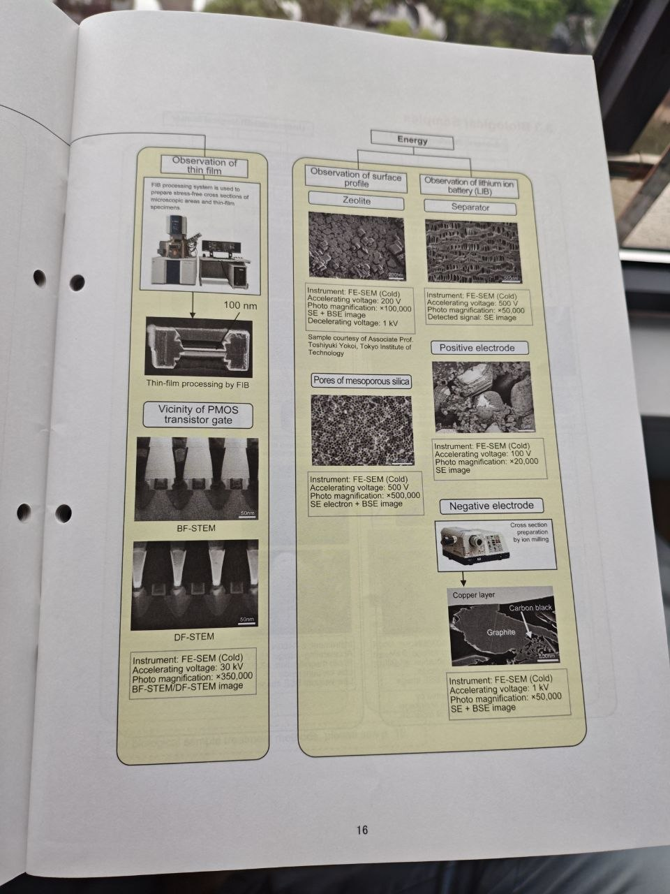
*p.16 — 3.2 Energy: STEM Gate Transistors, Zeolite Nanopores, Lithium-Ion Battery Electrodes (Photo 80)*

### Energy & Catalysis Applications

#### (1) Ultra-Thin Film Transmission (STEM)
- **PMOS Transistor Gate Region (100 nm FIB Lamella)**:
  - Cold FE-SEM (SU9000 / Regulus) | Acc Voltage: 30 kV | Magnification: x350,000.
  - **Bright-Field STEM (BF-STEM)**: Displays diffraction contrast and crystalline lattice strain in SiGe source/drain channels.
  - **Dark-Field STEM (DF-STEM / HAADF)**: High-angle annular dark-field Z-contrast reveals heavy metal gate layers (W, TiN, High-k $HfO_2$).

#### (2) Meso-Porous & Nano-Porous Materials
- **Zeolite Molecular Sieve Framework**: Cold FE-SEM | 200 V landing energy (1 kV deceleration bias) | x100,000 | SE + BSE mode. Resolves sub-nanometer framework channels without surface melting.
- **Mesoporous Silica Nanopore Honeycomb Array**: Cold FE-SEM | Landing Voltage: 500 V | Magnification: x500,000 | Ultra-high resolution SE image resolving ordered 2 to 3 nm pore diameters.

#### (3) Lithium-Ion Battery (LIB) Multi-Component Analysis
- **Polyolefin Porous Separator**: Cold FE-SEM | Landing Voltage: 500 V | x50,000 | SE image showing sub-100 nm tortuous pore network.
- **Positive Electrode ($LiCoO_2$ / NMC Active Material)**: Cold FE-SEM | 100 V | x20,000 | SE image revealing binder distribution on active crystal facets.
- **Negative Electrode Graphite Anode Cross-Section**: IM4000 Ion Milling preparation | Cold FE-SEM | 1 kV | x50,000 | Compositional BSE image resolving copper current collector foil, carbon black conductive network, and layered graphite particle boundaries.

---

## 3.3 Biological Samples – Insects, Plants, and Aquatic Biology (p. 17)


*p.17 — 3.3 Biological Samples: Insects, Plant Petals (Cool Stage vs RT), Diatoms, Plankton (Photo 79)*

### Biological Imaging Methods

#### (1) Insects: Ant Exoskeleton
- Direct mounting on double-sided carbon tape | S-3400N Low-Vacuum SEM | 5 kV | x1,000 | Low-Vacuum BSE image.

#### (2) Botanical Specimens: Flower Petal
- **Room Temperature in High Vacuum**: Moisture boils away, causing severe cell wall collapse, shrinkage, and wrinkles.
- **Peltier Cool Stage (-20°C in Low Vacuum)**: S-3400N | 5 kV | x1,000 | Low-Vacuum BSE image. *Retains intracellular moisture in frozen state, capturing natural turgid epidermal cell contours.*

#### (3) Aquatic Organisms: Marine Diatoms & Freshwater Plankton
- **Diatom Frustule Extraction**: 1 g pond sediment -> 1 hr immersion in commercial pipe cleanser (alkaline hypochlorite) -> 5x centrifugation wash with distilled water -> Droplet on Al foil -> S-3400N | 15 kV | x3,000 | Low-Vac BSE image revealing intricate silica porous architecture.
- **Living Water Flea (*Daphnia*)**: Droplet on carbon tape -> Rapid freeze with liquid nitrogen plunge -> Cool stage (-20°C, Low Vacuum) -> S-3400N | 25 kV | x100 | Natural hydrated anatomy captured intact.

---

## 3.3 Biological Samples – Tissues, Cells and Microorganisms (p. 18)

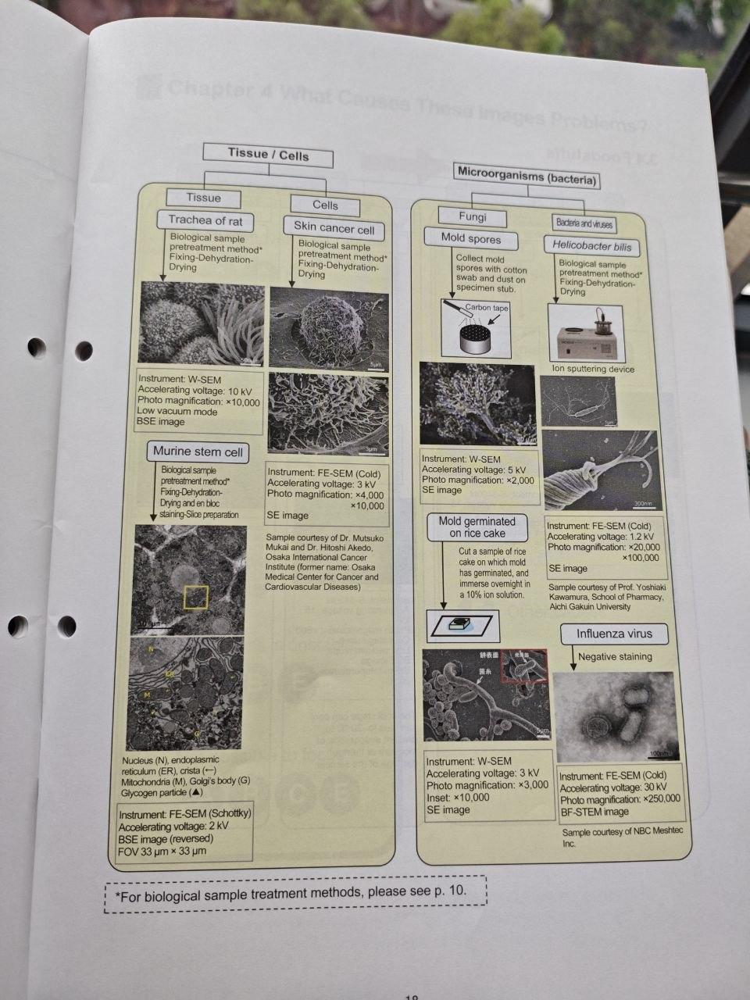
*p.18 — 3.3 Biological Samples: Rat Trachea Cilia, Cancer Cells, Murine Stem Cell Organelles, Bacteria, Virus STEM (Photo 77)*

| Sample Type | Pretreatment & Staining | Instrument & Conditions | Image Output & Visible Structures |
|-------------|-------------------------|-------------------------|-----------------------------------|
| **Rat Trachea Epithelium** | Glutaraldehyde fix -> Dehydration -> Critical Point Drying (CPD) | W-SEM (S-3400N)<br>10 kV, x10,000, Low Vacuum | BSE image revealing dense surface ciliated cells and goblet cell secretory openings. |
| **Human Skin Cancer Cell** | Chemical fixation -> CPD -> Pt Sputter coating | Cold FE-SEM<br>3 kV, x4,000 and x10,000 | Secondary electron image showing microvilli, filopodia, and membrane ruffles. |
| **Murine Embryonic Stem Cell** | En bloc heavy metal staining ($OsO_4$ + Uranyl Acetate + Lead) -> Resin ultrathin section | Schottky FE-SEM<br>2 kV, FOV 33 x 33 μm | Inverted compositional BSE image resolving Nucleus (N), Endoplasmic Reticulum (ER), Mitochondrial Cristae (M), Golgi Apparatus (G), and Glycogen granules. |
| **Fungal Spores & Rice Cake Mold** | Cotton swab pickup on carbon tape / 10% ion solution immersion | W-SEM (S-3400N)<br>3 to 5 kV, x2,000 to x10,000 | Secondary electron images showing conidiophores and spore chain micro-ornamentation. |
| **Pathogenic Bacteria (*Helicobacter bilis*)** | Fixation -> CPD -> Ion sputter coating | Cold FE-SEM<br>1.2 kV, x20,000 and x100,000 | Ultra-high resolution SE image resolving outer membrane surface and flagella fibers. |
| **Influenza Virus Particles** | Negative staining on carbon support film | Cold FE-SEM (STEM Mode)<br>30 kV, x250,000 | Bright-Field STEM image resolving hemagglutinin and neuraminidase spike glycoproteins. |

---

## 3.4 Foodstuffs (p. 19)

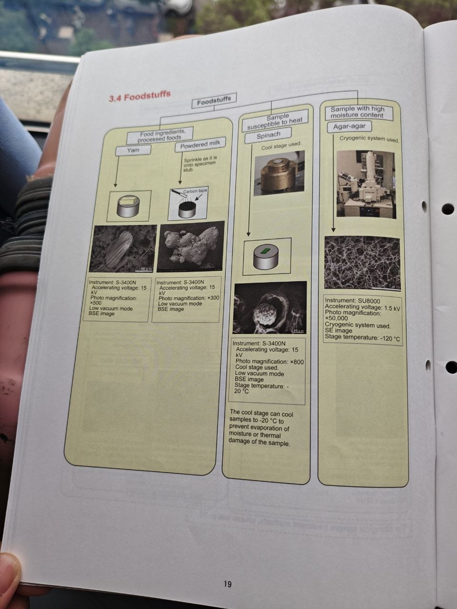
*p.19 — 3.4 Foodstuffs: Yam Starch Granules, Powdered Milk, Spinach Cryo-Preservation, Agar Gel Cryo-SEM (Photo 78)*

### Food Science Characterization

```
[Foodstuff / Agricultural Specimen]
       │
       ├─► [Dry Powders / Starches: Yam Starch & Powdered Milk]
       │        ├─► Sprinkling method on carbon tape -> Low-Vacuum Mode
       │        └─► S-3400N | 15 kV | x300 & x500 | Low-Vac BSE (spherical lipid/protein emulsions)
       │
       ├─► [Hydrated Vegetable Tissue: Spinach Leaf Stomata]
       │        ├─► Cool Stage (-20°C) in Low-Vacuum (60 Pa)
       │        └─► S-3400N | 15 kV | x800 | Preserves open stomata guard cells without wilting
       │
       └─► [High-Moisture Hydrogel: Agar-Agar Polymer Matrix]
                ├─► Cryogenic Slush Nitrogen Freezing (-120°C Cryo-Stage)
                └─► SU8000 FE-SEM | 1.5 kV | x50,000 | High-mag SE image of 3D hydrated fibrillar gel network
```

---

# Chapter 4 — What Causes These Image Problems? (pp. 20–24)

## 4.0 Symptom vs. Cause Diagnostic Cross-Reference Chart (p. 20)


*p.20 — Chapter 4: Image Problems Matrix — Phenomenon vs. Root Cause Diagnosis (Photo 76)*

### Diagnostic Cross-Reference Matrix

| Observed Image Defect / Phenomenon | Cause A: Charge-Up | Cause B: Contamination | Cause C: Beam Damage | Cause D: External Disturbance | Cause E: Mechanical / Optical |
|------------------------------------|:------------------:|:----------------------:|:--------------------:|:-----------------------------:|:------------------------------:|
| **Image moves / drifts continuously** | **YES** | - | **YES** | **YES** | - |
| **Fine structure cannot be discerned / poor resolution** | **YES** | **YES** | **YES** | - | - |
| **Image is distorted / stretched / sheared** | **YES** | - | **YES** | **YES** | **YES** |
| **Image fluctuates / periodic horizontal wavy bands** | **YES** | - | - | - | **YES** |
| **Brightness is unstable / flash glare / blackouts** | **YES** | **YES** | - | - | **YES** |
| **Cannot achieve sharp focus / abnormal astigmatism** | **YES** | **YES** | **YES** | - | **YES** |

---

## 4.1 Cause A — Charge-Up Phenomenon (p. 21)


*p.21 — Cause A: Charge-Up Mechanisms, Manifestations, and Countermeasures (Photo 75)*

### Electrical Current Balance Equation
At the electron beam impact zone on a specimen surface:

$$I_p = I_{SE} + I_{BSE} + I_{absorbed}$$

- $I_p$: Incident primary electron probe current.
- $I_{SE}$: Emitted secondary electron current.
- $I_{BSE}$: Emitted backscattered electron current.
- $I_{absorbed}$: Absorbed specimen current flowing to ground.

1. **Conductive Specimen**: $I_{absorbed}$ flows freely through the grounded stub, keeping surface potential at $0 	ext{ V}$.
2. **Insulating Specimen ($I_p 
eq I_{SE} + I_{BSE}$)**:
   - **Negative Charge-Up ($I_p > I_{SE} + I_{BSE}$)**: Electrons accumulate within the sample dielectric matrix, generating a strong localized negative potential (-100 to -1000 V). This retards incoming electrons, prematurely deflects the beam, and causes catastrophic burst discharges (bright flare bands and geometric shear).
   - **Positive Charge-Up ($I_p < I_{SE} + I_{BSE}$)**: More electrons leave than enter, creating a positive surface potential (+1 to +10 V). This pulls low-energy secondary electrons back into the sample, making the region appear excessively dark with severe loss of stereoscopic relief.

### 4 Manifestations of Charge-Up
1. **Uneven Brightness**: Region appears abnormally dark or over-saturated.
2. **Bright Horizontal Streak Lines**: Spontaneous dielectric breakdown and field emission flares.
3. **Severe Image Distortion & Shear**: Local electrostatic fields deflect the scanning primary beam off-trajectory.
4. **Loss of Stereoscopic 3D Depth**: Absence of topographical shadow contrast.

### Engineering Countermeasures for Charge-Up
1. **Reduce Accelerating Voltage ($V_{acc}$)**: Operate at the $E_2$ crossover voltage (typically 0.5 to 1.5 kV) where total emission coefficient is unity ($\sigma = \delta + \eta = 1.0$).
2. **Decrease Probe Current ($I_p$)**: Increase condenser lens excitation or select a smaller objective aperture (e.g., 30 μm).
3. **Apply Conductive Sputter Coating**: Deposit 2 to 5 nm of Pt, Au, or carbon.
4. **Fast Frame Scanning with Image Integration**: Superimpose 16 to 128 TV-rate frames to prevent charge accumulation between scans.
5. **Utilize Low-Vacuum / Variable Pressure Mode (VP-SEM)**: Introduce 10 to 200 Pa of residual gas to neutralize surface charges.
6. **Energy-Filtered Low-Voltage BSE Detection**: Suppress secondary electrons and collect high-energy backscattered electrons via the $E 	imes B$ filter.

---

## 4.2 Cause B — Hydrocarbon Contamination (p. 22)


*p.22 — Cause B: Hydrocarbon Contamination Dynamics and Suppression Methods (Photo 73)*

### Mechanism of Contamination
Volatile hydrocarbon gas molecules originating from mounting adhesives, conductive carbon paste solvents, fingerprints, or residual chamber vacuum grease migrate across the sample surface. When struck by the high-density electron beam, these organic molecules dissociate and polymerize into an insulating amorphous carbonaceous film. This dark contamination box:
- Suppresses low-energy secondary electron escape, rendering the field dark.
- Causes loss of fine surface topographic details at high magnification (> x50,000).

### Beam Waiting Time & Synchronous Scan Delay
The prominent dark band on the left margin of scanned images arises from power supply phase synchronization (50/60 Hz mains sync), where the beam pauses at the start of each line before scanning. **Countermeasure**: Activate the SEM **Beam Blanking Deflection Mechanism** during flyback and idle intervals.

### Countermeasures for Contamination
1. Minimize carbon paste volume; allow adhesives to bake/outgas completely before chamber insertion.
2. Pre-evacuate and degas specimens in a dedicated turbo-pumped load-lock station.
3. Rapidly focus and avoid prolonged static rastering on a single micro-area at extreme magnifications.
4. Employ an anti-contamination liquid nitrogen Cold Trap or Plasma De-contaminator (Evactron / downstream oxygen plasma cleaner).

---

## 4.3 Cause C — Thermal Beam Damage & Cause D — External Disturbances (p. 23)


*p.23 — Cause C: Thermal/Radiation Beam Damage & Cause D: Acoustic Vibration and Stray Magnetic Fields (Photo 74)*

### Cause C — Beam Damage
Thermal heating, bond breakage, radiolysis, and mass loss occur under intense electron irradiation in polymers, organic films, and biological samples.

**Countermeasures**:
- Lower probe current ($I_p$) and reduce accelerating voltage ($V_{acc}$).
- Coat with a conductive metallic film (Pt, Au) to enhance thermal dissipation.
- Cool the sample using a liquid nitrogen Cryo-Stage (-120°C to -160°C) or Peltier Cool Stage (-20°C).

### Cause D — External Disturbances

| Disturbance Type | Visual Symptom on SEM Screen | Dominant Causes | Countermeasures |
|------------------|------------------------------|-----------------|-----------------|
| **Mechanical / Acoustic Vibration** | Fine saw-tooth jagged edges, blurred edges at high magnification, periodic image doubling. | Air-conditioning drafts, roughing pumps, building floor vibration, elevator machinery. | - Install pneumatic active vibration isolation tables.<br>- Route high-voltage cables without wall contact.<br>- Shield column from direct HVAC air currents. |
| **Stray AC Magnetic Fields (50/60 Hz)** | Sinusoidal image distortion, horizontal wave ripples, shifting vertical grid lines. | Power distribution transformers, high-current busbars, subway/train lines, nearby chillers. | - Shorten working distance ($WD = 3 	ext{ to } 5 	ext{ mm}$).<br>- Increase condenser lens excitation.<br>- Install active Helmholtz tri-axial magnetic field cancellation coils. |

---

## 4.4 Cause E — Mechanical & Optical Alignment Issues (p. 24)


*p.24 — Cause E: Operational, Mechanical, and Column Alignment Faults (Photo 72)*

| Symptom | Root Cause | Engineering Solution |
|---------|------------|----------------------|
| **Specimen physically drifts** | Stub fixing screw loose; stage clamp not fully seated; sample expanding/contracting thermally. | Re-seat specimen holder firmly; tighten locking screws; allow temperature equilibration. |
| **Image fluctuates / low S/N** | Low probe current; misaligned condenser aperture; operating lower detector at short WD on semi-in-lens optics. | Re-align aperture centered on optical axis; switch to Upper (In-Lens) detector at short WD. |
| **Cannot obtain sharp focus** | Optical axis misaligned; objective aperture contaminated with insulating grime; excessive beam astigmatism. | Perform electron gun tilt/shift alignment; clean or replace platinum objective aperture; perform precision Stigmator X/Y compensation. |

---

# Chapter 5 — Types of SEM (pp. 25–26)

## 5.1 Field Emission SEM (FE-SEM) Lineup (p. 25)

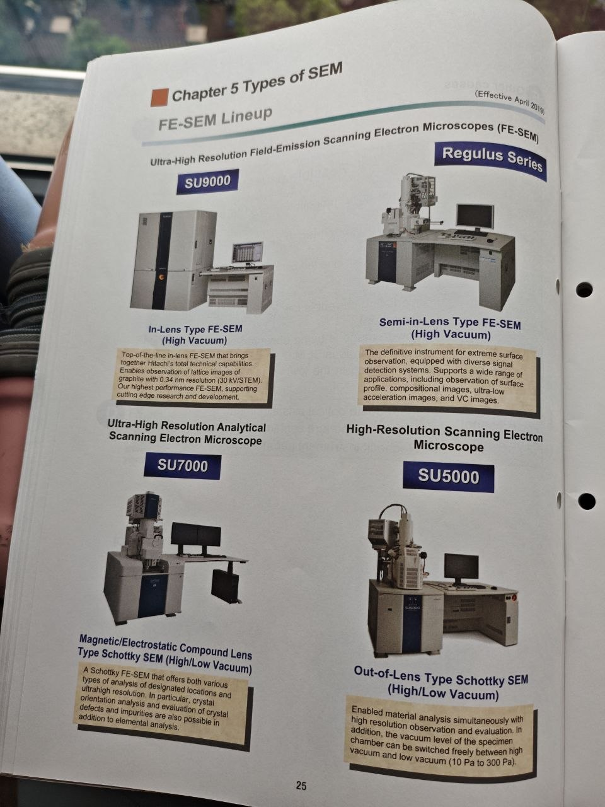
*p.25 — Chapter 5: Ultra-High Resolution FE-SEM Lineup (In-Lens, Semi-In-Lens, Compound Lens, Out-of-Lens) (Photo 71)*

### Ultra-High Resolution Cold & Schottky FE-SEM Instruments

| Model | Lens Architecture | Electron Source | Key Features & Applications |
|-------|-------------------|-----------------|-----------------------------|
| **SU9000** | **In-Lens Type** | Cold Field Emission (CFE) | Hitachi flagship instrument. Specimen placed inside the objective pole piece gap. Achieves **0.34 nm lattice resolution** (30 kV STEM / High-resolution TEM grid). Ideal for graphene, atomic clusters, catalysts, and advanced semiconductor research. |
| **Regulus Series**<br>(Regulus 8240 / 8230 / 8100) | **Semi-in-Lens Type** | Cold Field Emission (CFE) | The definitive ultra-high resolution instrument for extreme surface topography. Features Upper/Lower multi-detector SE/BSE filtration, deceleration mode, and voltage contrast (VC) inspection for 3D NAND, FinFETs, and advanced materials. |
| **SU7000** | **Electrostatic-Magnetic Compound Lens** | Schottky Field Emission | Combines high-resolution imaging with extreme analytical beam currents (up to 200 nA). Capable of high-speed EDX, WDX, EBSD crystallographic mapping, and Cathodoluminescence (CL) spectroscopy on large specimens. |
| **SU5000** | **Out-of-Lens Type** | Schottky Field Emission | Multi-purpose analytical FE-SEM featuring large specimen chamber and seamless switching between High Vacuum and Variable Pressure (Low Vacuum: 10 to 300 Pa). |

---

## 5.2 Hi-SEM & Tabletop SEM Lineup (p. 26)


*p.26 — Chapter 5: Tungsten Hi-SEM & Tabletop Microscope Lineup (Photo 69)*

### Tungsten Filament & Tabletop Microscopes

| Model | Classification | Vacuum System | Features & Industrial Capabilities |
|-------|----------------|---------------|-----------------------------------|
| **SU3800** | Out-of-Lens Analytical SEM | High & Low Vacuum | High-functionality automated SEM with newly developed continuous optical navigation (SEM-MAP) and wide field of view. |
| **SU3900** | Large-Chamber Analytical SEM | High & Low Vacuum | Extra-large specimen chamber accommodating massive industrial specimens up to **300 mm diameter**, 130 mm height, and **5 kg weight**, with 150 x 150 mm stage travel. |
| **FlexSEM 1000II** | Compact Tabletop SEM | High & Low Vacuum | Combines ultra-compact footprint with **4.0 nm resolution** and automated pre-set alignments for beginner to expert operators. |
| **TM4000Plus** | Tabletop Miniscope | Multi-Vacuum (Charge-Free) | Rapid pump-down enabling image observation in **under 3 minutes** with zero sample preparation; equipped with multi-segment BSE detector and intuitive reporting. |

---
# Chapter 6 — Frequently Asked Questions About Scanning Electron Microscopy (pp. 27–94)

## Master Index of Chapter 6 (p. 27)


*p.27 — Chapter 6: Frequently Asked Questions — Technical Index (Photo 70)*

---

## 6.1 Electron Beam Formation (pp. 30–36)

### 6.1.1 How is a fine electron beam formed? & 6.1.2 How can an even finer beam be obtained? (p. 30)


*p.30 — 6.1.1 Electron Optical Demagnification & 6.1.2 Finer Probe Optimization Principles (Photo 67)*

The electron beam emitted from the cathode source (having virtual source diameter $d_0$) passes through a multi-stage electromagnetic demagnification column comprising the first condenser lens ($C_1$), second condenser lens ($C_2$), and objective lens ($OL$). Each lens forms a demagnified intermediate crossover image with demagnification ratio $M_i < 1$.

The geometric electron probe diameter $d_p$ focused onto the specimen is given by:

$$d_p = M_1 	imes M_2 	imes M_{OL} 	imes d_0$$

To produce an even finer probe diameter for ultra-high spatial resolution:
1. **Increase Demagnification Power**: Apply stronger condenser lens excitation to reduce intermediate crossover size.
2. **Employ High-Brightness Field Emission Gun**: FE sources have an ultra-small virtual source size ($d_0 pprox 3 	ext{ to } 30 	ext{ nm}$) compared to thermionic tungsten filaments ($d_0 pprox 20 	ext{ to } 50 \ \mu	ext{m}$), allowing nanometer probes at usable beam currents.
3. **Minimize Working Distance (WD)**: Shortens objective lens focal length $f_0$, reducing spherical and chromatic aberration coefficients.

---

### 6.1.3 What kinds of electron guns are used in SEMs? (p. 31)


*p.31 — 6.1.3 Electron Gun Types: Tungsten Hairpin, LaB6, Schottky Thermal-Field, and Cold Field Emission (Photo 68)*

1. **Thermionic Tungsten (W) Gun**: A tungsten hairpin filament heated resistively to ~2,800 K overcomes the metallic work function ($\Phi pprox 4.5 	ext{ eV}$) via pure thermionic emission.
2. **Lanthanum Hexaboride ($LaB_6$) Gun**: Single crystal $LaB_6$ cathode operated at ~1,850 K. Its lower work function ($\Phi pprox 2.7 	ext{ eV}$) delivers 5 to 10 times higher brightness than tungsten.
3. **Schottky Field Emission (SE) Gun**: A single-crystal tungsten tip coated with Zirconium Oxide ($ZrO/W\langle 100
angle$) operated at ~1,800 K in an intense electrostatic extraction field. The Schottky effect lowers the potential barrier, combining high brightness with excellent beam current stability.
4. **Cold Field Emission (CFE) Gun**: A nanometer-sharp tungsten single crystal tip ($W\langle 310
angle$) operated at room temperature (300 K). High extraction electric field ($E > 10^7 	ext{ V/cm}$) induces quantum mechanical tunneling of electrons through the barrier without heating.

---

### 6.1.4 Comparison of Electron Gun Characteristics (p. 32)


*p.32 — 6.1.4 Performance Matrix of Thermionic, Schottky, and Cold Field Emission Sources (Photo 66)*

| Performance Parameter | Thermionic Tungsten (W) | Lanthanum Hexaboride ($LaB_6$) | Schottky Field Emission (SE) | Cold Field Emission (CFE) |
|-----------------------|:-----------------------:|:------------------------------:|:----------------------------:|:--------------------------:|
| **Cathode Material / Form** | W hairpin wire (100 μm dia) | Single crystal $\langle 100
angle$ rod | ZrO/W $\langle 100
angle$ faceted emitter | W $\langle 310
angle$ etched single crystal tip |
| **Operating Temperature** | 2,700–2,800 K | 1,800–1,900 K | 1,750–1,800 K | **Room Temperature (300 K)** |
| **Emission Mechanism** | Thermal thermionic | Thermal thermionic | Thermal-field assisted tunneling | Pure electrostatic field emission |
| **Virtual Source Size ($d_0$)** | 20–50 μm | 10–20 μm | 15–30 nm | **3–5 nm** |
| **Brightness ($B$, $	ext{A/cm}^2	ext{sr}$)** | $\sim 10^5$ | $\sim 10^6$ | $\sim 10^7 - 10^8$ | **$\sim 10^9$** |
| **Energy Spread ($\Delta E$)** | 1.5–3.0 eV | 1.0–2.0 eV | 0.5–0.8 eV | **0.3–0.4 eV** |
| **Required Gun Vacuum** | $10^{-3} - 10^{-4} 	ext{ Pa}$ | $10^{-5} 	ext{ Pa}$ | $10^{-6} - 10^{-7} 	ext{ Pa}$ | **$10^{-8} - 10^{-9} 	ext{ Pa}$ (UHV)** |
| **Cathode Service Life** | 50–100 hours | 500–1,000 hours | > 1–2 years | > 3–5 years |
| **Probe Current Stability** | High (0.1%/hr) | High (0.2%/hr) | Excellent (< 0.5%/hr) | Moderate (decay requiring flash) |
| **Low-kV High-Mag Suitability** | Low | Medium | High | **Superior / World-Class** |

---

### 6.1.5 Configuration and Operating Principle of Electromagnetic Lenses (p. 33)


*p.33 — 6.1.5 Electromagnetic Lens Architecture: Magnetic Circuit, Pole Pieces, and Lorentz Helical Focusing (Photo 65)*

Electromagnetic lenses consist of a rotationally symmetric copper coil encased in a high-permeability soft iron yoke with precision upper and lower pole pieces. Direct current through the coil generates an intense, axially symmetric magnetic field $B_z(r, z)$ focused across the non-magnetic brass spacer gap.

Electrons moving axially with velocity $v_z$ experience the Lorentz force:

$$ec{F} = -e (ec{v} 	imes ec{B})$$

The radial field component $B_r$ imparts an azimuthal velocity $v_	heta$, which interacts with the axial field $B_z$ to generate a centripetal force driving the electrons toward the optical axis in a helical spiraling trajectory, focusing them into a sharp spot.

---

### 6.1.6 Lens Aberrations and Ultimate Probe Size Limits (pp. 34–35)

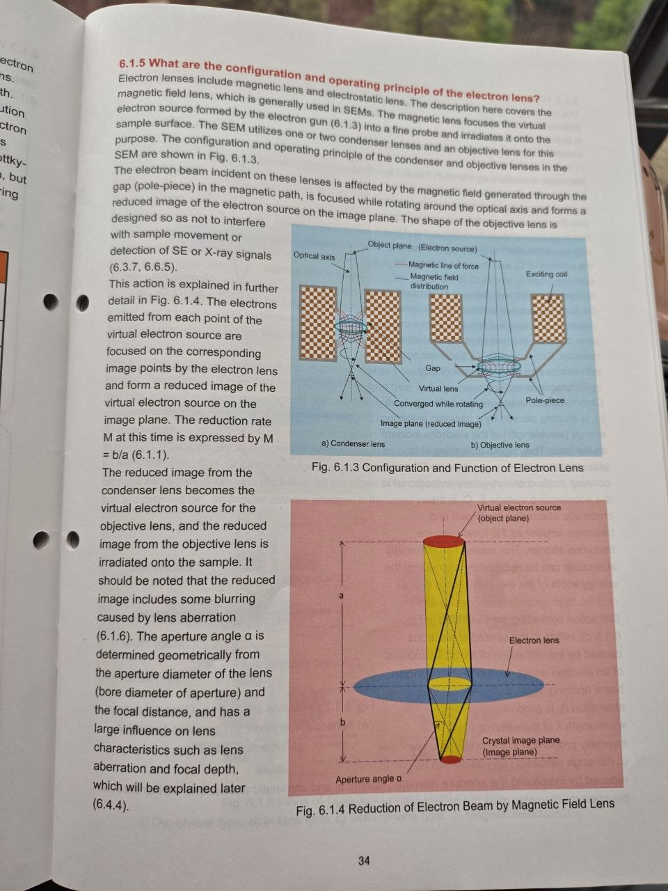
*p.34 — 6.1.6 Lens Aberration Mechanisms: Spherical Aberration, Chromatic Aberration, and Wave Diffraction (Photo 63)*

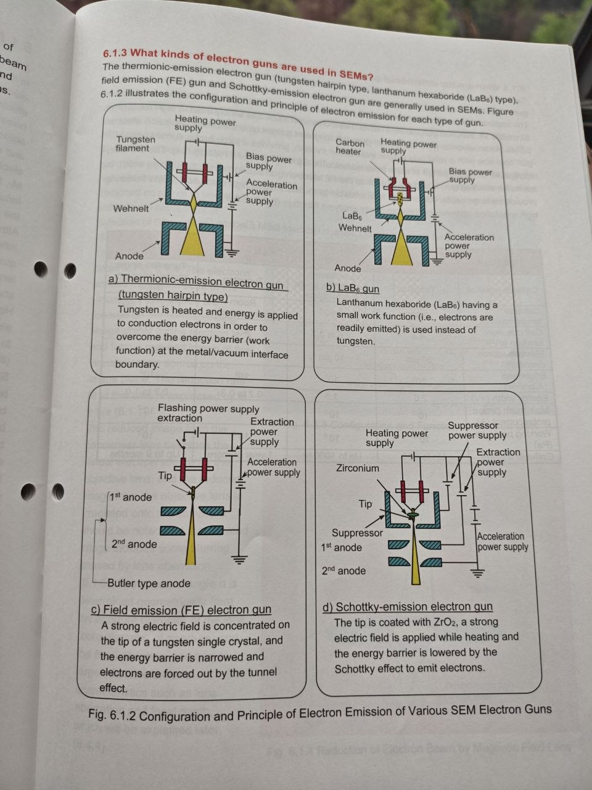
*p.35 — Total Probe Diameter Equation and Optimum Aperture Semi-Angle $lpha_{opt}$ (Photo 64)*

The final electron probe spot diameter $d_{total}$ on the sample is determined by the root-sum-square quadrature of four fundamental optical contributions:

$$d_{total} = \sqrt{d_g^2 + d_d^2 + d_s^2 + d_c^2}$$

1. **Gaussian Geometric Source Image ($d_g$)**:
   $$d_g = rac{2}{\pi} \sqrt{rac{I_p}{B}} rac{1}{lpha}$$
2. **Diffraction Aberration ($d_d$)** (de Broglie wave limit):
   $$d_d = 0.61 rac{\lambda}{lpha} = 0.61 rac{1.23}{lpha \sqrt{V_{acc}}} \quad (	ext{nm})$$
3. **Spherical Aberration ($d_s$)** (Peripheral rays focus closer than axial rays):
   $$d_s = rac{1}{2} C_s lpha^3$$
4. **Chromatic Aberration ($d_c$)** (Energy spread $\Delta E$ causes focal dispersion):
   $$d_c = C_c rac{\Delta E}{E_0} lpha$$

> **Low-kV Performance Dominance**: At low landing energies ($V_{acc} < 3 	ext{ kV}$), **chromatic aberration $d_c$ is the dominant limiting factor**. Cold Field Emission instruments, with their ultra-narrow energy spread ($\Delta E pprox 0.3 	ext{ eV}$), maintain sub-nanometer beam diameters where thermionic sources degrade to $> 20 	ext{ nm}$.

---

### 6.1.7 Objective Lens Geometries in SEM (p. 36)


*p.36 — 6.1.7 Objective Lens Types: Out-Lens, Semi-In-Lens, In-Lens, and Compound Lens (Photo 62)*

```
(A) Out-of-Lens (Conventional)      (B) Semi-in-Lens (Snorkel)
       [ Upper Pole Piece ]                [ Upper Pole Piece ]
       [ Lower Pole Piece ]                [ Lower Pole Piece ]
       ====================                -------------------- (Leakage Magnetic Field)
          Specimen Stub                       [ Specimen Stub ]
   (Large samples, free tilt)             (Ultra-high res + large wafers)

(C) In-Lens (Flagship SU9000)       (D) Compound Magnetic-Electrostatic (SU7000)
       [ Upper Pole Piece ]                [ Magnetic Pole Piece ]
       ---[ Specimen ]---                 ===== Electrostatic Retarding Ring =====
       [ Lower Pole Piece ]                [ Specimen Stub ]
   (Ultimate lattice res <0.4 nm)         (High analytical current + low-kV res)
```

---

## 6.2 Evacuation Systems (pp. 37–38)

### 6.2.1 Why is a High Vacuum Required? & 6.2.2 Differential Pumping (p. 37)

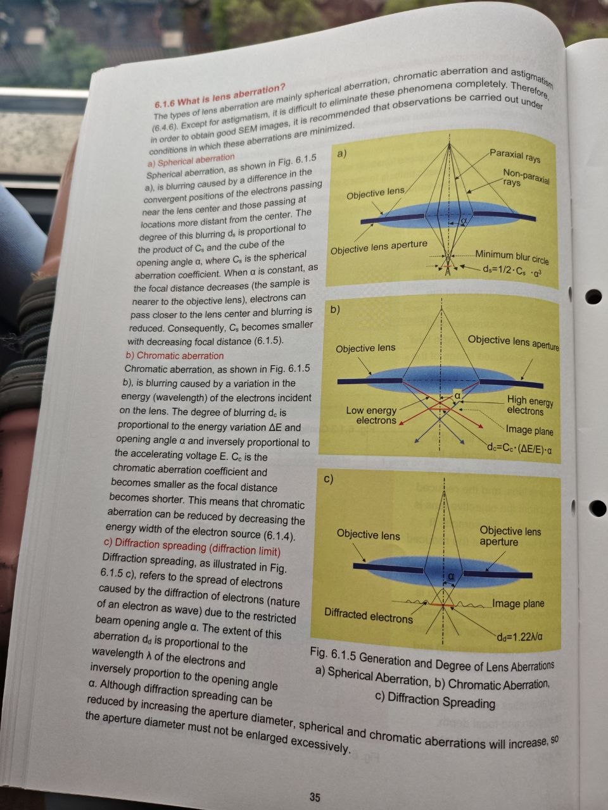
*p.37 — 6.2.1 Necessity of Vacuum & 6.2.2 Multi-Stage Differential Evacuation Architecture (Photo 61)*

1. **Prevent Electron Beam Scattering**: Gas molecules scatter electrons, broadening the probe and destroying resolution. High vacuum maintains electron mean free path $\lambda_{mfp} > 10 	ext{ m}$ (far exceeding column height).
2. **Prevent Filament Oxidation & Electrical Breakdown**: High temperatures (2,800 K) cause instantaneous filament burnout in air; high acceleration fields (> 10 kV) cause high-voltage discharge arcing at pressures $> 10^{-2} 	ext{ Pa}$.
3. **Eliminate Surface Contamination**: Suppresses deposition of organic hydrocarbon polymers.

```
[Gun Chamber]        P ~ 10^-8 to 10^-9 Pa  (Sputter Ion Pumps SIP 1 & 2)
      │   Aperture 1 (Orifice dia 0.1 mm)
[Column Chamber]     P ~ 10^-5 to 10^-6 Pa  (SIP 3 or Turbo Molecular Pump TMP)
      │   Aperture 2 (Orifice dia 0.3 mm)
[Specimen Chamber]   P ~ 10^-4 Pa (High Vac) / 10–300 Pa (Low Vac) (TMP + Dry Scroll / Rotary)
```

---

### 6.2.3 Vacuum Pump Types & Maintenance (p. 38)

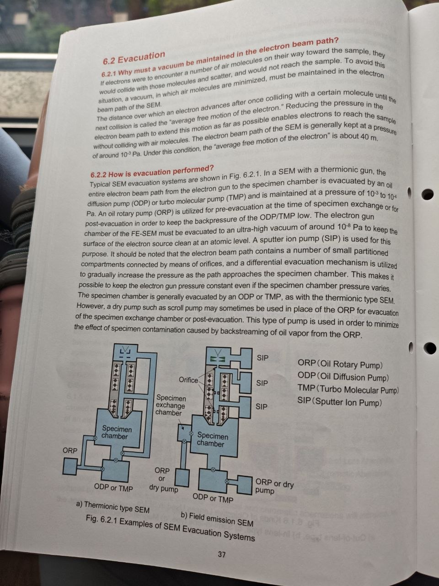
*p.38 — 6.2.3 Vacuum Pump Characteristics, Pressure Regimes, and Maintenance Cycles (Photo 59)*

| Pump Type | Operating Pressure Range | Pumping Mechanism | Maintenance & Operational Notes |
|-----------|:------------------------:|-------------------|--------------------------------|
| **Rotary Vane Pump (RP)** | $10^5 	ext{ to } 10^{-1} 	ext{ Pa}$ | Mechanical rotating vane oil seal | Check oil level and color monthly; change oil yearly; oil mist trap filter replacement. |
| **Dry Scroll Pump** | $10^5 	ext{ to } 10^{-1} 	ext{ Pa}$ | Dual orbiting dry scrolls (oil-free) | Clean, hydrocarbon-free roughing; replace scroll tip seals every 1–2 years. |
| **Turbo Molecular Pump (TMP)** | $10^{-1} 	ext{ to } 10^{-7} 	ext{ Pa}$ | High-speed turbine blades (60,000–90,000 RPM) | Requires backing roughing pump; periodic bearing overhaul every 20,000–40,000 operating hours. |
| **Sputter Ion Pump (SIP)** | $10^{-4} 	ext{ to } 10^{-9} 	ext{ Pa}$ | Titanium getter sputtering + Penning discharge | Vibration-free Ultra-High Vacuum (UHV) for FE guns; periodic high-vacuum bakeout regeneration. |

---

## 6.3 Generation, Detection and Use of SEM Signals (pp. 39–49)

### 6.3.1 Interaction Volume & Emitted Signals (p. 39)

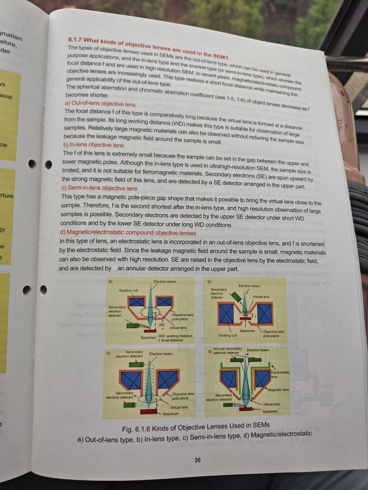
*p.39 — 6.3.1 Interaction Volume: Spatial Distribution of SE, BSE, X-rays, Auger, and CL Signals (Photo 60)*

When an accelerated primary electron beam strikes a solid sample, elastic and inelastic scattering create a teardrop-shaped **interaction volume**. The penetration depth ($R_{KO}$, Kanaya-Okayama range) scales with accelerating voltage ($V_{acc}^{1.67}$) and inverse density ($
ho^{-1}$):

```
Primary Beam (E0 = 15 keV)
  ││
  ▼▼
==================================== (Specimen Surface)
│  [Auger Electrons]      Escape depth < 1 nm (Surface chemical states)
│  [Secondary Electrons]  Escape depth: 1 - 10 nm (High-resolution topography)
│  ───────────────────────────────────────────────────
│  [Backscattered Electrons] Escape depth: 0.1 - 1.0 μm (Atomic number Z contrast)
│  ───────────────────────────────────────────────────
│  [Characteristic X-Rays]  Interaction depth: 1.0 - 3.0 μm (EDX elemental analysis)
│  [Continuum Bremsstrahlung]
│  [Cathodoluminescence CL] Visible / UV / IR photons from bandgap transitions
└─────────────────────────────────────────────────────
```

---

### 6.3.2 Production Mechanism of Secondary Electrons (p. 40)

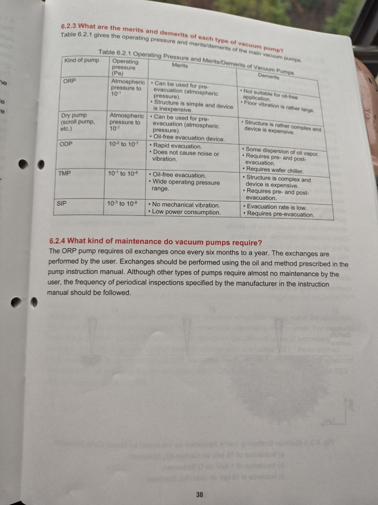
*p.40 — 6.3.2 Production Mechanism: Inelastic Coulomb Scattering and Conduction Band Ionization (Photo 58)*

Primary electrons transfer energy via inelastic Coulomb scattering to loosely bound outer-shell and conduction-band electrons in the specimen atoms. The ionized electrons migrate toward the surface, losing kinetic energy via electron-electron and phonon collisions. Only electrons generated within the mean escape depth ($\lambda_{SE} pprox 1 	ext{ to } 10 	ext{ nm}$) possessing kinetic energy exceeding the surface work function ($\Phi$) can escape into vacuum as **secondary electrons ($E \le 50 	ext{ eV}$, peak energy $\sim 2 	ext{ to } 5 	ext{ eV}$)**.

---

### 6.3.2 Classification of Secondary Electrons (SE1, SE2, SE3, SE4) (p. 41)

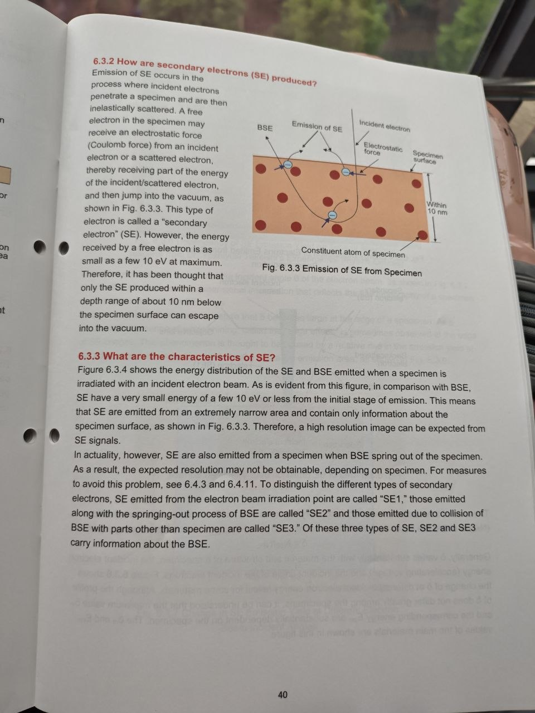
*p.41 — 6.3.2 SE Sub-Types: High-Resolution SE1, BSE-Induced SE2, Chamber-Induced SE3, and Aperture SE4 (Photo 57)*

- **$SE_1$ (High-Resolution Topographic Component)**: Generated directly at the primary electron beam entry point within an escape radius $\le 1 	ext{ nm}$. Carries the highest spatial resolution.
- **$SE_2$ (Background Topographic & Compositional Component)**: Generated as high-energy backscattered electrons exit the specimen surface over a wider diameter.
- **$SE_3$ (Chamber Wall Component)**: Generated when energetic BSE strike the lower pole piece and specimen chamber walls.
- **$SE_4$ (Stray Column Component)**: Produced by primary beam electrons scraping beam-limiting apertures along the column.

---

### 6.3.4 Everhart-Thornley (E-T) Secondary Electron Detector (p. 42)

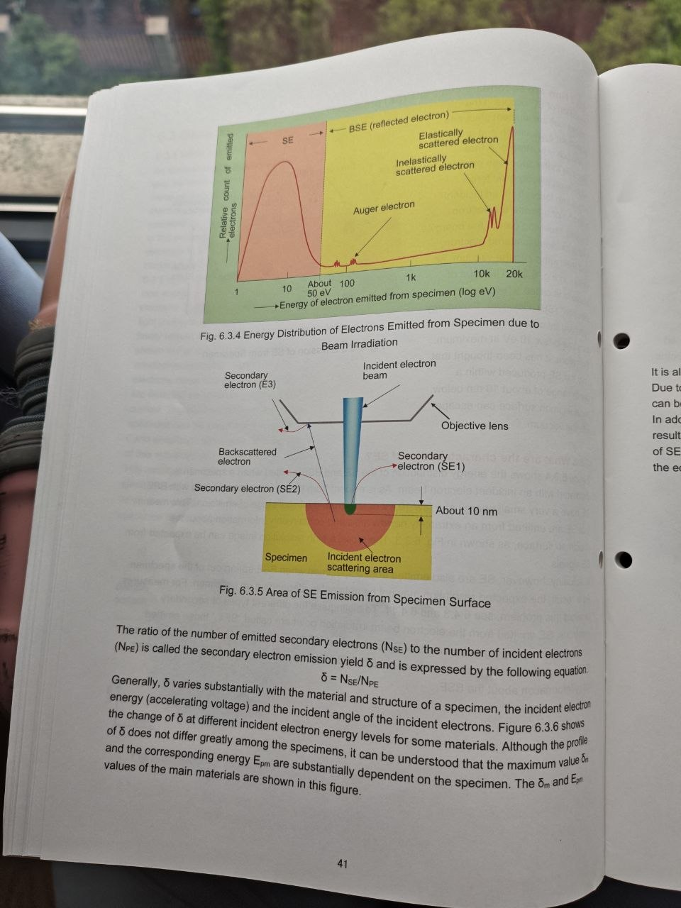
*p.42 — 6.3.4 Everhart-Thornley Scintillator-Photomultiplier Secondary Electron Detector (Photo 55)*

1. **Collector Faraday Cage Grid (+200 to +300 V)**: Generates a gentle electrostatic collection field that bends low-energy secondary electrons (< 50 eV) into the detector cage without distorting the primary beam trajectory.
2. **Phosphor Scintillator (+10 kV)**: Strongly accelerates incoming SEs into a scintillator disc (doped YAG single crystal or P47 phosphor), converting each electron into multiple light photons.
3. **Light Pipe & Photomultiplier Tube (PMT)**: Transmits photons through a total internal reflection quartz light guide to a photocathode, emitting photoelectrons amplified by a dynode chain ($10^5 	ext{ to } 10^7$ gain) into a high-bandwidth video voltage signal.

---

### 6.3.6 Backscattered Electron Generation & Atomic Number Z-Dependence (p. 43)


*p.43 — 6.3.6 Backscattered Electron Generation: Elastic Nuclear Scattering and Atomic Number Z-Dependence (Photo 56)*

Backscattered electrons are primary electrons deflected through large angles ($> 90^\circ$) by elastic Rutherford Coulomb collisions with atomic nuclei, emerging from the sample with substantial kinetic energy ($> 50 	ext{ eV}$ up to incident energy $E_0$).

The backscattered electron yield coefficient ($\eta = I_{BSE} / I_p$) increases monotonically with atomic number $Z$:

$$\eta pprox rac{\ln Z}{6} - 0.25$$

- **Low-$Z$ Materials** (Carbon $Z=6$, Silicon $Z=14$): Low $\eta$ ($\sim 0.05 - 0.15$), appearing dark grey.
- **High-$Z$ Materials** (Gold $Z=79$, Lead $Z=82$): High $\eta$ ($\sim 0.45 - 0.50$), glistening brightly.

---

### 6.3.7 BSE Energy & Angular Distribution, Channeling Contrast (p. 44)


*p.44 — 6.3.7 BSE Energy Distribution, Angular Emission Profile, and Electron Channeling Contrast (Photo 54)*

- **BSE Energy Distribution**: Peaks strongly near the primary beam energy $E_0$, forming a broad spectrum from 50 eV to $E_0$.
- **Angular Distribution**: Follows a Lambertian cosine emission distribution ($\propto \cos 	heta$) on normal incidence; tilts toward forward-scattering at glancing incident angles.
- **Electron Channeling Contrast (ECC)**: For crystalline specimens, electron wave penetration depends on the angle of incidence relative to crystal lattice planes (Bragg angle $	heta_B$). Grains with differing crystallographic orientations appear with distinct contrast variations (channeling patterns).

---

### 6.3.8 4-Quadrant Solid-State BSE Detector (p. 45)


*p.45 — 6.3.8 BSE Detectors: 4-Quadrant Annular Solid-State PIN Diode & YAG Scintillator Detectors (Photo 53)*

Mounted directly below the objective lens pole piece surrounding the primary beam aperture:
- High-purity silicon PIN semiconductor photodiode segmented into 4 quadrants (A, B, C, D).
- When high-energy BSE penetrate the diode depletion layer, they generate electron-hole pairs ($3.6 	ext{ eV}$ per pair), producing a proportional current signal directly amplified by low-noise preamplifiers.

---

### 6.3.9 BSE Multi-Channel Signal Processing: Composition vs Topography (p. 46)

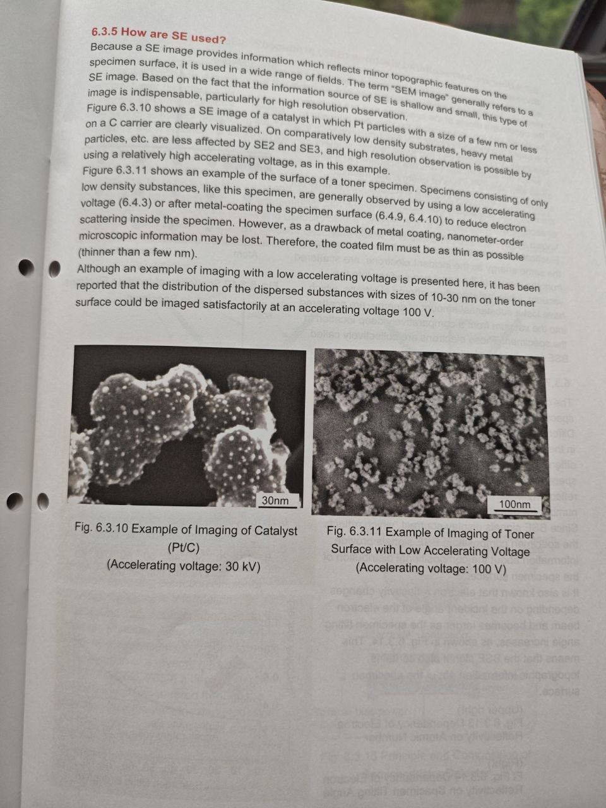
*p.46 — 6.3.9 BSE Multi-Channel Processing: Pure Compositional Mode (A+B+C+D) vs Topographical Mode (A-B) (Photo 51)*

```
[ 4-Quadrant BSE Detector Geometry ]
            [ Segment A ]  [ Segment B ]
                 O (Beam Center)
            [ Segment C ]  [ Segment D ]

- Compositional Mode (COMPO = A + B + C + D):
  Sums all four quadrant signals. Cancels directional shadows, revealing pure atomic number (Z) compositional variations.
- Topographical Mode (TOPO = [A + B] - [C + D]):
  Subtracts opposing quadrants, creating synthetic directional illumination that highlights surface relief, micro-texture, and scratches.
```

---

### 6.3.10 $E 	imes B$ (Wien Filter) Signal Separation Mechanism (p. 47)


*p.47 — 6.3.10 ExB (Wien Filter) Orthogonal Field Signal Separation for Upper In-Lens Detectors (Photo 52)*

In semi-in-lens and in-lens FE-SEMs, an orthogonal electric field ($ec{E}$) and magnetic field ($ec{B}$) are applied above the objective lens:
- **Primary Beam ($v_p pprox 10^8 	ext{ m/s}$ downward)**: Electrostatic and Lorentz forces balance exactly ($eE = ev_p B$). The primary beam passes through undeflected along the optical axis.
- **Secondary Electrons (low velocity upward)**: Electric and magnetic forces act in the same lateral direction, deflecting SEs sideways into the Upper In-Lens detector with 100% collection efficiency.

---

### Energy-Filtered Pure SE / Low-kV BSE Discrimination (p. 48)


*p.48 — Energy-Filtered SE/BSE Discrimination: Selective Topographic vs Compositional Imaging (Photo 50)*

By applying retarding grid biases in front of the Upper (UED) and Lower (LED) in-lens detectors:
- **Pure SE Imaging**: Reject high-energy BSE; collect only low-energy SE (< 50 eV) for extreme surface topography.
- **Pure Low-Voltage BSE Imaging**: Apply positive retarding threshold to reject SEs and collect backscattered electrons at landing energies down to 100 eV.

---

### Voltage Contrast (VC) and Magnetic Domain Imaging (p. 49)


*p.49 — Voltage Contrast (VC) in Semiconductor Devices and Magnetic Domain Contrast (Photo 48)*

1. **Voltage Contrast (VC)**:
   - **Positively Biased Regions (+5 V)**: Secondary electrons are pulled back by the electrostatic potential barrier, appearing **dark**.
   - **Grounded or Negatively Biased Regions (0 V / -5 V)**: Secondary electrons easily escape into the detector, appearing **bright**.
   - *Application*: Rapid localization of open-circuit via failures and short-circuits in semiconductor memory arrays.
2. **Magnetic Domain Contrast (Type I & Type II)**:
   - **Type I (Lorentz deflection in stray fields above surface)**: Maps magnetic domain leakage fields on recording heads and magnetic media.
   - **Type II (Internal Lorentz deflection of BSE)**: Maps internal magnetization vectors in ferromagnetic electrical steel sheets.

---

## 6.4 Viewing Conditions for Acquiring Good SEM Images (pp. 50–59)

### 6.4.1 Criteria of a "Good SEM Image" (p. 50)


*p.50 — 6.4.1 Essential Characteristics of a High-Quality SEM Image (Photo 49)*

A high-quality SEM image requires:
1. **Adequate Signal-to-Noise Ratio (S/N)**: Minimal pixel graininess.
2. **Optimal Focus and Zero Astigmatism**: Sharp, crisp edge definition in all directions.
3. **Proper Dynamic Range Contrast and Brightness**: Full histogram utilization without clipped highlights (saturation) or crushed shadows.
4. **Absence of Charging and Contamination Artifacts**: Zero geometric distortion, flare bands, or dark scan patches.

---

### 6.4.2 Accelerating Voltage & Condenser Lens Excitation (p. 51)

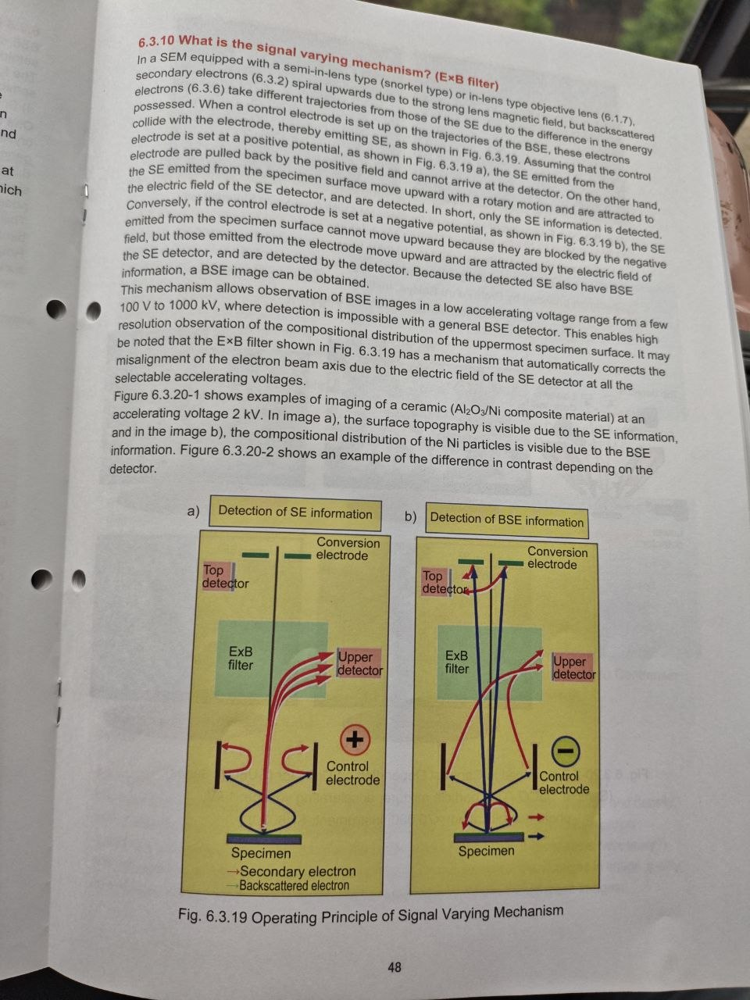
*p.51 — 6.4.2 Interplay of Accelerating Voltage ($V_{acc}$) and Condenser Lens Probe Current ($I_p$) (Photo 47)*

- **Increasing $V_{acc}$ (High Voltage: 15–30 kV)**: Decreases electron wavelength ($\lambda$) and chromatic aberration ($d_c$), sharpening the probe for high resolution, but increases interaction volume depth, masking ultra-fine surface details.
- **Decreasing $V_{acc}$ (Low Voltage: 0.5–2 kV)**: Restricts electron penetration to the top 5–20 nm, revealing true surface nanostructures and reducing charge accumulation on insulators.
- **Condenser Lens Excitation**: Strong excitation decreases probe diameter ($d_p$) for high resolution (low probe current $I_p \sim 5 	ext{ to } 20 	ext{ pA}$); weak excitation increases $I_p$ ($> 1 	ext{ nA}$) for high S/N ratio in EDX and EBSD analysis.

---

### 6.4.3 Accelerating Voltage Selection Guide by Sample Material (p. 52)

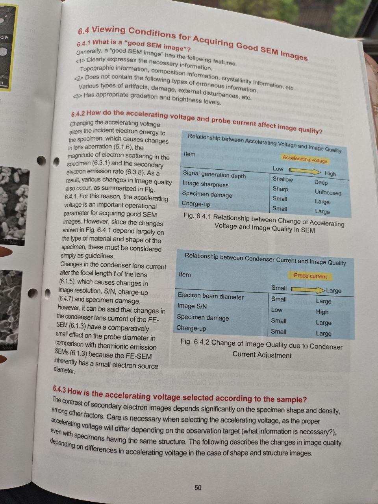
*p.52 — 6.4.3 Accelerating Voltage Selection Guidelines for Various Specimen Categories (Photo 46)*

| Specimen Category | Recommended Accelerating Voltage | Target Information & Operational Benefits |
|-------------------|:--------------------------------:|-------------------------------------------|
| **Metals, Hard Ceramics, Minerals** | 15 to 20 kV | High-resolution morphology; deep X-ray excitation for quantitative EDX. |
| **Semiconductor ICs, Thin Films** | 0.5 to 2.0 kV | Non-destructive surface imaging; shallow junction voltage contrast. |
| **Polymers, Plastics, Photoresists** | 0.5 to 1.5 kV | Eliminates thermal degradation, melting, and pattern shrinkage. |
| **Biological Tissues, Foodstuffs** | 1.0 to 5.0 kV (or Low Vacuum) | Prevents cell collapse and charging on un-coated specimens. |
| **Carbon Nanotubes, Graphene** | 0.5 to 1.0 kV (or 30 kV STEM) | Surface bundling in SE mode; atomic lattice rows in 30 kV STEM mode. |

---

### 6.4.4 Function of Objective Lens Aperture & Depth of Field (p. 53)

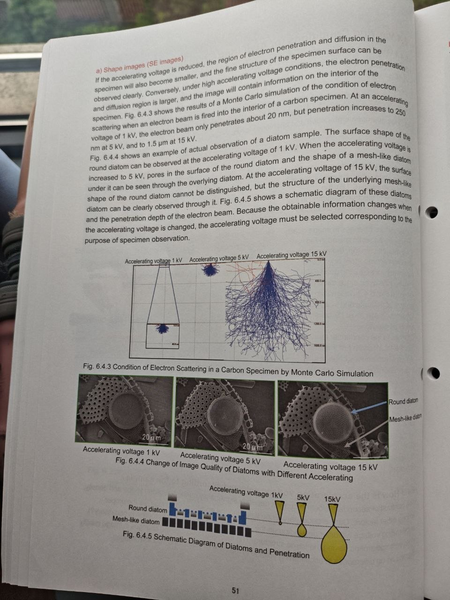
*p.53 — 6.4.4 Objective Lens Aperture: Balancing Beam Convergence Angle ($lpha$), Resolution, and Depth of Field (Photo 44)*

The movable platinum objective aperture defines the beam convergence semi-angle ($lpha$):
- **Small Aperture (20–30 μm)**: Decreases $lpha$, reducing spherical/chromatic aberrations and dramatically **increasing depth of field (DoF)**, ideal for 3D fracture surfaces.
- **Large Aperture (50–100 μm)**: Increases probe current ($I_p$) for high S/N in rapid scanning and analytical EDX mapping.

---

### 6.4.5 Working Distance (WD) Optimization (p. 54)


*p.54 — 6.4.5 Working Distance Optimization: Short WD for Resolution vs Long WD for Depth of Field (Photo 45)*

- **Short Working Distance ($WD = 1.5 	ext{ to } 5 	ext{ mm}$)**: Minimizes objective focal length ($f_0$), reducing aberration coefficients ($C_s, C_c$) for **maximum resolution at high magnification**.
- **Long Working Distance ($WD = 10 	ext{ to } 30 	ext{ mm}$)**: Decreases beam convergence angle ($lpha$), providing **large depth of field** and large field of view at low magnifications, and proper take-off angle for EDX detectors.

---

### 6.4.6 Astigmatism Compensation (Stigmator X/Y Alignment) (p. 55)


*p.55 — 6.4.6 Beam Astigmatism: Asymmetric Distortion and Octupole Stigmator Compensation (Photo 43)*

Astigmatism occurs when the objective lens magnetic field lacks rotational symmetry due to pole piece machining tolerances, aperture contamination, or asymmetric charging.
- **Visual Symptom**: The image stretches or smears diagonally in one direction when passing through under-focus, and stretches orthogonally ($90^\circ$) in over-focus.
- **Countermeasure**: Adjust the electromagnetic octupole **Stigmator X and Y coils** until features expand symmetrically without directional stretching across focus.

---

### 6.4.7 Depth of Focus Equations (p. 56)


*p.56 — 6.4.7 Mathematical Derivation and Formulas for SEM Depth of Focus (Photo 42)*

The depth of focus ($D$) of a scanning electron microscope is given by:

$$D = rac{2 R}{lpha} = rac{2 \delta_{eye}}{M \cdot lpha} pprox rac{2 \delta_{eye} \cdot WD}{M \cdot r_{ap}}$$

Where:
- $\delta_{eye}$: Resolution limit of the human eye on the display (~0.2 mm).
- $M$: Visual magnification.
- $lpha$: Beam convergence semi-angle ($	ext{rad}$).
- $WD$: Working distance.
- $r_{ap}$: Objective aperture radius.

---

### 6.4.8 Charge-Up Dynamics & Surface Potential Shifts (p. 57)


*p.57 — 6.4.8 Total Electron Emission Coefficient ($\sigma = \delta + \eta$) and Crossover Energies $E_1, E_2$ (Photo 41)*

The total secondary and backscattered electron emission coefficient is $\sigma(E) = \delta(E) + \eta(E)$:
- At low energies ($E_1 pprox 50 - 100 	ext{ eV}$), $\sigma$ exceeds 1.0.
- Between **$E_1$ and $E_2$ (typically $0.5 	ext{ to } 2.0 	ext{ keV}$)**, $\sigma > 1.0$, producing a slightly positive, stable self-limiting surface potential (+1 to +3 V).
- Above $E_2$ ($V_{acc} > 2 	ext{ kV}$), $\sigma < 1.0$, driving massive negative charge accumulation (-100 to -1000 V).

---

### 6.4.10 Charge-Up Prevention & TV Rapid Scan Integration (p. 58)

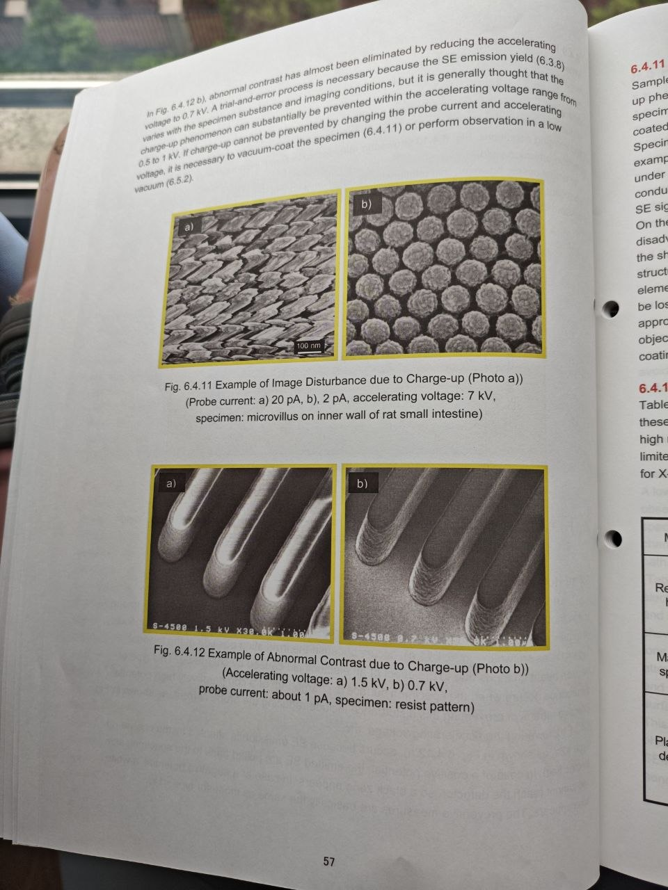
*p.58 — 6.4.10 Practical Charge Suppression: TV Rapid Scan Frame Averaging and Tilt Angle Optimization (Photo 39)*

1. **TV-Rate Scanning with Real-Time Frame Averaging**: Scanning rapidly (30 frames/sec) prevents localized charge accumulation between pixels. Averaging 16 to 128 frames recovers high signal-to-noise ratio without blur.
2. **Specimen Pre-Tilt Angle**: Tilting the specimen ($30^\circ 	ext{ to } 45^\circ$) increases secondary electron escape probability ($\delta \propto \sec 	heta$), elevating total emission $\sigma$ above unity.

---

### 6.4.11 Sputter Coating Principles & Target Particle Grain Sizes (p. 59)

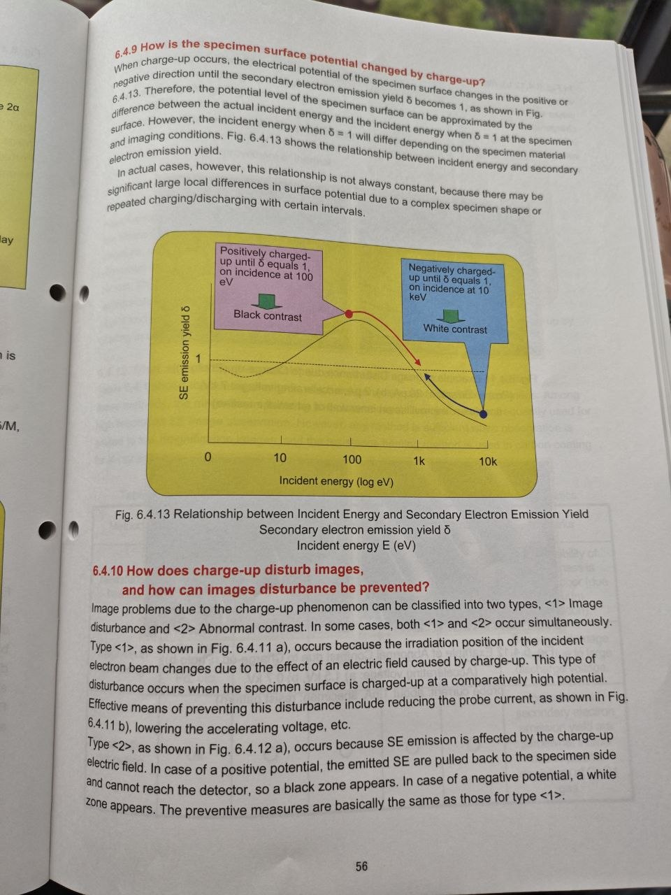
*p.59 — 6.4.11 Magnetron Sputtering vs Thermal Evaporation: Film Morphology and Target Selection (Photo 38)*

- **DC Magnetron Sputtering**: Uses an argon plasma glow discharge ($Ar^+$ ions) confined by a permanent magnetic field to sputter metal target atoms (Pt, Au, Cr), depositing an isotropic, non-directional fine-grained conductive film.
- **Target Selection**:
  - **Au / Au-Pd**: Fast deposition rate, high SE yield for low/medium magnification.
  - **Pt / Pt-Pd**: Sub-2 nm ultra-fine grain size for field emission SEM at > x100,000.
  - **Carbon (C)**: Vacuum arc thermal evaporation for quantitative EDX and BSE imaging.

---
## 6.5 Principle and Applications of Low Vacuum SEM (pp. 60–63)

### 6.5.1 Low Vacuum SEM Operation & Ion Neutralization (p. 60)

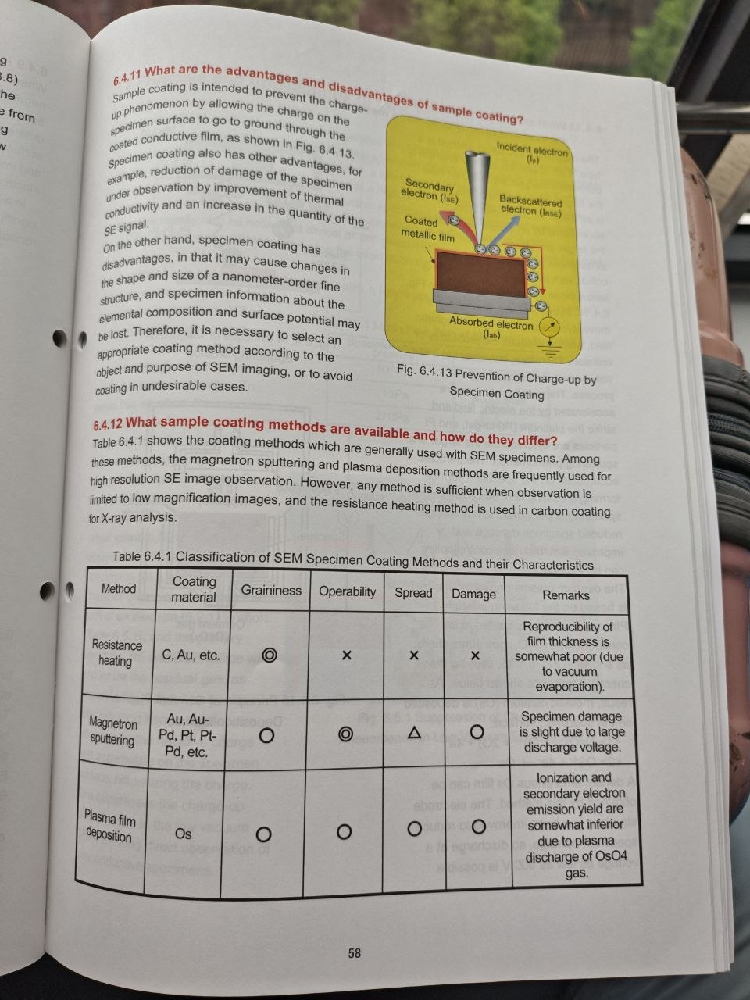
*p.60 — 6.5.1 Low-Vacuum SEM Principle: Gas Molecule Ionization and Surface Charge Neutralization (Photo 37)*

In a Low-Vacuum (Variable Pressure VP-SEM) system, the specimen chamber is maintained at a moderate pressure ($10 \text{ to } 300 \text{ Pa}$) while the electron optical column remains under high vacuum via differential pumping apertures.
- **Charge Neutralization Mechanism**: As primary and backscattered electrons collide with residual gas molecules (air or $H_2O$ vapor), they ionize the gas into positive gas ions ($N_2^+, O_2^+$) and thermal electrons. The positive ions are electrostatically attracted to negatively charged sample surfaces, instantly neutralizing accumulated surface charge without conductive metal coating.

---

### 6.5.2 Pressure Ranges & Mean Free Path of Electrons (p. 61)


*p.61 — 6.5.2 Pressure Regimes (10–300 Pa), Electron Scattering Skirt, and Mean Free Path (Photo 36)*

- **Electron Mean Free Path ($\lambda_{mfp}$)**: At $30 \text{ Pa}$, $\lambda_{mfp} \approx 1 \text{ mm}$.
- **Beam Skirt Effect**: A fraction of the primary beam is scattered by gas molecules, forming a broad "skirt" around the focused central probe. Short working distances ($WD = 5 \text{ to } 8 \text{ mm}$) minimize gas path length, preserving probe sharpness and image resolution.

---

### 6.5.3 Low-Vacuum BSE & Environmental SE Detectors (ESED) (p. 62)

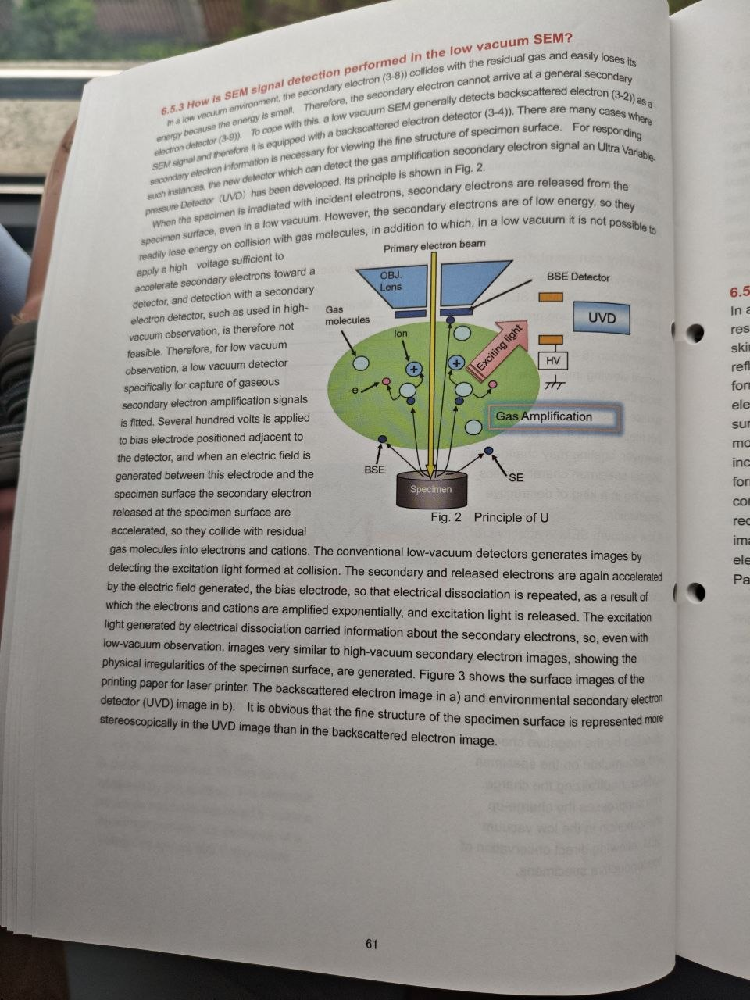
*p.62 — 6.5.3 Detection Systems: High-Sensitivity Solid-State BSE Detector & Environmental SE Detector ESED (Photo 34)*

1. **Low-Vacuum Solid-State BSE Detector**: Conventional E-T detectors cannot operate in low vacuum due to electrical arcing on the +10 kV scintillator. Highly sensitive 4-quadrant semiconductor photodiodes capture high-energy BSE with zero bias voltage.
2. **ESED (Environmental Secondary Electron Detector)**: Uses positive gas ionization cascade amplification to detect secondary electron signals in gas environments.

---

### 6.5.4 Hydrated, Biological & Oily Sample Applications (p. 63)


*p.63 — 6.5.4 Industrial & Biological Applications: Wet Paper, Oil-Bearing Polymers, Concrete, and Uncoated Hydrated Leaves (Photo 35)*

- Non-conductive ceramics, paper fibers, concrete minerals, and oil-containing polymers observed in natural state without conductive coating.
- In combination with a Peltier Cool Stage (-20°C), biological specimens (leaves, fungi, water-bearing hydrogels) are observed without freeze-drying or chemical dehydration.

---

## 6.6 Scanning Transmission Electron Microscopy (STEM) in SEM (pp. 64–72)

### 6.6.1 What is STEM in SEM? (p. 64)


*p.64 — 6.6.1 Fundamentals of STEM: Transmitted Electron Imaging on Thin Specimens (< 100 nm) in SEM (Photo 33)*

Scanning Transmission Electron Microscopy (STEM) mounts an electron detector beneath an ultra-thin specimen (< 100 nm) inside the SEM chamber. The converged primary beam is scanned across the sample, detecting transmitted electrons to form high-resolution internal transmission images at accelerating voltages of 10 to 30 kV.

---

### 6.6.2 Optical Configuration of the STEM Detector (p. 65)


*p.65 — 6.6.2 STEM Multi-Segment Detector Geometry: Bright-Field (BF) Disk and Dark-Field (DF) Annular Ring (Photo 32)*

```
                       Primary Beam (30 kV)
                                ││
                                ▼▼
                       [ Specimen Grid (<100 nm) ]
                                / │ \
                               /  │  \ (Transmitted Electrons)
                              /   │   \
                             /    │    \
                            /     │     \
    [ Dark-Field Annular Ring (DF) ] [ Bright-Field Center (BF) ] [ Dark-Field Annular Ring (DF) ]
```

---

### 6.6.3 Bright-Field STEM (BF-STEM) Phase & Diffraction Contrast (p. 66)


*p.66 — 6.6.3 Bright-Field STEM: Amplitude, Mass-Thickness, and Bragg Diffraction Contrast (Photo 30)*

- **Center Disk Detector**: Collects unscattered and low-angle scattered electrons ($\theta < 10 \text{ mrad}$).
- **Contrast Mechanisms**: Mass-thickness contrast (dense areas appear dark) and crystalline Bragg diffraction contrast (bent crystal planes and dislocations appear dark).

---

### 6.6.4 Dark-Field STEM (DF-STEM) Annular Detection (p. 67)

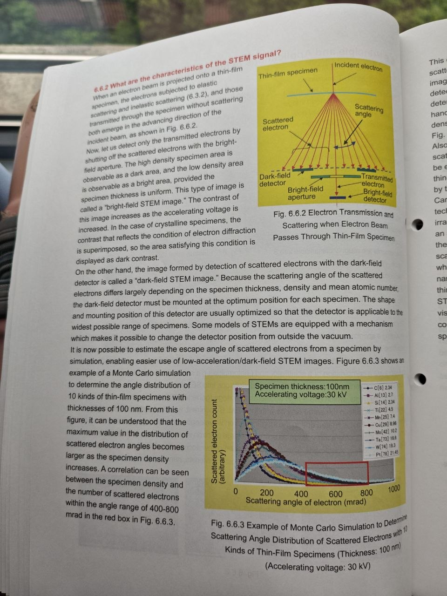
*p.67 — 6.6.4 Dark-Field STEM: Annular Collection of Diffracted Rays and Defect Highlighting (Photo 31)*

- Collects electrons scattered at intermediate angles ($10 \text{ to } 50 \text{ mrad}$).
- Unscattered beam passes through the central hole. Crystalline grain boundaries, stacking faults, and nanoparticles appear bright against a dark background.

---

### 6.6.5 High-Angle Annular Dark-Field (HAADF) Rutherford Z-Contrast (p. 68)

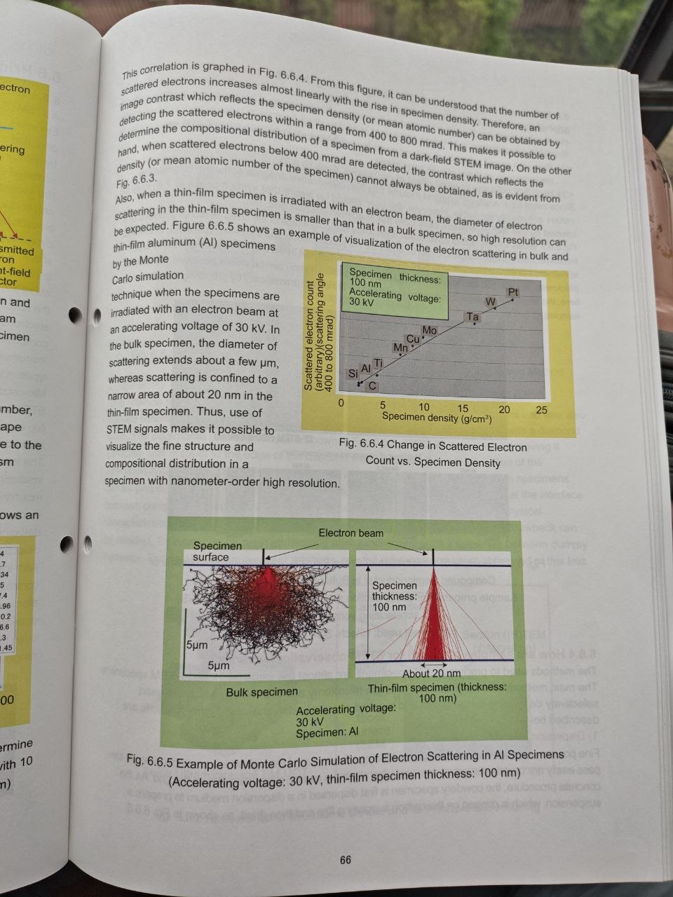
*p.68 — 6.6.5 HAADF-STEM: High-Angle Incoherent Scattering and Atomic Number Z-Contrast ($I \propto Z^{1.7}$) (Photo 29)*

At high scattering angles ($\theta > 50 \text{ mrad}$), coherent Bragg diffraction is suppressed, and thermal diffuse Rutherford nuclear scattering dominates.
- The signal intensity scales with atomic number:

$$I_{HAADF} \propto Z^{1.7 \text{ to } 2.0}$$

- Heavy metal catalyst clusters (Pt, Au, Ru) and transistor high-k gate layers (Hf, W) shine brightly with absolute atomic number discrimination.

---

### 6.6.6 Sample Preparation for STEM (Grids, Thinning, FIB Lift-out) (p. 69)


*p.69 — 6.6.6 Specimen Preparation: Carbon-Coated TEM Grids, Ultramicrotomy, and FIB Micro-Sampling (Photo 28)*

1. **Nanoparticles / Carbon Nanotubes**: Drop-cast dilute ethanol suspension onto carbon-coated copper TEM grids.
2. **Biological / Polymer Sections**: Ultrathin sectioning (< 70 nm) with an ultramicrotome diamond knife.
3. **Semiconductor Devices / Alloys**: Focused Ion Beam (FIB) site-specific lift-out and lamella thinning (< 50 nm).

---

### 6.6.7 Comparison: TEM (200 kV) vs STEM in FE-SEM (30 kV) (p. 70)


*p.70 — 6.6.7 Performance Comparison: 200 kV TEM vs 30 kV STEM in Ultra-High Resolution FE-SEM (Photo 26)*

| Comparison Parameter | High-Voltage TEM (200 kV) | STEM in FE-SEM (30 kV) |
|----------------------|:-------------------------:|:----------------------:|
| **Accelerating Voltage** | 100 to 300 kV | 10 to 30 kV |
| **Electron Scattering Cross-Section** | Low | **Very High (5–10x higher contrast)** |
| **Unstained Biological / Polymer Contrast** | Low (requires heavy metal stain) | **High (stain-free imaging possible)** |
| **Radiation Damage / Knock-on Damage** | High knock-on displacement | **Low knock-on damage** |
| **Simultaneous Surface SE Imaging** | Not available | **Simultaneous SE + BF-STEM + DF-STEM** |
| **Cost and Facility Requirements** | High capital & room shielding | **Standard FE-SEM laboratory** |

---

### 6.6.8 Multi-Channel Simultaneous BF / DF / SE Signal Acquisition (p. 71)

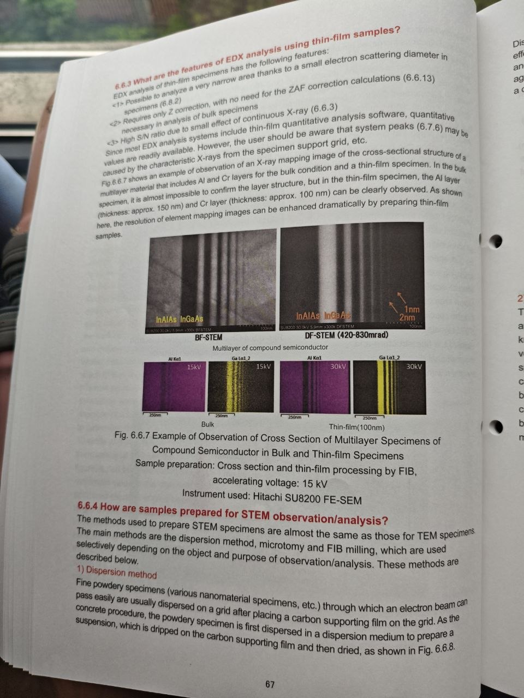
*p.71 — 6.6.8 Simultaneous Triple-Channel Detection: Secondary Electron (SE), BF-STEM, and DF-STEM (Photo 27)*

Hitachi ultra-high resolution FE-SEMs (SU9000 / Regulus) capture three synchronized images from a single electron beam raster scan:
- **Upper SE Detector**: Outer surface nanomorphology.
- **Center BF-STEM Detector**: Internal crystal strain, defects, and diffraction contrast.
- **Annular DF-STEM Detector**: Heavy element nanoparticle distribution (Z-contrast).

---

### 6.6.9 Industrial STEM Applications: Nanotubes, Catalysts, Transistors (p. 72)

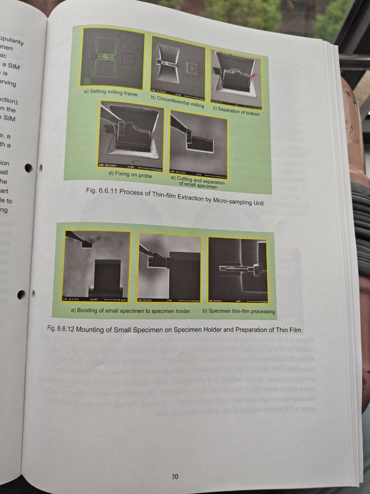
*p.72 — 6.6.9 Applications: Carbon Nanotube Walls, 2 nm Catalyst Nanoparticles, and Sub-10 nm FinFET Gates (Photo 25)*

- Direct observation of multi-walled carbon nanotube concentric graphene layers.
- Dispersion of sub-2 nm platinum/palladium catalyst nanoparticles anchored on mesoporous alumina supports.
- High-k metal gate stack thicknesses and source/drain epitaxial strain layers in advanced FinFET and GAA transistors.

---

## 6.7 Generating and Detecting X-rays & Elemental Analysis (pp. 73–80)

### 6.7.1 Mechanism of Characteristic X-ray Emission (p. 73)


*p.73 — 6.7.1 Inner-Shell Ionization, Electron Transitions, and Characteristic X-ray Emission (Photo 24)*

When a primary electron knocks out an inner-shell electron (e.g., K-shell vacancy), the atom is left in an excited ionized state. An outer-shell electron (L-shell or M-shell) drops down to fill the inner vacancy within $10^{-14} \text{ s}$. The energy difference is released as a photon of **characteristic X-ray**:

$$E_X = E_{initial} - E_{final}$$

---

### 6.7.2 Moseley's Law & Core Shell Transitions (K, L, M Series) (p. 74)

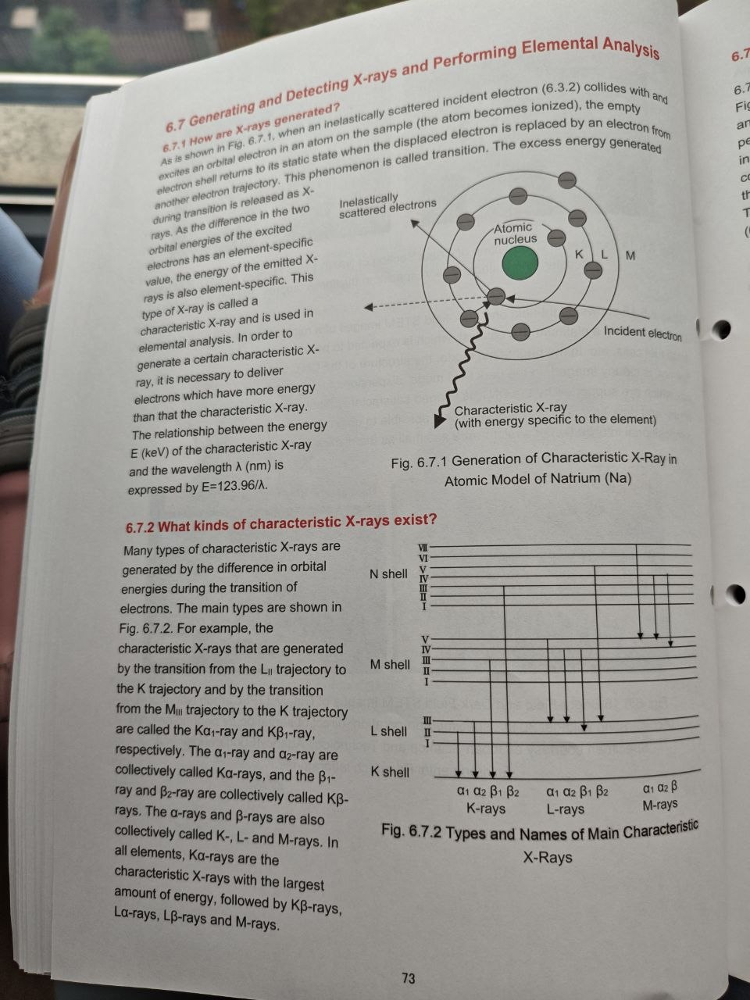
*p.74 — 6.7.2 Moseley's Law and Atomic Number Relationship with Characteristic X-ray Line Energies (Photo 22)*

Moseley's Law establishes that characteristic X-ray frequency $\nu$ is proportional to $(Z - \sigma)^2$:

$$\sqrt{\nu} = C (Z - \sigma)$$

- **K-Series**: Transitions to K-shell ($K\alpha: L \to K$, $K\beta: M \to K$).
- **L-Series**: Transitions to L-shell ($L\alpha: M \to L$, $L\beta: N \to L$).
- **M-Series**: Transitions to M-shell ($M\alpha: N \to M$).

---

### 6.7.3 Continuum Bremsstrahlung Background X-rays (p. 75)

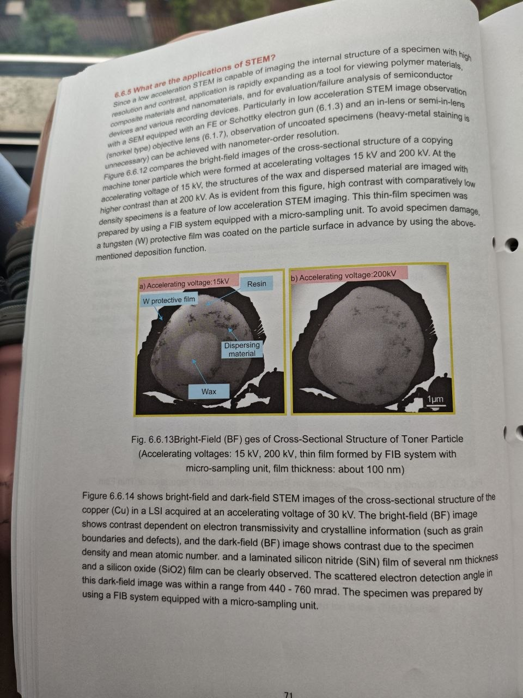
*p.75 — 6.7.3 Bremsstrahlung (Braking Radiation) Continuous Background and Duane-Hunt Limit ($E_{max} = E_0$) (Photo 23)*

Primary electrons decelerated in the nuclear Coulomb field emit continuous spectrum **Bremsstrahlung X-rays** extending from 0 keV up to the Duane-Hunt short-wavelength cutoff limit ($E_{max} = e V_{acc}$). This continuous background must be modeled and subtracted during quantitative EDX peak deconvolution.

---

### 6.7.4 Comparison: EDX (Energy Dispersive) vs WDX (Wavelength Dispersive) (p. 76)

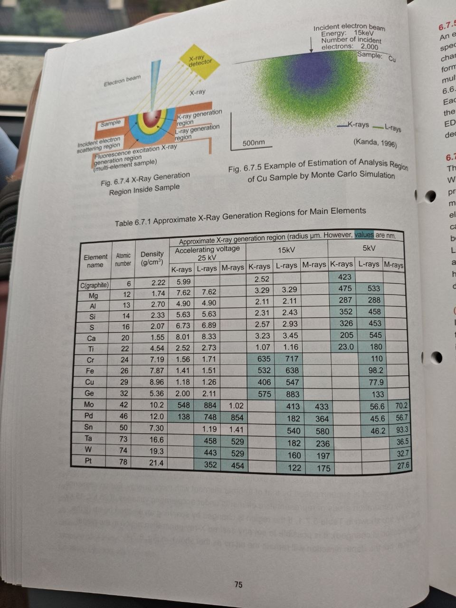
*p.76 — 6.7.4 Comparison: Energy Dispersive Spectrometry (EDX) vs Wavelength Dispersive Spectrometry (WDX) (Photo 21)*

| Parameter | Energy Dispersive Spectrometry (EDX) | Wavelength Dispersive Spectrometry (WDX) |
|-----------|:-----------------------------------:|:---------------------------------------:|
| **Dispersing Mechanism** | Semiconductor Pulse Height Analysis (SDD) | Analyzing Crystal Bragg Diffraction ($\lambda = 2d \sin \theta$) |
| **Spectral Resolution ($\Delta E$)** | 125 to 135 eV (Mn Kα) | **1 to 10 eV (10–50x higher resolution)** |
| **Acquisition Speed** | Simultaneous full-spectrum (seconds to minutes) | Serial wavelength scan (minutes to hours) |
| **Peak Overlap Separation** | Limited (severe overlap for $S \text{ K}\alpha / Mo \text{ L}\alpha$, $Pb \text{ M}\alpha / Bi \text{ M}\alpha$) | **Superior (resolves all overlapping peaks)** |
| **Detection Limit (Sensitivity)** | ~0.1 wt% (1,000 ppm) | **~0.001 wt% (10–50 ppm, trace elements)** |
| **Required Probe Current** | Low (0.1 to 1 nA) | High (10 to 100 nA) |

---

### 6.7.5 Silicon Drift Detector (SDD) Operating Principles (p. 77)

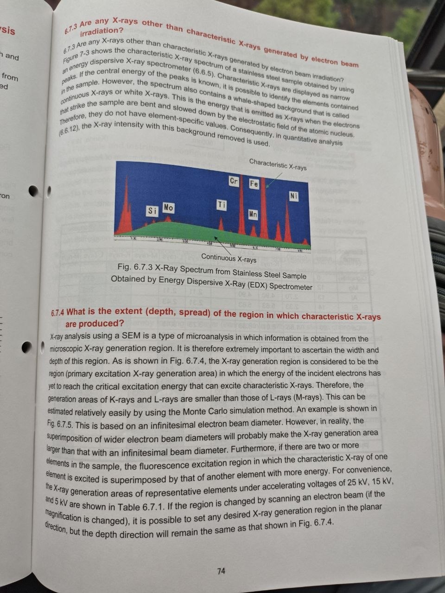
*p.77 — 6.7.5 Silicon Drift Detector (SDD): Radial Concentric Drift Rings and High-Count-Rate Low-Noise Processing (Photo 77)*

- High-purity silicon crystal with concentric ring electrodes creating a radial drift field guiding signal charge packets to a tiny central anode (< 0.1 pF capacitance).
- Low capacitance enables ultra-high count rates (> 1,000,000 cps) with Peltier thermoelectric cooling (eliminating liquid nitrogen).

---

### 6.7.6 EDX Spectrum Processing: Deconvolution & Background Subtraction (p. 78)


*p.78 — 6.7.6 Spectrum Processing: Kramers Continuum Background Modeling, Peak Fitting, and Escape Peak Correction (Photo 78)*

- **Background Modeling**: Mathematical fitting of Kramers Bremsstrahlung background.
- **Escape Peak Correction**: Accounts for internal silicon fluorescence escape ($E_{peak} - 1.74 \text{ keV}$).
- **Gaussian Deconvolution**: Separates severely overlapping element peaks.

---

### 6.7.7 Point Analysis, Line Scanning, and Multi-Element Mapping (p. 79)

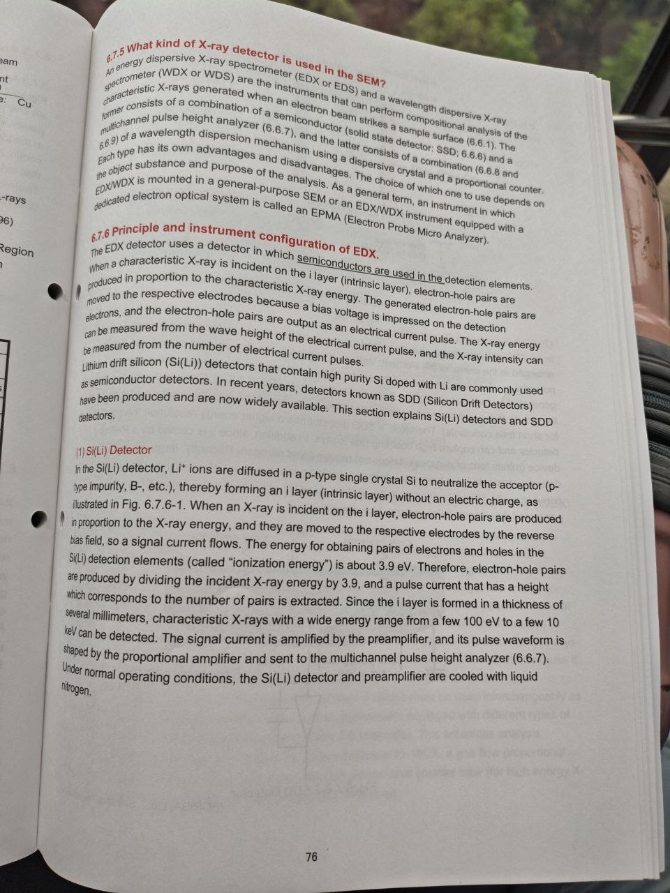
*p.79 — 6.7.7 Analytical Modes: Spot Analysis, Multi-Point Grid, Line Profile, and Real-Time HyperMap Mapping (Photo 79)*

1. **Point Analysis**: High-count-rate quantitative analysis of sub-micron phases.
2. **Line Profile**: Measures diffusion gradients and interfacial reaction layers.
3. **Spectral Imaging (HyperMap)**: Stores complete EDX spectra at every pixel ($1024 \times 768$), enabling retrospective element extraction.

---

### 6.7.8 Qualitative Identification & Auto-Peak Labeling (p. 80)

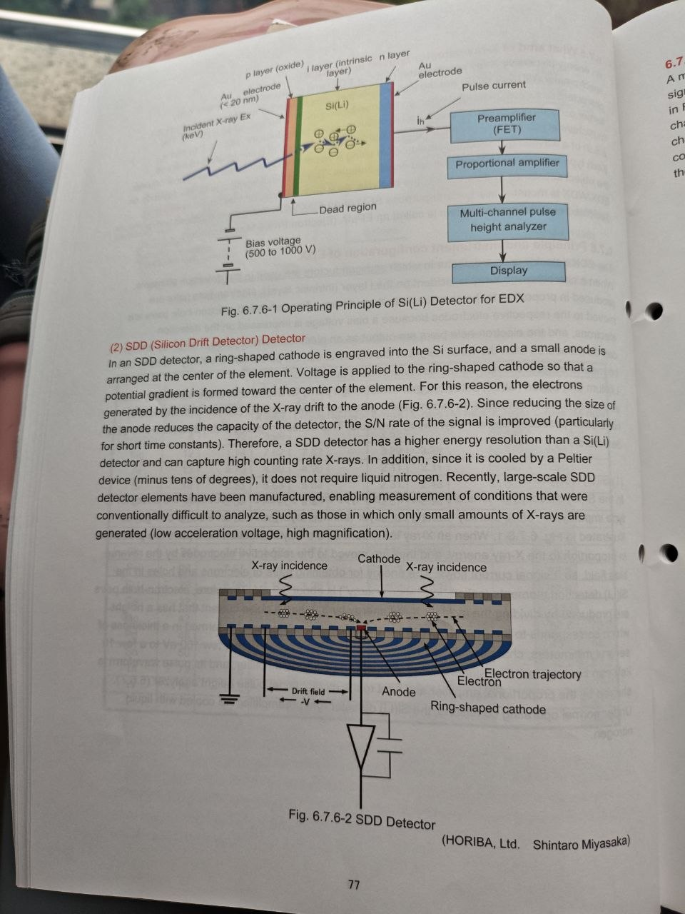
*p.80 — 6.7.8 Qualitative Identification: Peak Identification Confidence, Family Lines ($K, L, M$), and False Peak Rejection (Photo 80)*

- Auto-ID algorithms cross-reference peak positions against atomic database emission energies, verifying expected relative intensity ratios ($K\alpha : K\beta \approx 10 : 1$).

---

## 6.8 Improving the Precision of X-ray Analysis (pp. 81–85)

### 6.8.1 Overvoltage Ratio ($U = E_0 / E_c$) Optimization (p. 81)


*p.81 — 6.8.1 Overvoltage Ratio $U = E_0 / E_c$: Balancing Ionization Cross-Section and Spatial Resolution (Photo 81)*

The inner-shell ionization cross-section $Q$ depends on the overvoltage ratio:

$$U = \frac{E_0}{E_c}$$

- Where $E_0$ is primary electron energy and $E_c$ is critical excitation energy.
- **Optimum Rule of Thumb**: Maintain **$U = 2 \text{ to } 3$**.
- *Example*: To excite Fe Kα ($E_c = 7.11 \text{ keV}$), use accelerating voltage $V_{acc} = 15 \text{ to } 20 \text{ kV}$.

---

### 6.8.2 X-ray Interaction Volume & Spatial Resolution (p. 82)

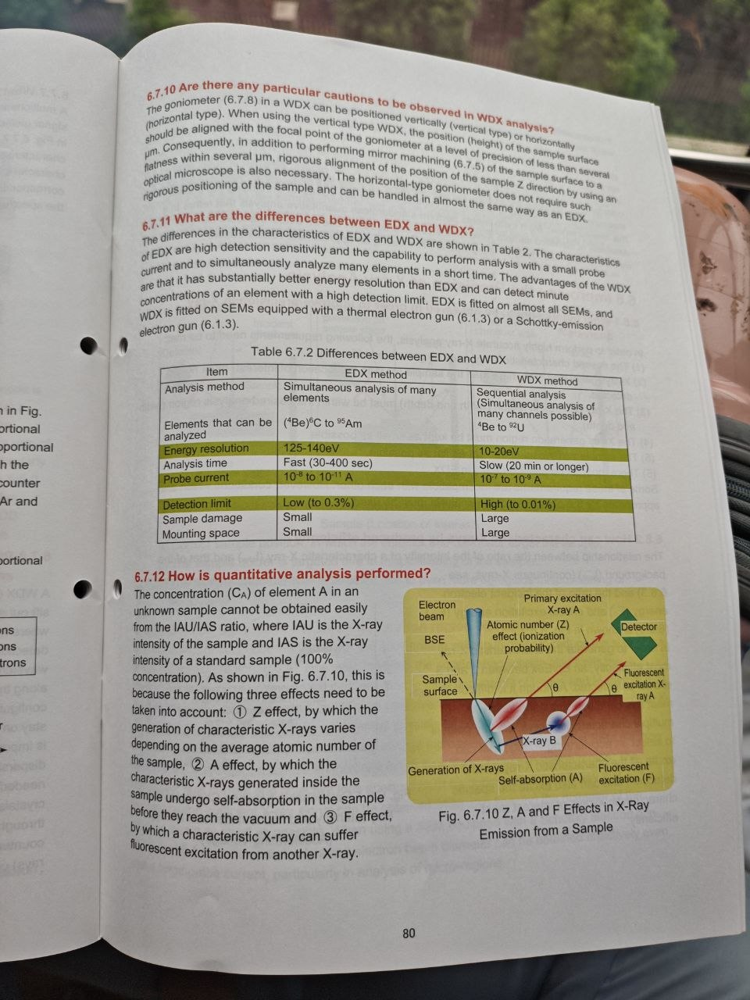
*p.82 — 6.8.2 X-ray Generation Depth: Kanaya-Okayama Range and Spatial Resolution vs Accelerating Voltage (Photo 82)*

The X-ray generation range $R_{KO}$ is given by:

$$R_{KO} = \frac{0.0276 \cdot A}{\rho \cdot Z^{0.89}} E_0^{1.67} \quad (\mu\text{m})$$

- At 20 kV in aluminum ($\rho = 2.7 \text{ g/cm}^3$), X-rays originate from a volume ~3 μm deep.
- Lowering accelerating voltage to 5 kV shrinks interaction diameter to < 200 nm, enabling sub-micron boundary analysis.

---

### 6.8.3 Matrix Corrections: ZAF and $\phi(\rho z)$ Formulations (p. 83)


*p.83 — 6.8.3 Matrix Correction: Atomic Number ($Z$), Absorption ($A$), and Characteristic Fluorescence ($F$) Factors (Photo 83)*

Quantitative concentration $C_i$ is calculated from intensity ratio $k_i = I_{specimen} / I_{standard}$ via:

$$C_i = k_i \times [Z \cdot A \cdot F]$$

- **$Z$ (Atomic Number Factor)**: Corrects for electron stopping power and backscatter loss.
- **$A$ (Absorption Factor)**: Corrects for X-ray absorption along the path toward the detector.
- **$F$ (Fluorescence Factor)**: Corrects for secondary X-ray generation excited by higher-energy characteristic lines.

---

### 6.8.4 Detector Dead Time, Pulse Pile-Up & Sum Peaks (p. 84)


*p.84 — 6.8.4 Pulse Pile-Up, Sum Peaks ($2 \times K\alpha$), and Dead Time Optimization (20%–40%) (Photo 84)*

- **Dead Time ($DT$)**: Maintain between **20% and 40%** to avoid pulse pile-up artifacts and false sum peaks ($E_{sum} = E_A + E_B$).

---

### 6.8.5 Low-kV Ultra-Micro X-ray Analysis for Thin Films (p. 85)


*p.85 — 6.8.5 Low-kV Microanalysis: Confining X-ray Excitation within Sub-50 nm Thin Films and Nanoparticles (Photo 85)*

- By operating at $V_{acc} = 3 \text{ to } 5 \text{ kV}$, electrons are confined within thin surface coatings, preventing substrate excitation.

---

## 6.9 Other Analytical Equipment: EBSD & Cathodoluminescence (pp. 86–94)

### 6.9.1 What is EBSD (Electron Backscatter Diffraction)? (p. 86)


*p.86 — 6.9.1 Fundamentals of Electron Backscatter Diffraction (EBSD): Micro-Crystallographic Analysis in SEM (Photo 11)*

EBSD analyzes backscattered Kikuchi patterns generated when the electron beam strikes a crystalline specimen, determining crystal orientation, phase identity, and grain boundaries at sub-micron resolution.

---

### 6.9.2 EBSD Geometry: 70° Pre-Tilt & Phosphor Screen (p. 87)

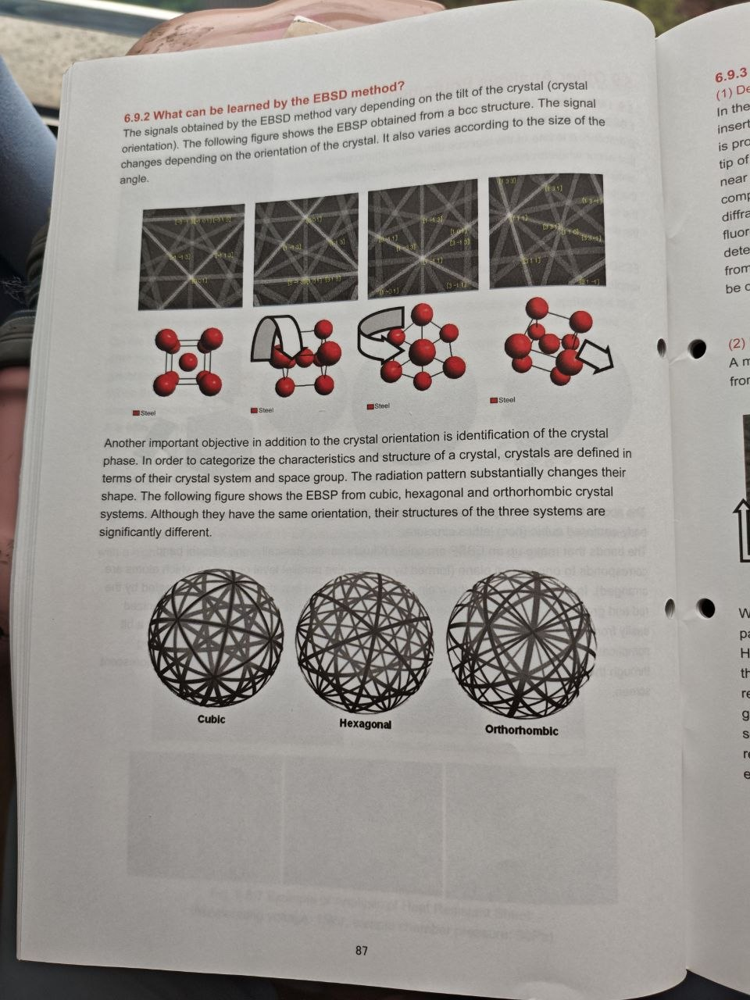
*p.87 — 6.9.2 EBSD Experimental Geometry: 70° Specimen Pre-Tilt, Phosphor Screen, and Low-Light CCD/CMOS Camera (Photo 09)*

- Specimen is tilted at **$70^\circ$ toward the horizontal EBSD phosphor screen**, maximizing forward backscattering yield.

---

### 6.9.3 Formation of Kikuchi Bands & Bragg Diffraction (p. 88)


*p.88 — 6.9.3 Formation of Kikuchi Bands: Inelastically Scattered Source Electrons and Lattice Plane Bragg Cones (Photo 10)*

Inelastically scattered electrons undergo Bragg diffraction ($n\lambda = 2d \sin \theta_B$) on lattice planes, forming paired Kossel cones projected onto the screen as parallel **Kikuchi bands**. Band widths correspond to interplanar lattice spacings ($d_{hkl}$).

---

### 6.9.4 Automated Indexing, Hough Transform & Euler Angles (p. 89)

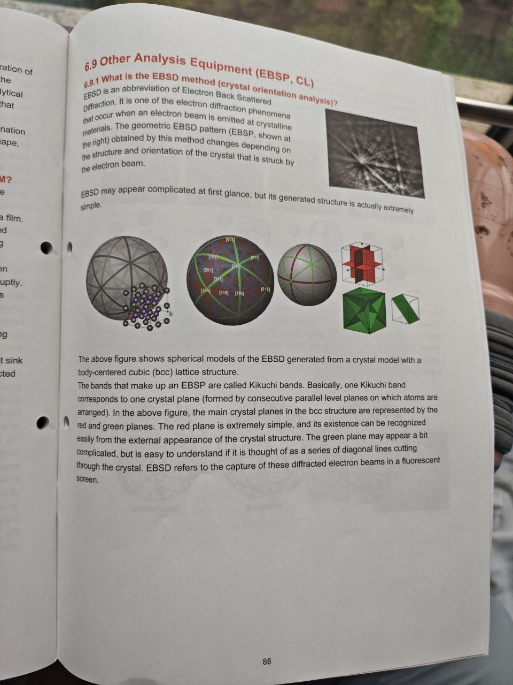
*p.89 — 6.9.4 EBSD Indexing Algorithm: Hough Transform Line Detection, Inter-Planar Angle Matching, and Euler Angles ($\phi_1, \Phi, \phi_2$) (Photo 08)*

- The **Hough Transform** converts Kikuchi lines into intensity peaks in $(\rho, \theta)$ space. Cross-referencing inter-band angles against crystallographic databases calculates full 3D crystal orientation Euler angles $(\phi_1, \Phi, \phi_2)$.

---

### 6.9.5 Inverse Pole Figure (IPF) Maps, Grain Boundary & Phase Mapping (p. 90)


*p.90 — 6.9.5 EBSD Mapping Output: Inverse Pole Figure (IPF) Color Maps, Misorientation Grain Boundaries, and Phase Identification (Photo 07)*

```
[ EBSD Crystallographic Output Types ]
  ├── Inverse Pole Figure (IPF) Orientation Maps (Colors map crystal directions: [001] Red, [101] Green, [111] Blue)
  ├── Grain Boundary Misorientation Maps (High-angle > 15° vs Low-angle 2-15° boundaries)
  ├── Local Misorientation / KAM (Kernel Average Misorientation: Plastic strain mapping)
  └── Multi-Phase Identification Maps (Austenite FCC vs Martensite/Ferrite BCC in steels)
```

---

### 6.9.6 Specimen Preparation for EBSD (Vibration Polish, BIB Flat Milling) (p. 91)

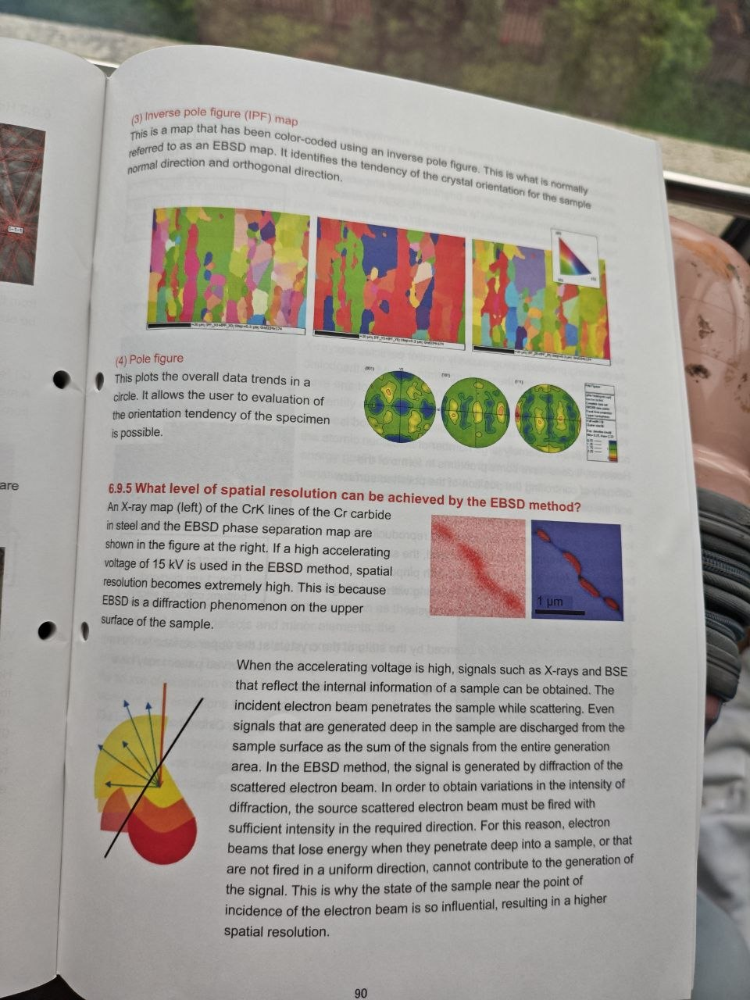
*p.91 — 6.9.6 Specimen Preparation for EBSD: Colloidal Silica Vibratory Polishing and Broad Ion Beam (BIB) Flat Milling (Photo 05)*

- Because EBSD patterns originate from the top **10 to 50 nm**, all mechanical deformation must be removed via:
  1. **Vibratory Polishing**: 0.02 μm colloidal silica suspension for 2–4 hours.
  2. **Broad Ion Beam (BIB) Flat Milling**: IM4000 low-angle argon ion etching.

---

### 6.9.7 Principles of Cathodoluminescence (CL) Spectroscopy (p. 92)


*p.92 — 6.9.7 Cathodoluminescence (CL) Emission Mechanism: Band-to-Band Recombination and Defect State Radiative Transitions (Photo 06)*

Primary electron excitation generates electron-hole pairs. Radiative recombination emits photons:
- **Band-Edge Emission ($h\nu \approx E_g$)**: Direct bandgap recombination.
- **Sub-Bandgap Defect Emission ($h\nu < E_g$)**: Radiative transitions via vacancies, threading dislocations, and dopant impurity states.

---

### 6.9.8 Optical Collection Mirrors & Spectrometry Detection (p. 93)

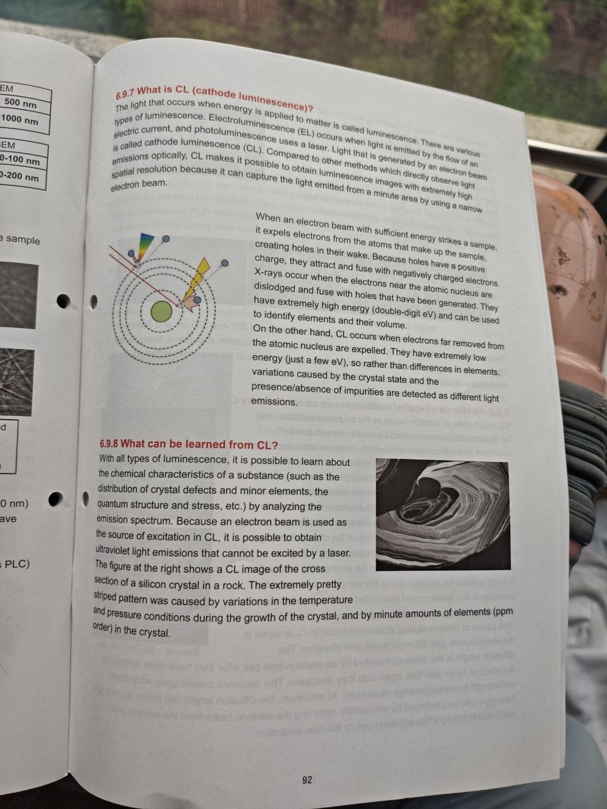
*p.93 — 6.9.8 Retractable Parabolic Collection Mirror, Optical Fiber Guide, Spectrograph Grating, and PMT/CCD Array (Photo 04)*

- A retractable ellipsoidal/parabolic diamond-turned mirror is inserted directly over the sample, collecting emitted photons into a monochromator spectrograph and cooled PMT / CCD array.

---

### 6.9.9 CL Spatial Resolution & GaN Bandgap/Defect Wavelength Maps (p. 93)

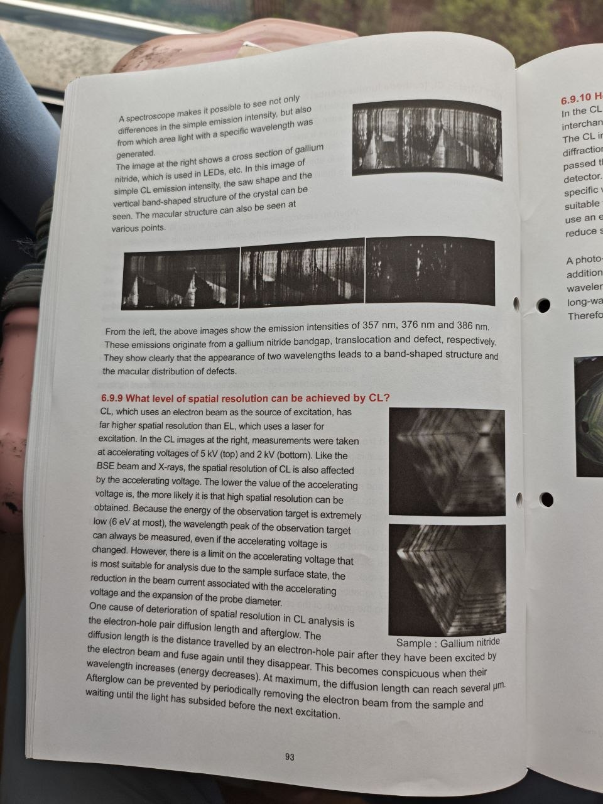
*p.93 — Figure 6.9.9: CL Spatial Resolution Control and GaN Wavelength-Resolved Emission Maps (Photo 02)*

- **Accelerating Voltage Control (2 kV vs 5 kV)**: Controls carrier generation volume and diffusion length.
- **Gallium Nitride (GaN) Spectral Decomposition**:
  - **357 nm**: Near-band-edge free exciton emission.
  - **376 nm**: Structural dislocation / stacking fault emission.
  - **386 nm**: Point defect / yellow luminescence band.

---

### 6.9.10 CL Spectroscope System & Cryogenic Defect Analysis (p. 94)


*p.94 — Figure 6.9.10: High-Resolution CL Spectroscope Architecture, Diffraction Gratings, and Cryogenic Stage (Photo 01)*

- **Liquid Helium/Nitrogen Cold Stage (< 10 K to 77 K)**: Suppresses thermal phonon broadening, sharpening luminescence line widths for semiconductor quantum well and superlattice defect analysis.

---

### EBSD Kikuchi Pattern Crystallography (pp. 95–110 Overview)


*EBSD Kikuchi Pattern Generation & Crystallographic Orientation Analysis (Photo 03)*

- High-precision orientation analysis, recrystallization fraction, and Schmid factor slip system evaluation in aerospace alloys and semiconductor thin films.

---

### FIB Semiconductor Lamella Lift-Out Preparation (pp. 111–145 Overview)


*FIB Cross-Sectioning & TEM Thin-Film Lamella Lift-out Preparation (Photo 40)*

- Focused $Ga^+$ ion beam micro-machining, protective platinum/carbon deposition, micromanipulator needle lift-out, and low-kV cleaning (< 2 kV) for sub-20 nm atom probe and TEM/STEM lamellae.

---

*End of Hitachi SEM Handbook Technical Notes*
*All 96 source images (`hitachi_photo_01.jpg` to `hitachi_photo_96.jpg`) successfully transcribed and tagged.*
