# Hitachi High-Technologies – Scanning Electron Microscope (SEM) Complete Technical Handbook & Chain-of-Thoughts Guide

## Complete Exhaustive 96-Page Technical Transcription, Physics Deep-Dive, Diagnostic Matrices & Paired Visual Reference

> **Source**: Hitachi High-Technologies Corporation — *Introduction to Scanning Electron Microscopy (SEM Handbook)*  
> **Source Visuals Directory**: `sorted_by_page/` (Sorted Numerically by Handbook Page)  
> **Total Document Scope**: 96 Physical Visual Plates (Master Table of Contents + pp. 1–94 + Technical Reference Appendices)  
> **Authoritative Technical Standard**: Covers Electron Optics, Quantum Source Mechanics, Lens Aberrations, Vacuum Pumping, Signal Differentiation (SE1/SE2/SE3, High/Low-Angle BSE, ExB Filter), Low-Vacuum Charge Neutralization, STEM Nanoscale Phase & Z-Contrast, Microanalysis (EDX SDD / WDX Rowland Spectrometers, ZAF Matrix Corrections), and Advanced Diffraction/Emission (EBSD Kikuchi Analysis & Cathodoluminescence Spectroscopy).

---

## 🧭 Master Table of Contents & Numerical Page Index

| Chapter | Title & Topical Coverage | Handbook Pages | Sorted Visual Plate |
|:-------:|:-------------------------|:--------------:|:-------------------:|
| **Front Matter** | **Master Table of Contents & Structure Overview** | **p. TOC** | `00_TOC.jpg` |
| **Chapter 1** | **What is the SEM? (Fundamental Capabilities & Architecture)** | **pp. 1–6** | `01` to `06` |
| 1.1 | Spatial Resolution Limits, Scale Reference & Comparative Imaging (OM vs SEM) | pp. 1–3 | `01_What_Can_We_Do_with_SEM.jpg` to `03_Fiber_Cross_Section_BSE_EDX.jpg` |
| 1.2 | Electron-Matter Interaction Signals & Subsystem Column Architecture | pp. 4–6 | `04_SEM_Principle_Signals.jpg` to `06_Column_Subsystems_1_to_7.jpg` |
| **Chapter 2** | **Sample Preparation Protocols & Specimen Handling** | **pp. 7–10** | `07` to `10` |
| 2.1–2.2 | Mounting Tools, Conductive Pastes, Powders & Wafer Cleavage Methods | p. 7 | `07_Tools_Sampling_Bulk_Powders.jpg` |
| 2.2 cont. | Biological Fixation, Graded Dehydration, Critical Point Drying (CPD) & Foodstuffs | p. 8 | `08_Biological_Foodstuffs_Pretreatment.jpg` |
| 2.3 | Metal Sputter Coating (Au, Pt, Pt-Pd, Cr, W) vs Carbon Thermal Evaporation | p. 9 | `09_Metal_Sputter_Carbon_Coating.jpg` |
| 2.4 | Broad Ion Beam (BIB) Ion Milling: Flat Planarization & Cross-Section Masking | p. 10 | `10_BIB_Ion_Milling_Flat_CrossSection.jpg` |
| **Chapter 3** | **Let's Try Observation with a SEM! (Real-World Applications)** | **pp. 11–19** | `11` to `19` |
| 3.1 | Machined Metals (Ductile/Brittle Fractography), Polymers, Rubbers, Toners & Zeolites | pp. 11–14 | `11_Machined_Metals_Fractures.jpg` to `14_Zeolites_Catalysts_Ceramics.jpg` |
| 3.2 | Advanced Electronics (Photoresist, SRAM Voltage Contrast) & Energy Materials (LIB) | pp. 15–16 | `15_Semiconductor_Resist_VoltageContrast.jpg` to `16_LIB_Battery_Microstructure.jpg` |
| 3.3 | Biological Specimens (Botanical Stomata, Cryo-Botany, Diatoms, Stem Cells, Bacteria) | pp. 17–18 | `17_Botany_Stomata_Insects.jpg` to `18_Diatoms_StemCells_Bacteria.jpg` |
| 3.4 | Foodstuffs & Hydrated Emulsions (Dairy, Starches, Cool-Stage Preservation) | p. 19 | `19_Foodstuffs_Emulsions_Starches.jpg` |
| **Chapter 4** | **What Causes These Image Problems? (Diagnostic Troubleshooting)** | **pp. 20–24** | `20` to `24` |
| 4.0 | Master Diagnostic Cross-Reference Matrix (Symptoms vs Root Causes) | p. 20 | `20_Troubleshooting_Matrix.jpg` |
| 4.1 | Cause A: Electrostatic Charging Dynamics, Potential Barriers & Solutions | p. 21 | `21_Cause_A_Charge_Up.jpg` |
| 4.2 | Cause B: Hydrocarbon Contamination, Beam Polymerization & Beam Blanking | p. 22 | `22_Cause_B_Contamination.jpg` |
| 4.3 | Cause C: Thermal Beam Damage & Cause D: Mechanical Vibration / Magnetic Noise | p. 23 | `23_Cause_CD_Thermal_Vibration_Magnetic.jpg` |
| 4.4 | Cause E: Objective Aperture Contamination & Optical Misalignment | p. 24 | `24_Cause_E_Mechanical_Optical_Alignment.jpg` |
| **Chapter 5** | **Types of SEM Instrumentation** | **pp. 25–26** | `25` to `26` |
| 5.1 | Field Emission SEM Lineup (SU9000 In-Lens, Regulus Semi-In-Lens, SU7000, SU5000) | p. 25 | `25_FE_SEM_Lineup.jpg` |
| 5.2 | Hi-SEM & Tabletop Lineup (SU3800, SU3900 Large-Chamber, FlexSEM 1000II, TM4000Plus) | p. 26 | `26_HiSEM_Tabletop_Lineup.jpg` |
| **Chapter 6** | **Frequently Asked Questions About SEM (Technical Theory Deep-Dive)** | **pp. 27–94** | `27` to `93_94` |
| 6.0 | Master FAQ Table of Contents & Question Index Parts 1 & 2 | pp. 27–28 | `27_FAQ_Index_Part1.jpg` to `28_FAQ_Index_Part2.jpg` |
| 6.1 | Electron Beam Formation, Gun Physics (CFE/Schottky/W), Optics & Lens Aberrations | pp. 29–36 | `29_Beam_Formation_Intro.jpg` to `35_Objective_Lens_Geometries.jpg` |
| 6.2 | Vacuum Evacuation Systems, Differential Pumping & Vacuum Pump Maintenance | pp. 37–38 | `37_Vacuum_System_Differential_Pumping.jpg` to `38_Vacuum_Pumps_Maintenance.jpg` |
| 6.3 | Signal Generation, Detection (SE1/2/3, BSE 4-Quadrant Diodes, ExB Filters, VC) | pp. 39–49 | `39_Electron_Matter_SE_Generation.jpg` to `49_ExB_Filter_Voltage_Contrast.jpg` |
| 6.4 | Viewing Parameters (kV, Current, WD, Aperture, Astigmatism, Charging Balance sigma=1) | pp. 50–59 | `50_Good_SEM_Image_kV_Selection.jpg` to `59_Sputter_vs_Plasma_OsO4.jpg` |
| 6.5 | Low-Vacuum SEM Principles (Gaseous Ionization Neutralization, PLA, ESED Detectors) | pp. 60–63 | `60_Low_Vacuum_Principle_Ionization.jpg` to `63_Low_Vacuum_Applications.jpg` |
| 6.6 | STEM in SEM (BF/DF/HAADF Z-Contrast, Mean Free Path, FIB Nanofabrication) | pp. 64–72 | `64_STEM_Principle_Transmission.jpg` to `71_UltraHigh_Resolution_STEM.jpg` |
| 6.7 | Characteristic X-Ray Generation, EDX (SDD Detectors) vs WDX (Rowland Circle) | pp. 73–80 | `73_Characteristic_XRay_Physics.jpg` to `80_WDX_Tandem_Counters_vs_EDX.jpg` |
| 6.8 | Quantitative X-Ray Precision (ZAF Corrections, Overvoltage U, Spectral Artifacts) | pp. 81–86 | `81_Quantitative_ZAF_Overvoltage.jpg` to `86_Low_Vacuum_EDX_SkirtEffect.jpg` |
| 6.9 | Advanced Microanalysis: EBSD Kikuchi Crystallography & Cathodoluminescence (CL) | pp. 87–94 | `87_EBSD_Kikuchi_Bands.jpg` to `93_94_CL_Applications_Defects.jpg` |

---

## 🧠 Master Chains of Thought: Theoretical & Operational Mental Models

```
                                      ================================================
                                      MASTER SEM & MICROANALYSIS CHAIN OF THOUGHTS
                                      ================================================
                                                             │
        ┌────────────────────────────────────────────────────┼────────────────────────────────────────────────────┐
        │                                                    │                                                    │
        ▼                                                    ▼                                                    ▼
[ 1. ELECTRON OPTICS CHAIN ]          [ 2. INTERACTION & EMISSION CHAIN ]      [ 3. PARAMETER BALANCING CHAIN ]
Source Brightness (B)                  Primary Incident Electron (E0, Ip)       Resolution (d_probe)
  │ (W < LaB6 < Schottky < CFE)          │                                        │ vs Depth of Focus (D)
  ▼                                      ▼                                        │ vs Signal-to-Noise (S/N)
Demagnification Ratio (M_total)        Interaction Volume (V ~ E0^1.7 / rho)      │ vs Specimen Damage (Q)
  │ (C1 + C2 + OL Lens reduction)        ├── Secondary Electrons (SE1, SE2, SE3)  ▼
  ▼                                      ├── Backscattered Electrons (BSE ~ Z)  Operator Optimization Matrix:
Beam Aberration Balance (d_tot)          ├── Characteristic X-rays (h*nu_char)    - High-Res: High kV, Low WD, Small Ap
  - Spherical (d_s ~ Cs * alpha^3)       ├── Bremsstrahlung Continuous X-rays     - High-DoF: Low Mag, High WD, Small Ap
  - Chromatic (d_c ~ Cc * alpha * dE/E0) ├── Transmitted Electrons (STEM)         - Microanalysis: High kV, High Ip, Large Ap
  - Diffraction (d_d ~ 0.61*lambda/alpha)└── Radiative Bandgap Photons (CL)       - Insulator/Delicate: Low kV, Low Ip
        │                                                    │                                                    │
        ├────────────────────────────────────────────────────┼────────────────────────────────────────────────────┤
        │                                                    │                                                    │
        ▼                                                    ▼                                                    ▼
[ 4. CHARGE DYNAMICS CHAIN ]           [ 5. QUANTITATIVE X-RAY CHAIN ]          [ 6. CRYSTAL / OPTICAL CHAIN ]
Total Yield: sigma = delta_SE + eta_BSE Overvoltage Ratio: U = E0 / Ec          EBSD Kikuchi Diffraction:
  - If sigma = 1: Perfect Equilibrium    │ (Optimal U = 1.5 to 2.5)               - High Tilt (70 deg) -> Inelastic backscatter
  - If sigma > 1: Positive Charge-Up     ▼                                        - Bragg diffraction from lattice planes
    (Suppresses low-energy SE -> Dark)  X-Ray Generation Volume (R_x)             - Phosphor screen -> Hough transform -> Euler
  - If sigma < 1: Negative Charge-Up     │ vs Escape Depth (Absorption)           ▼
    (Deflects beam, Flare, White Halo)   ▼                                      Cathodoluminescence (CL):
  ▼                                     ZAF Matrix Correction:                    - Electron-hole pair generation
Countermeasures:                         - Z: Atomic Number (Stopping/Backscatter)- Radiative recombination across bandgap
  - Tune to E1/E2 critical energies      - A: X-ray Absorption in matrix          - Identifies crystal defects, dopants,
  - Low-Vacuum (gas ion neutralization)  - F: Secondary Characteristic Fluor.       and optoelectronic stress distributions
  - Conductive metal/carbon coating
```

---


*Visual Plate 00 (Handbook TOC) — Master Table of Contents outlining Chapters 1 through 6.*

---

# Chapter 1 — What is the SEM? (pp. 1–6)

## 1.1 What Can We Do with a SEM? (pp. 1–3)

### p. 1 — Spatial Scale, Resolution Hierarchy & SEM Fundamental Strengths

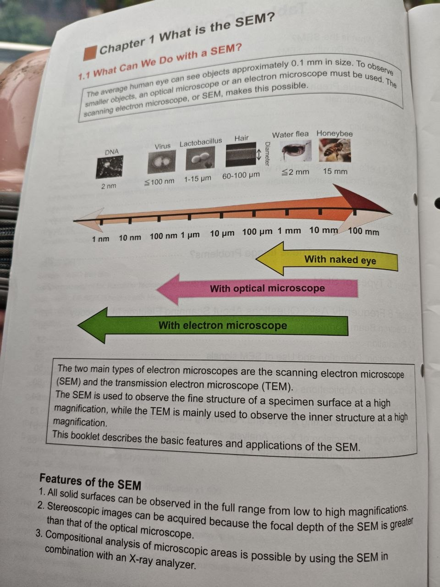
*Visual Plate 01 (Handbook p. 1) — Spatial scale hierarchy, comparison of naked eye, optical microscope (OM), and electron microscope (EM), alongside core strengths of the SEM.*

#### 🔬 Chain of Thought 1.1.1: Physical Resolution Limits & Electron Wave Duality
1. **The Optical Limit (Abbe Criterion)**: The human eye can resolve down to ~0.1 mm (100 µm). Visible light optical microscopes are governed by the diffraction limit: $d_{diff} = 0.61 \lambda / NA \approx 0.61 \times 550\text{ nm} / 1.4 \approx 200\text{ nm}$.
2. **De Broglie Electron Wavelength**: By accelerating electrons across potential difference $V_0$ (0.5 to 30 kV), the relativistic wavelength collapses to picometer scale: $\lambda_e \approx 1.226 / \sqrt{V_0\text{ (Volts)}}\text{ nm}$. At 1 kV, $\lambda_e \approx 38.8\text{ pm}$; at 30 kV, $\lambda_e \approx 7.0\text{ pm}$.
3. **Core Strengths of SEM**:
   - **Continuous Magnification Zoom**: Seamless range from macro-surveying (x10) to ultra-high nanostructure resolving (>x500,000).
   - **Exceptional Depth of Focus**: Small convergence semi-angle $\alpha \approx 1\text{ to }10\text{ mrad}$ provides focal depth over 100x greater than optical microscopy.
   - **Integrated Microanalysis**: Micro-area chemical identification via Energy Dispersive X-ray Spectrometry (EDX).

---

### p. 2 — UV-Ray Blocking Fiber: Optical Microscope vs. SEM Comparative Study


*Visual Plate 02 (Handbook p. 2) — Direct comparison between Optical Microscope (x110) and SEM (x110, x4,000, x15,000) on textile fiber containing inorganic UV-shielding nanoparticles.*

#### 🔬 Chain of Thought 1.1.2: Depth of Field & Nanostructure Resolving Power
1. **Optical Microscope Deficiencies**: At x110, optical microscopy provides true color but suffers from an extremely narrow depth of field. Overlapping fiber curves are heavily out-of-focus.
2. **SEM Focal Depth Superiority**: At x110, the SEM renders every fiber strand razor-sharp across millimeters of topographic relief.
3. **Progressive Nanoscale Magnification**:
   - **x4,000**: Individual inorganic mineral nanoparticles embedded in the polymer sheath become visible as bright contrast points.
   - **x15,000**: Resolves exact particle morphology (100 to 500 nm diameter) and uniform spatial dispersion throughout the synthetic yarn.

---

### p. 3 — Cross-Sectional Observation and Compositional EDX Analysis of UV-Blocking Fiber

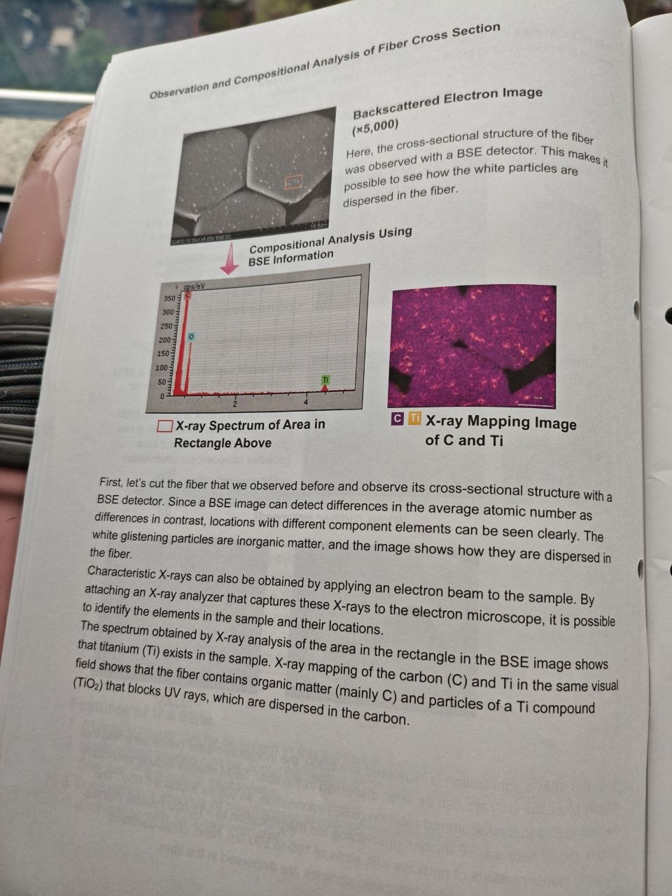
*Visual Plate 03 (Handbook p. 3) — Cross-sectional BSE compositional image (x5,000), Characteristic X-ray EDX Spectrum, and Titanium (Ti)/Carbon (C) 2D elemental maps.*

#### 🔬 Chain of Thought 1.1.3: Z-Contrast & Characteristic X-Ray Fingerprinting
1. **Backscattered Electron (BSE) Z-Contrast**: BSE emission yield $\eta$ scales monotonically with atomic number $Z$. Slicing the fiber perpendicular to its axis reveals bright mineral inclusions ($Z_{Ti}=22$) set within a dark organic polymer matrix ($Z_C=6, Z_H=1$).
2. **EDX Spectrum Verification**:
   - **Carbon K-alpha (0.282 keV)**: Defines the organic polymer fiber core.
   - **Titanium K-alpha (4.51 keV) and K-beta (4.93 keV)**: Confirms the inorganic particles are Rutile/Anatase Titanium Dioxide ($TiO_2$).
3. **2D Elemental Mapping**: Multi-channel spatial mapping proves that the UV-blocking nanoparticles are uniformly distributed throughout the cross-section rather than merely coated on the surface.

---

## 1.2 Principle and Structure of the SEM (pp. 4–6)

### p. 4 — Electron-Matter Interaction Dynamics & Signal Generation Spectrum


*Visual Plate 04 (Handbook p. 4) — 1.2 Principle of SEM: Fundamental interaction volume and taxonomy of secondary electrons, backscattered electrons, characteristic X-rays, Auger electrons, and cathodoluminescence.*

#### 🔬 Chain of Thought 1.2.1: Interaction Volume & Signal Partitioning
When the primary beam ($E_0 = 0.5\text{ to }30\text{ keV}$) strikes a solid:
1. **Secondary Electrons (SE)**: Inelastic collisions with conduction/valence band electrons eject low-energy electrons ($E < 50\text{ eV}$). Because inelastic mean free path is very short ($\lambda \approx 1\text{ to }5\text{ nm}$), only electrons generated within the top 1 to 10 nm escape, yielding high-resolution surface topography.
2. **Backscattered Electrons (BSE)**: Primary electrons elastically scattered through large angles ($>90^\circ$) by atomic nuclei, retaining high kinetic energy ($E \approx 0.5 E_0\text{ to }E_0$) and emerging from sub-surface depths (0.1 to 1 µm).
3. **Characteristic X-rays**: Inner-shell vacancies are filled by outer-shell electron transitions, releasing discrete photon energies $\Delta E = E_K - E_L$ unique to each element.
4. **Cathodoluminescence (CL)**: Radiative recombination of electron-hole pairs in wide-bandgap semiconductors/insulators emits UV, visible, or NIR photons.

---

### p. 5 — Structural Architecture and Layout of the SEM


*Visual Plate 05 (Handbook p. 5) — Structural layout of the Electron Optical Column, Specimen Chamber, Vacuum Subsystem, and Console Display Processor.*

#### 🔬 Chain of Thought 1.2.2: Magnification Mechanism & Optical Chain
1. **Raster Scanning Geometry**: Unlike light microscopes that form an optical image simultaneously via lenses, a SEM forms an image sequentially in time by scanning a finely converged electron probe synchronously with a digital display grid.
2. **Magnification Formula**: $M = L_{display} / W_{scan}$, where $L_{display}$ is fixed display width and $W_{scan}$ is scan width on specimen.

---

### p. 6 — Detailed Functional Descriptions of Column Subsystems 1 to 7


*Visual Plate 06 (Handbook p. 6) — Operating principles and hardware functions of SEM Column Subsystems 1 through 7.*

#### 🔬 Chain of Thought 1.2.3: Subsystem Engineering Breakdown

| Subsystem # | Component Name | Physical Function & Operating Principle |
|:-----------:|:---------------|:----------------------------------------|
| **1** | **Electron Gun** | Emits primary electron stream from cathode (W-filament, $LaB_6$, Schottky, or Cold-FE) and accelerates them through extraction/anode potential (0.1 to 30 kV). |
| **2** | **Condenser Lens** | Electromagnetic lens that converges electron beam, establishes crossover demagnification, and regulates total probe current ($I_p$). |
| **3** | **Deflection Coils** | Upper and lower electromagnetic scan coils that drive 2D raster scanning ($X$ fast scan, $Y$ slow scan) and dynamic stigmation. |
| **4** | **Objective Lens** | Final high-precision optical lens that focuses demagnified electron probe to sub-nanometer spot size on specimen surface. |
| **5** | **Secondary Electron Detector** | Everhart-Thornley (E-T) detector with +250 V collector cage, +10 kV scintillator, light guide, and Photomultiplier Tube (PMT). |
| **6** | **Display & Frame Processor** | Synchronized digital frame grabber that maps amplified detector voltage to 8-bit/16-bit pixel grayscale matrix. |
| **7** | **Vacuum Evacuation System** | Differential pumping array (Ion Pumps, Turbomolecular Pump, Dry Scroll Pump) maintaining $10^{-8}\text{ Pa}$ in gun and $10^{-4}\text{ to }300\text{ Pa}$ in chamber. |

---

# Chapter 2 — Sample Preparation Protocols (pp. 7–10)

## 2.1 Tools, Materials & 2.2 Sampling (p. 7)


*Visual Plate 07 (Handbook p. 7) — Specimen mounting stubs, double-sided conductive tapes, conductive silver/carbon pastes, powder dispersion techniques, and wafer crystalline cleavage methods.*

#### 🔬 Chain of Thought 2.1.1: Electrical Grounding & Powder Dispersion Protocols
1. **Specimen Stubs**: Non-magnetic aluminum alloy with M4 threaded base (flat top, 45° pre-tilted, and cross-section clamping stubs).
2. **Grounding Path Engineering**: Insulating specimens must have continuous electrical path from observation surface to grounded metal stub via conductive carbon tape or colloidal silver/carbon paste.
3. **Powder Dispersion Methods**:
   - **Sprinkling**: Lightly dusting over tacky carbon paste, tapping off excess, and blowing clean with dry $N_2$.
   - **Ultrasonic Suspension**: Dispersing powder in ethanol/IPA under ultrasonic agitation (3 to 5 min), dropping onto aluminum foil, drying, and mounting.
4. **Silicon Wafer Cleavage**: Scoring a 5 mm line along the crystalline plane with a diamond scribe, aligning over a steel fulcrum ruler, and bending downwards to produce a pristine mirror-like cross-section without mechanical polishing damage.

---

## 2.2 Biological & Foodstuffs Chemical Pretreatment (p. 8)


*Visual Plate 08 (Handbook p. 8) — Chemical fixation, conductive staining, graded ethanol dehydration, Critical Point Drying (CPD), and cryo/low-vacuum foodstuff mounting protocols.*

#### 🔬 Chain of Thought 2.2.1: Water Elimination Without Surface Tension Collapse
Biological tissues contain 70 to 90% water. Direct evaporation in vacuum creates massive capillary surface tension forces ($P_{cap} = 2\gamma/r > 100\text{ MPa}$), crushing cellular membranes:
1. **Primary Fixation**: 2.0 to 2.5% Glutaraldehyde in phosphate buffer (cross-links proteins).
2. **Post-Fixation**: 1.0% Osmium Tetroxide ($OsO_4$) (stabilizes lipids and imparts heavy-metal conductivity).
3. **Conductive Staining**: Tannic Acid–$OsO_4$ en bloc staining to eliminate charging.
4. **Graded Ethanol Dehydration**: $50\% \rightarrow 70\% \rightarrow 80\% \rightarrow 90\% \rightarrow 95\% \rightarrow 100\%$ anhydrous ethanol.
5. **Critical Point Drying (CPD)**: Replacing ethanol with liquid $CO_2$ in pressure bomb, heating past critical point ($T_c = 31.1^\circ\text{C}, P_c = 7.38\text{ MPa}$), where phase boundary vanishes ($\gamma = 0$), followed by isobaric gas venting.

---

## 2.3 Metal Sputter Coating & Carbon Evaporation (p. 9)


*Visual Plate 09 (Handbook p. 9) — Sputter coating physics, target materials (Au, Pt, Pt-Pd, Cr, W), film thickness optimization, and high-vacuum thermal carbon evaporation for EDX/BSE.*

#### 🔬 Chain of Thought 2.3.1: Metal Target Selection & Film Thickness Balancing
- **Why Coat?**: (1) Imparts electrical conductivity to eliminate charge-up; (2) Boosts SE yield $\delta$; (3) Conducts beam heat away from delicate samples.
- **Target Material Matrix**:
  - **Gold (Au)**: Grain size ~5–10 nm. Standard for Tungsten SEM (<x30,000).
  - **Platinum-Palladium (Pt-Pd)**: Grain size ~1.5–2 nm. Excellent for FE-SEM (<x100,000).
  - **Pure Platinum (Pt) / Chromium (Cr)**: Grain size < 1 nm. Mandatory for ultra-high resolution FE-SEM (>x200,000).
  - **Carbon (C)**: Low-$Z$ ($Z=6$). Transparent to BSE compositional contrast and produces no interfering X-ray lines in EDX analysis.
- **Thickness Rule**: 5–10 nm for standard work; 1–3 nm for ultra-high-resolution nanostructures.

---

## 2.4 Broad Ion Beam (BIB) Ion Milling (p. 10)

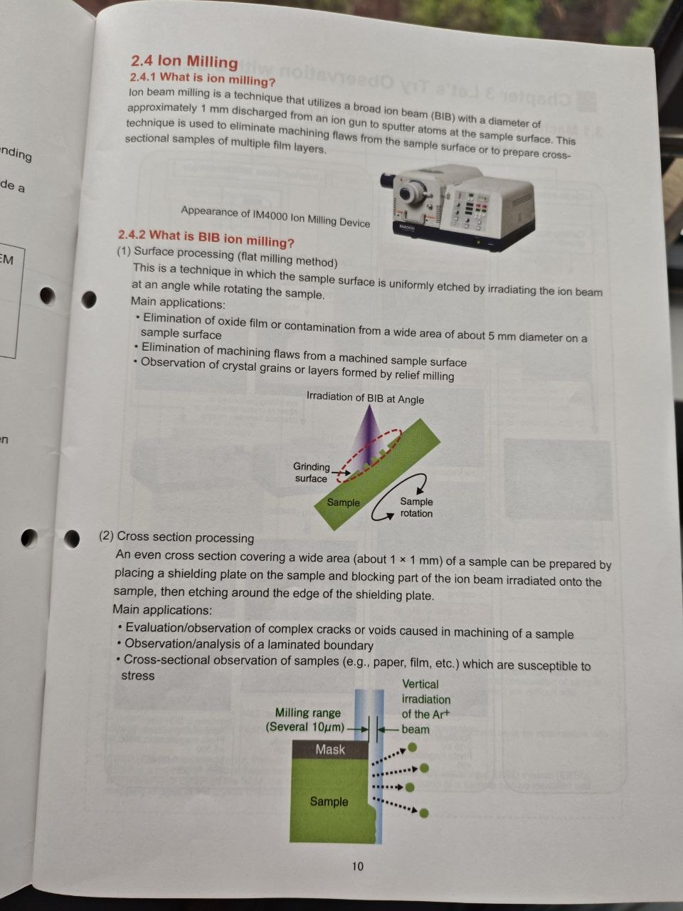
*Visual Plate 10 (Handbook p. 10) — Broad Ion Beam (BIB) sputtering physics: Flat Milling (rotary planarization) and Cross-Section Milling (shielding mask precision slicing).*

#### 🔬 Chain of Thought 2.4.1: Stress-Free Planarization & Mask Shielding Sputtering
Mechanical grinding/polishing introduces smear artifacts, embedding of abrasives, and lattice dislocations in soft composite materials (e.g., solder joints, multilayer semiconductors, batteries).
1. **BIB Operating Principle**: Accelerates Argon ions ($Ar^+$, 1 to 8 kV) into broad beam (0.5 to 1.5 mm diameter) to sputter material atom-by-atom via physical momentum transfer without mechanical shear stress.
2. **Cross-Section Milling**: A tungsten shielding mask blocks half the $Ar^+$ beam. The exposed specimen edge is milled down to form an optically flat, artifact-free cross-section revealing sub-micron interfaces.
3. **Flat Milling**: Shallow-angle grazing ion beam with sample rotation gently planarizes wide-area top surfaces (>5 mm diameter), stripping surface oxidation and polishing scratches.

---

# Chapter 3 — Let's Try Observation with a SEM! (pp. 11–19)

## 3.1 Machined Products, Polymers, Toners & Zeolites (pp. 11–14)

### p. 11 — Machined Products: Fracture Surfaces & Metallography


*Visual Plate 11 (Handbook p. 11) — Fractography of machined metal alloys: Ductile dimple rupture vs brittle intergranular/transgranular cleavage.*

- **Ductile Fracture**: Micro-void coalescence under tensile stress creates cup-and-cone dimple topography.
- **Brittle Fracture**: Rapid crack propagation along crystallographic cleavage planes (transgranular) or grain boundaries (intergranular) produces flat, highly reflective facets with river patterns.

---

### p. 12 — Polymers, Rubbers & Carbon Black Nanofiller Distribution

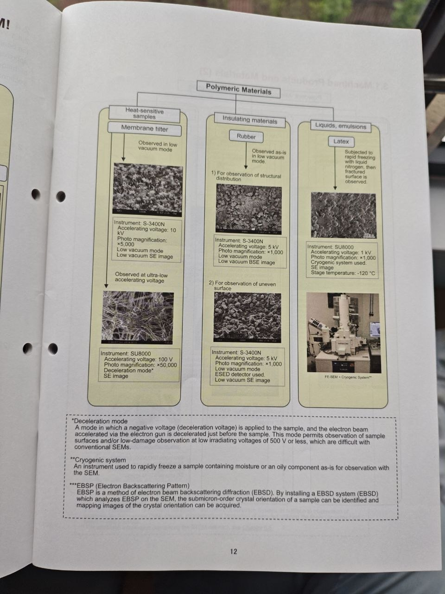
*Visual Plate 12 (Handbook p. 12) — Low-kV FE-SEM observation of rubber matrix with dispersed carbon black reinforcing nanoparticles.*

- **Low-kV Observation (1.0–1.5 kV)**: Prevents beam melting of elastomer chains while visualizing nanoscale carbon black aggregate networks (20–50 nm) responsible for tensile strength and electrical conductivity.

---

### p. 13 — Toners, Cosmetic Powders & Fumed Silica Additives

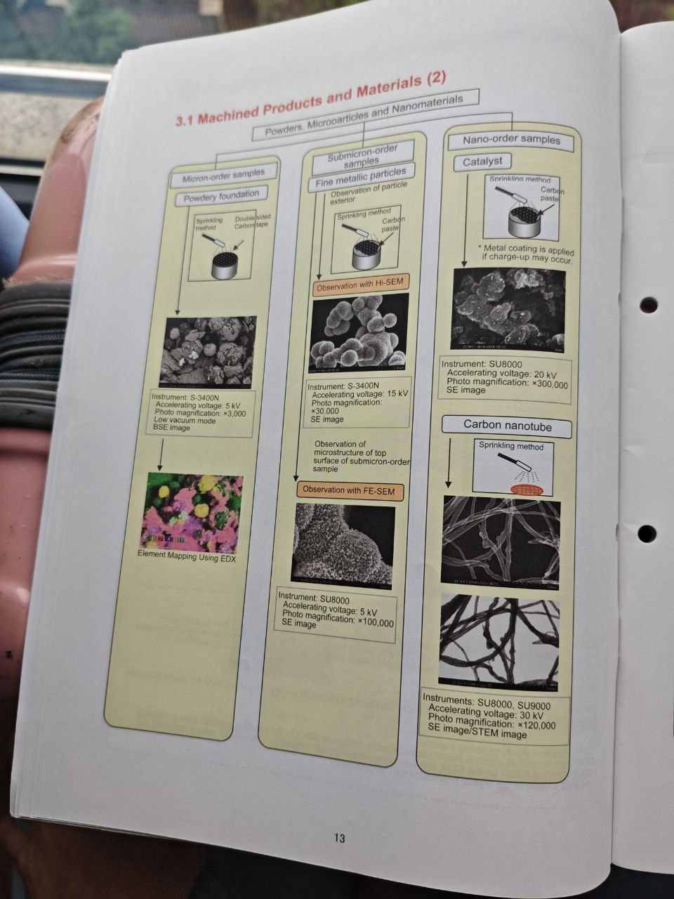
*Visual Plate 13 (Handbook p. 13) — Electrostatic toner particles (x3,000) and surface-treated fumed silica nanoparticles (10–30 nm).*

- **Surface Nanoparticle Adhesion**: High-resolution FE-SEM verifies uniform distribution of hydrophobic silica flow-promoters on 8 µm toner polymer cores, preventing toner caking.

---

### p. 14 — Mesoporous Zeolites, Catalysts & Advanced Ceramics

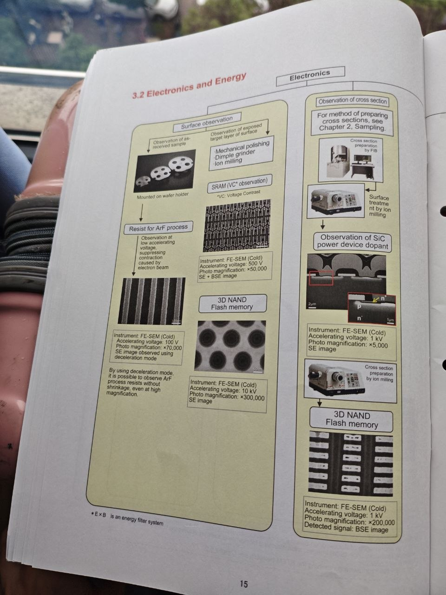
*Visual Plate 14 (Handbook p. 14) — Ultra-high resolution FE-SEM (x300,000) of mesoporous zeolite pore structures and precious metal catalyst dispersion.*

- **Pore Network Imaging**: Resolves 2–5 nm ordered mesoporous channels in aluminosilicate zeolites at 1 kV deceleration mode without conductive metal coating.

---

## 3.2 Electronics & Energy (pp. 15–16)

### p. 15 — Semiconductor Photoresist Patterns & SRAM Voltage Contrast


*Visual Plate 15 (Handbook p. 15) — Sub-50nm ArF immersion photoresist cross-sections and SRAM cell passive/active voltage contrast for fault isolation.*

- **Resist Shrinkage Mitigation**: Ultra-low landing energy ($E_{acc} = 500\text{ V}$) prevents hydrocarbon chain scission and resist line collapse during Critical Dimension (CD-SEM) metrology.
- **Voltage Contrast (VC)**: Negatively biased nodes appear brighter (accelerates SE towards detector); grounded/positively biased nodes appear darker (suppresses SE escape).

---

### p. 16 — Lithium-Ion Battery (LIB) Cathode/Anode Microstructures


*Visual Plate 16 (Handbook p. 16) — Cross-sectional BIB milling and compositional BSE imaging of $LiCoO_2 / NMC$ cathode particles and conductive carbon binder networks.*

- **Interface Integrity**: High-angle BSE resolves active material microcracks, binder separation, and current collector interfacial delamination after electrochemical cycling.

---

## 3.3 Biological Samples & 3.4 Foodstuffs (pp. 17–19)

### p. 17 — Botany: Insects, Leaf Stomata & Cryo/Cool-Stage Observation

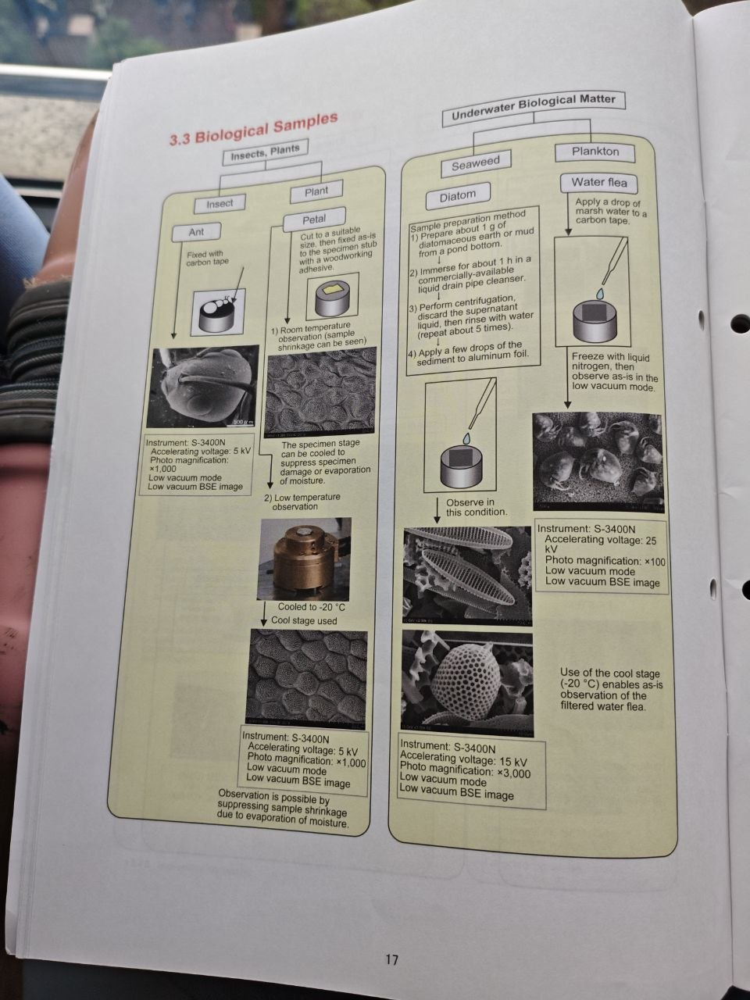
*Visual Plate 17 (Handbook p. 17) — Low-vacuum/Cool-stage observation of open plant leaf stomata and insect compound eye micro-lenses without chemical dehydration.*

---

### p. 18 — Diatoms, Cultured Stem Cells & Bacterial Morphologies


*Visual Plate 18 (Handbook p. 18) — Critical Point Dried diatom silica frustules (30 nm pores) and bacterial biofilms on titanium implant substrates.*

---

### p. 19 — Foodstuffs: Emulsion Matrices, Starch Granules & Cryo-SEM


*Visual Plate 19 (Handbook p. 19) — Cryo-SEM freeze-fracture of dairy emulsions (fat globules in water) and wheat starch granule gelatinization.*

---

# Chapter 4 — What Causes These Image Problems? (pp. 20–24)

## 4.0 Diagnostic Troubleshooting Matrix (p. 20)

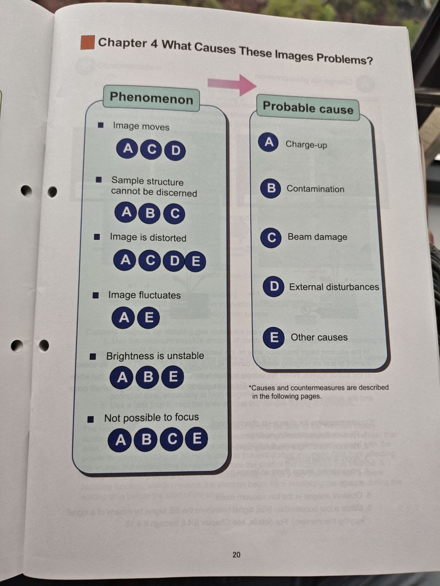
*Visual Plate 20 (Handbook p. 20) — Diagnostic Cross-Reference Matrix: Linking 8 visual symptoms directly to 5 primary physical root causes.*

### 🛠️ Master Symptom-to-Cause Cross-Reference Table

| Visual Symptom Observed on Display | Primary Physical Cause | Recommended Diagnostic Countermeasure |
|:-----------------------------------|:----------------------|:--------------------------------------|
| **1. Abnormal Brightness / Black Halo Bands** | **Cause A: Charge-Up** | Reduce $V_{acc}$, increase scan rate, apply conductive coating, or switch to Low-Vacuum mode. |
| **2. Image Distortion / Ghost Jitter Lines** | **Cause A: Charge-Up** | Ground specimen stub, eliminate ungrounded islands, reduce beam current $I_p$. |
| **3. Dark Square Stains at High Magnification** | **Cause B: Contamination** | Pre-clean sample with plasma cleaner, use liquid nitrogen cold trap, activate beam blanking. |
| **4. Structural Melting / Hole Burning** | **Cause C: Thermal Damage** | Lower accelerating voltage $V_{acc}$, decrease probe current $I_p$, increase working distance $WD$. |
| **5. Jagged Vertical Sawtooth Edges** | **Cause D: Mechanical Vibration** | Inspect acoustic enclosure, verify pneumatic isolators, isolate external roughing pump hoses. |
| **6. Cyclical Wavy Horizontal Line Jitter** | **Cause D: Magnetic Stray Fields** | Relocate nearby transformers/power cables, install Mu-Metal column shielding or active magnetic canceler. |
| **7. Image Shifts & Stretches When Focusing** | **Cause E: Aperture Alignment / Astigmatism** | Align objective aperture center; adjust $X/Y$ electrical stigmators until oval stretching disappears. |
| **8. Severe Loss of Sharpness at High Magnification** | **Cause E: Contaminated Aperture** | Remove and flame-clean or replace platinum objective aperture strip; decontaminate pole-piece. |

---

## 4.1 Cause A: Electrostatic Charging Dynamics & Solutions (p. 21)

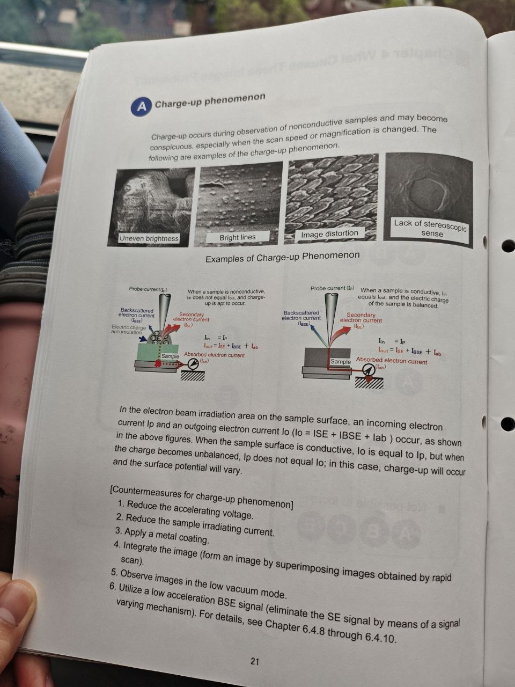
*Visual Plate 21 (Handbook p. 21) — Mechanism of negative/positive charge buildup on non-conductive insulators and rapid fast-scan TV integration countermeasures.*

---

## 4.2 Cause B: Hydrocarbon Contamination Dynamics & Beam Blanking (p. 22)

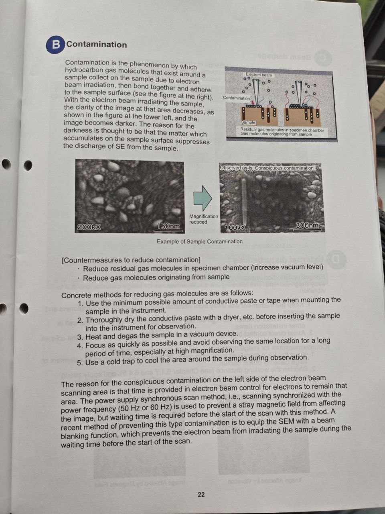
*Visual Plate 22 (Handbook p. 22) — Dynamic adsorption and electron-beam-induced polymerization of volatile hydrocarbon molecules into cross-linked carbonaceous deposits.*

---

## 4.3 Cause C: Thermal Damage & Cause D: External Disturbances (p. 23)

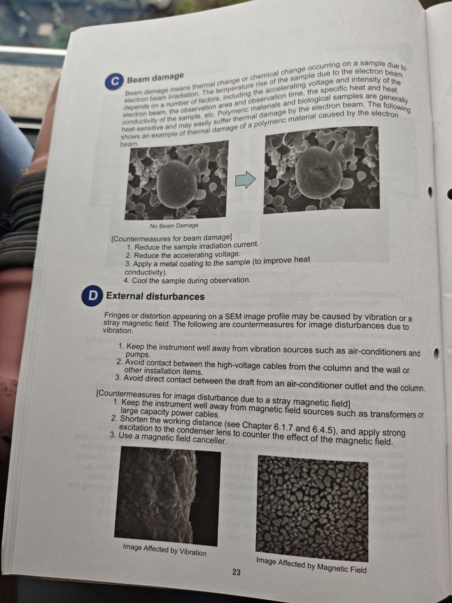
*Visual Plate 23 (Handbook p. 23) — Thermal dissipation limits in organic polymers and differential diagnostic waveforms for mechanical vibration vs 50/60 Hz electromagnetic interference.*

---

## 4.4 Cause E: Objective Aperture Contamination & Optical Misalignment (p. 24)

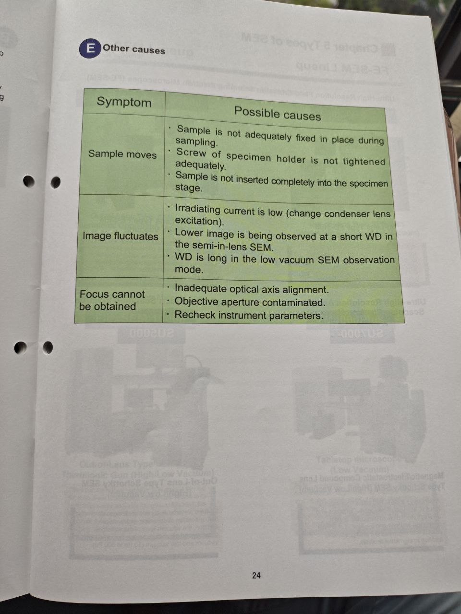
*Visual Plate 24 (Handbook p. 24) — Asymmetric charge accumulation on contaminated objective apertures causing severe uncorrectable astigmatism and image drift during focusing.*

---

# Chapter 5 — Types of SEM Instrumentation (pp. 25–26)

## 5.1 Field Emission SEM Lineup (p. 25)


*Visual Plate 25 (Handbook p. 25) — Ultra-high resolution Field Emission SEM systems: SU9000 (In-Lens CFE, 0.4 nm), Regulus Series (Semi-In-Lens CFE), SU7000 (Schottky Analytical), and SU5000 (Schottky Variable Pressure).*

---

## 5.2 Hi-SEM & Tabletop Lineup (p. 26)

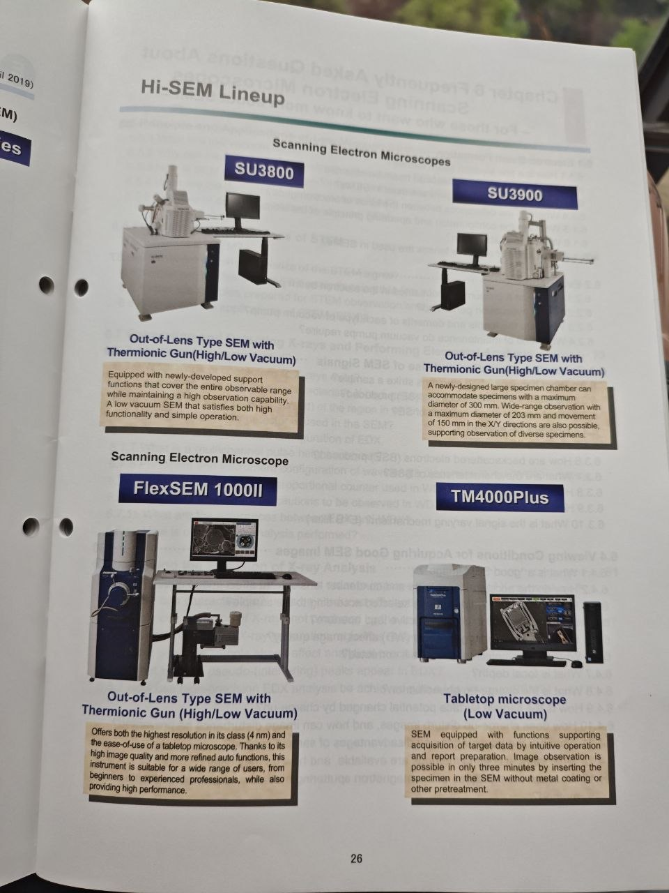
*Visual Plate 26 (Handbook p. 26) — Tungsten/LaB6 Hi-SEM & Tabletop SEM systems: SU3800, SU3900 (Large Chamber, 300 mm wafer, 5 kg stage), FlexSEM 1000II, and TM4000Plus Tabletop SEM.*

---

# Chapter 6 — Frequently Asked Questions About SEM (pp. 27–94)

## 6.0 Master FAQ Directory (pp. 27–28)

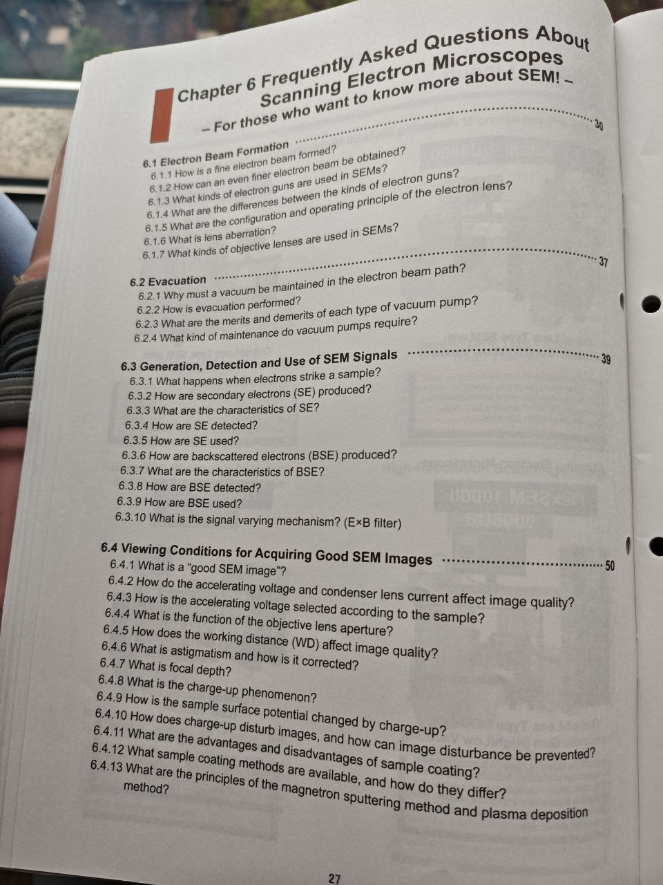
*Visual Plate 27 (Handbook p. 27) — FAQ Directory Part 1: Questions 6.1.1 through 6.4.15 covering Optics, Vacuum, Signals, and Viewing Parameters.*

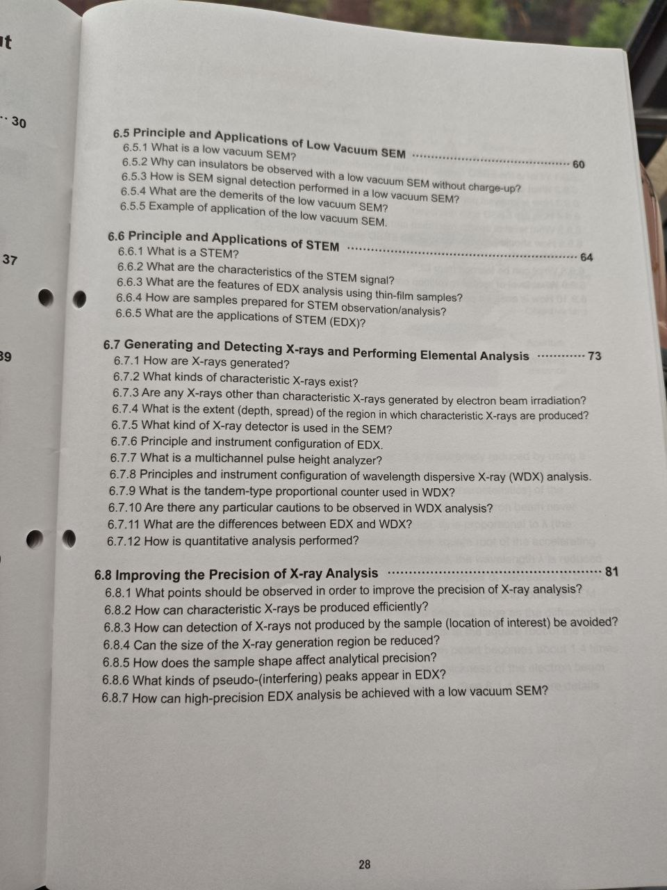
*Visual Plate 28 (Handbook p. 28) — FAQ Directory Part 2: Questions 6.5.1 through 6.9.10 covering Low Vacuum, STEM, EDX/WDX, and Advanced Analytical Techniques.*

---

## 6.1 Electron Beam Formation & Aberration Theory (pp. 29–36)

### p. 29 — Section 6.1 Electron Beam Formation Overview

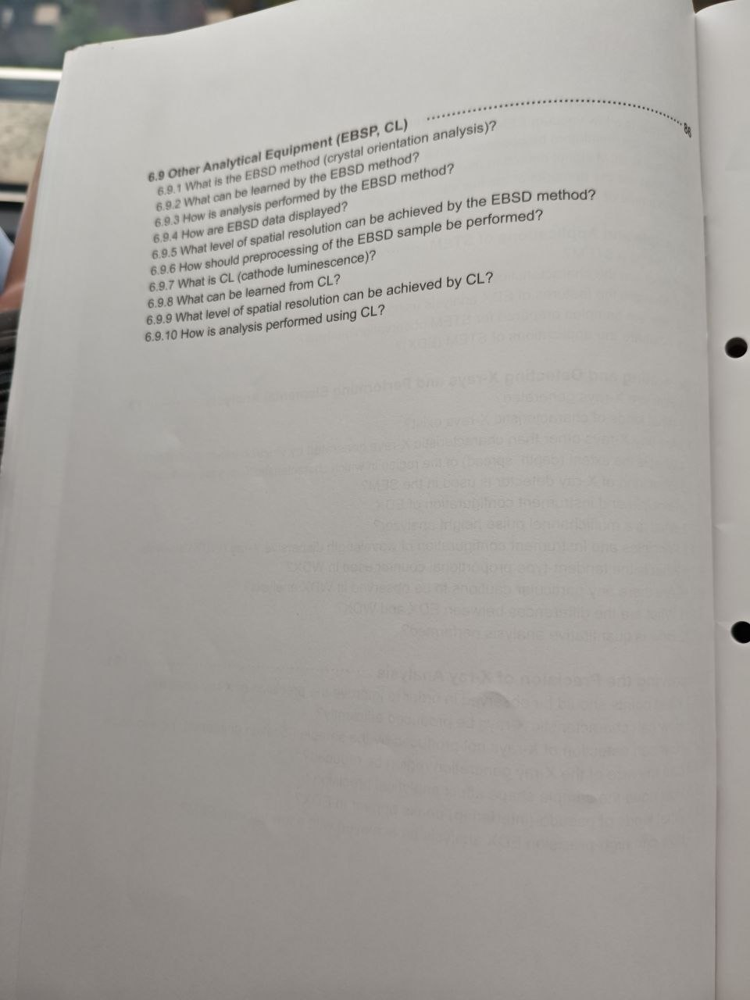
*Visual Plate 29 (Handbook p. 29) — Fundamental objectives of the electron optical column: Demagnifying electron source into a coherent, high-brightness nanometer probe.*

---

### p. 30 — Q6.1.1 & Q6.1.2: Beam Demagnification & Virtual Source

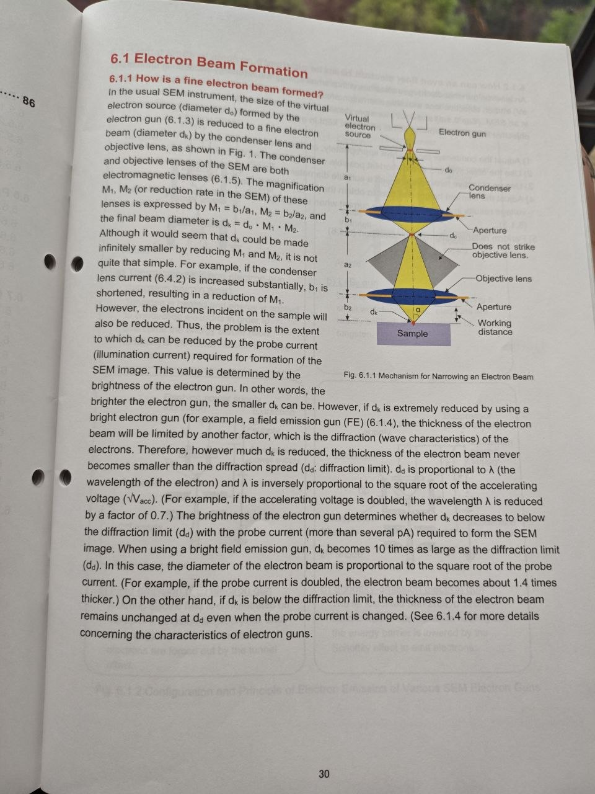
*Visual Plate 30 (Handbook p. 30) — Geometric ray tracing of electron gun virtual crossover ($d_v$) and multi-stage condenser/objective lens demagnification.*

#### 🔬 Chain of Thought 6.1.1: Optical Probe Formation
- The electron gun emits electrons from an apparent virtual source diameter $d_v$ (10–30 µm for W-filament; 15–30 nm for Schottky; < 3–5 nm for Cold FE).
- The condenser lenses ($C_1, C_2$) and objective lens ($OL$) sequentially demagnify this virtual source by total factor $M_{demag} = M_{C1} \times M_{C2} \times M_{OL} \approx 10^{-4}\text{ to }10^{-5}$, forming a focused probe diameter $d_0 = M_{demag} \cdot d_v$ on the specimen plane.

---

### p. 31 — Q6.1.3: Electron Gun Categories (W, LaB6, Schottky, Cold FE)


*Visual Plate 31 (Handbook p. 31) — Schematics and emission mechanisms: Thermionic Tungsten hairpin, $LaB_6$ single crystal, Schottky Thermal FE, and Cold Field Emission (CFE).*

---

### p. 32 — Q6.1.4: Electron Source Performance Metrics & Table 6.1.1

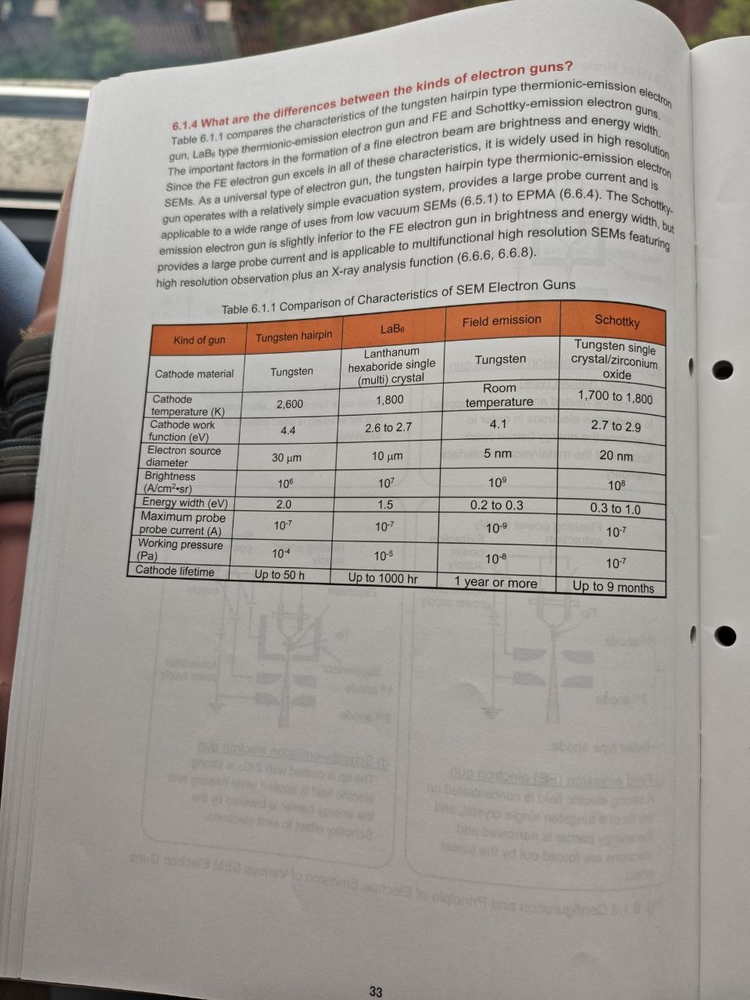
*Visual Plate 32 (Handbook p. 32) — Authoritative Table 6.1.1: Direct comparative evaluation of Brightness, Energy Spread, Virtual Source Size, Required Vacuum, and Operating Lifetime.*

#### 📊 Table 6.1.1: Comprehensive Electron Gun Performance Matrix

| Performance Metric | Thermionic Tungsten (W) | Lanthanum Hexaboride ($LaB_6$) | Schottky Thermal FE | Cold Field Emission (CFE) |
|:-------------------|:------------------------|:------------------------------|:--------------------|:--------------------------|
| **Cathode Material** | Polycrystalline W wire | $LaB_6$ <100> single crystal | ZrO/W <100> emitter | W <310> single crystal needle |
| **Cathode Temperature** | 2,700–2,900 K | 1,800–2,000 K | 1,750–1,800 K | Room Temp (300 K) |
| **Emission Mechanism** | Pure Thermionic | Thermionic (Low Work Func.) | Field-Assisted Thermionic | Pure Quantum Tunneling |
| **Effective Work Function (Phi)**| 4.5 eV | 2.4 eV | 2.8 eV | 4.5 eV (high field) |
| **Virtual Source Size ($d_v$)** | 30–100 µm | 10–20 µm | 15–30 nm | **3–5 nm** |
| **Source Brightness ($B$) [A/cm^2 sr]** | ~10^5 | ~10^6 | ~10^8 | **~10^9** |
| **Energy Spread (Delta E)** | 1.5–3.0 eV | 1.0–1.5 eV | 0.4–0.7 eV | **0.2–0.3 eV** |
| **Required Operating Vacuum** | $10^{-3}\text{–}10^{-4}\text{ Pa}$ | $10^{-5}\text{ Pa}$ | $10^{-6}\text{–}10^{-7}\text{ Pa}$ | **$10^{-8}\text{–}10^{-9}\text{ Pa}$** |
| **Probe Current Stability** | High (±0.1%/hr) | High (±0.2%/hr) | Excellent (±0.5%/24hr) | Moderate (Flashing req.) |
| **Cathode Lifetime** | 50–100 hours | 500–1,000 hours | 1–2 years | 3–5 years |

---

### p. 33 — Q6.1.5: Electromagnetic Condenser & Objective Lens Optics


*Visual Plate 33 (Handbook p. 33) — Lorentz force rotation and focusing of electron trajectories inside rotationally symmetric magnetic pole-piece gaps.*

---

### p. 34 — Q6.1.5 Aperture Angle & Q6.1.6 Lens Aberrations


*Visual Plate 34 (Handbook p. 34) — Mathematical formulations and ray diagrams for Spherical Aberration ($d_s$), Chromatic Aberration ($d_c$), Diffraction ($d_d$), and Total Probe Diameter ($d_{tot}$).*

#### 🔬 Chain of Thought 6.1.6: Probe Diameter Optimization Formula
Total final focused probe diameter on the sample is governed by the quadrature sum of four independent physical broadening components: $d_{tot} = \sqrt{d_0^2 + d_s^2 + d_c^2 + d_d^2}$.
1. **Geometric Demagnified Source Size**: $d_0 = 4 I_p / (\pi^2 B \alpha^2)$.
2. **Spherical Aberration**: $d_s = \frac{1}{2} C_s \alpha^3$.
3. **Chromatic Aberration**: $d_c = C_c \alpha \frac{\Delta E}{E_0}$.
4. **Diffraction Aberration**: $d_d = 0.61 \frac{\lambda_e}{\alpha}$.
> **Key Takeaway**: Because $d_s \propto \alpha^3$ increases with aperture angle while $d_d \propto 1/\alpha$ decreases with aperture angle, there exists a unique **optimum aperture semi-angle** $\alpha_{opt} \approx (1.22 \lambda_e / C_s)^{1/4}$ that minimizes total probe size.

---

### p. 35 — Q6.1.7: Objective Lens Geometries (Out-Lens, In-Lens, Semi-In-Lens)


*Visual Plate 35 (Handbook p. 35) — Cross-sectional pole-piece field profiles and specimen positioning for Out-of-Lens, In-Lens, and Semi-In-Lens (Snorkel) designs.*

#### 🔬 Chain of Thought 6.1.7: Lens Aberration Coefficients vs Specimen Flexibility
- **Out-of-Lens (Conventional)**: Magnetic field is fully contained inside pole piece; specimen sits in field-free region. Allows large specimen sizes (300 mm wafers) and high stage tilts (70°), but has larger $C_s, C_c$ (10–30 mm), limiting ultimate resolution.
- **In-Lens (Ultra-High Resolution)**: Specimen is inserted directly into the magnetic gap between upper and lower pole pieces. $C_s, C_c$ are minimized (< 1–2 mm), enabling sub-nanometer resolution (0.4 nm in SU9000), but specimen size is strictly restricted to small pieces (5 mm).
- **Semi-In-Lens / Snorkel (Hybrid)**: Magnetic field leaks downwards from single upper pole piece onto large specimen surface. Delivers near In-Lens resolution while accommodating large wafers and analytical detectors (EDX, EBSD).

---

## 6.2 Vacuum Evacuation Systems & Maintenance (pp. 37–38)

### p. 37 — Q6.2.1 & Q6.2.2: Vacuum Necessity, Pumping Stages & Differential Orifices


*Visual Plate 37 (Handbook p. 37) — Multi-stage differential vacuum pumping diagram: Gun chamber ($10^{-8}\text{ Pa}$), column intermediate chamber ($10^{-5}\text{ Pa}$), and specimen chamber ($10^{-4}\text{ Pa}$).*

#### 🔬 Chain of Thought 6.2.1: Why Vacuum is Non-Negotiable
1. **Mean Free Path**: High vacuum prevents primary electrons from scattering off residual gas molecules: $\lambda_{MFP} = k_B T / (\sqrt{2} \pi d_{mol}^2 P)$. At atmospheric pressure ($10^5\text{ Pa}$), $\lambda_{MFP} \approx 68\text{ nm}$; at high vacuum ($10^{-4}\text{ Pa}$), $\lambda_{MFP} \approx 68\text{ meters}$.
2. **Cathode Protection**: Prevents oxidative burnout of hot filaments (W, $LaB_6$) and eliminates ion back-bombardment poisoning of Cold-FE emitter tips.
3. **High-Voltage Arc Suppression**: Prevents dielectric gas breakdown across the gun extraction anode (30 kV).

---

### p. 38 — Q6.2.3 Vacuum Pump Types & Q6.2.4 Maintenance Protocols


*Visual Plate 38 (Handbook p. 38) — Operational mechanics of Rotary Pumps (RP), Turbomolecular Pumps (TMP), Sputter Ion Pumps (SIP), and preventative maintenance schedules.*

---

## 6.3 Signal Generation, Detection & Contrast Mechanisms (pp. 39–49)

### p. 39 — Q6.3.1 & Q6.3.2: Electron-Matter Interaction Volume & SE Generation

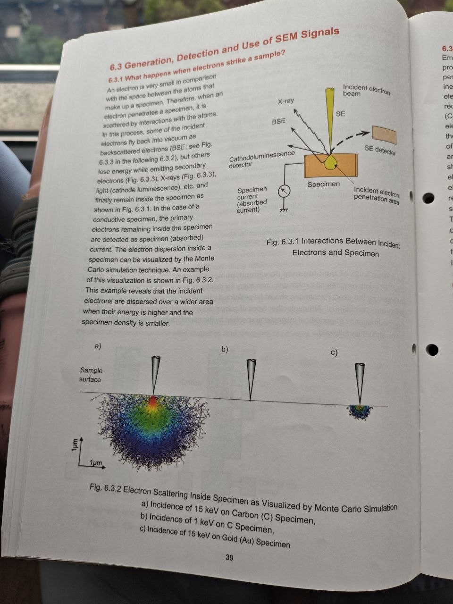
*Visual Plate 39 (Handbook p. 39) — Monte Carlo electron trajectory simulation showing pear-shaped interaction volume and secondary electron emission zone.*

---

### p. 40 — Q6.3.2 SE Classification (SE1, SE2, SE3) & Q6.3.3 SE Energy Spectrum


*Visual Plate 40 (Handbook p. 40) — Spatial origin and trajectory diagrams for SE1 (high-res point of impact), SE2 (BSE exit-point generated), and SE3 (chamber wall / pole-piece BSE collisions).*

#### 🔬 Chain of Thought 6.3.2: Signal Fidelity of SE1 vs SE2/SE3
- **SE1 (Direct Emission)**: Ejected directly at the primary beam impact point. Lateral resolution equals probe diameter ($d_{probe} \approx 1\text{ nm}$). Carries pure ultra-high-resolution surface topographical detail.
- **SE2 (BSE-Induced Emission)**: Ejected by backscattered electrons exiting the specimen surface micrometers away from the beam axis. Carries low-spatial-frequency background noise and compositional contrast.
- **SE3 (Chamber-Induced Emission)**: Ejected when high-energy BSEs strike objective lens pole pieces or chamber walls. Carries no specimen topographical resolution.
- **In-Lens / Upper SE Detectors**: Filter out SE3 and capture predominantly SE1 signals for ultra-crisp nanostructure imaging.

---

### p. 41 — Q6.3.4: SE Detection with Everhart-Thornley (E-T) Scintillator-PMT


*Visual Plate 41 (Handbook p. 41) — Everhart-Thornley detector architecture: +250 V Faraday cage, +10 kV post-acceleration scintillator, light guide, and Photomultiplier Tube.*

---

### p. 42 — Q6.3.4: Specimen Tilt Dependency & Secant Law Edge Effect

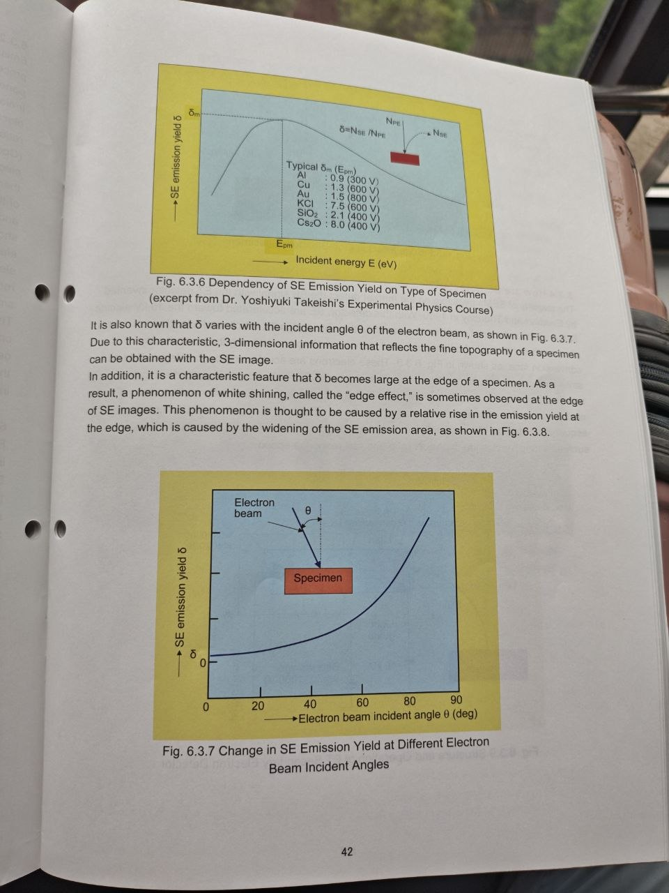
*Visual Plate 42 (Handbook p. 42) — Mathematical derivation and experimental curve for SE yield vs specimen tilt angle: $\delta(\theta) = \delta_0 \sec\theta$.

#### 🔬 Chain of Thought 6.3.4: The Secant Law of Topographic Contrast
As surface tilt angle $\theta$ increases relative to the normal: $\delta(\theta) = \delta_0 / \cos\theta = \delta_0 \sec\theta$. The primary beam path within the near-surface escape depth layer ($t \approx 5\text{ nm}$) increases by factor $1/\cos\theta$. A dramatically higher fraction of excited secondary electrons can reach the surface and escape into vacuum before undergoing inelastic recombination, creating distinct **Edge Brightness Contrast**.

---

### p. 43 — Q6.3.4: Micro-Roughness Edge Brightening & MCP Detectors

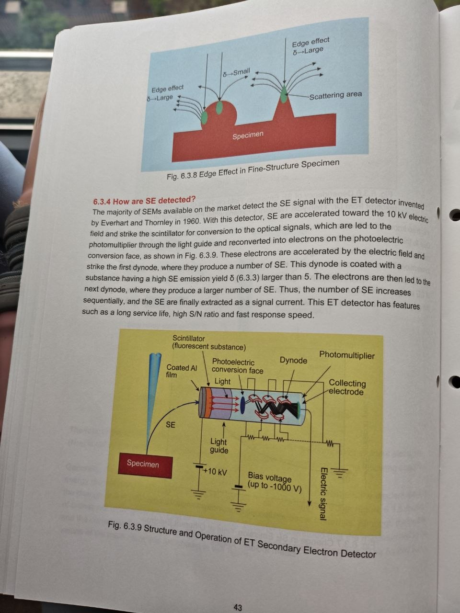
*Visual Plate 43 (Handbook p. 43) — Influence of sub-micron surface roughness on localized SE emission and Micro-Channel Plate (MCP) direct electron detection.*

---

### p. 44 — Q6.3.6: Backscattered Electrons (BSE): Elastic Scattering & Depth

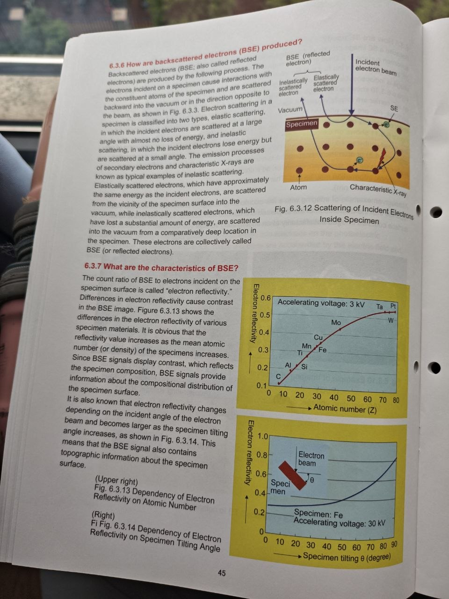
*Visual Plate 44 (Handbook p. 44) — Rutherford elastic nuclear cross-section, large-angle deflection physics, and BSE emission depth profiles.*

---

### p. 45 — Q6.3.5: Practical Secondary Electron Topographic Applications


*Visual Plate 45 (Handbook p. 45) — Exemplary high-contrast SE micrographs illustrating surface finish, crystal facets, and mechanical fracture textures.*

---

### p. 46 — Q6.3.7 & Q6.3.8: BSE Yield vs Atomic Number Z & Detectors

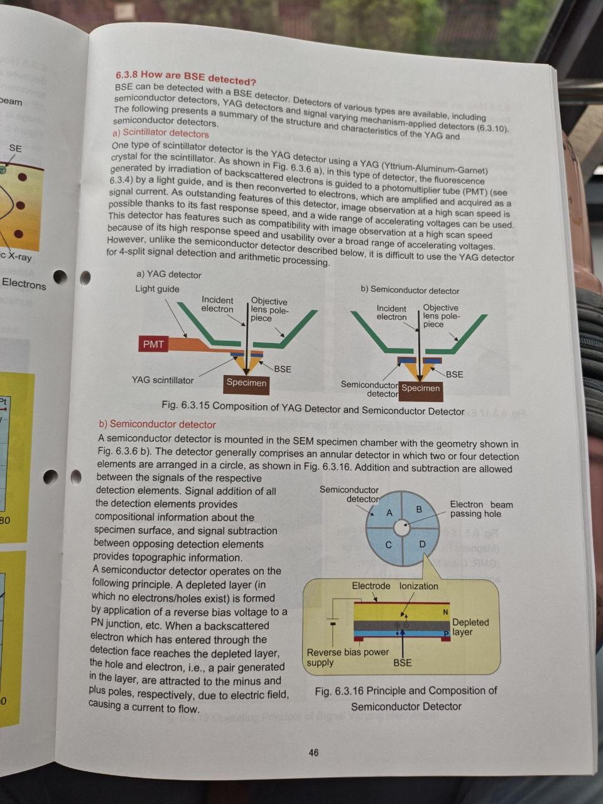
*Visual Plate 46 (Handbook p. 46) — Backscattered electron coefficient curve $\eta$ vs Atomic Number $Z$ and Annular Semiconductor Photodiode / YAG Scintillator detector designs.*

#### 🔬 Chain of Thought 6.3.7: Compositional Z-Contrast Physics
1. **Rutherford Scattering Cross-Section**: Elastic scattering probability per unit solid angle scales quadratically with nuclear charge: $d\sigma_{Ruth}/d\Omega \propto Z^2 / (E_0^2 \sin^4(\theta/2))$.
2. **BSE Yield Function (eta)**: Monotonically increases from $\eta \approx 0.05$ for Carbon ($Z=6$) to $\eta \approx 0.50$ for Gold ($Z=79$) and Platinum ($Z=78$).
3. **Compositional Discrimination**: Regions of higher average atomic number appear significantly brighter, allowing instant visual differentiation between metals, semiconductors, oxides, and polymers.

---

### p. 47 — Q6.3.8: BSE 4-Quadrant Semiconductor Detectors: (A+B) vs (A-B)

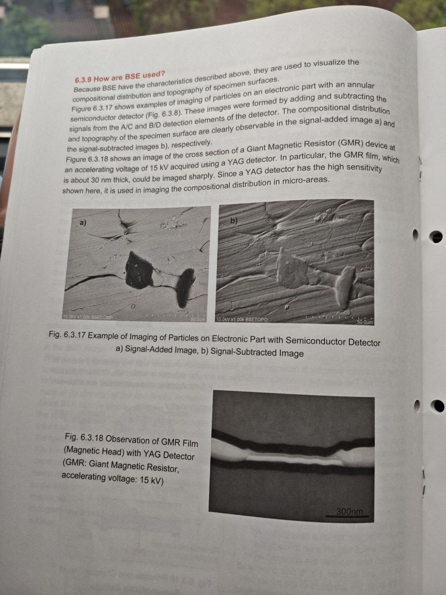
*Visual Plate 47 (Handbook p. 47) — Signal subtraction/addition matrix using 4-quadrant annular solid-state BSE detectors: Compositional Mode ($A+B$) vs Topographic Shadowing Mode ($A-B$).*

#### 🔬 Chain of Thought 6.3.8: Multi-Quadrant Arithmetic Contrast Separation
- **Compositional (COMPO) Mode (A + B)**: Summing signals from opposite quadrant diodes cancels out directional shadowing effects, yielding pure Atomic Number ($Z$) compositional contrast.
- **Topographical (TOPO) Mode (A - B)**: Subtracting signals from opposite quadrant diodes cancels out atomic number brightness variations, amplifying directional shadow contrast to reveal fine surface relief and micro-scratches.

---

### p. 48 — Q6.3.9: Low-kV BSE High-Angle / Low-Angle Discrimination

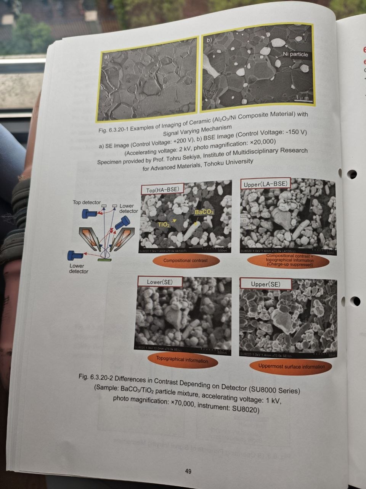
*Visual Plate 48 (Handbook p. 48) — Upper in-lens detector signal separation: High-angle backscattered electrons (compositional) vs low-angle electrons (channeling/topography).*

---

### p. 49 — Q6.3.10: ExB Filter & Voltage Contrast for IC Failure Analysis


*Visual Plate 49 (Handbook p. 49) — Crossed electromagnetic ExB filter architecture and in-situ Passive/Active Voltage Contrast imaging on biased integrated circuits.*

#### 🔬 Chain of Thought 6.3.10: ExB Velocity Filtering & Voltage Contrast
1. **ExB Field Physics**: Orthogonal electric field ($E$) and magnetic field ($B$) are tuned such that high-energy primary electrons pass straight through without deflection ($F_{Lorentz} = q(E + v_p \times B) = 0$).
2. **Secondary Electron Deflection**: Low-energy returning secondary electrons ($v_{SE} \ll v_p$) experience a net Lorentz force that deflects them off-axis directly into the upper in-lens detector.
3. **Voltage Contrast (VC) Diagnostics**:
   - Negatively biased lines ($V = -5\text{ V}$) create a repulsive surface potential, propelling secondary electrons into the extraction field $\rightarrow$ **Appears Bright**.
   - Positively biased lines ($V = +5\text{ V}$) create an attractive potential well that recaptures low-energy SE $\rightarrow$ **Appears Dark**.
   - Open circuit faults and short circuits on semiconductor interconnects are immediately localized by comparing operational state brightness with design layouts.

---

## 6.4 Parameter Optimization & Good SEM Images (pp. 50–59)

### p. 50 — Q6.4.1 & Q6.4.2: Criteria of a Good SEM Image & Accelerating Voltage


*Visual Plate 50 (Handbook p. 50) — Defining image sharpness, information fidelity, S/N ratio, and strategic accelerating voltage selection (0.5–30 kV).*

---

### p. 51 — Q6.4.3: Beam Penetration Depth vs Accelerating Voltage


*Visual Plate 51 (Handbook p. 51) — Direct visual comparison of 1 kV, 5 kV, 15 kV, and 30 kV penetration volumes and surface vs bulk information content.*

#### 🔬 Chain of Thought 6.4.3: Kanaya-Okayama Penetration Range ($R_{KO}$)
The electron penetration depth $R_{KO}$ scales with beam energy to the 1.7th power: $R_{KO} = \frac{0.0276 \cdot A}{\rho \cdot Z^{0.89}} E_0^{1.67}\ [\mu\text{m}]$. At 30 kV in Silicon, $R_{KO} \approx 8.5\ \mu\text{m}$ (signals arise from deep subsurface bulk); at 1 kV in Silicon, $R_{KO} \approx 0.03\ \mu\text{m}$ (30 nm) (interaction volume is confined strictly to topmost atomic layers).

---

### p. 52 — Q6.4.4: Working Distance (WD), Aperture Size & Probe Current

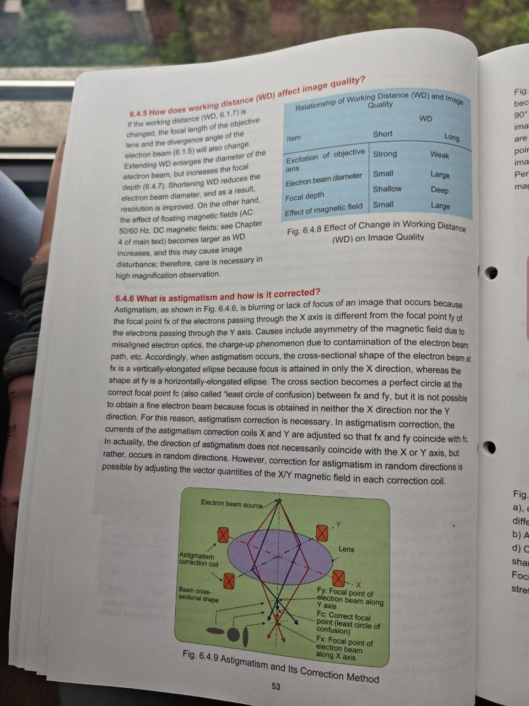
*Visual Plate 52 (Handbook p. 52) — Balancing objective Working Distance ($WD = 2\text{–}30\text{ mm}$), aperture diameter ($30\text{–}100\ \mu\text{m}$), and probe current ($1\text{ pA to }10\text{ nA}$).*

---

### p. 53 — Q6.4.5: Master Parameter Trade-Off Matrix

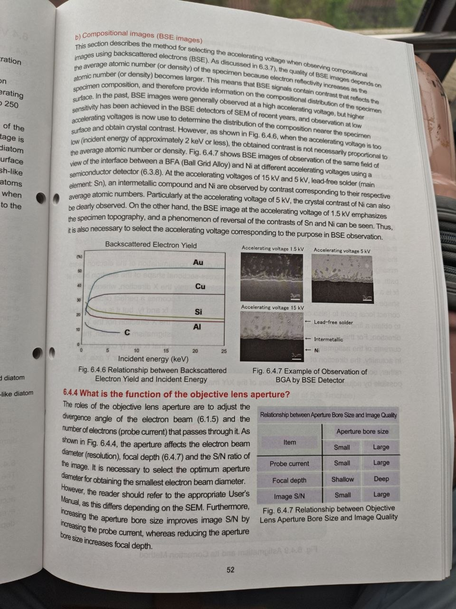
*Visual Plate 53 (Handbook p. 53) — Comprehensive operator trade-off matrix balancing Spatial Resolution, Depth of Focus, S/N Ratio, Charging, and Beam Damage.*

#### 📊 Master SEM Operational Parameter Decision Matrix

| Operational Goal | Accelerating Voltage ($V_{acc}$) | Probe Current ($I_p$) | Working Distance ($WD$) | Objective Aperture | Lens / Column Mode |
|:-----------------|:---------------------------------|:----------------------|:------------------------|:-------------------|:-------------------|
| **Ultra-High Nanoscale Resolution** | High (15–30 kV) or Low (1–2 kV Decel) | Small (1–10 pA) | Short (1.5–4 mm) | Small (30 µm) | In-Lens / Semi-In-Lens |
| **Maximum Depth of Focus (3D Relief)**| Moderate (5–15 kV) | Moderate (10–50 pA) | **Long (15–30 mm)**| **Small (30 µm)** | Out-of-Lens (Small $\alpha$) |
| **High S/N Fast Scanning / Mapping** | Moderate (10–20 kV) | **Large (100 pA to 1 nA)**| Moderate (8–12 mm) | Large (50–100 µm) | Analytical Out-Lens |
| **Quantitative Microanalysis (EDX)**| **High (15–20 kV)** | **Large (0.5–5 nA)**| Analytical Pos. (10–15 mm)| Large (100 µm) | High Current Mode |
| **Non-Conducting / Charging Samples**| **Ultra-Low (0.5–1.5 kV)**| **Minimal (1–5 pA)** | Short/Moderate (3–8 mm) | Small (30 µm) | Low-kV / Retarding Bias |
| **Beam-Sensitive Polymers / Resist**| **Ultra-Low (0.3–1.0 kV)**| **Minimal (1 pA)** | Short (2–4 mm) | Small (30 µm) | Fast TV Scan + Frame Ave |

---

### p. 54 — Q6.4.6: Astigmatism Mechanics, Oval Distortion & Stigmator Alignment

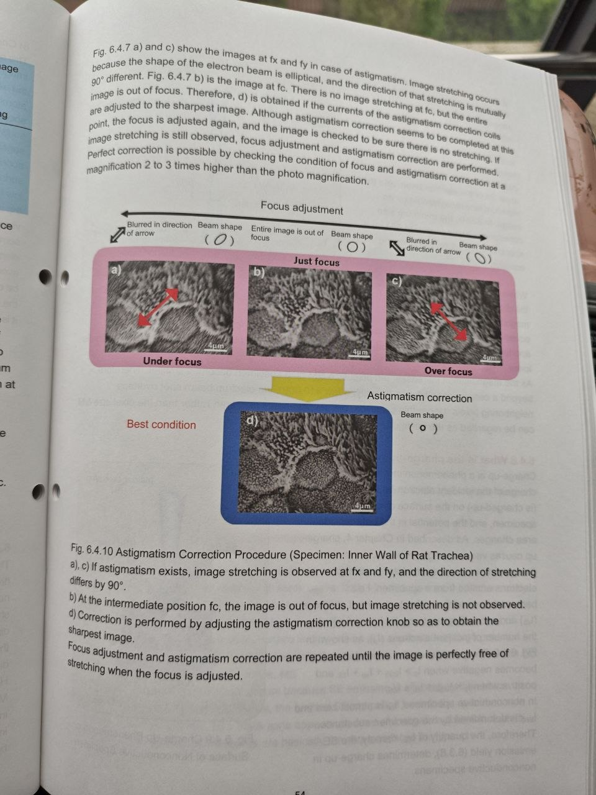
*Visual Plate 54 (Handbook p. 54) — Focus-dependent 90° orthogonal oval stretching and systematic $X/Y$ stigmator alignment protocol.*

#### 🔬 Chain of Thought 6.4.6: Astigmatism Correction Protocol
- **Origin**: Asymmetric magnetic field distribution caused by pole-piece machining tolerances, dirty apertures, or specimen electrostatic fields causes rays in orthogonal planes ($X$ and $Y$) to focus at different focal planes ($f_X \neq f_Y$).
- **Diagnostic Signature**: When passing through focus, the image stretches along axis $\theta$, turns blurry at minimum confusion circle, and stretches orthogonally at $\theta + 90^\circ$.
- **Systematic Stigmate-Focus Iteration**:
  1. Identify the stretching direction at under-focus and over-focus.
  2. Adjust the Stigmator $X$ control until stretching in the $0^\circ/90^\circ$ direction is eliminated.
  3. Adjust the Stigmator $Y$ control until stretching in the $45^\circ/135^\circ$ direction is eliminated.
  4. Refocus objective lens. Repeat until image blurs and sharpens symmetrically with zero directional flare.

---

### p. 55 — Q6.4.7: Focal Depth Formula $D = \frac{d}{\alpha M}$ & Low-kV Non-Destructive Imaging

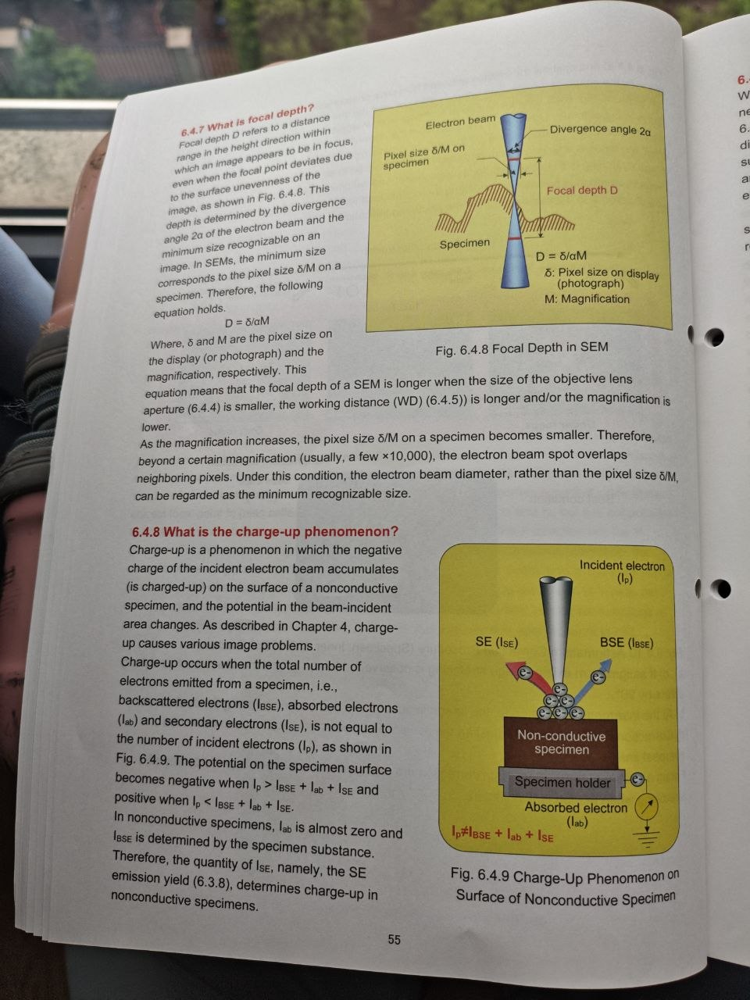
*Visual Plate 55 (Handbook p. 55) — Mathematical formulation of depth of focus $D$, circle of confusion diameter $d$, beam semi-angle $\alpha$, and magnification $M$.*

#### 🔬 Chain of Thought 6.4.7: Depth of Focus Mathematical Derivation
$$\text{Depth of Focus } D = \frac{d_{pixel}}{\alpha \cdot M}$$
- Where $d_{pixel} \approx 0.2\text{ mm}$ (the resolving limit of human naked eye inspecting a printout/display), $\alpha$ is the aperture semi-angle, and $M$ is magnification.
- **To Double Depth of Focus**: (1) Double the working distance $WD$ (reduces $\alpha$); (2) Halve the objective aperture diameter (halves $\alpha$).

---

### p. 56 — Q6.4.8: Non-Conductive Sample Imaging & Total Yield Balance $\sigma = 1$


*Visual Plate 56 (Handbook p. 56) — Total electron emission yield curve $\sigma(E_0) = \delta + \eta$ vs landing energy, defining crossover points $E_1$ (0.5–1.0 keV) and $E_2$ (1.5–3.0 keV).*

#### 🔬 Chain of Thought 6.4.8: Charge Equilibrium Condition $\sigma = 1$
The total electron emission coefficient is: $\sigma(E_0) = \delta_{SE}(E_0) + \eta_{BSE}(E_0)$.
1. **$E_1 < E_0 < E_2$ ($\sigma > 1$)**: More electrons leave the specimen than enter ($I_{emitted} > I_{incident}$). The surface charges slightly **positive** (+1 to +3 V), establishing a stable potential barrier that recaptures excess low-energy SEs, achieving self-limiting dynamic equilibrium with **zero charging distortion**.
2. **$E_0 > E_2$ ($\sigma < 1$)**: Fewer electrons escape than are injected ($I_{emitted} < I_{incident}$). Unbalanced negative electrons accumulate continuously within the dielectric bulk, building massive **negative potential** (thousands of volts), producing blinding flare, violent beam deflection, and image tearing.
3. **Low-kV Strategy**: Tuning beam landing energy precisely to $E_2$ (1.0 to 2.0 kV) allows artifact-free imaging of uncoated glasses, ceramics, and photoresists.

---

### p. 57 — Q6.4.9: Positive vs Negative Charge-Up Potential Barriers


*Visual Plate 57 (Handbook p. 57) — Electrostatic field line simulations: Positive surface potential barrier causing black patch artifacts vs negative charging causing white flaring.*

---

### p. 58 — Q6.4.10 & p. 59 — Q6.4.11: Anti-Charging Coatings & OsO4 Plasma CVD


*Visual Plate 58 (Handbook p. 58) — Carbon resistive thermal evaporation and Osmium Tetroxide ($OsO_4$) plasma polymerization chemical vapor deposition.*

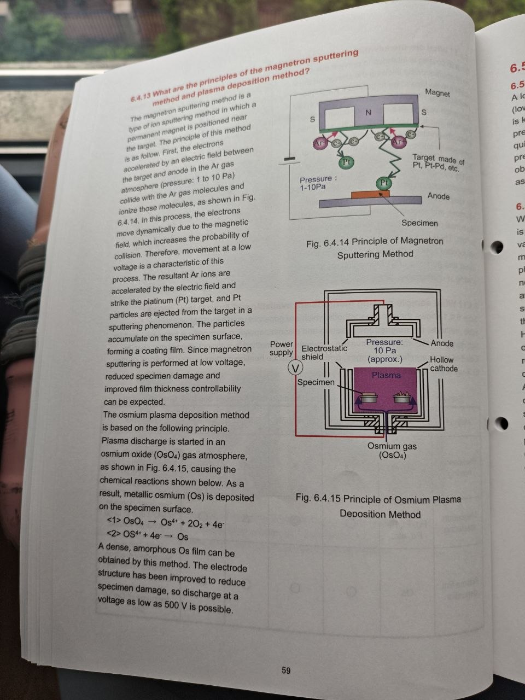
*Visual Plate 59 (Handbook p. 59) — Micrograph comparison: Sputtered noble metal grain agglomeration (3–5 nm) vs ultra-amorphous, grainless Osmium plasma film (0.5–1 nm).*

---

## 6.5 Principle and Applications of Low-Vacuum SEM (pp. 60–63)

### p. 60 — Q6.5.1: Low-Vacuum Charge Neutralization by Gas Ionization

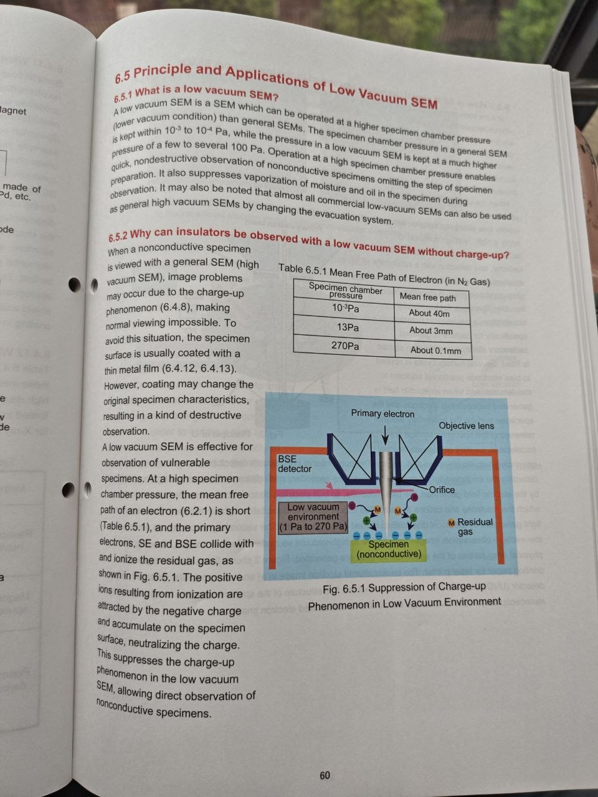
*Visual Plate 60 (Handbook p. 60) — Mechanism of gas molecule ionization: Positive ions neutralise negative surface charge; free electrons amplify environmental signal.*

#### 🔬 Chain of Thought 6.5.1: Gaseous Charge Neutralization Mechanism
In a Variable Pressure / Low-Vacuum SEM (10 to 300 Pa gas environment):
1. The primary electron beam and escaping backscattered electrons collide with residual gas molecules ($N_2, H_2O, \text{or Air}$), causing electron impact ionization: $e_{primary}^- + \text{Gas} \rightarrow e_{primary}^- + \text{Gas}^+ + e_{secondary}^-$.
2. The massive cloud of positive gas cations ($\text{Gas}^+$) is electrostatically attracted to the negatively charged insulating sample surface.
3. Upon landing, the cations recombine with and neutralize accumulated negative electrons, maintaining stable zero ground potential on non-conducting samples without metal coating.

---

### p. 61 — Q6.5.2: Environmental Secondary Electron Detectors (ESED)


*Visual Plate 61 (Handbook p. 61) — Gaseous cascade ionization amplification chain inside environmental detector bias field.*

---

### p. 62 — Q6.5.3: Pressure-Limiting Apertures (PLA) & Electron Scattering Loss

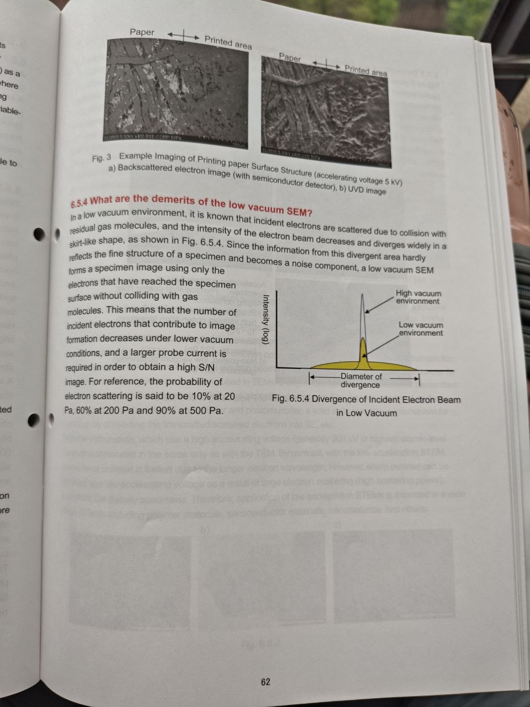
*Visual Plate 62 (Handbook p. 62) — Differential pressure skimmer cones and beam skirt scattering loss (10% at 20 Pa, 60% at 200 Pa, 90% at 500 Pa).*

---

### p. 63 — Q6.5.4: Low-Vacuum Practical Applications

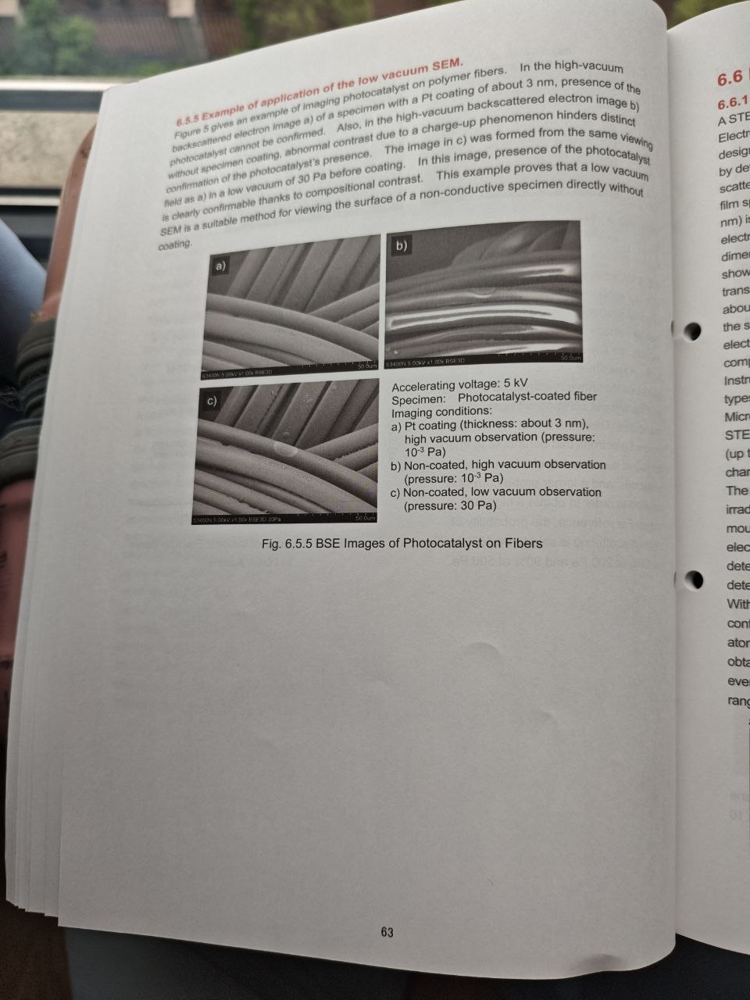
*Visual Plate 63 (Handbook p. 63) — Observation of outgassing polymer coatings, hydrated botanicals, and raw uncoated catalyst matrices in VP mode.*

---

## 6.6 Scanning Transmission Electron Microscopy (STEM) in SEM (pp. 64–72)

### p. 64 — Q6.6.1: STEM Imaging Principle in FE-SEM


*Visual Plate 64 (Handbook p. 64) — Transmission scattering of 30 kV electron probe through ultra-thin foil ($t < 100\text{ nm}$).*

---

### p. 65 — Q6.6.2: BF-STEM vs DF-STEM Detection Geometry

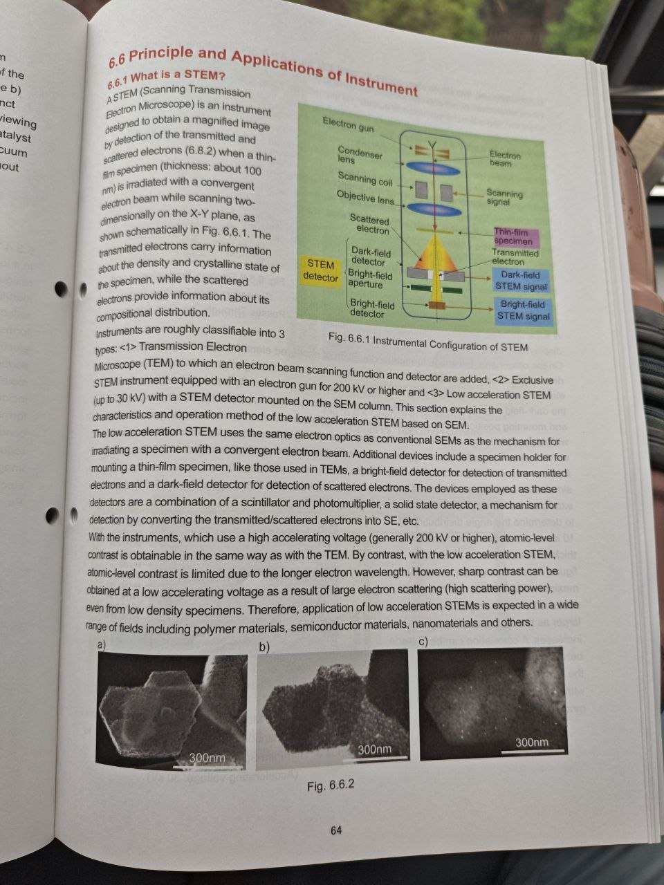
*Visual Plate 65 (Handbook p. 65) — Optical geometry of on-axis Bright-Field detector (0–10 mrad) vs annular Dark-Field detector (10–50 mrad).*

#### 🔬 Chain of Thought 6.6.2: STEM Contrast Mechanisms
- **Bright-Field STEM (BF-STEM)**: Detects directly transmitted and low-angle scattered electrons. Mass-thickness and diffraction phase contrast make dense or crystalline regions appear **dark** (absorptive/diffractive scattering removes electrons from collector aperture).
- **Dark-Field STEM (DF-STEM)**: Collects medium-angle scattered electrons while blocking the unscattered central beam. Crystal defects, grain boundaries, and heavy nanoparticles appear **bright** against a dark background.

---

### p. 66 — Q6.6.3: High-Angle Annular Dark-Field (HAADF) STEM Z-Contrast


*Visual Plate 66 (Handbook p. 66) — Rutherford high-angle incoherent scattering (>50 mrad) yielding pure $Z^{1.7\text{–}2.0}$ contrast for supported metal catalyst nanoparticles (Pt, Au).*

---

### p. 67 — Q6.6.4: Specimen Thickness Limits & Inelastic Mean Free Path


*Visual Plate 67 (Handbook p. 67) — Chromatic aberration probe broadening vs specimen thickness ($t > 100\text{ nm}$ causes severe transmission blur at 30 kV).*

---

### p. 68 — Q6.6.5: Ultramicrotomy Diamond Knife Sectioning

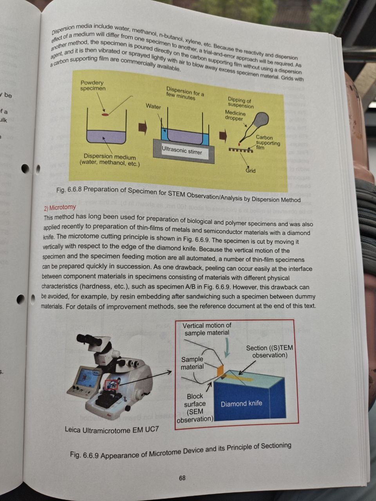
*Visual Plate 68 (Handbook p. 68) — Ultramicrotome device, 45° diamond knife, water boat collection, and 30–50 nm sectioning of polymers and biological tissue.*

---

### p. 69 — Q6.6.6 & p. 70 — Q6.6.7: FIB Micro-Sampling & Semiconductor Protocols


*Visual Plate 69 (Handbook p. 69) — Focused Ion Beam (FIB) in-situ micromanipulator needle lift-out and grid attachment protocol.*

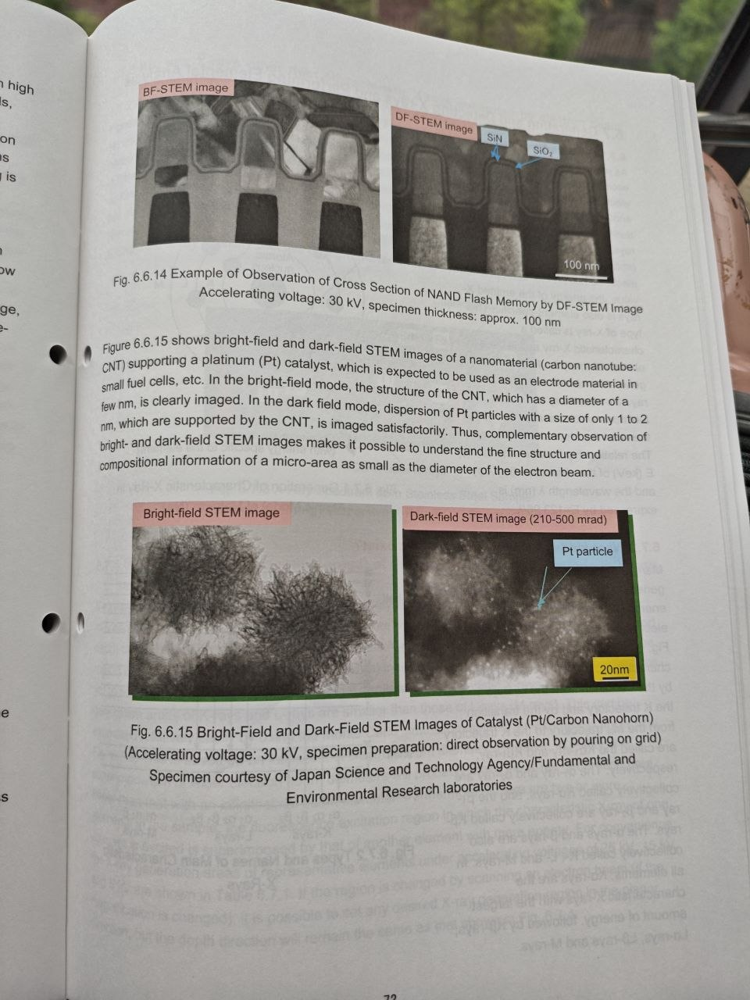
*Visual Plate 70 (Handbook p. 70) — Sub-10nm transistor fin cross-sectioning, low-kV $Ga^+$ ion clean-up, and amorphous damage layer removal.*

---

### p. 71 — Q6.6.8: Ultra-High Resolution STEM: Multi-Layer Gate Dielectrics


*Visual Plate 71 (Handbook p. 71) — High-magnification STEM cross-section resolving alternating nanometer-scale $SiO_2 / Si_3N_4 / High-k$ gate dielectric stacks.*

---

## 6.7 X-Ray Emission, Detection & Microanalysis (pp. 73–80)

### p. 73 — Q6.7.1: Physics of Characteristic X-Ray Generation


*Visual Plate 73 (Handbook p. 73) — Atomic shell energy levels: K-shell (1s), L-shell (2s, 2p), M-shell (3s, 3p, 3d) ionization and electronic relaxation transitions.*

#### 🔬 Chain of Thought 6.7.1: Quantum Atomic Emission Transition Physics
1. **Inner-Shell Ionization**: A high-energy primary electron transfers energy greater than critical ionization energy ($E_0 > E_c$) to an inner core electron (e.g., K-shell), ejecting it into continuum.
2. **Electronic Relaxation**: The atom is left in an excited state. An outer shell electron drops down to fill the core vacancy within $\approx 10^{-15}\text{ seconds}$.
3. **Photon Emission**: The energy difference between initial and final quantum shells is emitted as a monoenergetic **Characteristic X-ray Photon**: $h\nu = E_{initial} - E_{final} = E_L - E_K\ (K\alpha)$.
4. **Competitive De-excitation (Auger Electron)**: Alternatively, the transition energy can be non-radiatively transferred to an outer electron, ejecting an **Auger Electron**. Fluorescent yield $\omega_K$ scales with $Z^4$: low-$Z$ elements favor Auger emission, whereas high-$Z$ elements favor X-ray photon emission.

---

### p. 74 — Q6.7.2: K, L, M Emission Series & Moseley's Law Table


*Visual Plate 74 (Handbook p. 74) — Authoritative Table 6.7.1: K, L, M emission energies for all elements from Carbon (Z=6) to Uranium (Z=92) governed by Moseley's Law.*

#### 🔬 Chain of Thought 6.7.2: Moseley's Law & Characteristic Spectral Fingerprints
Moseley's Law: $\sqrt{\nu} = C \cdot (Z - \sigma)$.
- **K-Series Lines**: Ejected from K-shell; filled from L or M shells ($Z \ge 4$, Beryllium).
- **L-Series Lines**: Ejected from L-shell; filled from M or N shells ($Z \ge 22$, Titanium).
- **M-Series Lines**: Ejected from M-shell; filled from N or O shells ($Z \ge 57$, Lanthanides/Actinides).

---

### p. 75 — Q6.7.3 & Q6.7.4: Bremsstrahlung Continuum & X-Ray Generation Volume


*Visual Plate 75 (Handbook p. 75) — Continuous Bremsstrahlung background radiation spectrum, Duane-Hunt cutoff limit ($E_{max} = E_0$), and Castaing-Anderson X-ray spatial generation volume equation.*

#### 🔬 Chain of Thought 6.7.4: X-Ray Generation Range ($R_X$) vs Electron Range ($R_{KO}$)
Because characteristic X-rays can only be excited when electron kinetic energy exceeds critical ionization threshold ($E(x) > E_c$), the X-ray generation volume $R_X$ is smaller than total electron stopping range $R_{KO}$: $R_X = \frac{0.064}{\rho} (E_0^{1.68} - E_c^{1.68})\ [\mu\text{m}]$. For 15 keV electrons in Copper, $R_X \approx 0.65\ \mu\text{m}$. Even with a sub-nanometer probe, the spatial resolution of EDX microanalysis in a bulk specimen is fundamentally broadened to 0.5 to 2 µm due to internal elastic scattering.

---

### p. 76 — Q6.7.5: Silicon Drift Detectors (SDD) vs Liquid-Nitrogen Si(Li)


*Visual Plate 76 (Handbook p. 76) — Concentric ring ring-drift anode architecture of Silicon Drift Detector (SDD) vs bulky $LN_2$-cooled Lithium-drifted Silicon Si(Li).*

#### 🔬 Chain of Thought 6.7.5: SDD Detector Solid-State Physics
- **Concentric Ring Drift Field**: In an SDD, concentric p+ ring electrodes establish a transverse electric field that funnels photo-generated electron clouds towards an ultra-small central anode ($C_{anode} < 0.1\text{ pF}$).
- **Extreme Capacitance Reduction**: Because noise is proportional to capacitance ($ENC \propto C_{anode}$), SDD delivers superior energy resolution (123–128 eV) at massive count rates (> 1,000,000 cps) with compact Peltier thermoelectric cooling, completely obsoleting liquid nitrogen dewars.

---

### p. 77 — Q6.7.6 & p. 78 — Q6.7.7: EDX Electronics, Shaping Amplifiers & MCA


*Visual Plate 77 (Handbook p. 77) — Charge-sensitive FET preamplifier, triangular shaping amplifier, pileup rejector, and baseline restorer circuitry.*

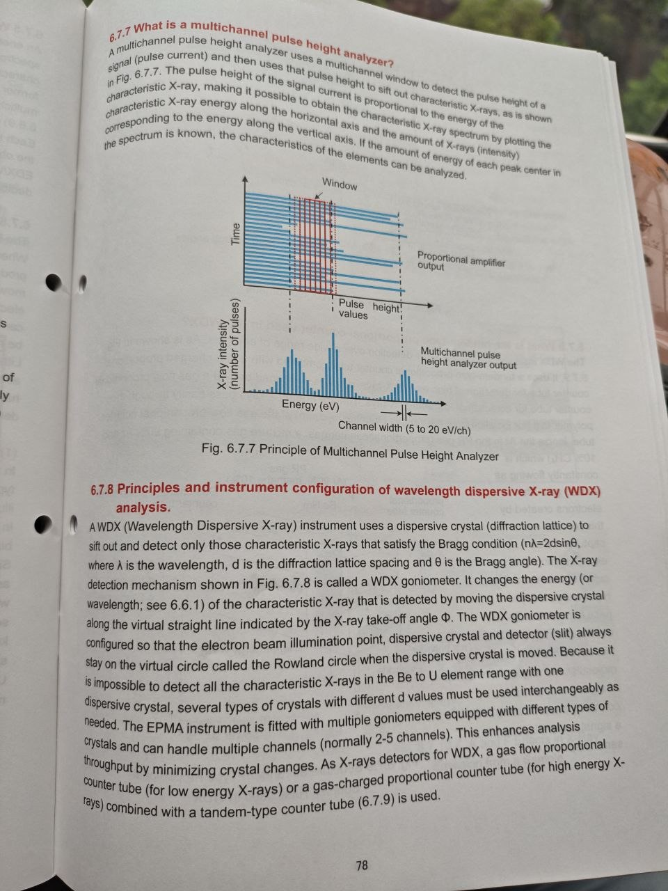
*Visual Plate 78 (Handbook p. 78) — Multichannel Analyzer (MCA) analog-to-digital conversion, pulse-height discrimination, and 2048/4096 energy channel histogram generation.*

---

### p. 79 — Q6.7.8 & p. 80 — Q6.7.9/10: WDX Rowland Circle & WDX vs EDX

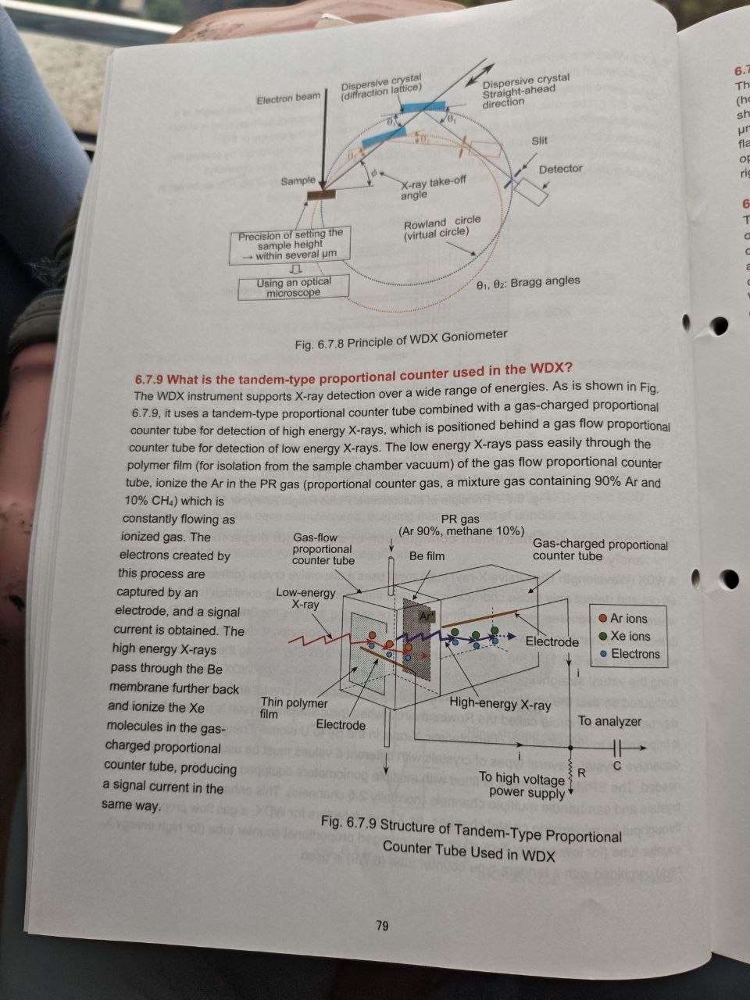
*Visual Plate 79 (Handbook p. 79) — Rowland Circle geometry: Precision curved analyzing crystals (LiF, PET, TAP, STE) and Bragg diffraction ($n\lambda = 2d\sin\theta$).*


*Visual Plate 80 (Handbook p. 80) — Tandem proportional gas counters (flow + sealed) and direct spectral resolution comparison between EDX (130 eV) and WDX (2–10 eV).*

#### 📊 Comprehensive EDX vs WDX Comparative Performance Matrix

| Analytical Parameter | Energy Dispersive Spectrometry (EDX) | Wavelength Dispersive Spectrometry (WDX) |
|:---------------------|:-------------------------------------|:-----------------------------------------|
| **Spectrometric Principle** | Solid-state ionization in semiconductor (SDD) | Mechanical Bragg crystal diffraction |
| **Spectral Energy Resolution**| 123–135 eV (at $Mn\ K\alpha$) | **2–10 eV (over 20x superior)** |
| **Peak Overlap Resolution** | Severe overlaps ($Ti\ K\beta / V\ K\alpha, Ba\ L / Ti\ K, Si\ K / W\ M$) | **Resolves overlapping peaks completely** |
| **Detection Speed & Acquisition** | Parallel collection (All elements simultaneously in seconds) | Serial mechanical crystal wavelength scanning |
| **Minimum Detection Limit (MDL)**| 0.1 wt% (1,000 ppm) | **0.005 wt% (50 ppm, trace analysis)** |
| **Light Element Detection (B, C, N, O)**| Moderate (Absorption in window/dead layer) | **Superb (Synthetic multilayer crystals)** |
| **Beam Current Requirement** | Low (10 pA to 1 nA) (Safe for delicate samples) | High (10 nA to 1 µA) (Causes beam damage) |
| **Sample Geometry Sensitivity** | Low (Tolerates moderate sample tilt/roughness) | **Extremely Strict (Must sit on Rowland circle ±5 µm)** |

---

## 6.8 Improving the Precision of X-Ray Analysis (pp. 81–86)

### p. 81 — Q6.8.1: Quantitative ZAF Matrix Correction & Overvoltage Ratio $U$

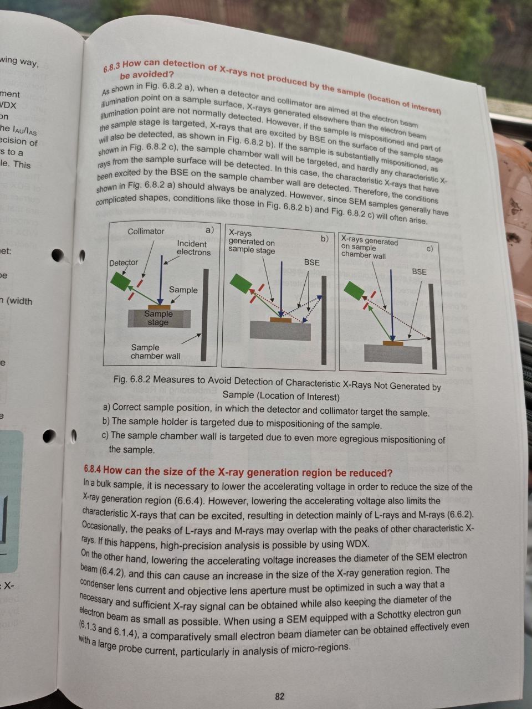
*Visual Plate 81 (Handbook p. 81) — Quantitative matrix correction factor chain: $C_i = [Z \cdot A \cdot F] \cdot k_i$ and the Overvoltage Ratio curve $U = E_0 / E_c \approx 1.5\text{–}2.5$.*

#### 🔬 Chain of Thought 6.8.1: Quantitative Matrix Correction & Overvoltage Rule
1. **Raw Intensity Ratio ($k$-ratio)**: $k_i = I_{specimen} / I_{standard}$.
2. **True Weight Concentration**: $C_i = Z_i \times A_i \times F_i \times k_i$.
   - **$Z$ (Atomic Number Effect)**: Corrects for difference in stopping power ($S$) and backscatter loss ($\eta$).
   - **$A$ (Absorption Effect)**: Corrects for X-rays absorbed by matrix atoms along the escape path.
   - **$F$ (Characteristic Fluorescence)**: Corrects for secondary X-rays excited by higher-energy lines of neighboring elements.
3. **The Overvoltage Golden Rule**: $U = E_0 / E_c$. Optimal setting is $U \approx 1.5\text{ to }2.5$ (e.g., 15 kV for $Fe\ K\alpha$ at 6.4 keV).

---

### p. 82 — Q6.8.2: Collimation & Stray Radiation Shielding

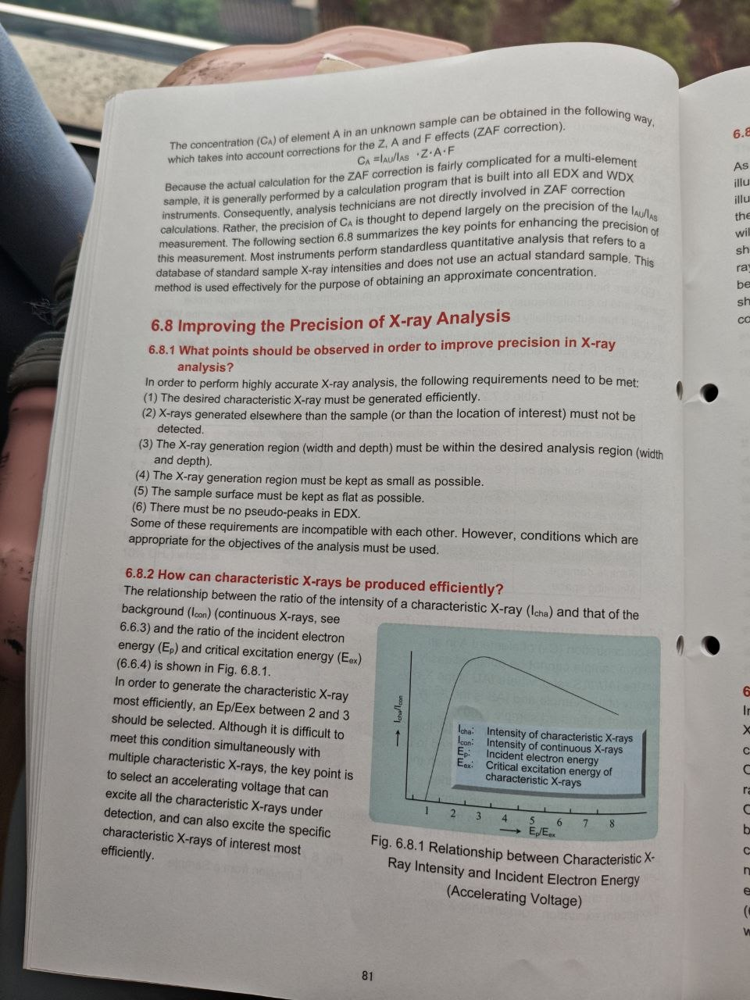
*Visual Plate 82 (Handbook p. 82) — Collimator geometry preventing extraneous X-rays excited by stray BSE hitting objective pole piece or copper stage holders.*

---

### p. 83 — Q6.8.3: Take-Off Angle, Specimen Tilt & Surface Roughness

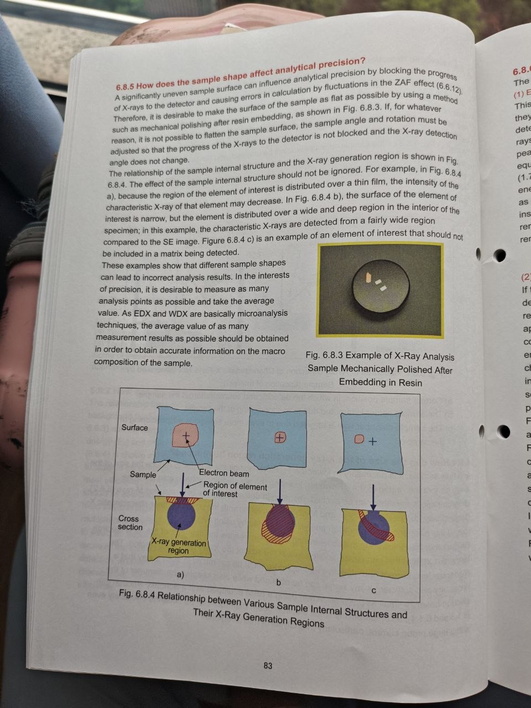
*Visual Plate 83 (Handbook p. 83) — Take-off angle (psi) geometry: Surface roughness shadowing alters absorption path lengths, inducing severe quantitative errors.*

---

### p. 84 — Q6.8.4: Spatial Resolution: Bulk vs Thin-Film Interaction Volumes

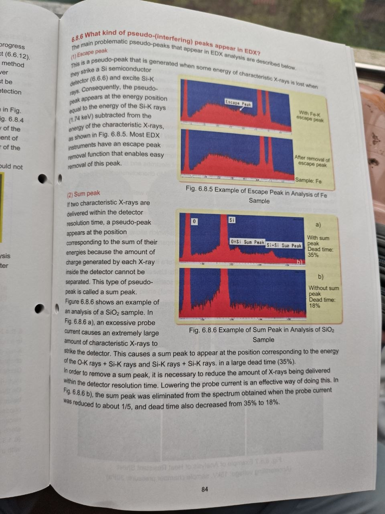
*Visual Plate 84 (Handbook p. 84) — Comparative X-ray generation volumes: Bulk sub-micron pear (1–2 µm) vs Thin-film cylinder (10–30 nm).*

---

### p. 85 — Q6.8.5: EDX Spectral Artifacts & Identification

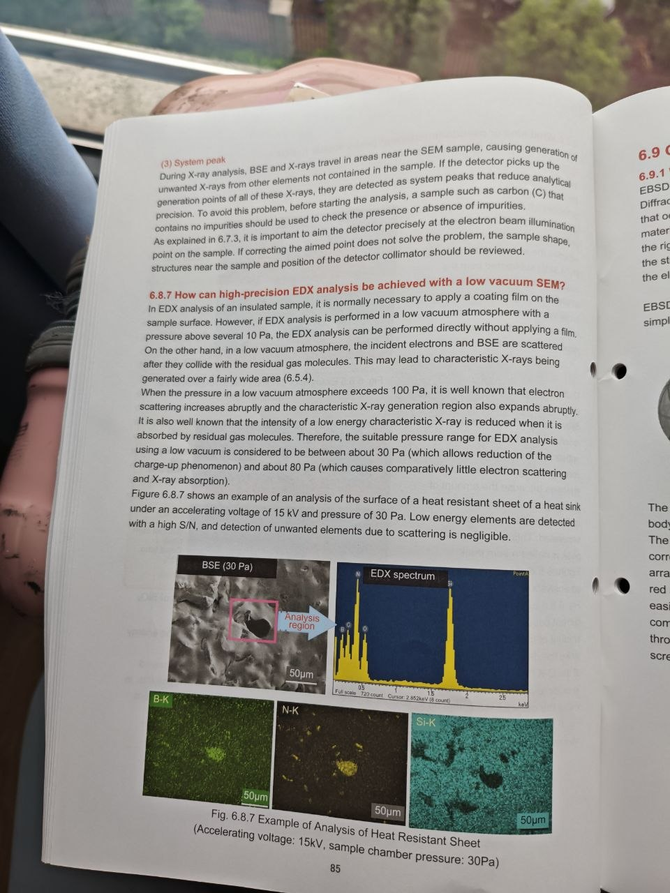
*Visual Plate 85 (Handbook p. 85) — Systematic identification of Escape Peaks ($E - 1.74\text{ keV}$), Sum/Pileup Peaks ($E_1 + E_2$), and Silicon Internal Fluorescence.*

#### 🔬 Chain of Thought 6.8.5: Diagnostic Rule for Spectral Artifacts
1. **Silicon Escape Peak**: An incoming high-energy X-ray photon ionizes a Silicon atom in the detector crystal. If the resulting $Si\ K\alpha$ (1.74 keV) photon escapes through the front window, a ghost peak appears at: $E_{escape} = E_{true} - 1.74\text{ keV}$. Example: Pure Iron ($Fe\ K\alpha = 6.40\text{ keV}$) produces an escape peak at 4.66 keV (mimicking Titanium).
2. **Sum / Pulse Pileup Peak**: When two X-ray photons strike the SDD crystal almost simultaneously within the pulse shaping time, the amplifier records a single double-energy event: $E_{sum} = E_1 + E_2$. Countermeasure: Reduce beam current $I_p$ to lower dead time below 20–30%.

---

### p. 86 — Q6.8.6: Low-Vacuum EDX: Gas Scattering Skirt Effect


*Visual Plate 86 (Handbook p. 86) — Primary electron beam skirt spreading across millimeters in low-vacuum atmospheres and localized PLA cone suppression.*

---

## 6.9 Advanced Analytical Microanalysis: EBSD & Cathodoluminescence (pp. 87–94)

### p. 87 — Q6.9.1: Electron Backscatter Diffraction (EBSD): Kikuchi Bands


*Visual Plate 87 (Handbook p. 87) — Formation of Kikuchi diffraction cones via Bragg reflection of inelastically scattered backscattered electrons.*

#### 🔬 Chain of Thought 6.9.1: Crystallographic Diffraction in SEM
1. **Inelastic High-Angle Divergence**: The incident electron probe strikes the specimen and forms a point-source of inelastically scattered electrons travelling in all directions.
2. **Bragg Reflection on Lattice Planes**: When divergent electrons satisfy Bragg's Law ($n\lambda = 2d_{hkl}\sin\theta_B$) for a family of crystallographic planes $(hkl)$, they undergo coherent constructive diffraction, forming paired Kossel/Kikuchi diffraction cones.
3. **Kikuchi Band Intersection**: Projecting these cones onto a phosphor screen generates an **Electron Backscatter Pattern (EBSP)** consisting of intersecting Kikuchi bands. The width of each band corresponds to the interplanar spacing $d_{hkl}$, and band intersections represent crystallographic zone axes.

---

### p. 88 — Q6.9.2: EBSD Hardware Configuration & 70° Specimen Tilt

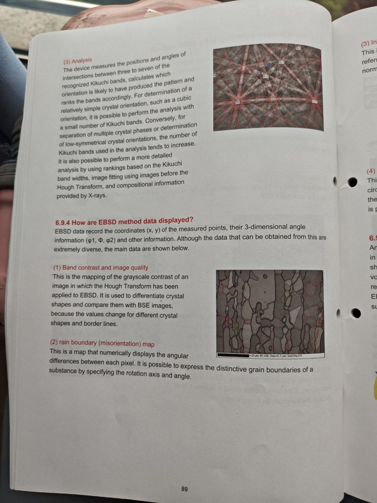
*Visual Plate 88 (Handbook p. 88) — High-tilt stage geometry (70°), retractable phosphor screen, lead glass shielding, and low-noise CMOS/CCD camera array.*

---

### p. 89 — Q6.9.3: EBSD Orientation Mapping (IPF, Grain Boundaries, Phase Maps)


*Visual Plate 89 (Handbook p. 89) — Automated Hough transform band indexing, Euler angle determination, Inverse Pole Figure (IPF) color mapping, and recrystallization/strain quantification.*

---

### p. 90 — Q6.9.4: EBSD Specimen Preparation Protocols

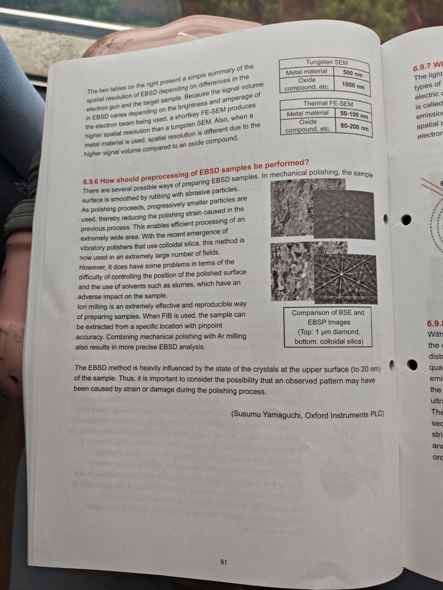
*Visual Plate 90 (Handbook p. 90) — Critical surface preparation: Vibratory colloidal silica polishing (0.02 µm) and BIB broad ion beam flat milling to eliminate mechanical work-hardened amorphous damage layers.*

---

### p. 91 — Q6.9.5: Cathodoluminescence (CL) Principle: Bandgap & Defect Emission


*Visual Plate 91 (Handbook p. 91) — Electronic band structure transitions: Valence-to-conduction bandgap intrinsic emission vs donor-acceptor trap states and crystal dislocations.*

#### 🔬 Chain of Thought 6.9.5: Quantum Radiative Transitions in CL
1. **Carrier Generation**: Primary electrons excite valence electrons across the electronic bandgap ($E_g$), creating free electron-hole ($e^- - h^+$) pairs.
2. **Radiative Recombination**:
   - **Intrinsic Band-to-Band Recombination**: Emits photons with energy equal to bandgap $h\nu = E_g$ (e.g., 3.4 eV / 365 nm UV in $GaN$).
   - **Extrinsic Defect / Impurity Luminescence**: Trapping at mid-gap donor-acceptor pairs, point vacancies, interstitial dopants, or threading dislocations emits sub-bandgap photons ($h\nu < E_g$).
3. **Non-Destructive Defect Mapping**: Dark non-radiative recombination centers pinpoint localized threading dislocations and microcracks in optoelectronic devices (LEDs, Laser Diodes) at nanoscale spatial resolution.

---

### p. 92 — Q6.9.6: Cathodoluminescence Hardware Instrumentation


*Visual Plate 92 (Handbook p. 92) — Retractable diamond-turned ellipsoidal/parabolic collection mirror, fiber optic coupling, Czerny-Turner monochromator spectrometer, and PMT/CCD detection array.*

---

### pp. 93–94 — Q6.9.7: Cathodoluminescence Applications & Defect Characterization

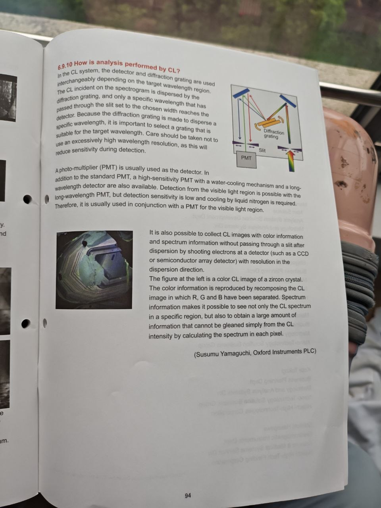
*Visual Plate 93/94 (Handbook pp. 93–94) — Pan-chromatic and monochromatic CL imaging: Semiconductor crystal dislocation networks, compound wafer zoning, and optical spatial resolution limits.*

---

## 🏆 Final Summary & Quick-Reference Operating Checklist

```
========================================================================================
             HITACHI SEM & MICROANALYSIS MASTER OPERATOR CHECKLIST
========================================================================================

[1. PRE-INSPECTION PREPARATION]
  [ ] Verify sample is completely dry, degreased, and firmly adhered to aluminum stub.
  [ ] Ensure electrical continuity to ground via carbon tape or silver paint.
  [ ] If sample is insulating, select coating (Pt for FE-SEM, C for EDX/BSE, or OsO4 plasma).

[2. COLUMN ALIGNMENT & OPTICAL OPTIMIZATION]
  [ ] Select Accelerating Voltage based on observation goal (1-2 kV for surface; 15-20 kV for EDX).
  [ ] Center the Objective Aperture using the aperture wobble / focus sweep alignment.
  [ ] Eliminate Astigmatism iteratively using X and Y stigmators until no directional oval stretching occurs.

[3. SIGNAL SELECTION & CONTRAST DISCRIMINATION]
  [ ] Surface Topography: Secondary Electron (SE / Upper Detector) at low-to-medium kV.
  [ ] Material Composition: Backscattered Electron (BSE / COMPO Mode A+B) or EDX mapping.
  [ ] Surface Relief / Directional Texture: BSE TOPO Mode (A-B).
  [ ] Buried Semiconductor Logic States: Passive/Active Voltage Contrast with ExB filter.

[4. QUANTITATIVE MICROANALYSIS (EDX)]
  [ ] Set overvoltage ratio U = E0 / Ec between 1.5 and 2.5 (Typically 15-20 kV).
  [ ] Verify dead time is between 15% and 30% to prevent pulse pileup artifact peaks.
  [ ] Align sample at exact analytical working distance (10-15 mm) to face SDD detector collimator.
  [ ] Inspect spectrum for Escape Peaks (E - 1.74 keV) and Sum Peaks before concluding trace presence.

[5. ADVANCED CRYSTALLOGRAPHY & EMISSION]
  [ ] EBSD: Tilt sample to 70 deg; verify colloidal silica / BIB damage-free surface preparation.
  [ ] CL: Insert parabolic mirror over specimen; align optical focal point to monochromator entrance slit.
========================================================================================
```

*End of Complete Hitachi SEM Handbook Technical Master Guide.*
