# 3D Microelectronic Packaging — Comprehensive Handbook & Reading Notes

## Micro Raman Spectroscopy for Stress Characterization

Micro Raman Spectroscopy is a non-destructive optical technique widely utilized for stress characterization in semiconductor microelectronic packaging. In standard packaging stress analysis, the measurement is typically conducted in a backscatter configuration to resolve the longitudinal vibrational mode (mode 3) of the silicon crystal lattice. This allows researchers to directly compute the sum of the two in-plane principal stresses ($\sigma_{xx} + \sigma_{yy}$). 

When high numerical aperture optics (NA $> 0.4$) are employed, the excitation light collects sufficient off-axis scattering to resolve all three principal modes of vibration. This enables the complete determination of the tri-axial tensorial stress field within microscopic semiconductor structures.

```
                  Raman Peak Shift vs. Mechanical Stress
 ─────────────────────────────────────────────────────────────────────────
  Backward Shift (cm⁻¹) ◄── [Tensile Stress] ── 0 ── [Compressive Stress] ──► Forward Shift (cm⁻¹)
                               (Directly Proportional: 1 cm⁻¹ ≈ 434 MPa)
```

Compressive and tensile stresses in the silicon substrate induce measurable forward and backward spectral shifts in the Raman peak, respectively. In monocrystalline silicon, a Raman shift of $1\text{ cm}^{-1}$ corresponds linearly to an in-plane stress magnitude of approximately $434\text{ MPa}$.

Because the optical penetration depth in the backscatter configuration is very shallow, Raman spectroscopy primarily captures stress information from near-surface regions. However, the stress field surrounding 3D packaging features—such as Through-Silicon Vias (TSVs)—is inherently tri-axial and extends deep into the bulk substrate. Consequently, empirical near-surface Raman spectroscopy is routinely coupled with Finite Element Analysis (FEA) modeling to reconstruct accurate 3D stress distributions throughout the silicon wafer.

---

## Stresses in Through-Silicon Vias (TSVs)

### Origin and Physical Mechanisms of TSV Stresses

Mechanical stresses in Through-Silicon Via (TSV) structures arise from two primary physical mechanisms:

1. **Growth Stresses**: Originate during the via-filling process by electrodeposition. Copper grows radially inward from the seed layer on the via sidewalls and abuts at the center axis. This growth front often leaves a central seam or thin line of microvoids along the TSV axis. During post-deposition annealing and room-temperature self-annealing, electroplated copper undergoes grain growth and grain boundary elimination, resulting in volumetric shrinkage. Under hydrostatic stress gradients within the TSV, lattice vacancy diffusion toward pre-existing defects causes microvoid growth, threatening mechanical and electrical reliability.

2. **Thermo-Mechanical Stresses**: Induced by the large Coefficient of Thermal Expansion (CTE) mismatch between the electroplated copper filler ($\alpha_{\text{Cu}} \approx 16.5 \times 10^{-6}/\text{K}$) and the surrounding silicon substrate ($\alpha_{\text{Si}} \approx 2.6 \times 10^{-6}/\text{K}$). Operational thermal cycling from fluctuating Joule heating continually cycles these differential stresses over the device lifespan.

```
                      TSV Stress & Voiding Mechanisms
 ─────────────────────────────────────────────────────────────────────────
   [Si Substrate]  │  ◄── Radial Tensile Stress Peak at Si-Cu Interface
  ─────────────────┼──────────────────────────────────────────────────────
   [Cu TSV Filler] │  • Electroplated Cu seam / void growth during annealing
                   │  • Volumetric shrinkage via grain boundary elimination
                   │  • Hydrostatic stress gradients drive vacancy migration
  ─────────────────┼──────────────────────────────────────────────────────
   [Si Substrate]  │  ◄── High CTE Mismatch (α_Cu = 16.5 vs α_Si = 2.6 ppm/K)
```

At ambient temperature, electroplated Cu inside Si vias is under residual tension. During thermal ramp-up, tension is elastically relieved before compressive stress builds up. As temperature rises further, the yield strength and creep resistance of Cu decrease, resulting in stress relief through plastic yielding and creep. 

Thermal cycling leads to the accumulation of hydrostatic stress within the Cu TSV filler, with higher impurity levels correlating to elevated residual stresses. Severe tensile radial stresses concentrate at the Cu-Si interface, making it susceptible to delamination. Radial stress at the interface generally increases with TSV length for a given diameter, whereas hydrostatic stress dependence on TSV diameter is non-monotonic.

---

### Keep-Out Zone (KOZ) and Microstructure Analysis

Near-surface stresses in silicon surrounding Cu TSVs alter the local energy band structure, inducing **piezoresistivity** that degrades electron and hole mobility in nearby active transistors. To prevent circuit performance degradation, a **Keep-Out Zone (KOZ)**—typically several micrometers wide—must be maintained around each TSV where no active devices can be placed. The required KOZ area scales with the square of the TSV diameter and increases for high-aspect-ratio TSVs, imposing a real-estate overhead on high-density 3D IC layouts.

Direct measurement of stress states in Cu-TSVs using X-ray micro-diffraction reveals a significant hydrostatic tensile stress ($\sim 234\text{ MPa}$) at room temperature, which shifts into compression ($-196\text{ MPa}$) during annealing at $200\ ^\circ\text{C}$, and cools back to a lower tensile residual stress ($\sim 167\text{ MPa}$). The initial high tensile stress stems from grain boundary elimination during room-temperature self-annealing. Subsequent thermal annealing lowers residual tensile stress via high-temperature plastic relaxation and creep.

Linear elastic FEA modeling incorporating realistic Cu grain microstructures reveals that stress distribution inside the TSV is highly heterogeneous due to grain anisotropy.

- **Fig. 4.11 — von Mises Stress Distribution in a Cu-TSV Structure**:

  ```mermaid
  graph TD
      subgraph Stress_Distribution["von Mises Stress Field in Cu-TSV (FEA Model)"]
          S1["TSV Corners & Si Interface Extremities<br/><b>Peak Stress: ~350 MPa</b>"]
          S2["Interior Copper Grains<br/><b>Heterogeneous Stress: 50–125 MPa</b>"]
          S3["Cu Grain Boundaries<br/><b>Localized Stress Concentration</b>"]
          S4["Flanking Silicon Regions<br/><b>Low Stress: 0–25 MPa</b>"]
      end
  ```

  ```
  Von Mises Stress Distribution (Cu-TSV Cross-Section)
  ─────────────────────────────────────────────────────
  Y (µm)
   80 ┤ ░░░░░ [Cu TSV - grain boundaries visible] ░░░░░
   70 ┤ ▓▓▓▓▓ [heterogeneous stress field across    ▓▓▓▓▓
   60 ┤ ▓▓▓▓▓  individual grains — stress peaks     ▓▓▓▓▓
   50 ┤ ▓▓▓▓▓  at grain boundaries and near         ▓▓▓▓▓
   40 ┤ ▓▓▓▓▓  TSV-Si interface]                    ▓▓▓▓▓
   30 ┤ ▓▓▓▓▓                                       ▓▓▓▓▓
   20 ┤ ▓▓▓▓▓ [High stress ~350 MPa at corners]     ▓▓▓▓▓
   10 ┤ ░░░░░ [Si regions flanking TSV]             ░░░░░
    0 └────────────────────────────────────────────────
      0       10      20      30      40      50   X (µm)

  Stress scale (MPa):
  ████ ~350   ████ ~125   ████ ~100   ████ ~75
  ████ ~50    ████ ~25    ████ ~0
  ```

  As shown in Fig. 4.11, the highest von Mises stress ($\sim 350\text{ MPa}$) localizes at the TSV corners and Cu-Si interface extremities. Interior Cu grains display a heterogeneous stress field ($50\text{--}125\text{ MPa}$), with localized stress peaking along internal grain boundaries.

---

### Metal Pumping: Extrusion and Intrusion Mechanisms

During thermal cycling, CTE mismatch generates severe shear stress near via extremities. When induced stresses exceed the yield strength of copper, filler plastic deformation occurs. Differential thermal expansion between Cu and Si is accommodated by interfacial sliding, leading to top-surface **extrusion** (or intrusion) of Cu relative to Si. Extrusion typically occurs at via ends and is enhanced by elevated creep rates and grain boundary sliding.

Because copper shrinks significantly relative to silicon during cooling, interfacial sliding produces vertical steps at the via mouth. The rate of via protrusion/intrusion per thermal cycle decreases with increasing cycle count as metal filler stress saturates due to strain hardening.

The majority of Cu pumping manifests as uniform global extrusion ($\sim 10\text{--}30\text{ nm}$), with localized single-grain extrusion occurring in isolated TSVs after high-temperature annealing. Via pitch has minimal effect on pumping height, whereas larger via diameters yield larger average protrusion.

- **Fig. 4.23 — Heating Rate and Temperature Dependence of Copper Pumping**:

  ```mermaid
  graph TD
      subgraph Regime1["High Heating Rate / Small Excursion"]
          R1["Rate-Independent Plasticity Dominates"] --> R1_Res["Smooth Curved Dome Profile at TSV Top"]
      end
      subgraph Regime2["Rapid Heating / Moderate Excursion"]
          R2["GB Sliding & Creep Deformation"] --> R2_Res["Extrusion of Individual Grains"]
      end
      subgraph Regime3["Slow Heating / High Temperature"]
          R3["Interfacial Sliding Dominates"] --> R3_Res["Uniform Vertical Step Protrusion at Interface"]
      end
  ```

  ```
  Heating Rate vs. Thermal Cycling Temperature Range (TSV Protrusion Mechanisms)
  ─────────────────────────────────────────────────────────────────────────────
  ▲ Heating Rate
  │
  │  ┌─────────────────────────┐         ┌─────────────────────────┐
  │  │ High Heating Rate /     │ ───►    │ Rapid Heating & Mod.    │
  │  │ Small Thermal Excursion │         │ Large Temp. Excursions  │
  │  └─────────────────────────┘         └─────────────────────────┘
  │  • Rate-independent                  • Stress relief restricted
  │    plasticity dominates              • High temp allows diffusion
  │  • Smooth overall curvature          • Grain boundary sliding &
  │    at TSV top surface                  creep deformation dominate
  │                                      • Individual grain extrusion
  │
  │                                      ┌─────────────────────────┐
  │                                ───►  │ Slow Heating Rate &     │
  │                                      │ High Temperatures       │
  │                                      └─────────────────────────┘
  │                                      • Interfacial sliding only
  │                                        becomes dominant here
  │                                      • Uniform vertical step
  │                                        protrusion at interface
  │
  └─────────────────────────────────────────────────────────────────────────────►
                       Thermal Cycling Temperature Range

  Visual Diagrams & SEM Profiles (Fig. 4.23):

  [1] High Heating Rate (Small Excursion)   [2] Rapid Heating (Mod. Excursion)   [3] Slow Heating (High Temp)
      ┌───────────┐                            ┌─┬─┬───┬─┐                           ┌───────────┐
      │  ╭─────╮  │                            │ █ │ █ █ │ █ │                           │ │       │ │
   ───┴──┴─────┴──┴───                      ───┴─┴─┴───┴─┴─┴───                       ───┴─┴───────┴─┴───
       [Si] [Cu] [Si]                           [Si] [Cu] [Si]                            [Si] [Cu] [Si]
   • Overall curved dome                    • Extruded individual grains             • Uniform interfacial step
   • Plasticity-dominated                   • Grain boundary sliding                 • Interfacial sliding-dominated
  ```

---

### Electromigration (EM) and Interfacial Reliability

While TSVs have large cross-sectional areas that lower average current density, current crowding and stress gradients at junction interfaces with Back-End-of-Line (BEOL) and Redistribution Layer (RDL) metallizations create severe electromigration (EM) risks. Atomic Flux Divergence (AFD) peaks where top/bottom metallizations meet the TSV, driven predominantly by Joule-heating-induced stress gradients rather than electric potential gradients.

Experimental testing reveals no EM void formation inside the TSV bulk regardless of electron flow direction. Instead, voids form downstream of electron flow at the intersection between the TSV end and the RDL metal layer.

```
                      EM Void Nucleation Mechanism
 ─────────────────────────────────────────────────────────────────────────
   [RDL Cu Line]  ──► Cu atoms migrate freely outward
  ─────────────────────────────────────────────────────────────────────────
   [TiN Barrier]  ──► Blocks Cu replenishment from TSV bulk into RDL
  ─────────────────────────────────────────────────────────────────────────
   [TSV Cu Bulk]  ──► TiN barrier causes localized vacancy accumulation &
                      void nucleation at electron exit interface
```

The TiN diffusion barrier layer blocks Cu replenishment from the TSV into the void region while Cu migration outward into RDL lines continues. Thus, the TiN barrier layer becomes the primary driver of EM void nucleation. In thin Cu lines, voids span the entire line thickness. In thick Cu lines, current crowding concentrates voiding at the TiN/Cu-line interface.

- **Fig. 4.27 — EM Damage and Sn Migration under Extreme Conditions ($1.5 \times 10^5\text{ A/cm}^2$, $200\ ^\circ\text{C}$, 20 Days)**:

  ```mermaid
  graph TD
      subgraph EM_Damage["Extreme EM Failure Modes (Fig. 4.27)"]
          D1["M1 Layer Voiding<br/><b>90° Electron Turn & Current Crowding</b>"]
          D2["Sn Interfacial Electromigration<br/><b>Migration from Solder Ball along TSV-Si Interface</b>"]
      end
  ```

  ```
  Fig. 4.27 — EM Damage & Sn Migration near TSV Top / BEOL Interface
  ─────────────────────────────────────────────────────────────────────────────
  (a) FIB Cross-Sectional Diagram & Voiding in M1 Layer:

        BEOL Layers  [ M3 / M2 Interconnects ]
       ═════════════════════════════════════════════
        M1 Layer     ┌─────┐   [Void ⚡] ◄── Red Arrow (M1 Voiding)
       ──────────────┴─┐   └───┬─────────
                       │   e⁻  │  ◄── 90° Electron Turn (Current Crowding)
                       │   ▲   │
                       │   │   │  ◄── Upward Electron Flow through TSV
                       │  TSV  │
                       │  Cu   │
                       │Filler │
       ────────────────┴───────┴───────────────── [Si Substrate]
                       (5 µm Scale)

  (b) Sn Kα EDS X-Ray Map (Sn Migration Path):

                       ┌───────┐
                       │  M1   │
                       └─┬───┬─┘
                         │ █ │ ◄── Sn Concentration in Dark Ion Features
                         │ █ │
                         │ █ │ ◄── Sn Electromigrated from Bottom Solder
                         │ █ │     Ball along TSV-Si Interface into Filler
                         └───┘
  ```

Under extreme EM exposure, two primary damage mechanisms occur: Metal-1 (M1) voiding due to current crowding at $90^\circ$ electron turns upon exiting the TSV, and Sn electromigration from bottom solder balls along the TSV-Si interface into the TSV bulk.

---

### Thermal Dependence of TSV Protrusion

When TSVs are subjected to thermal excursions, protrusion height increases non-linearly with temperature. Deformations follow two distinct temperature regimes:

1. **Low-Temperature Regime ($T < 260\ ^\circ\text{C}$)**: Lower rate of protrusion increase, dominated by dislocation motion within Cu grains.
2. **High-Temperature Regime ($T > 320\ ^\circ\text{C}$)**: Higher rate of protrusion increase, dominated by **diffusional creep**—combining grain boundary diffusion (**Coble creep**) and lattice diffusion (**Nabarro-Herring creep**)—alongside dislocation creep.

Coble creep initiates at lower temperatures, transitioning to Nabarro-Herring creep as temperature rises. The combined activation of diffusional and dislocation creep leads to accelerated protrusion above $320\ ^\circ\text{C}$.

- **Fig. 6.16 — Mean Protrusion vs. Temperature & Homologous Temperature ($T/T_m$)**:

  ```mermaid
  graph TD
      subgraph LowTemp["Low Temperature Regime (T < 260 °C)"]
          A1["Dislocation Motion"] --> A2["Grain Deformation"]
          A2 --> A3["Lower Protrusion Rate"]
      end
      subgraph HighTemp["High Temperature Regime (T > 320 °C)"]
          B1["Coble Creep<br/>(Grain Boundary Diffusion)"]
          B2["Nabarro-Herring Creep<br/>(Lattice Diffusion)"]
          B3["Dislocation Creep"]
          B1 & B2 & B3 --> B4["Accelerated Protrusion Rate"]
      end
      LowTemp -->|"Temperature Increase (>320 °C)"| HighTemp
  ```

  ```
  Fig. 6.16 — Mean Protrusion vs. Temperature (Regime Transition)
  ─────────────────────────────────────────────────────────────────────────────
  Homologous Temp (T/Tm) ──►  0.28    0.35    0.42    0.50    0.57    0.64
                             ┌───────────────────────────────────────────┐
                         8 ┤ │                                        ■  │
                           │ │                                      /    │
                         7 ┤ │                                    ■      │
  Mean Protrusion (a)      │ │                                  /        │
                         6 ┤ │                                ■          │
                           │ │                              /            │
                         5 ┤ │                          ■                │
                           │ │                        /                  │
                         4 ┤ │                    ■ ----- (Diffusional   │
                           │ │                  ■ - - - -  Creep Regime) │
                         3 ┤ │              ■ - -                        │
                           │ │          ■   / (Dislocation Motion)       │
                         2 ┤ │      ■   ■                                │
                           │ │    ■                                      │
                         1 ┤ │  ■                                        │
                             └─┴──────┴──────┴──────┴──────┴──────┴──────┘
                               0     100    200    300    400    500    600
                                             Temperature (°C)
  ```

---

### Geometric and Sidewall Roughness Effects on Protrusion

TSV cross-sectional geometry significantly influences defect diffusion rates. Tracking the number of mobile defect atoms (DAs) shows that rectangular TSVs contain the highest DA count (fastest defect diffusion), followed by trapezoidal and hourglass geometries.

This behavior is governed by the perimeter-to-cross-sectional-area ratio ($P/A$):
- **Rectangle**: $P/A = 0.008$ (lowest ratio $\to$ fewest boundary sink sites $\to$ highest mobile DA count $\to$ fastest diffusion).
- **Trapezoid**: $P/A = 0.011$
- **Hourglass**: $P/A = 0.014$ (highest ratio $\to$ dense boundary sink sites $\to$ defects cluster and become immobile $\to$ lowest protrusion).

- **Fig. 6.17 — Mobile Defect Atoms (DAs) Decay vs. Time Step by TSV Geometry**:

  ```mermaid
  graph LR
      subgraph Rect["Rectangle TSV (P/A = 0.008)"]
          R1["Lowest Perimeter/Area Ratio"] --> R2["Fewer Immobile Boundary Sites"]
          R2 --> R3["Highest Mobile Defect Atoms (DAs ~60-90)"]
          R3 --> R4["Fastest Defect Diffusion Rate"]
      end
      subgraph Trap["Trapezoid TSV (P/A = 0.011)"]
          T1["Intermediate P/A Ratio"] --> T2["Moderate Boundary Clustering"]
          T2 --> T3["Medium Mobile Defect Atoms (DAs ~30-50)"]
      end
      subgraph Hour["Hourglass TSV (P/A = 0.014)"]
          H1["Highest Perimeter/Area Ratio"] --> H2["Dense Boundary Defect Clustering"]
          H2 --> H3["Defects Become Immobile"]
          H3 --> H4["Lowest Mobile Defect Atoms (DAs ~10-30)"]
          H4 --> H5["Lowest Protrusion Height"]
      end
  ```

  ```
  Fig. 6.17 — Mobile Defect Atoms (DAs) Decay vs. Time Step by TSV Geometry
  ─────────────────────────────────────────────────────────────────────────────
  The Number of DAs
    400 ┤ ■ [Rectangle] (P/A = 0.008)
        │ ● [Trapezoid] (P/A = 0.011)
    300 ┤ ▲ [Hourglass] (P/A = 0.014)
        │  \   \   \
    200 ┤   \   \   \
        │    ■   \   \
    100 ┤    ●─■──■───────■───■─────■───■──── [Rectangle: Highest DAs ~60-90]
        │    ▲─●──●───────●───●─────●───●──── [Trapezoid: Medium DAs ~30-50]
      0 └────▲─▲──▲───────▲───▲─────▲───▲──── [Hourglass: Lowest DAs ~10-30]
          500  3000   6000   9000  12000  15000
                        Time step

  TSV Geometries (Cross-sections):
    ┌────────┐          ┌──────┐          ┌────────┐
    │        │          │  \/  │          │ \    / │
    │        │          │  /\  │          │  \  /  │
    └────────┘          └──────┘          └────────┘
    Rectangle          Hourglass          Trapezoid
   (P/A = 0.008)      (P/A = 0.014)      (P/A = 0.011)
  [Fastest Diffusion] [Immobile Clustering] [Intermediate]
  ```

During TSV drilling, via sidewalls develop **sidewall scalloping roughness**, generating localized tensile stresses up to $340\text{ MPa}$ at groove roots. This roughness increases leakage current and alters TSV capacitance ($C$), resistance ($R$), and inductance ($L$). Larger roughness amplitudes ($R_a$) physically impede upward Cu atom movement, reducing mean protrusion height.

- **Table 6.2 — Roughness Parameters ($R_a$, $\lambda_a$) vs. Protrusion Heights (Models MSR1–MSR7)**:

  | Model No. | Roughness Amplitude $R_a$ | Wavelength $\lambda_a$ | Mean Protrusion ($a$) | Maximum Protrusion ($a$) |
  | :--- | :--- | :--- | :--- | :--- |
  | **MSR1** | 10 | $40\pi$ | 4.7 | 7.6 |
  | **MSR2** | 20 | $40\pi$ | 4.5 | 7.6 |
  | **MSR3** | 30 | $40\pi$ | 4.3 | 8.2 |
  | **MSR4** | 40 | $40\pi$ | 3.8 | 7.4 |
  | **MSR5** | 20 | $30\pi$ | 3.0 | 4.6 |
  | **MSR6** | 20 | $20\pi$ | 4.2 | 7.3 |
  | **MSR7** | 20 | $10\pi$ | 5.0 | 9.3 |

---

### Protrusion Profile Prediction Criteria

Predicting TSV protrusion profiles requires evaluating four key factor categories:

1. **Loading Conditions**: Protrusion occurs under compressive normal strains ($\varepsilon_x, \varepsilon_y$) or shear strain ($\gamma_{xy}$); TSVs under pure shear strain ($\gamma_{yx}$) exhibit **no protrusion**. Compressive $\varepsilon_x$ causes bumping near top surface edges (flat center), whereas tensile $\varepsilon_y$ causes center bumping. Symmetric loading and larger strain magnitudes near the top end yield larger protrusions.
2. **Cu Grain Microstructure**: Top-end grains contribute significantly more to protrusion than deeper grains. Smaller vertical grain size ($y$-direction) increases protrusion. Larger horizontal grain size ($x$-direction) increases protrusion under $\varepsilon_x, \gamma_{xy}$, but decreases protrusion under tensile $\varepsilon_y$.
3. **Temperature**: Higher thermal exposure increases protrusion height due to enhanced plasticity and diffusional creep.
4. **Geometry & Sidewall Roughness**: TSVs with smaller roughness amplitude $R_a$ and smaller scalloping wavelength $\lambda_a$ exhibit larger protrusions.

---

## Bonding & Interconnect Technologies

### Solder-Based vs. Direct Cu–Cu Bonding

Solder-based bonding is widespread in 3D interconnects, employing one-sided solder microbumps (e.g., Cu / barrier / SnAg) bonded to Cu pads. While soft solder provides process robustness by accommodating bump height non-uniformity and co-planarity variations, it suffers from time-consuming multi-layer processing, mechanical damage during handling, temperature limits set by solder melting points ($221\text{--}232\ ^\circ\text{C}$), brittle Intermetallic Compound (IMC) formation, and pitch scaling constraints.

Solid-Liquid Interdiffusion (**SLID**) and Solid-State Interdiffusion (**SSID**) consume all solder to form full-IMC joints. SSID operates below the solder melting point but requires high pressure ($50\text{--}150\text{ MPa}$).

- **Fig. 8.1 — Interconnect Bonding Structures Comparison**:

  ```mermaid
  graph TD
      subgraph Fig81A["(a) Conventional Soldering"]
          direction TB
          A1["Upper Substrate / Cu Pad"] --- A2["Intermetallic Compound (IMC) Layer"]
          A2 --- A3["Bulk Solder Microbump (SnAg / SnCu)"]
          A3 --- A4["Intermetallic Compound (IMC) Layer"]
          A4 --- A5["Lower Substrate / Cu Pad"]
      end
      subgraph Fig81B["(b) SLID / SSID Bonding"]
          direction TB
          B1["Upper Substrate / Cu Pad"] --- B2["Continuous Intermetallic (IMC) Joint<br/>(Solder Fully Consumed)"]
          B2 --- B3["Lower Substrate / Cu Pad"]
      end
      subgraph Fig81C["(c) Direct Cu–Cu Bonding"]
          direction TB
          C1["Upper Substrate / Cu Pad"] --- C2["Pristine Direct Cu–Cu Bond Interface<br/>(No Solder / No IMCs)"]
          C2 --- C3["Lower Substrate / Cu Pad"]
      end
  ```

  ```
  Fig. 8.1 — Interconnect Bonding Structures Comparison
  ─────────────────────────────────────────────────────────────────────────────
  (a) Conventional Soldering      (b) SLID / SSID Bonding       (c) Direct Cu–Cu Bonding
  ┌───────────────────────┐       ┌───────────────────────┐       ┌───────────────────────┐
  │    Upper Substrate    │       │    Upper Substrate    │       │    Upper Substrate    │
  ├───────────────────────┤       ├───────────────────────┤       ├───────────────────────┤
  │   Cu Metallization    │       │   Cu Metallization    │       │   Cu Metallization    │
  ├───────────────────────┤       ├───────────────────────┤       ├───────────────────────┤
  │     IMCs Layer        │       │   Intermetallic (IMC) │       │                       │
  ├───────────────────────┤       │      Full Layer       │       │    Direct Cu–Cu       │
  │     Solder Bulk       │       │  (Solder Consumed)    │       │      Interface        │
  ├───────────────────────┤       ├───────────────────────┤       │ (No Solder / No IMCs) │
  │     IMCs Layer        │       │   Cu Metallization    │       ├───────────────────────┤
  ├───────────────────────┤       ├───────────────────────┤       │   Cu Metallization    │
  │   Cu Metallization    │       │    Lower Substrate    │       ├───────────────────────┤
  ├───────────────────────┤       └───────────────────────┘       │    Lower Substrate    │
  │    Lower Substrate    │                                       └───────────────────────┘
  └───────────────────────┘
  ```

Direct Cu–Cu bonding eliminates solder and IMCs, offering higher electrical conductivity, lower power consumption, reduced RC delay, superior EM resistance, and excellent heat dissipation for high-temperature power electronics ($250\ ^\circ\text{C}$). The primary challenge is rapid surface oxidation ($\text{CuO}, \text{Cu}_2\text{O} > 10\text{ nm}$), which is non-self-limiting and inhibits bonding below $300\ ^\circ\text{C}$. Surface passivation and controlled atmospheres enable low-temperature bonding down to $100\text{--}150\ ^\circ\text{C}$.

---

### Thermo-Compression Bonding (TCB) & Crystal Plane Diffusivity

Cu–Cu Thermo-Compression Bonding (TCB) relies on inter-diffusion at elevated temperatures ($300\text{--}400\ ^\circ\text{C}$) under compression ($100\text{--}150\text{ MPa}$ for as-plated Cu; $< 2.5\text{ MPa}$ for CMP Cu). Temperatures $> 300\ ^\circ\text{C}$ risk thermal stress damage and interfacial voiding.

Surface diffusivity ($D_{\text{surface}}$) displays extreme anisotropy across Cu crystal planes:

- **Table 8.2 — Cu Surface Diffusion Coefficients ($D_{\text{surface}}$) across Crystal Planes**:

  | Temperature ($^\circ\text{C}$) | (111) Plane [$D_{\text{surface}}\ (\text{m}^2/\text{s})$] | (100) Plane [$D_{\text{surface}}\ (\text{m}^2/\text{s})$] | (110) Plane [$D_{\text{surface}}\ (\text{m}^2/\text{s})$] |
  | :--- | :--- | :--- | :--- |
  | **150** | $6.85 \times 10^{-10}$ | $2.15 \times 10^{-14}$ | $6.61 \times 10^{-16}$ |
  | **200** | $9.42 \times 10^{-10}$ | $1.19 \times 10^{-13}$ | $5.98 \times 10^{-15}$ |
  | **250** | $1.22 \times 10^{-9}$ | $4.74 \times 10^{-13}$ | $3.56 \times 10^{-14}$ |
  | **300** | $1.51 \times 10^{-9}$ | $1.48 \times 10^{-12}$ | $1.55 \times 10^{-13}$ |

As shown in Table 8.2, $D_{\text{surface}}(111)$ is $4\text{--}6$ orders of magnitude higher than $(100)$ and $(110)$ across $150\text{--}300\ ^\circ\text{C}$. Preferential $(111)$ surface orientation (e.g., highly oriented nanotwinned Cu) is essential for enabling ultra-low-temperature Cu–Cu diffusion bonding.

---

### Surface Activated Bonding (SAB) Processes

Surface Activated Bonding (SAB) achieves room-temperature direct bonding in Ultra-High Vacuum (UHV) by using Ar atom beam bombardment to sputter off native surface oxides and contaminants.

- **Fig. 8.9 — TEM Microstructure of SAB Cu–Cu Interface**:

  ```mermaid
  graph TD
      subgraph SAB_Tech["Surface Activated Bonding (SAB) in UHV"]
          P1["Ar Atom Beam Bombardment in UHV"] --> P2["Sputter-Clean Native Oxides & Organics"]
          P2 --> P3["Room-Temperature Contact"]
      end
      subgraph SAB_TEM["TEM Microstructure Characteristics (Fig. 8.9)"]
          T1["Direct Planar Metal-to-Metal Interface"]
          T2["Zero Interfacial Oxide / Amorphous Layer"]
          T3["No Significant Grain Growth / Interdiffusion"]
          T4["Eliminates CTE Mismatch & Thermal Stress"]
      end
      P3 --> SAB_TEM
  ```

  ```
  Fig. 8.9 — TEM Microstructure of Room-Temperature SAB Cu–Cu Interface
  ─────────────────────────────────────────────────────────────────────────────
  (a) Cross-Section of CMP-Cu Film           (b) High-Resolution Grain Boundary
      on SiO2 / Si Substrate                     across Bonded Interface

      ┌─────────────────────────┐                ┌─────────────────────────┐
      │      Si Substrate       │                │      CMP-Cu Film        │
      ├─────────────────────────┤                │    (Upper Substrate)    │
      │  SiO2 Barrier (500 nm)  │                │    /               \    │
      ├─────────────────────────┤                │   /  Grain Boundary \   │
      │   CMP-Cu Film (Bulk)    │                ├────═════════════════────┤ ◄── Bond Interface
      │ ▓▓▓▓▓▓▓▓▓▓▓▓▓▓▓▓▓▓▓▓▓▓▓ │                │   \  (Pristine, no  /   │     (No Oxides /
      ├─ ─ ─ ─ ─ ─ ─ ─ ─ ─ ─ ─ ─┤ ◄─ Interface   │    \   diff. voids) /   │      No Interlayers)
      │   CMP-Cu Film (Bulk)    │                │      CMP-Cu Film        │
      │ ▓▓▓▓▓▓▓▓▓▓▓▓▓▓▓▓▓▓▓▓▓▓▓ │                │    (Lower Substrate)    │
      ├─────────────────────────┤                └─────────────────────────┘
      │  SiO2 Barrier (500 nm)  │                       (100 nm Scale)
      ├─────────────────────────┤
      │      Si Substrate       │
      └─────────────────────────┘
            (500 nm Scale)
  ```

As illustrated in Fig. 8.9, SAB produces a planar interface with direct metal contact and no interfacial oxides. It bypasses thermal expansion mismatch and stress issues.

Standard SAB struggles on ionic materials (glass, $\text{SiO}_2$) due to ion-beam-induced surface polarization. **Modified SAB** sputter-cleans surfaces while co-depositing thin Fe/Si nanolayers to shield surface polarity, enabling room-temperature hermetic sealing of glass/polymer devices (OELDs).

---

### Cu/SiO2 Hybrid Bonding

$\text{Cu}/\text{SiO}_2$ hybrid bonding involves hydrophilic surface modification, room-temperature initial contact, and post-bonding annealing ($200\text{--}400\ ^\circ\text{C}$). Due to CMP dishing, initial contact occurs **exclusively via $\text{SiO}_2\text{--}\text{SiO}_2$ bonding**. Post-bonding annealing strengthens the dielectric interface and drives differential Cu thermal expansion to close dishing gaps, forming direct $\text{Cu}\text{--}\text{Cu}$ metallic bonds.

Commercial **Direct Bonding Interconnect (DBI)** (Ziptronix) terminates surfaces with reactive species ($\text{Si-OH}, \text{Si-NH}_2$) for ambient room-temperature bonding without compression ($\text{Si-O-Si}, \text{Si-N-N-Si}$ bonds), followed by thermal-expansion-driven $\text{Cu}\text{--}\text{Cu}$ bonding.

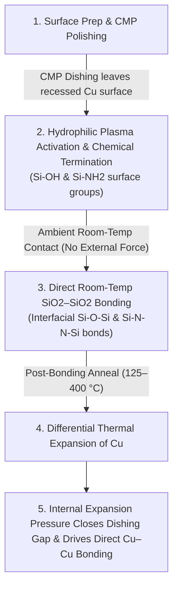
```mermaid
graph TD
    H_Step1["1. Surface Prep & CMP Polishing"] -->|"CMP Dishing leaves recessed Cu surface"| H_Step2["2. Hydrophilic Plasma Activation & Chemical Termination<br/>(Si-OH & Si-NH2 surface groups)"]
    H_Step2 -->|"Ambient Room-Temp Contact (No External Force)"| H_Step3["3. Direct Room-Temp SiO2–SiO2 Bonding<br/>(Interfacial Si-O-Si & Si-N-N-Si bonds)"]
    H_Step3 -->|"Post-Bonding Anneal (125–400 °C)"| H_Step4["4. Differential Thermal Expansion of Cu"]
    H_Step4 --> H_Step5["5. Internal Expansion Pressure Closes Dishing Gap & Drives Direct Cu–Cu Bonding"]
```

Electrodeposited Cu achieves as-bonded $\text{Cu}\text{--}\text{Cu}$ energy of $\sim 0.8\text{ J/m}^2$, rising to $\sim 2.8\text{ J/m}^2$ after 60 days. Interfacial water molecules can cause water stress corrosion, degrading bond strength. Combined SAB with Si-Ar beam irradiation and attach-detach processing in vacuum ($10^{-2}\text{ Pa}, 2.5\text{ MPa}, 200\ ^\circ\text{C}$) overcomes CMP dishing, roughness, and wafer bow.

---

### Cu/Adhesive Hybrid Bonding and Insertion Bonding

$\text{Cu}/\text{Adhesive}$ hybrid bonding replaces $\text{SiO}_2$ with polymer adhesives. 'Adhesive-First' bonding cures adhesive ($\sim 250\ ^\circ\text{C}$) before high-temperature $\text{Cu}\text{--}\text{Cu}$ TCB ($350\text{--}400\ ^\circ\text{C}$), risking thermal degradation. 'Cu-First' bonding performs low-temperature $\text{Cu}\text{--}\text{Cu}$ bonding ($200\text{--}250\ ^\circ\text{C}$) prior to adhesive curing, eliminating substrate alignment slip.


```mermaid
graph TD
    subgraph AdhFirst["'Adhesive-First' Approach"]
        AF1["TCB & Cure Polymer Adhesive (~250 °C, 1h)"] --> AF2["High-Temp Cu-Cu TCB (350–400 °C)"]
        AF2 --> AF_Issue["Risk of Thermal Damage to Adhesive,<br/>High Thermal Stress & Low Throughput"]
    end
    subgraph CuFirst["'Cu-First' Approach (Preferred)"]
        CF1["Low-Temp Cu-Cu TCB (200–250 °C, <10 min)"] --> CF2["Long-Duration Polymer Adhesive Curing"]
        CF2 --> CF_Adv["Prevents Substrate Relative Slip & Alignment Misalignment"]
    end
    subgraph HCOOH_Fix["HCOOH (Formic Acid) Vapor Alternative"]
        HF1["Formic Acid Vapor Cleans Cu Oxides without Sputtering"] --> HF2["Eliminates Cu Impurity Redeposition on Adhesive"]
        HF2 --> HF3["Enables Shear Strength >10 MPa at 200 °C in ~5 min"]
    end
```

Formic Acid ($\text{HCOOH}$) vapor treatment cleans Cu oxides without sputtering Cu contaminants onto the adhesive (unlike Ar plasma), enabling strong $\text{Cu}\text{--}\text{Cu}$ bonds ($> 10\text{ MPa}$ shear strength) at $200\ ^\circ\text{C}$ in $5\text{ min}$.

**Alternative Cu–Cu Insertion Bonding**: Low-temperature TSV bonding scheme applying high shear stress via **sloped sidewall landing pads** to drive large local plastic deformation as TSV nails are forced into the sloped pads.

---

## Chapter 9 — Copper Micro and Nano Particles Mixture for 3D Interconnection

### Motivation for Metallic Particle Bonding

Metallic particles are a promising solution for 3D interconnects since they offer a **low sintering temperature** — as the surface-to-volume ratio increases with smaller particle size, the particle can absorb more energy. Nano-materials have relatively larger surface area, giving them higher surface activation due to nano-scaling effects. This makes them easy to fuse together, which also ensures compactness in 3D IC applications. As a result, nano-particle approaches are expected to **reduce both bonding temperature and pressure** compared to bulk metal joining.

Due to the nano-scale effect, **nano-silver particles** (diameter $\sim 20\text{ nm}$) are able to be sintered at temperatures as low as $150\ ^\circ\text{C}$.

### Motivation for Mixed Cu Particle Bonding

A key limitation of **copper nano-particles** is that they are **readily oxidized in ambient** and unstable because of their large surface area. These surface oxides can degrade bonding characteristics. To ensure improvements over bulk copper paste, treatments such as **fluxing resin**, **thermal oxidation**, and **reduction techniques** are being studied.

These methods help increase the shear strength from **below 5 MPa to above 20 MPa** on average, under sintering conditions of $300\ ^\circ\text{C}$ for $60\text{ min}$. Usage of Cu micro-scale particle sintering with oxide removal methods demonstrates higher bond strength due to Cu surface modification in **formic acid bonding conditions**.

A notable problem associated with copper paste made from nano-particles is the **large amount of porosity and cracks**:
- **Uncontrolled agglomeration** of nano-particles results in inhomogeneity
- **Different evaporation rates** of dispersion solvents lead to particle shrinkage
- Residual stress from differential shrinkage makes the paste **prone to cracking**

### Cu Paste Formulation and Characterization

For metallic bonding, two important factors are:
1. **Lower sintering temperature**
2. **Higher electrical conductivity**

Solvents and additives used in copper particles should have a **low boiling point**. Pastes using common solvents such as $\alpha$-terpineol, ethanol, and hydrazine monohydrate & citric acid monohydrate have sintering temperatures at about $\sim 300\ ^\circ\text{C}$, which is considered **high for back-end interconnections** in 3D IC.

The **sintering profile** is critical to paste physical properties — temperature and time affect both bond strength and shear strength, which can vary from $0.5$ to $40\text{ MPa}$ and is influenced by the environment. When pastes are sintered in $\text{H}_2$, the oxide on the film surface can be removed. The sintering temperature is then decided by the solvents used during the synthesis process.

#### Experimental Details

| Component | Specification | Source |
|-----------|--------------|--------|
| Commercial micro-particles | $1\text{–}2\ \mu\text{m}$ diameter, 99% purity | American Elements |
| Cu nano-particles | $40\text{–}80\text{ nm}$ diameter, passivated with thin amine layer | Lockheed Martin Advanced Technology Center (Cuantumfuse solder materials) |
| **Optimal weight ratio (micro:nano)** | **6:1** | Calculated for best performance |

### In-Situ Resistance Characterization of 6:1 Mixed Paste

During temperature ramping of the 6:1 mixed paste:

1. **At $\sim 170\ ^\circ\text{C}$** — resistance has an obvious drop, suggesting most solvents evaporate at this temperature (resistance measured as high as $100\ \Omega$)
2. **At $230\ ^\circ\text{C}$** — resistance shows another obvious drop after $6\text{ min}$ of sintering
3. **Final stable resistance**: $2.79\ \Omega$

> **Fig. 9.10** — The resistance change in the 6:1 mixed paste during sintering. The dual-axis plot shows resistance (kΩ) dropping from $\sim 850\text{ k}\Omega$ to $2.79\ \Omega$ as temperature ramps to $230\ ^\circ\text{C}$ and holds steady, with the sharpest resistance decrease occurring between 2–6 minutes.

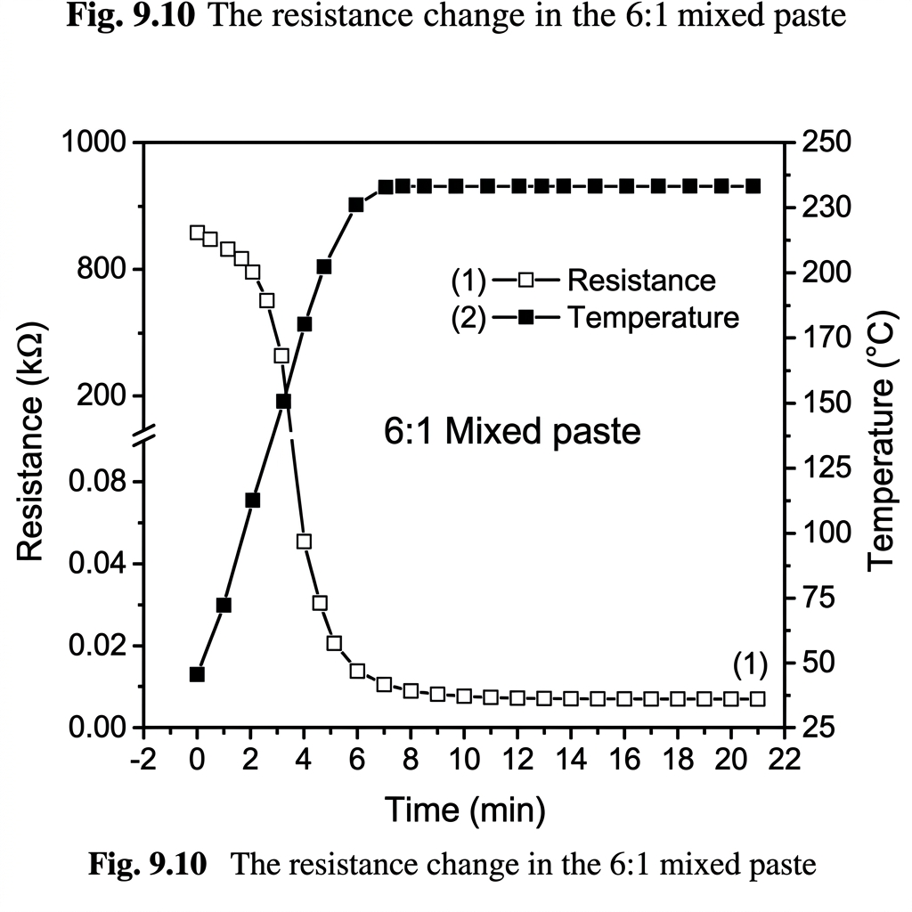

### Comparison: Micro-Particle vs Nano-Particle Paste Behaviour

The **paste transition temperature** is defined as the temperature when resistance decreases to $10\ \Omega$ (since there is no pronounced resistance change beyond that point):

| Paste Type | Transition Temperature | Final Resistance | Behaviour |
|-----------|----------------------|-----------------|-----------|
| Micro-particles | $150\ ^\circ\text{C}$ | $2.3\ \Omega$ | Stable — resistance decreases monotonically |
| Nano-particles | $\sim 220\ ^\circ\text{C}$ | Unstable — spikes to $50\text{ k}\Omega$ | Resistance first drops to $1.8\ \Omega$ then sudden irreversible increase |
| **6:1 Mixed paste** | **$\sim 170\ ^\circ\text{C}$** | **$2.79\ \Omega$** | **Stable — combines benefits of both** |

> **Fig. 9.11** — *In situ* resistance change of (a) micro-particle paste and (b) nano-particle paste. The micro-particle paste shows stable monotonic resistance reduction to $2.3\ \Omega$. The nano-particle paste exhibits an anomalous sudden resistance spike from $1.8\ \Omega$ to $\sim 50\text{ k}\Omega$ at $\sim 5\text{ min}$ (highlighted in red), attributed to crack formation during sintering.

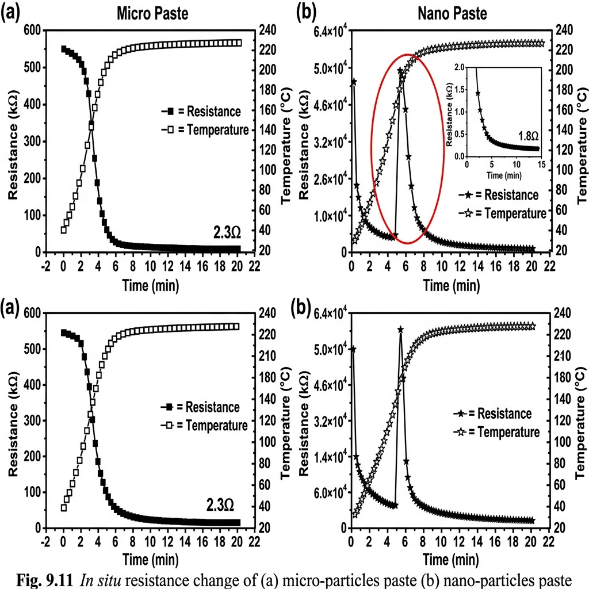

### Analysis of Particle-Specific Behaviour

**Lower transition temperature of micro-particles paste** compared to nano-particles paste:
- Micro-particles were **washed to remove oxide** prior to paste formulation
- Pre-cleaning eliminates the oxide barrier that would otherwise delay sintering onset

**Advantages of the 6:1 mixed paste**:
- Micro and nano particles **mix well** in the mixture, reducing porosity
- The mixture is able to **fuse at lower temperature** due to **heat localization**
- Nano-particles **fill the interstitials** formed by micro-particles, creating better inter-particle connections — likely the reason for low final resistance after sintering

**Cause of nano-particle paste cracking**:
- The sudden irreversible resistance increase is observed at the **5th minute** during sintering
- Likely caused by **solvent evaporation** during sintering, which leads to **residual stress** in the paste due to different evaporation rates of the solvents
- Since the resistance change is **irreversible**, it confirms structural cracking rather than a reversible thermal effect

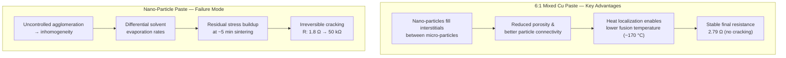
```mermaid
graph TD
    subgraph MixedAdvantage["6:1 Mixed Cu Paste — Key Advantages"]
        M1["Nano-particles fill interstitials<br/>between micro-particles"] --> M2["Reduced porosity &<br/>better particle connectivity"]
        M2 --> M3["Heat localization enables<br/>lower fusion temperature (~170 °C)"]
        M3 --> M4["Stable final resistance<br/>2.79 Ω (no cracking)"]
    end
    subgraph NanoProblem["Nano-Particle Paste — Failure Mode"]
        N1["Uncontrolled agglomeration<br/>→ inhomogeneity"] --> N2["Differential solvent<br/>evaporation rates"]
        N2 --> N3["Residual stress buildup<br/>at ~5 min sintering"]
        N3 --> N4["Irreversible cracking<br/>R: 1.8 Ω → 50 kΩ"]
    end
```

---

## Chapter 10 — Fundamentals of Bonding Technology and Process Materials for 2.5/3D Packages

### Technical Challenges: Mass Reflow vs Thermo-Compression Bonding (TCB)

#### Traditional Flip Chip Assembly Process

The traditional flip chip assembly process starts with dipping the die into a flux reservoir or dispensing flux on a substrate, depending on the product. The die is then placed on the substrate, followed by reflowing both die and substrate to form the interconnections. Flux residues are removed from the bonded packages and underfill is applied in the gap between the die and substrate. The underfill curing process completes the traditional flip chip assembly process.

> There is a preference to use **flux dipping**, but logic manufacturers use **dispensing** because of the associated assembly cost with equipment price and throughput.

> **Fig. 10.5** — Traditional flip chip assembly process: (a) schematic of assembly process flow showing flux application → chip attach → mass reflow → deflux → underfill → underfill cure; (b) reflow profile plot showing ramp zone, soak zone, peak temperature, and time above liquidus.

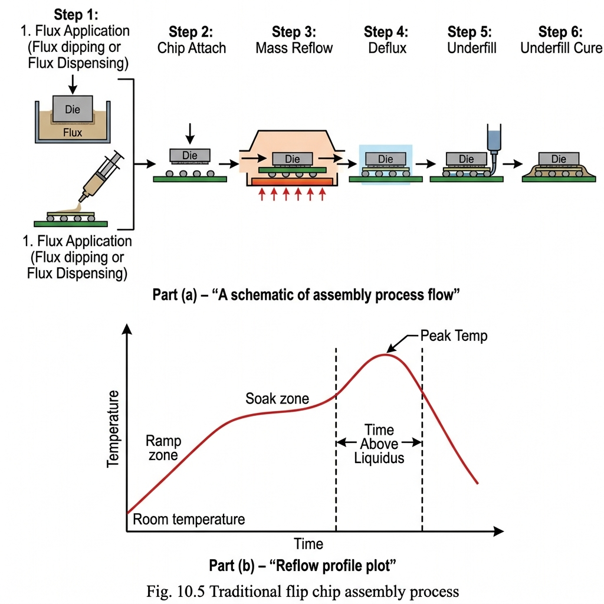

**Mass reflow** can take several minutes. Temperature ranges and time duration at each zone can be optimized through a number of iterations, which must be compatible with solder alloy composition and process materials to achieve high, stable product yield.

#### TCB Process Advantages

In contrast, **TCB can complete bonding in 2–3 steps** of the assembly process. The typical failure signature of yield loss due to warpage would be **non-contact opens** that occur when the amount of dynamic warpage is greater than the solder collapse during solder reflow.

TCB prevents this via metallurgical interconnections by controlled forces and temperatures applied to both die and substrate under vacuum-constrained head and stage respectively — the vacuum forces **minimize warpage** of silicon die and substrate.

> **Fig. 10.6** — Schematics of TCB using epoxy flux: (1) Epoxy flux dispense onto substrate, (2) TCB process with controlled heat and force from TCB head, (3) Underfill cure completing the assembly in a single thermal step.

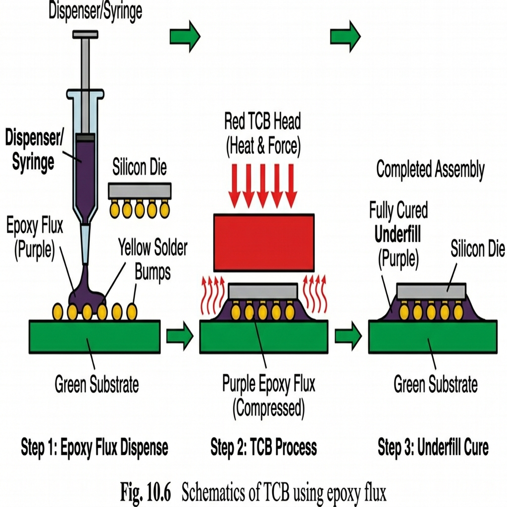

#### Placement Accuracy Comparison

| Parameter | Mass Reflow (Flip Chip) | TCB (3D Packages) |
|-----------|------------------------|-------------------|
| Self-alignment | Solder can recover misalignment if bumps placed on half of pad opening | No solder self-alignment — placement accuracy is critical |
| Typical pad size | $60\ \mu\text{m}$ | $\sim 20\ \mu\text{m}$ (current TSV products) |
| Max misalignment allowable | $\pm 15\ \mu\text{m}$ (half of 30 µm half-pad) | $\pm 5\ \mu\text{m}$ |
| HVM placement accuracy target | $\pm 15\ \mu\text{m}$ | $< \pm 2\ \mu\text{m}$ ($3\sigma$, per equipment suppliers) |

> **Note**: $\text{O}_2$ levels during the process are recommended to be maintained **below 100 ppm** in order to support solder wetting and produce less stringy flux residue.

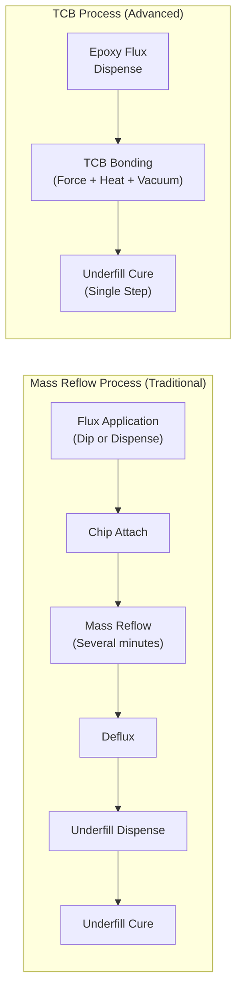
```mermaid
graph LR
    subgraph MassReflow["Mass Reflow Process (Traditional)"]
        MR1["Flux Application<br/>(Dip or Dispense)"] --> MR2["Chip Attach"]
        MR2 --> MR3["Mass Reflow<br/>(Several minutes)"]
        MR3 --> MR4["Deflux"]
        MR4 --> MR5["Underfill Dispense"]
        MR5 --> MR6["Underfill Cure"]
    end
    subgraph TCBProcess["TCB Process (Advanced)"]
        TCB1["Epoxy Flux<br/>Dispense"] --> TCB2["TCB Bonding<br/>(Force + Heat + Vacuum)"]
        TCB2 --> TCB3["Underfill Cure<br/>(Single Step)"]
    end
```

---

### Process Materials — Thermal Analysis Techniques

#### Thermogravimetric Analysis (TGA)

**TGA** measures the amount and rate of change in the weight of a material as a function of increasing temperature (constant heating rate) or as a function of time (constant temperature). Primarily used to determine the **composition of materials** and predict their **thermal stability** — characterizes materials that exhibit weight loss or gain due to decomposition, oxidation, hydration, or dehydration. Provides information about the underlying physical and chemical phenomena by measuring the rate of change in weight.

#### Differential Scanning Calorimetry (DSC)

**DSC** measures the difference in heat flow required to increase the sample temperature versus a reference sample as a function of temperature or time. The basic principle allows identifying whether the process is **exothermic or endothermic** when the sample undergoes a physical transformation such as phase transitions.

#### Thermomechanical Analysis (TMA)

**TMA** measures the change in sample size as a function of temperature, time, and load using testing geometries similar to standard mechanical testing:

| Geometry | Application |
|----------|------------|
| **(a) Expansion** | Compression and CTE studies |
| **(b) Flexure** | 3-point bending |
| **(c) Extension** | Tensile testing |
| **(d) Penetration** | Hardness/softening point |
| **(e) Dilatometry** | Bulk dimensional change |

Used to identify the **glass transition temperature ($T_g$)** where an amorphous material shows a phase change from rigid to flexible/fluid. The $T_g$ is taken as the **intersection of the tangents** from the graphs above and below the transition.

#### Dynamic Mechanical Analysis (DMA)

**DMA** is widely used to characterize material properties as functions of temperature, time, frequency, stress, atmosphere, or combinations of these parameters. Typically used to determine the $T_g$ of **polymer-based materials** commonly found in the electronic packaging industry.

#### Table 10.2 — Thermal Analyzer Used for Standard Methods *(Source: PerkinElmer)*

| Problem | Properties | Analysis | Standard Method |
|---------|-----------|----------|----------------|
| **Delamination** | CTE | TMA | IPC TM-650 2.4.24.1 |
| | Decomposition temperature | TGA | ASTM D3850 |
| | Glass transition temperature | DSC / TMA / DMA | IPC TM-650 2.4.25C / IPC TM-650 2.4.24C / IPC TM-650 2.4.24.2 |
| **Through hole reliability** | CTE (Z-axis) | TMA | IPC TM-650 2.4.24.1 |
| **Bad thermal stability** | Glass transition temperature | DSC / DMA | IPC TM-650 2.4.25C |
| | Moisture content | TGA | IPC TM-650 2.4.24C |
| | Decomposition temperature | TGA | IPC TM-650 2.4.24.2 |
| | Modulus | DMA | IPC TM-650 2.4.24.4 |
| **Size stability** | CTE (XY-Axis) | TMA | IPC TM-650 2.4.24C |

---

### Principles of Materials Formulation

**Flux performance** is the most important factor within all assembly building blocks and process materials designed for TCB targeting the 3D stacking process. It requires the **right chemistry coupled with a proper heat cycle** to reduce surface oxides. The synergistic combination between chemistry and processing can promote a clean and solder-wettable metal surface — a prerequisite to achieve good metallurgical bonding.

#### Oxide Reduction Chemistry

> **Fig. 10.25** — Chemical equations for oxide reduction: (a) Sn/Pb oxide reduction by organic acids (RCOOH), (b) Cu oxide reduction by organic acids. The carboxylic acid reacts with metal oxides to form metal carboxylate salts and water.

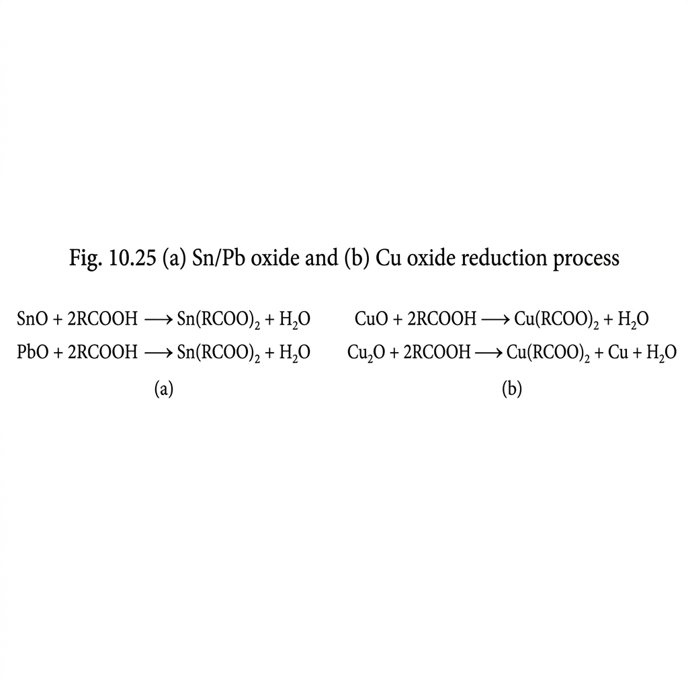

**Sn/Pb Oxide Reduction (a):**

$$\text{SnO} + 2\text{RCOOH} \rightarrow \text{Sn(RCOO)}_2 + \text{H}_2\text{O}$$

$$\text{PbO} + 2\text{RCOOH} \rightarrow \text{Pb(RCOO)}_2 + \text{H}_2\text{O}$$

**Cu Oxide Reduction (b):**

$$\text{CuO} + 2\text{RCOOH} \rightarrow \text{Cu(RCOO)}_2 + \text{H}_2\text{O}$$

$$\text{Cu}_2\text{O} + 2\text{RCOOH} \rightarrow \text{Cu(RCOO)}_2 + \text{Cu} + \text{H}_2\text{O}$$

---

### Assembly Process Materials — Flux Types

#### Water-Soluble Flux

Based on **organic acids** to provide oxide reduction performance. These fluxes produce **corrosive residues** after solder reflow, necessitating a **pressurized water wash process** to eliminate flux residue.

Water-soluble flux can also be applied to TCB technology with no major changes in formulation. The flux comprises:

| Component | Function |
|-----------|----------|
| **Vehicle** | High-temperature tolerant chemicals (liquid or solid). Dissolves by-products from activator-oxide reactions and carries them away during wetting/spreading. Serves as **heat transfer media**. Solid-form vehicles are adopted from natural/modified rosins or natural/synthetic resins. |
| **Activators** | React with and reduce metal oxides |
| **Surfactants** | Help liquid flux spread and reduce surface tension of molten solder |
| **Thickening agents** | Control rheology |
| **Solvents** | Control viscosity for proper dispensing properties |

#### No-Clean Flux

"No-clean" does **not imply no flux residues remain** after solder reflow. These fluxes generally have the same aggressiveness as **Rosin Mildly Activated (RMA)** fluxes, but leave **fewer and less corrosive residues** compared to water-soluble flux.

Achieved by:
1. **Reducing the solid content** of the flux — typical no-clean flux has **< 15% solids**, compared with **30–50% in cleanable fluxes**
2. **Polymerizing residues** to minimize their corrosivity in the presence of moisture

---

### Capillary Underfill (CUF)

CUF is an important process material for building blocks with mass reflow processes using water-soluble or no-clean fluxes in 2.5/3D processes.

CUF flows within the **extremely thin $\sim 3\ \mu\text{m}$ gap**, which requires optimizing viscosity and filler size properties. Theoretically, CUF has no barrier in filling a gap as long as the gap is greater than the filler particle size.

> **Practical limitation**: CUF is limited to **$\geq 120\ \mu\text{m}$ pitch** flip chip applications due to the need to remove flux residues. Below $120\ \mu\text{m}$ pitch, the defluxing process cannot guarantee removal of all residues in HVM. Flux residues can impede CUF flow, resulting in **underfill voids and/or delamination**, which negatively affect interconnection reliability performance.

### Epoxy Flux (No-Flow Underfill / Non-Conductive Paste)

Epoxy flux materials allow TCB technology to complete **microbumped solder reflow and encapsulation in a single step**. The material performs the function of both the flux and epoxy-based underfill in the TCB process — hence the term "epoxy flux" — and can **skip the flux cleaning process**.

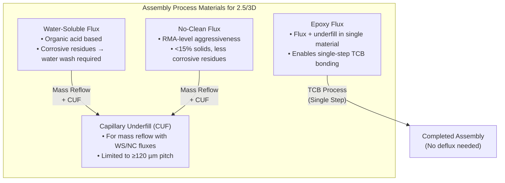
```mermaid
graph TD
    subgraph ProcessMaterials["Assembly Process Materials for 2.5/3D"]
        direction TB
        WS["Water-Soluble Flux<br/>• Organic acid based<br/>• Corrosive residues → water wash required"]
        NC["No-Clean Flux<br/>• RMA-level aggressiveness<br/>• <15% solids, less corrosive residues"]
        CUF["Capillary Underfill (CUF)<br/>• For mass reflow with WS/NC fluxes<br/>• Limited to ≥120 µm pitch"]
        EF["Epoxy Flux<br/>• Flux + underfill in single material<br/>• Enables single-step TCB bonding"]
    end
    WS --> |"Mass Reflow<br/>+ CUF"| CUF
    NC --> |"Mass Reflow<br/>+ CUF"| CUF
    EF --> |"TCB Process<br/>(Single Step)"| Done["Completed Assembly<br/>(No deflux needed)"]
```

---

### Underfill Filler Concentration & Material Property Trade-Offs

#### Filler Concentration Effects

An increase in filler concentration typically **improves solder joint reliability**; however, excessive filler concentration increases the possibility of **filler entrapment between bumps and pads**, consequently resulting in an **electrical open failure** under temperature cycling conditions.

> **Key trade-off**: Higher filler content strengthens joints but risks filler-induced opens at fine pitch.

#### Low-k Dielectric Protection

The filler concentration may also need to **protect fragile low-k dielectric layers**. The demand on low-k protection is determined by package configuration including:

| Configuration | Gap/Clearance |
|--------------|---------------|
| **Die-to-die** | Silicon-to-silicon space |
| **Die-to-substrate** | Die-to-substrate gap |
| **Module-to-substrate** | Module-to-substrate clearance |

> **Fundamental conflict**: Solder joint reliability requires **stiff, rigid underfills** (high modulus) while more **compliant underfill properties** (low modulus) are better at protecting low-k layers.

#### Interdependent Material Properties

A successful candidate material must simultaneously address multiple interdependent properties:

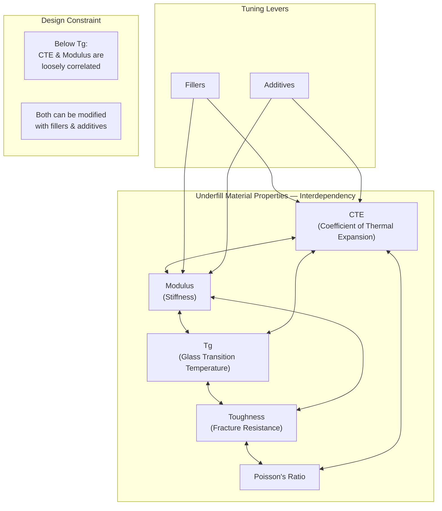
```mermaid
graph TD
    subgraph MaterialProps["Underfill Material Properties — Interdependency"]
        CTE["CTE<br/>(Coefficient of Thermal Expansion)"] <--> MOD["Modulus<br/>(Stiffness)"]
        MOD <--> TG["Tg<br/>(Glass Transition Temperature)"]
        TG <--> TOUGH["Toughness<br/>(Fracture Resistance)"]
        TOUGH <--> PR["Poisson's Ratio"]
        PR <--> CTE
        CTE <--> TG
        MOD <--> TOUGH
    end
    subgraph Tuning["Tuning Levers"]
        F["Fillers"] --> CTE
        F --> MOD
        A["Additives"] --> CTE
        A --> MOD
    end
    subgraph Constraint["Design Constraint"]
        C1["Below Tg:<br/>CTE & Modulus are<br/>loosely correlated"]
        C2["Both can be modified<br/>with fillers & additives"]
    end
```

- **CTE** and **modulus** are loosely correlated at temperatures less than $T_g$
- Both properties can be modified with **fillers and additives**
- All five properties — CTE, modulus, Poisson's ratio, toughness, and $T_g$ — are **interdependent upon one another**, making formulation optimization a multi-variable challenge

---

### Effects of Intermetallic Compound (IMC) Morphology on Electromigration (EM) Degradation

#### Substrate Interface Morphologies: Mass Reflow vs TCB

When comparing the morphologies of Intermetallic Compounds (IMCs) on the substrate side, the **reflow joint** shows uniformly structured IMCs that **entirely cover the ENIG surface**, whereas the **TCB joint** exhibits a significantly different interface where only certain regions are discerned with **rod-like $\text{Cu}_6\text{Sn}_5$ IMCs**.

> The difference in thickness of the IMC and its morphology affects the kinetics of Cu and Ni atom diffusion through the SAC 305 solder matrix.

There is a **faster out-diffusion of Cu and Ni** from the bond pad and ENIG surface finishes if the IMCs do not fully cover those areas, or if the IMC scallops have high-aspect-ratio structures.

> **Fig. 10.62** — Visual aid showing IMC morphology comparison between mass reflow and TCB joints, out-diffusion of Cu/Ni, and the resulting electromigration degradation mechanism under current stress.

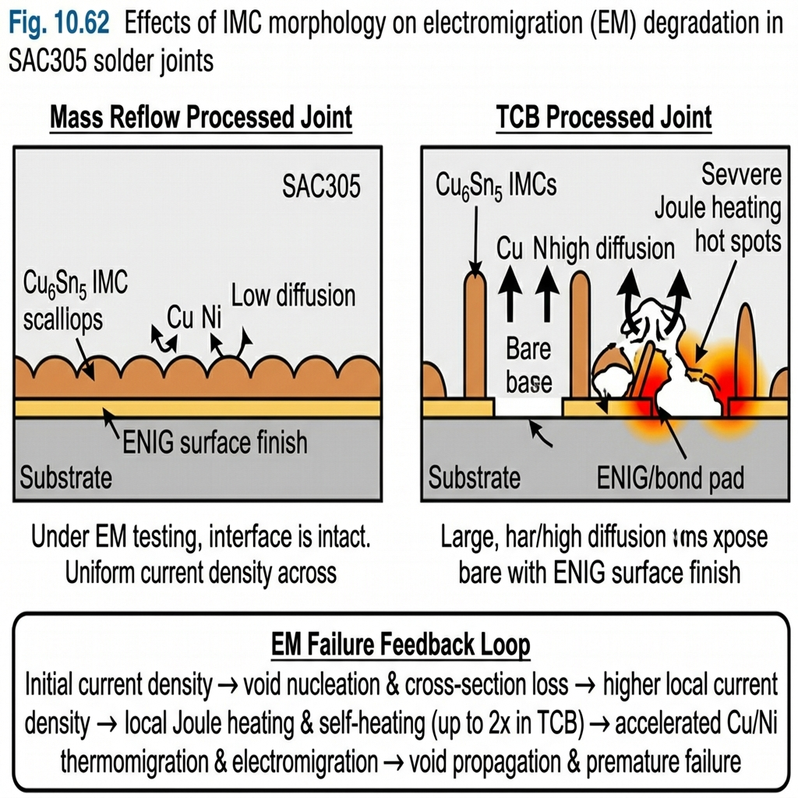

#### EM Degradation & Premature Failure Mechanism in TCB Joints

In terms of EM effect on these samples:
1. **TCB joints** suffer from **premature failure** due to much faster Cu and Ni out-diffusion.
2. The depletion of Cu/Ni atoms leads to **void formation and propagation**, eventually **delaminating the interface** and shorting the interconnect.

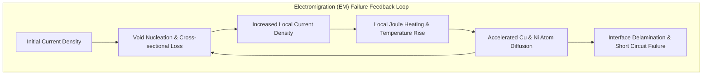
```mermaid
graph TD
    subgraph EM_Feedback_Loop["Electromigration (EM) Failure Feedback Loop"]
        J0["Initial Current Density"] --> V1["Void Nucleation & Cross-sectional Loss"]
        V1 --> J1["Increased Local Current Density"]
        J1 --> JH1["Local Joule Heating & Temperature Rise"]
        JH1 --> D1["Accelerated Cu & Ni Atom Diffusion"]
        D1 --> V1
        D1 --> FAIL["Interface Delamination & Short Circuit Failure"]
    end
```

#### Thermal History & Cooling Rate Impact

IMC morphology differences between solder joints reflowed by the two processes are primarily attributed to **cooling rates**:
- **Reflow-processed joints** endure a much **slower cooling rate** — molten solder has more time to wet and form/grow continuous IMCs before reaching its solidification temperature, depositing a protective continuous IMC layer at the substrate interface.
- **TCB joints** undergo **rapid thermal cycling and fast cooling**, leaving isolated, high-aspect-ratio rod-like IMCs with bare patches.

#### Thermomigration (TM) & Self-Heating

Self-heating was observed in TCB flip-chip test coupons under EM aging tests:
- The degree of self-heating in TCB flip-chip packages was **up to twice as high** compared to reflow-processed packages.
- Higher power generates local heating on TCB solder joints (**Joule heating effect**).
- **Thermomigration (Mass Transport)**: Atoms in hotter regions have a higher probability of dislocation due to temperature-related thermal activation, driving net diffusion of atoms **from hot to cold areas** (along the negative temperature gradient).
- Solder joints processed by TCB lack continuous IMCs at their interfaces and **cannot dissipate local Joule heating efficiently** compared to IMC-rich reflow solder joints.

> **EM Test Benchmark**: Reflow joints showed **no EM-induced failure** during the aging test period where TCB joints failed. In reflow joints, Cu/Ni diffusion was strongly impeded by the thick, continuous IMC scallop layer. Furthermore, $\text{Sn-Cu}$ compounds inherently possess **superior EM resistance** compared to eutectic SAC solders.

---

### The Deeper Controversy & Bulk $\beta$-Sn Anisotropy

Is IMC morphology the sole direct cause of EM failure? **Unlikely as a standalone cause.**

> A large volume of **$\beta$-Sn** occupies the middle of the solder joint, while $\text{Cu}_6\text{Sn}_5$ IMCs are located mainly at the interfaces. Therefore, the **crystallographic orientation of anisotropic $\beta$-Sn** must be taken into account for a holistic diagnosis of premature solder joint failures in TCB processes.

#### Anisotropic Diffusion Kinetics in $\beta$-Sn

| Atom Species | Diffusion Speed Along c-axis $[001]$ vs Orthogonal Axes | Test Temp |
|--------------|--------------------------------------------------------|-----------|
| **Copper (Cu)** | **$500\times$ faster** along c-axis | $25\ ^\circ\text{C}$ |
| **Nickel (Ni)** | **$\sim 7 \times 10^4\times$ faster** along c-axis | $120\ ^\circ\text{C}$ |

---

### Effects of Crystallographic Orientation of $\beta$-Sn on EM Degradation

#### Inverse Pole Figure (IPF) Orientation Mapping

Inverse Pole Figure (IPF) maps illustrate the crystallographic orientations of $\beta$-Sn grains across reflow and TCB joints.

> **Fig. 10.55** — Crystallographic orientation of $\beta$-Sn, anisotropic diffusion along the c-axis $[001]$, and Inverse Pole Figure (IPF) orientation maps relative to vertical electron flow direction.

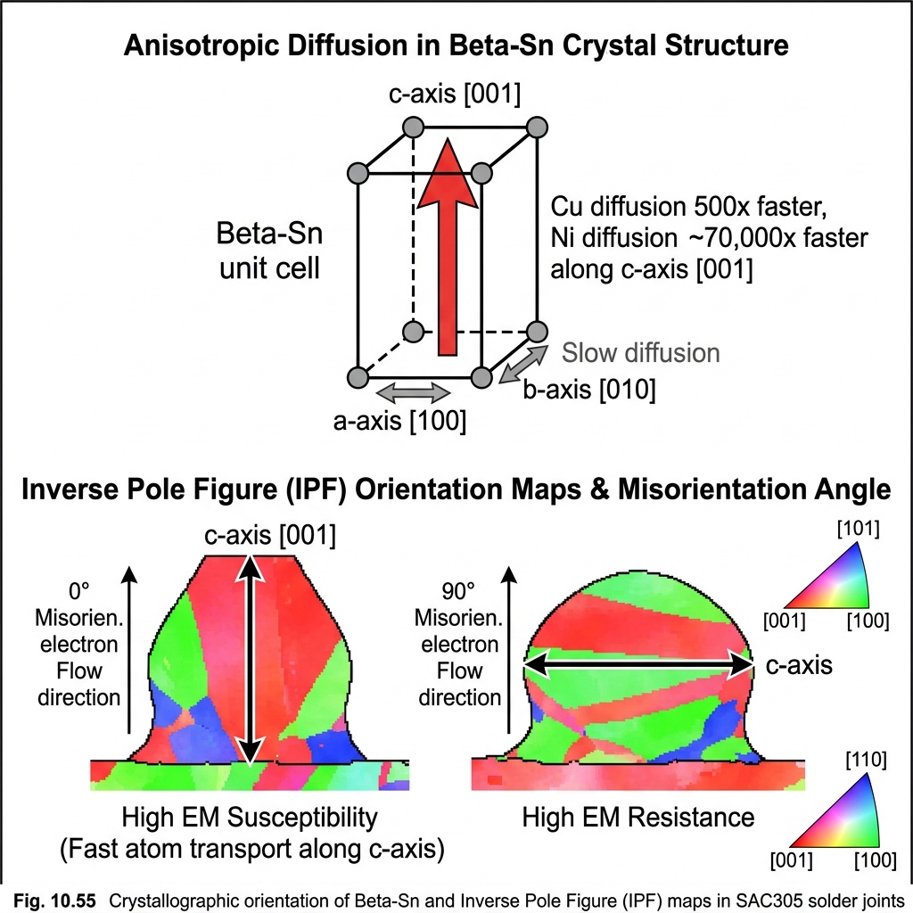

#### Misorientation & Electron Flow Alignment

- Each pixel in an IPF map represents the crystal orientation corresponding to the **vertical direction** (the direction of electron flow).
- **$[001]$ Configuration**: A pixel corresponding to $[001]$ has its c-axis pointing **directly vertically** ($0^\circ$ misorientation between vertical electron flow and the c-axis).
- **Misorientation Impact**: When the misorientation angle is small ($0^\circ$, c-axis parallel to electron flow), Cu and Ni atoms diffuse at maximum rates ($500\times$ for Cu, $70,000\times$ for Ni). When the misorientation angle is near $90^\circ$ (c-axis perpendicular to electron flow), atomic diffusion is heavily suppressed.
- Comparing reflow vs TCB joints requires analyzing these misorientation value distributions alongside IMC coverage to predict overall EM reliability.

---

## Chapter 11 — Fundamentals of Solder Alloys in 3D Packaging

### Solder Alloys in Microbumps

Microbumps in 3D packaging employ a wide variety of Cu/Sn-based solder alloy structures, formed by both **Reflow** and **Thermal Compression Bonding (TCB)** processes.

#### Table 11.1 — Solder Alloys and Structures for Microbumps

| Microbump Structure | Bonding Technology | References |
|---|---|---|
| 5.4 µm Cu / 3.6 µm Sn / 9.5 µm Cu | TCB 240, 260 °C | [3] |
| Cu/Sn/Cu | TCB | [4] |
| 20 µm Cu / SnAg / 3 µm Ni | Reflow | [5] |
| Cu/Ni/Sn2.5Ag/Ni/Cu | TCB | [6] |
| Cu/Ni/SnAg/Ni/Cu | Reflow | [7] |
| 300Å Cr / 500Å Cu / 35 µm Cu / 35 µm SAC405 | (not available) | [8] |
| Ti/Cu(seed)/Cu(wire)/3.0 µm Cu / 3.5 µm SnAg | TCB at 280 °C | [9] |
| Cu/Ni/Sn | TCB at <250 °C | [10] |
| Cu/Ni/SnAg | TCB | [11] |
| 30 µm Cu / 3 µm Ni / 25 µm SnAg | Reflow | [12] |
| 33 µm Cu / 25 µm SnAg | Reflow | [12] |
| 50 µm Cu / 20 µm SAC305 | TCB | [13] |
| 42 µm Cu / 3 µm Ni / 35 µm Solder | TCB | [14] |
| 28 µm Cu / 2 µm Ni / 15 µm SnAg | TCB | [15] |
| Cu/Ni/Sn 2.5Ag | TCB | [16] |
| 5 µm Cu / 2 µm Ni / 8 µm Sn57Bi | Reflow at 180 °C | [17] |
| 5 µm Cu / 2 µm Ni / 8 µm SAC305 | Reflow | [17] |
| Cu/Ni/Sn | (not available) | [18] |
| 100 nm Ti / 200 nm Cu / 12 or 8 µm Cu / 10 or 25 µm SAC305 | Reflow | [19] |
| 100 nm Ti / 200 nm Cu / 12 µm Cu / 2 µm Ni / 10 µm SAC305 | Reflow | [19] |
| NiFe/Pb-free solder (undefined) | Reflow | [20] |
| NiFe/Cu/Pb-free solder (undefined) | Reflow | [20] |
| 8 µm Cu/SnAg | Reflow | [21] |
| 8 µm Cu/Ni/SnAg | Reflow | [21] |
| 5 µm Cu / 3 µm Ni / 5 µm Sn 2.5Ag | TCB | [22] |
| 2 µm Cu / 5 µm Sn (on substrate) | TCB | [23] |
| Cu/Sn/Ni/Cu (TSV) | TCB | [24] |
| Cu/Ni/Sn/Ni/Cu (TSV) | TCB | [24] |
| Cu/Sn/Cu (TSV) | TCB | [25] |
| Cu/Sn/Au/Ni/Cu (TSV) | TCB | [25] |
| Cu/Ni/Sn/Au/Ni/Cu (TSV) | TCB | [25] |
| 50 nm Ti / 120 nm Cu / 3 µm Cu / 3 µm Sn | TCB 260 °C | [26] |
| 10 µm Cu / 10 µm SnAg | TCB 250 °C | [27] |
| Cu/Sn/Cu (TSV) | Reflow | [28] |
| Cu/Sn/Ni/Cu (TSV) | Reflow | [28] |
| Cu/Ni/Sn/Ni/Cu (TSV) | Reflow | [28] |

**Table 11.1 (continued)**

| Microbump Structure | Bonding Technology | References |
|---|---|---|
| 10 µm Cu / 10 µm SnAg | Reflow | [29] |
| 5 µm Cu / 3 µm Ni / 5 µm Sn2.5Ag | TCB 300 °C | [30] |
| 16 µm Cu / 10 µm SnAg/Cu | Reflow 240 °C | [31] |
| 2 µm Ni / 1 µm Cu / 4 µm Sn | Reflow 245 °C | [32] |
| 2 µm Cu / 5 µm Sn | TCB 300 °C, 350 °C | [33] |
| 25 µm Cu / 15 µm Sn58Bi | TCB 170 °C | [34] |
| 20 µm Cu / 12 µm Sn | TCB | [35] |

> **TCB**: Thermal Compression Bonding; **TSV**: Through Silicon Via; **SAC**: SnAgCu

---

### Formation of IMC in the As-Produced Microbump

#### Volume Effects — Why Microbumps Are Fundamentally Different

The interactions in the microbump system generally follow the same reactions as observed for BGA and C4 bumps, but **the solder volume in the microbump is dramatically reduced**.

> **Volume comparison**: An 80 µm C4 bump has ~**55× the volume** of a 25 µm diameter, 10 µm height microbump. Under identical reaction conditions (time and temperature), the **volume ratio of IMC in the microbump is proportionally far greater** than in C4 or BGA solder joints — making the IMC microstructure dominant in microbump reliability.

#### As-Produced Sn-Cap Microbump IMC Structure

A 95 µm Cu / 3.6 µm Sn microbump bonded on a Cu substrate will form a characteristic layered structure:

```
Cu Pillar
   │
   ├── Thin Cu₃Sn  (at Cu surface)
   ├── Large volume Cu₆Sn₅  (between Cu₃Sn and Sn)
   ├── Residual β-Sn  (at center)
   ├── Large volume Cu₆Sn₅
   ├── Thin Cu₃Sn  (at bottom Cu surface)
   │
Cu Trace / Substrate
```

> **Fig. 11.5** — Cross-section showing IMC regions in a Cu/Sn/Cu microbump at different reaction times and temperatures: (a) as-reflowed with residual Sn and early IMC formation, (b) after extended thermal aging showing porous $\text{Cu}_6\text{Sn}_5$ with Kirkendall voids as the $\text{Cu}_6\text{Sn}_5 \rightarrow \text{Cu}_3\text{Sn}$ transformation progresses.

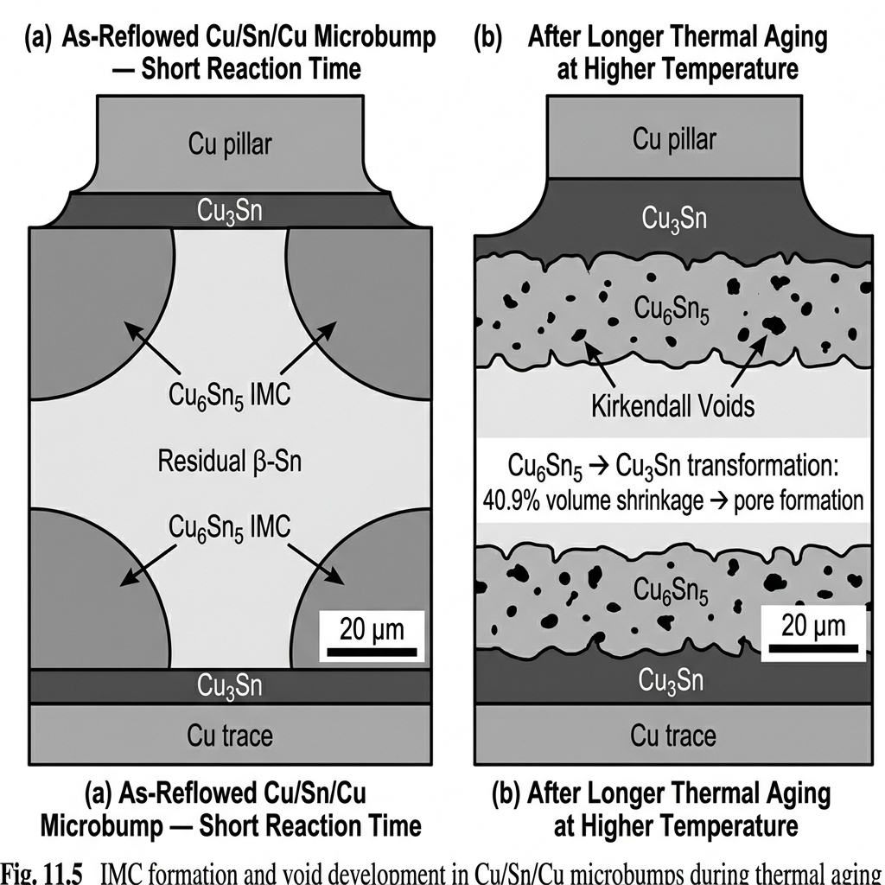

#### Cu/Sn/Cu Joint Evolution During Thermal Aging

The IMC structure evolves progressively with time and temperature:

1. **Initial reflow**: $\text{Cu}_6\text{Sn}_5$ forms within the bulk Sn solder; $\text{Cu}_3\text{Sn}$ forms at the solder/Cu boundaries.
2. **Extended bonding / thermal aging**: $\text{Cu}_6\text{Sn}_5$ converts to $\text{Cu}_3\text{Sn}$ — this transformation **leaves behind pores** within the former $\text{Cu}_6\text{Sn}_5$ regions.
3. **High temperature storage**: Joints containing both IMC phases (formed at shorter reaction time or lower reaction temperature) undergo further $\text{Cu}_6\text{Sn}_5 \rightarrow \text{Cu}_3\text{Sn}$ transformation during storage.

> **Kirkendall Void Origin**: The pore volume formed corresponds to the **theoretical 40.9% volume shrinkage** accompanying the $\text{Cu}_6\text{Sn}_5 \rightarrow \text{Cu}_3\text{Sn}$ transformation.

#### Ni Diffusion Barrier Layer

Ni is the most common diffusion barrier layer used to reduce Cu–solder interaction during reflow and subsequent operation:

- Ni is typically deposited on **both Cu ends** of a SnAg microbump.
- After TCB, Ni forms **$\text{Ni}_3\text{Sn}_4$ IMC** at the Ni/solder interface.
- The growth of $\text{Ni}_3\text{Sn}_4$ through the TCB process has an **activation energy of 127.8 kJ/mol**, and its thickness grows **exponentially** with bonding time in the temperature range **250–300 °C**.
- Mechanical property note: $\text{Ni}_3\text{Sn}_4$ exhibits **elastic anisotropy**, with **much less elastic anisotropy in the a–c plane** than along other crystallographic directions.

#### Mixed (Cu,Ni) IMC Formation

Ni exhibits an **FCC structure** with similar atomic dimensions and **continuous solid solubility** with Cu. Solder joints with Ni or Cu metallization commonly form:

| Combination | Resulting IMC |
|---|---|
| Cu-dominant side | $(\text{Cu,Ni})_6\text{Sn}_5$ |
| Ni-dominant side | $(\text{Ni,Cu})_3\text{Sn}_4$ |

> **Fig. 11.6** — IMC formation at the microbump/Cu trace interface: **(a)** without Ni barrier on Cu pillar — $\text{Cu}_6\text{Sn}_5$ and $\text{Cu}_3\text{Sn}$ form on both interfaces; **(b)** with Ni barrier on Cu pillar — $(\text{Cu,Ni})_x\text{Sn}_y$ forms at the Ni-capped pillar side, while $\text{Cu}_6\text{Sn}_5$ forms on the bare Cu trace side. The Ni barrier retards Cu pillar consumption.

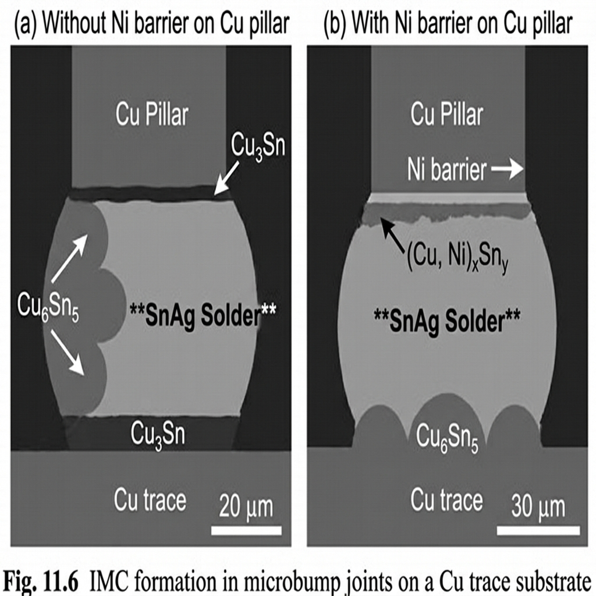

#### Phase Transformation & Microstructure Evolution During Thermal Aging

The phase transformation induced by **thermal aging** is particularly influential on final microbump microstructure due to the **small solder volume**:

- **Cu/Sn/Cu microbump after reflow** forms the structure:
  $$\text{Cu} / \text{Cu}_3\text{Sn} / \text{Cu}_6\text{Sn}_5 / \text{Sn} / \text{Cu}_6\text{Sn}_5 / \text{Cu}_3\text{Sn} / \text{Cu}$$
- Residual Sn is of **limiting volume** and may not exist in some joints.
- **Thermal aging at 240 °C** gradually converts $\text{Cu}_6\text{Sn}_5$ into $\text{Cu}_3\text{Sn}$.
- **Extended storage (3 h at 240 °C)** can produce a **$\text{Cu}_3\text{Sn}$-only joint**.

For Cu pillar bumps with Sn4Ag0.5Cu solder caps:
- As-fabricated: **scallop-shaped $\text{Cu}_6\text{Sn}_5$ IMC**
- After aging at **180 °C**: $\text{Cu}_6\text{Sn}_5$ transforms from **scallop to planar structure**; discontinuous $\text{Cu}_3\text{Sn}$ forms between $\text{Cu}_6\text{Sn}_5$ and Cu pillar
- **Voids form between $\text{Cu}_3\text{Sn}$ and Cu pillar** — fracture occurs here during shear testing

---

### Mechanical Properties & Thermal Fatigue Life

The high volume fraction of IMC in microbumps makes IMC properties **determinant for joint performance**.

#### IMC Type & Thermal Fatigue Life Ranking

Thermal fatigue life is **disproportional to the Young's Modulus of the IMC**, but the combined effect of **modulus and CTE** determines fatigue life. For high-IMC-volume microbumps:

$$\text{Fatigue Life: } \text{Ni}_3\text{Sn}_4 > \text{Cu}_6\text{Sn}_5 > \text{Cu}_3\text{Sn}$$

| IMC Phase | Young's Modulus (GPa) | CTE (ppm/°C) | Relative Fatigue Life |
|---|---|---|---|
| $\text{Ni}_3\text{Sn}_4$ | 136 | 13.7 | **Best** |
| $\text{Cu}_6\text{Sn}_5$ | 124 | 19.0 | Intermediate |
| $\text{Cu}_3\text{Sn}$ | 143 | 18.2 | **Worst** |

> **Note on sequencing**: $\text{Ni}_3\text{Sn}_4$ achieves the best fatigue life due to its **lower CTE** (13.7 ppm) minimising thermal mismatch strain, despite its moderate modulus. $\text{Cu}_3\text{Sn}$ performs worst due to its combination of the **highest modulus** (143 GPa) AND high CTE (18.2 ppm).

#### IMC Volume Fraction & Fatigue Life

- Increasing IMC thickness or volume fraction generally **increases thermal fatigue life** of the micro joint.
- However, the thermal fatigue life reaches a **minimum value at 42.8% volume fraction** of $\text{Ni}_3\text{Sn}_4$ IMC.

---

### Intrinsic Diffusion Coefficients — Governing IMC Kinetics

#### Table 11.2 — Intrinsic Diffusion Coefficients of Elements in Different Phases (at 170 °C)

| Phase | Element | D (m²/sec) at 170 °C | References |
|---|---|---|---|
| Cu | Cu | $1.07 \times 10^{-29}$, $3.46 \times 10^{-29}$ | [38] |
| Cu | Sn | $3.98 \times 10^{-26}$ | [39] |
| Sn | Cu | $1.06 \times 10^{-9}$ (//c), $3.04 \times 10^{-11}$ (⊥c) | [40] |
| Sn | Sn | $1.81 \times 10^{-16}$ (//c), $4.43 \times 10^{-16}$ (⊥c) | [38] |
| Ni | Ni | $8.95 \times 10^{-38}$, $1.61 \times 10^{-37}$ | [38] |
| Sn | Ni | $1.47 \times 10^{-8}$ (//c), $7.73 \times 10^{-11}$ (⊥c) | [41] |
| $\text{Cu}_3\text{Sn}$ | Cu | $5.12 \times 10^{-16}$ | [24] |
| $\text{Cu}_3\text{Sn}$ | Sn | $1.46 \times 10^{-16}$ | [24] |
| $\text{Cu}_6\text{Sn}_5$ | Cu | $9.42 \times 10^{-16}$ | [24] |
| $\text{Cu}_6\text{Sn}_5$ | Sn | $9.44 \times 10^{-16}$ | [24] |
| $\text{Ni}_3\text{Sn}_4$ | Ni | $1.36 \times 10^{-17}$ | [24] |
| $\text{Ni}_3\text{Sn}_4$ | Sn | $6.81 \times 10^{-18}$ | [24] |

> (//c: parallel to c-axis; ⊥c: perpendicular to c-axis)

#### Key Diffusion Insights

- **$\text{Cu}_3\text{Sn}$**: Cu diffusion ($5.12 \times 10^{-16}$) is slightly faster than Sn diffusion ($1.46 \times 10^{-16}$) → Cu is the dominant diffusing species.
- **$\text{Cu}_6\text{Sn}_5$**: Cu ($9.42 \times 10^{-16}$) and Sn ($9.44 \times 10^{-16}$) diffuse at **similar speeds**.
- **$\text{Ni}_3\text{Sn}_4$**: Ni ($1.36 \times 10^{-17}$) diffuses faster than Sn ($6.81 \times 10^{-18}$) → Ni is the dominant diffusing species.

**Consequence during high-temperature annealing of a Cu/Sn/Ni/Cu microbump**:
1. $\text{Cu}_6\text{Sn}_5$ forms first after reflow.
2. $\text{Cu}_6\text{Sn}_5$ converts to $\text{Cu}_3\text{Sn}$ at the **expense of Cu**.
3. Diminishing of $\text{Cu}_6\text{Sn}_5$ and growth of $\text{Cu}_3\text{Sn}$ follow **diffusion-controlled kinetics**.
4. **Kirkendall voids** nucleate within the $\text{Cu}_3\text{Sn}$ layer, attributed to the **asymmetry in Cu vs. Sn diffusion rates**.

---

### Microstructure and Failure Mechanisms of Microbumps

#### Geometry Constraints — IMC-Dominated Joints

The extremely small solder volume of microbumps fundamentally changes the reliability physics:
- Solder volume is **at least one order of magnitude smaller** than that of a C4 bump.
- After reflow treatments (thermal aging, electrical current stressing), **almost the entire solder volume converts to IMC** — even with a Ni barrier layer.
- Cu/solder joints are **completely transformed to IMC after reflow** when the solder thickness is **< 20 µm**.


```mermaid
graph LR
    A["Reflow / Aging / Current Stressing"] --> B["Cu6Sn5 → Cu3Sn Transformation"]
    B --> C["Kirkendall Void Formation<br/>(40.9% volume shrinkage)"]
    C --> D["Void Coalescence → Crack"]
    D --> E["Brittle Fracture & Joint Failure"]
```

#### Mechanical Brittleness Threshold

Micro tensile test results:
- **As-reflowed** joints exhibit **brittle behaviour** when the joint thickness is **≤ 70 µm**.
- A 15 µm-thickness joint is mechanically dominated by IMC and shows inherent brittle fracture behaviour under current stressing.

#### Current Stressing Failure Pathway (Without Ni Barrier)

Under current stressing:
1. $\text{Cu}_3\text{Sn}$ layer grows at the expense of both $\text{Cu}_6\text{Sn}_5$ and Cu sources on both pillar ends.
2. Extensive Kirkendall void formation and coalescence → crack initiation and propagation → failure.

#### Current Stressing Failure Pathway (With Ni Barrier)

When a Ni barrier is introduced between Cu pillar and solder:
- The Ni barrier **retards Cu pillar consumption** (slower reaction rate of Ni).
- Solder is completely converted to a **mixed layer of $\text{Cu}_6\text{Sn}_5$ and $(\text{Cu,Ni})_6\text{Sn}_5$**.
- However, the **$\text{Cu}_3\text{Sn}$ layer grows rapidly** at the Cu trace side, causing massive consumption of the Cu trace and **inducing Kirkendall voids at the Cu trace interface**.

#### Kirkendall Void Mitigation — Nanotwinned Cu Pillars

> **Kirkendall void**: a typical defect formed at the interface when diffusivities of counter-diffusing elements are unequal. In the Cu/Sn system, the faster diffusion of Cu relative to Sn in $\text{Cu}_3\text{Sn}$ drives vacancy flux toward the Cu side, nucleating voids.

**Potential mitigation strategy**: Removing voids from within the $\text{Cu}_3\text{Sn}$ diffusion medium.

- **Nanotwinned Cu pillars** produced by electroplating are capable of **sinking the Kirkendall voids** generated during IMC transformation reactions in Cu pillar/Sn/Cu pillar structures.
- The high density of coherent twin boundaries in nanotwinned Cu acts as effective **vacancy sinks**, suppressing void nucleation and coalescence.

---

## Chapter 12 — Fundamentals of Electromigration in Interconnects of 3D Packaging (Continued)

---

### 12.A — Solder Alloy Effects on EM Stability

#### 12.A.1 Alloy Composition and Metallization Dissolution Control

Solder alloying significantly impacts the stability of solder systems during electromigration. Comparing **Sn-1.8Ag** and **Sn-0.5Cu** with different joining paths to control Ni and Cu dissolution:

- **Sn-1.8Ag** exhibits a **much more stable grain structure** and stable **Ag₃Sn particles**, which act to slow down Cu dissolution into the solder bulk.
- The presence of Ag₃Sn precipitates physically impedes grain boundary migration and reduces the effective diffusion channels for Cu atoms.

This demonstrates that the composition of the solder alloy itself — independent of process conditions — can be engineered to resist metallization dissolution.

#### 12.A.2 Zn Doping Effects on SnAg Microstructure and EM Stability

Zn doping provides a dual mechanism for improving EM resistance in SnAg solder systems:

- **Zn reacts strongly with alloying elements** such as Cu, Ag, and Ni.
- **Zn-doped solders improve interface stability** as well as the **bulk microstructure**.
- A stable microstructure in a Zn-doped solder can effectively **suppress EM failure induced by Sn atom flux divergence**.

The stabilisation occurs because Zn forms stable secondary phases at grain boundaries and interfaces, acting as diffusion barriers that reduce both Sn self-diffusion and the dissolution rate of underlying metallization layers.

---

### 12.B — Blech Effect in Solder Joints

#### 12.B.1 Physical Mechanism

There exists a **threshold current density** below which no EM damage occurs. This threshold is inversely proportional to the length of the stressed conductor — a phenomenon termed the **Blech Effect**.

The Blech Effect arises from a **back stress gradient**:

```
Electron Wind Force →←← Back Stress (Mechanical)
       ↓                        ↑
  Atom flux toward anode    Atom accumulation
  Vacancy accumulation        at anode
     at cathode               (compressive)
```

As atoms pile up at the anode under the electron wind force, a compressive stress builds there while tensile stress develops at the cathode. This mechanical back stress gradient generates a counter-flux that **opposes and eventually balances** the electron wind force at sufficiently short conductor lengths.

#### 12.B.2 Critical Blech Product

The Blech Effect implies a **critical Blech product** $(j \times L)$ — the product of current density $j$ and conductor length $L$ — below which a conductor will **never fail by EM**:

$$
(j \times L)_{\text{critical}} \rightarrow \text{no EM failure}
$$

| Condition | Implication |
|---|---|
| $(j \times L) < (j \times L)_\text{crit}$ | Back stress balances electron wind; no EM damage |
| $(j \times L) > (j \times L)_\text{crit}$ | Electron wind dominates; EM damage occurs |

- At a **given current density**, EM damage can be eliminated when the conductor length is **sufficiently short**.
- The critical Blech product **decreases dramatically with increasing temperature**, meaning the protective effect of the Blech back stress is diminished at elevated operating temperatures.

---

### 12.C — EM Failure Caused by Metallization Dissolution

EM can simultaneously accelerate **cathode metallization dissolution** and promote **thicker IMC growth on the anode side**:

#### 12.C.1 Thick Cathode Metallization Scenario

When cathode metallization is **thick enough**:
- The joint undergoes progressive transformation into a **full IMC joint** or a joint with very little remaining Sn solder.
- A fully-IMC joint can actually have **high EM resistance** due to the different (and typically slower) diffusion kinetics in the IMC phases compared to bulk Sn.

#### 12.C.2 Thin Cathode Metallization Scenario — Open Circuit Failure

When cathode metallization is **thin**:
- EM can dissolve the **entire metallization layer**, inducing a **solder joint open circuit** — a distinctly different and more catastrophic failure mode compared to the Sn diffusion–induced IMC/solder separation.

#### 12.C.3 Sensitivity to Sn Grain Orientation (c-axis Effect)

A critical and **highly anisotropic phenomenon** governs metallization dissolution rate: the **Sn c-axis orientation relative to the electron flow direction**.

| Sn c-axis Orientation | Time to Dissolve 2 µm Ni UBM |
|---|---|
| **Parallel** to electron flow direction | **~100 hours** (fast dissolution) |
| **Perpendicular** to electron flow direction | **~1800 hours** (slow dissolution) |

*(At same temperature and current density)*

This **18× difference in time-to-failure** arises from the highly anisotropic diffusivity of atoms in the body-centred tetragonal (BCT) β-Sn crystal structure. Diffusion along the c-axis ($D_\parallel$) is orders of magnitude faster than perpendicular to it ($D_\perp$), as reflected in the intrinsic diffusion coefficient data.

> **Fig. 12.2** — SEM cross-sections and EBSD IPF maps showing the strong correlation between Sn c-axis orientation and cathode Ni-P EM damage:


- **(a) Fast Ni dissolution** — The SEM cross-section shows significant cathode-side Ni-P dissolution and asymmetric solder joint consumption. The EBSD IPF map shows a dominant single-grain orientation (large coloured region indicating strong texture), and the c-axis cube schematic confirms the c-axis points **vertically — parallel to the electron flow (↑e)** direction. This alignment maximises Ni atomic flux through the fast-diffusion c-axis channel.

- **(b) Slow Ni dissolution** — The SEM cross-section shows minimal cathode damage after equivalent stressing. The EBSD IPF map shows a fragmented multi-grain mosaic (mixed colours, no dominant orientation), and the c-axis schematic confirms the c-axis lies **horizontally — perpendicular to the electron flow (↑e)**. Diffusion proceeds along the slow $D_\perp$ path, suppressing Ni dissolution rate dramatically.

---

### 12.D — Impact of Assembly Cooling Rate on EM Performance

#### 12.D.1 Experimental Observations

Solder joints formed with cooling rates in the range of **1–50 °C/sec** reveal stark differences in EM performance:

- Joints formed with **faster cooling rates** have MTTF approximately **3× shorter** than those with slower cooling rates.
- Cross-sectional analysis of EM-damaged joints confirms that **Ni dissolution is the dominant failure mode** in faster-cooled joints.

#### 12.D.2 EBSD Analysis and c-axis Distribution

EBSD analysis reveals the root cause: solder joints formed with faster cooling rate show a **higher probability of forming c-axis oriented Sn grains aligned along the substrate normal** (i.e., parallel to the electron flow direction) — directly correlating to the worst EM performance.

The **critical angle** between the Sn c-axis and the substrate normal for fast Ni dissolution is approximately **40°**:

| Angular Range (c-axis vs. substrate normal) | Effect |
|---|---|
| **0° – 40°** | Fast metal dissolution → EM failure regime |
| **> 40°** | Slow dissolution → EM resistant regime |

Measured probability of EM failure caused by fast Ni dissolution:

| Cooling Rate | Probability of EM Fail |
|---|---|
| Fast cooling | ~**25%** |
| Slow cooling | ~**15%** |

#### 12.D.3 Reason: Preferred Grain Growth Direction During Solidification

The cooling rate–dependent orientation distribution is not random — it is governed by **preferred crystallographic growth directions** during solidification:

- **Inverse pole figure (IPF) results** indicate that the **[110] direction** of β-Sn is the preferred direction aligned with the substrate normal.
- This is because the **thermal gradient during solidification is normal to the substrate or Si die**, and [110] is the **preferred grain growth direction** following the thermal flow during solidification.
- Since the **c-axis of tetragonal Sn is always perpendicular to its [110] direction**, when [110] is aligned with the substrate normal, **the c-axis lies perpendicular to the substrate normal** — this is the low-risk orientation for EM.

#### 12.D.4 Effect of Cooling Rate on Texture

| Cooling Rate | Solidification Behaviour | c-axis Distribution |
|---|---|---|
| **Slow** | Sufficient time for grains to grow along preferred [110] direction | Most grains have c-axis ⊥ substrate normal (low-risk) |
| **Fast** | Insufficient time; grain orientations become more **random** | More grains with small angles between c-axis and substrate normal (high-risk) |

Fast cooling produces a broader, more random orientation spread — increasing the statistical probability that some grains will fall within the 0–40° dangerous regime.

---

### 12.E — Impact of Solder Alloying on Cyclic Twin Formation and EM Behaviour

#### 12.E.1 Cyclic Twin Formation and Ag Content

The **Ag content in SAC alloys** dramatically influences cyclic twin formation:

- **2.2 wt% Ag** in SAC alloy can **dramatically increase the chance of forming cyclic twins** during solidification.
- Cyclic twinning occurs commonly during solidification of SnAg, SnCu, and SAC alloys.
- This is a **very unique twinning mode**, very rarely observed in other metal systems.

Formation of cyclic twins in Pb-free solder can impact the **distribution of c-axis orientations** relative to the substrate normal direction.

#### 12.E.2 Crystallographic Constraint of Cyclic Twins

The critical constraint governing cyclic twins in β-Sn:

- Cyclic twins **share the [100] or [010] common axis** — but **not [001]** (the c-axis direction).
- Therefore, if **1 out of the 3 cyclic twins** has its c-axis aligned with the electron flow direction, the **other 2 twins cannot** align their c-axis with the electron flow, because their common axis is not the [001] direction.

```
Cyclic Twin Bundle (3 grains share [100]/[010]):
    Grain 1: c-axis → (could align with e⁻ flow)
    Grain 2: c-axis ⊥ (cannot align — constrained by shared non-[001] axis)
    Grain 3: c-axis ⊥ (cannot align — constrained by shared non-[001] axis)
 ∴ Max 1 in 3 grains can have c-axis aligned with electron flow
```

#### 12.E.3 EM Benefit of Ag Addition

For cyclic twinning structures, the **3 orientations are bundled together** and cannot all have their c-axis aligned with the electron flow direction simultaneously. This scenario **statistically reduces the probability of c-axis alignment with the substrate normal**, thereby:

> **Adding Ag to the SnCu system improves EM performance** against metallization dissolution by suppressing the probability of the most dangerous (c-axis ∥ electron flow) grain configuration.

---

### 12.F — Impact of Solder Joint Height on Metallization Dissolution EM

#### 12.F.1 Blech-Like Plateau in SnAg Joints (Sn Diffusion Mode)

For SnAg solder joints experiencing **Sn diffusion–controlled EM failure**:

- The **resistance change vs. stress time plot reaches a plateau**, interpreted as evidence of the **Blech back-stress effect** in SnAg joints.
- Solder joint **height (i.e., joint length) directly impacts Sn diffusion–controlled EM** through this Blech mechanism.
- In contrast, **no such plateau** is observed for SnCu solder joints — indicating the joint height effect is tied specifically to the Sn diffusion failure mode.

#### 12.F.2 Cu Dissolution Rate vs. Solder Joint Height (Fig. 12.4)

For metallization dissolution–controlled failure, joint height plays a critical and counterintuitive role:

> **Fig. 12.4** — Cu dissolution rate (cathode copper pad consumption in µm) increases with increasing solder joint height, for Cu/SAC305/Cu joints of same volume but different heights:


| Joint Height | Cu Consumption at 30 min |
|---|---|
| H1 = 300 µm | ~10.5 µm |
| H2 = 420 µm | ~13 µm |
| H3 = 520 µm | ~17 µm |

The same height-dependent effect is observed for **Ni dissolution** in Cu/Sn-0.7Cu/Ni solder joints:
- MTTF of **shorter joint height** is approximately **3× longer** than that with higher joint height.
- The main failure mode is confirmed to be **Ni dissolution**.

#### 12.F.3 Physical Mechanism — Back Diffusion Model (Fig. 12.5)

The physical explanation lies in the competition between **forward dissolution flux** and **back diffusion flux** of metallization atoms (e.g., Ni):

> **Fig. 12.5** — Schematic of a solder joint showing Ni diffusion fluxes during EM:


Three competing fluxes govern the system:

| Flux | Symbol | Direction | Description |
|---|---|---|---|
| Dissolution flux | $J_\text{dissolution}$ | ↑ (from cathode) | Ni dissolving from cathode Ni UBM into solder under electron wind |
| Ni transport flux | $J_\text{Ni}$ | ↑ (through Sn bulk) | Ni atoms carried by electron wind away from cathode interface |
| Back diffusion flux | $J_\text{back diffusion}$ | ↓ (downward) | Ni atoms diffusing back toward cathode from upper solder region |

**For fast Ni dissolution ($J_\text{dissolution}$) to occur**, the system requires an **effective $J_\text{Ni}$** — Ni must be efficiently removed from the cathode interface to sustain the concentration gradient that drives continued dissolution.

**Short joint height** → better EM resistance:
- Ni atoms carried upward quickly reach the **anode side** and are **subjected to back diffusion** ($J_\text{back}$).
- The anode side acts as a **barrier** — Ni cannot travel far enough away.
- $J_\text{back}$ replenishes Ni at the cathode interface, **preventing the establishment of Ni deficiency** needed for fast dissolution.

**Long joint height** → poor EM resistance:
- Ni atoms must travel a longer distance before reaching the anode.
- $J_\text{back}$ **cannot effectively return** to increase cathode-side Ni concentration.
- **Ni deficiency at the cathode interface is easily established** — sustaining a large concentration gradient and fast dissolution rate.

```
SHORT JOINT — back-diffusion suppresses dissolution:
 ┌─────────────────────────────┐ Anode (Cu)
 │   Ni accumulates; J_back ↓  │
 │   [Sn solder — short path]  │
 │   J_Ni ↑ (short distance)   │
 └─────────────────────────────┘ Cathode Ni
   Ni replenished → slow J_dissolution → long MTTF

LONG JOINT — back-diffusion insufficient:
 ┌─────────────────────────────┐ Anode (Cu)
 │   Ni dispersed; J_back weak ↓│
 │   [Sn solder — long path]   │
 │   J_Ni ↑ (long distance)    │
 └─────────────────────────────┘ Cathode Ni
   Ni deficiency → fast J_dissolution → short MTTF
```

This back-diffusion mechanism is the **solder-joint analogue of the Blech back-stress effect** — operating through **atomic concentration gradients** rather than mechanical stress gradients. The shorter the solder joint, the more effectively the anode side "recycles" dissolved metallization atoms back to the cathode, suppressing the net dissolution rate.

---

### 12.G — Summary: Factors Governing Metallization Dissolution EM in Solder Joints

| Factor | Mechanism | Effect on EM Resistance |
|---|---|---|
| **Solder alloy (Ag addition)** | Ag₃Sn stabilises grain structure; slows Cu dissolution | ↑ Improved |
| **Zn doping** | Zn reacts with Cu/Ag/Ni; stabilises interface and bulk | ↑ Improved |
| **Sn c-axis ∥ e⁻ flow** | Fast diffusion path along c-axis drives rapid metallization dissolution | ↓ Degraded |
| **Sn c-axis ⊥ e⁻ flow** | Slow diffusion path; minimal metallization dissolution | ↑ Improved |
| **Fast assembly cooling** | More random orientations → more c-axis ∥ e⁻ flow grains | ↓ Degraded |
| **Slow assembly cooling** | Preferred [110] growth → c-axis ⊥ substrate normal | ↑ Improved |
| **High Ag content (cyclic twins)** | Bundled twin orientations; reduces probability of c-axis ∥ e⁻ flow | ↑ Improved |
| **Short solder joint height** | Back diffusion effectively replenishes cathode; suppresses dissolution | ↑ Improved |
| **Long solder joint height** | Back diffusion ineffective; Ni deficiency easily established | ↓ Degraded |
| **Blech product (j × L) < critical** | Back stress balances electron wind; no EM damage | ↑ Protected |

---

### 12.H — Full IMC Joint Transformation Under EM in Microbumps

#### 12.H.1 Unique Behaviour of Microbumps vs. Larger Solder Joints

Microbumps exhibit a fundamentally different EM response compared to conventional larger solder joints, arising from their **smaller solder-to-metallization volume ratio**:

- In conventional bumps, metallization dissolution leads to open-circuit failure before the solder can fully convert to IMC.
- In microbumps, the small solder volume means a **full IMC bump can form before the metallization is fully consumed** — this is a key reason why **metallization dissolution is not a widely reported failure mode in microbumps**.

#### 12.H.2 Threshold Volume Ratio — Cu/Sn Reaction Example

A threshold metallization-to-solder volume ratio determines which failure mode dominates. This can be calculated directly from the IMC reaction stoichiometry:

**Cu/Sn system example** — $\text{Cu}_6\text{Sn}_5$ forms first under EM with Cu dissolution:

$$
\frac{V_\text{Cu}}{V_\text{Sn}} > 0.52 \Rightarrow \text{Full Cu}_6\text{Sn}_5 \text{ IMC bump forms before metallization open}
$$

| Condition | Outcome |
|---|---|
| Cu/Sn volume ratio **> 0.52** | Full Cu₆Sn₅ IMC joint formed; no open-circuit failure |
| Cu/Sn volume ratio **< 0.52** | Cu metallization fully dissolved; open-circuit failure |

**Practical implication**: As long as the **Cu height exceeds half the solder height**, a full IMC joint will form before Cu dissolution failure occurs.

#### 12.H.3 Critical Current Density Threshold in Microbumps

Study [30] estimated that the **critical current density** for microbumps is approximately $3 \times 10^5 \text{ A/cm}^2$:

- When the applied current density is **below this threshold**, no EM damage can be induced regardless of how long the test runs.
- This represents a **true immunity regime** — analogous to the Blech product condition for interconnect lines — specific to the microbump geometry.

---

### 12.I — Thermomigration Accompanied by EM in Solder Joints

#### 12.I.1 Origin of Thermal Gradient Under Current Stressing

When current is applied to solder joints in electronic packaging, two simultaneous transport phenomena occur:

1. **Electromigration (EM)**: driven by the electron wind force
2. **Thermomigration (TM)**: driven by the thermal gradient arising from Joule heating

The Joule heating distribution is **asymmetric** due to packaging geometry:
- Heating on the **substrate side** of the solder joint is much less than that from the **chip side**, where transistors and finer back-end-of-line (BEOL) interconnects generate more heat.
- This inherent asymmetry creates a **temperature gradient across the solder joint height**.

#### 12.I.2 Threshold for Thermomigration Damage

A temperature difference of **10 °C across a 100 µm diameter solder joint** (equivalent to a thermal gradient of **1000 °C/cm**) is sufficient to:
- Induce thermomigration
- Drive measurable elemental redistribution within the solder

> **Thermomigration is expected to be far more severe in microbumps of 3D packaging** — their diameter is more than one order of magnitude smaller, and stacked Si dies generate more heat with poorer thermal dissipation paths, resulting in much steeper thermal gradients (up to ~5000 °C/cm or more).

#### 12.I.3 Direction of Migration — Heat of Transport Q

The migration direction of each species under a thermal gradient is governed by the **heat of transport Q** — defined as the difference between the heat carried by a moving atom per mole and the enthalpy of atoms per mole at the hot end:

| Sign of Q | Migration Direction | Species |
|---|---|---|
| **Q < 0** | Cold → Hot (up-gradient) | **Sn** |
| **Q > 0** | Hot → Cold (down-gradient) | **Ni, Cu, Ag, Ti** |

In summary:
- **Sn migrates from cold end to hot end**
- **Ni, Cu, Ag, Ti migrate from hot end to cold end**

This opposing migration tendency between Sn and metallization elements creates **flux divergence** that can result in IMC redistribution and void formation.

#### 12.I.4 Comparative Thermomigration Susceptibility of Cu vs. Ni

**Cu thermomigration** occurs much more readily than Ni thermomigration, partly due to the difference in solubility in Pb-free solder:

| Element | Solubility in Pb-free Solder | Thermal Gradient for TM Observation |
|---|---|---|
| **Cu** | 1.54 wt% at 260 °C | **1000 °C/cm** (flip chip joint) |
| **Ni** | 0.28 wt% at 250 °C | **1429 °C/cm** (flip chip, no TM); **5345 °C/cm** (microbumps, TM observed) |

The lower Ni solubility means less Ni is available in solution to migrate, requiring a far steeper thermal gradient to induce observable Ni thermomigration.

#### 12.I.5 Time-Resolved Thermomigration in Microbumps — Fig. 12.12

> **Fig. 12.12** — Time-series SEM cross-sections showing thermomigration evolution in a microbump under thermal gradient, at 0 h, 213 h, 323 h, and 644 h:


- **(a) 0 h** — As-reflowed state: Ni₃Sn₄ and Ag₃Sn IMC particles distributed throughout the solder bulk; both hot end (top, Cu/Ni) and cold end (bottom, Ni) interfaces intact.
- **(b) 213 h** — Ag₃Sn particles begin clustering toward the cold end; Ni redistribution not yet prominent but early interface changes visible.
- **(c) 323 h** — Progressive Ni depletion at the hot-end interface visible (dashed circle); Ag₃Sn particles migrated to cold end; Ni accumulation at cold end interface.
- **(d) 644 h** — Continued Ni depletion at hot end (dashed circle); Ag₃Sn fully concentrated at cold end; significant microstructural redistribution. **No Sn migration** is observable throughout all time steps, consistent with the opposing Q sign.

#### 12.I.6 Inhibition of Cu Thermomigration by Ag₃Sn

**Ag₃Sn IMC particles or plates can suppress thermomigration of Cu** by two mechanisms:

1. **Physical obstruction**: Ag₃Sn particles inhibit Cu dissolution at the hot end.
2. **Suppression of abnormal IMC accumulation**: They prevent excessive Cu-Sn IMC build-up at the cold end.

The ability of Ag₃Sn to resist Cu thermomigration is speculated to be related to the **lower susceptibility of Ag atoms to temperature gradients** (near-zero or negative Q for Ag), meaning Ag₃Sn particles tend to remain stable or migrate slowly — effectively acting as immobile barriers to Cu flux.

---

### 12.J — EM in TSV of 3D Packaging

#### 12.J.1 EM in Cu Damascene Interconnects — Inherent Differences from Al

Unlike Al-based interconnects where EM failure is **grain boundary dominated**, EM damage in Cu-based metal lines is **interface dominated**:

- Fast diffusion paths are at the **via sidewalls** and at the **interface between the Cu line and the barrier/passivation layer**.
- These interfaces — not grain boundaries — are the **likely failure initiation locations** for Cu EM.

#### 12.J.2 Four Key EM Factors for TSV-Related Interconnects

The following EM factors from Cu damascene interconnects are directly applicable to TSV-connected systems:

##### Factor 1 — Current Crowding

Due to non-uniform interconnect dimensions and complex routing geometries, current density is non-uniform along the interconnect path:

- **Higher current density** concentrates at the **inner corner of bent conductors** — this is where EM failure initiates.
- Local Joule heating increases at these hotspots, generating:
  - A **thermal gradient** → thermomigration driving force
  - A **thermo-mechanical stress gradient** → both serve as additional Cu diffusion drivers

##### Factor 2 — Influence of Passivation Layer

Since Cu EM is interface-dominated, the passivation layer quality directly controls EM lifetime:

- Anything that **improves Cu/passivation adhesion** or **slows interfacial Cu diffusion** extends EM lifetime.
- Key experimental data:

| Passivation Material | Relative MTTF | Cu/Passivation Debond Energy |
|---|---|---|
| **SiNₓ** | ~12× longer | High (strong adhesion) |
| **SiC** | 1× (baseline) | Much lower (weaker adhesion) |

The MTTF ratio correlates directly with the debond energy — stronger adhesion = slower interfacial diffusion = longer EM lifetime.

##### Factor 3 — Reservoir Effect

Metal line **extensions adjacent to via connections** (also termed overhang regions or reservoirs) can delay EM failure:

- The extension acts as a **reservoir for void growth** — vacancies must fill the reservoir before a critical void forms at the via.
- Lower stress and vacancy concentration in the extension region slow void migration.
- Current density distribution analysis shows a **low current density zone in the M2 extension corners above the cathode** — this retards void migration into the extension.
- A **critical extension length exists**: beyond this length, increasing the extension further provides **no additional EM lifetime improvement** — diminishing returns.

##### Factor 4 — Thermo-Mechanical Stress Impact

Analogous to the Blech back-stress effect:

- **Stress gradient** serves as a driving force for atomic flux, opposing the electron wind–driven vacancy density difference between cathode and anode.
- EM-induced vacancy accumulation at the cathode creates a tensile stress; atomic accumulation at the anode creates compressive stress.
- This mechanical back-stress can partially or fully counteract EM, depending on the geometry (Blech product regime).

#### 12.J.3 TSV EM Connection Types and Failure Modes

> **Fig. 12.13** — Schematic cross-sections of the two types of TSV EM testing patterns:


| Type | Configuration | Current Path |
|---|---|---|
| **Type 1** | TSV + micro bump | Top BEOL → TSV → RDL → Bump → Bottom BEOL |
| **Type 2** | TSV + RDL | Top BEOL → TSV → RDL → Bump → Bottom BEOL (lateral RDL emphasis) |

> **Fig. 12.14** — SEM cross-sections of the four TSV EM failure modes across both connection types and current directions:


| Panel | Type | e⁻ Flow Direction | Failure Mode |
|---|---|---|---|
| **(a)** | Type 1 (TSV + Bump) | Downstream | Void formation at cathode interface within solder joint |
| **(b)** | Type 1 (TSV + Bump) | Upstream | Catastrophic solder joint separation (failure part detached) |
| **(c)** | Type 2 (TSV + RDL) | Downstream | No visible damage — TSV acts as electron wind barrier |
| **(d)** | Type 2 (TSV + RDL) | Upstream | Void nucleation and growth at RDL/bump interface below TSV |

The key distinction: **electron flow direction relative to the TSV/bump stack** determines whether damage concentrates at the solder joint or at the RDL interface, with the solder bump being most vulnerable when it sits at the cathode side of the TSV.

---

## Chapter 13 — Fundamentals of Heat Dissipation in 3D IC Packaging and Thermal-Aware Design

---

### 13.A — Overview of Thermal Challenges in 3D IC Stacking

#### 13.A.1 Microchannel Cooling — Design Constraints

Design of an **integrated cooling layer** in 3D IC stacks is restricted by the placement of TSVs connecting adjacent chip stacks:
- TSVs must pass through or around the cooling interlayer, limiting the channel dimensions and layout freedom.
- **IBM demonstrated** a practical silicon chip cooler capable of addressing **> 1 kW/cm² cooling** needs:
  - Utilised **offset strip fins** (instead of straight microchannels) for lower thermal resistance.
  - Achieved thermal resistance of approximately **$1 \times 10^{-6}$ m²·°C/W**.

#### 13.A.2 Thermal Intensification Factor (TIF)

The **Thermal Intensification Factor (TIF)** accounts for the overlapping of heat-generating devices from different layers along the shared heat flow path:

$$
\text{TIF} = \frac{q''_{3D-H}}{q''_{3D-U}}
$$

Where:
- $q''_{3D-U}$ = uniform heat flux based on **total power** dissipated at the active cooling area
- $q''_{3D-H}$ = **local** value of heat flux apparent at the heat sink at any given location

TIF captures the non-uniformity of heat generation across stacked dies — a critical input for hot-spot thermal management in 3D ICs.

#### 13.A.3 Thermal Derating Factor

The **thermal derating factor** accounts for **additional thermal resistance** introduced at the interface between:
- A heat-generating device on a chip in the 3D stack, and
- The adjacent chip bonded toward the heat sink.

When adjacent chips are mechanically bonded, this interface adds resistance that must be compensated for by effectively increasing the apparent heat flux at the heat sink level. The thermal derating factor is used to:
- **Estimate device temperature maps** (uses apparent heat flux)
- **Perform coolant heat balance calculations** (uses actual heat flux)

---

### 13.B — Air Cooling of 3D ICs

Stacking **more than 2 IC chips** in a conduction-cooled configuration still permits the use of **conventional heat sinks** on the outer face of the 3D chip stack. However:

- Heat flux levels are **higher than a single chip** (power from multiple dies must exit through the same cooling area).
- **Advanced air cooling options** may be required to handle the increased thermal load.
- The **increased thermal resistance** in the heat flow pathway through the stack must be considered — this can be partially compensated by using a **lower thermal resistance heat sink**.

---

### 13.C — Jet Impingement and Spray Cooling

#### 13.C.1 Jet Impingement

High-speed jets from a nozzle impinging directly on a target surface offer effective high-heat-flux dissipation:

- A **single jet** provides cooling concentrated in the immediate impingement area.
- **Arrays of jets** can cover larger areas, using air or liquid as the cooling medium.
- **Liquids** are most suitable for the highest heat flux levels.

**Key disadvantages**:

| Issue | Detail |
|---|---|
| High pressure drops | 50–500 kPa required |
| Fabrication and leakage | Complex plumbing; leakage risk at high pressure |
| Vibration and erosion | High-velocity jets cause target surface degradation |

> **Jet impingement cannot be readily applied to conduction-cooled 3D ICs** — placing jets in interlayers creates extremely complex fluid distribution systems, and leakage remains a critical concern due to the high pressures required for high-velocity jets.

#### 13.C.2 Spray Cooling

Spray cooling involves **spraying liquid droplets from a nozzle** onto a target surface where they **evaporate**:

- Exploits **latent heat of evaporation** — far more effective than single-phase forced convection used in standard jet impingement.
- Target surfaces may be coated with **porous coatings or microstructures** to enhance evaporation rate.

**Key design challenges**:
- Spray distribution pattern uniformity
- Effect of returning vapour on incoming droplet velocity
- Controlling flow rate to avoid **surface flooding** (which degrades evaporation efficiency)

---

### 13.D — Microchannel Cooling

#### 13.D.1 Definition and Geometry

Microchannels are defined as channels with **minimum dimensions in the range of 10–200 µm**. They can be:

1. **Etched directly** into the silicon substrate (monolithic integration).
2. **Etched or machined** in a separate silicon or copper chip that is **bonded to the back side** of the IC chip (conduction-cooled configuration).

> **Fig. 13.3** — Schematic of a microchannel-cooled three-layer 3D IC structure:


Key features shown in Fig. 13.3:
- **Cooling layers** are interleaved between each IC die layer (1st, 2nd, 3rd).
- **Electrical vias** (TSVs) run vertically through the cooling layers — highlighted constraint on channel placement.
- **Microchannel evaporators** support both **single-phase** (liquid convection) and **two-phase** (evaporative) cooling modes.
- **Optical & RF access** is maintained at the top without a traditional heat sink.

#### 13.D.2 Why Microchannels Are the Most Promising Cooling Method

Microchannels offer the most promising cooling solution for 3D ICs because:
- They are **compatible with interlayer integration** — directly within the chip stack.
- They offer **high heat transfer coefficients** due to small hydraulic diameters.

**Critical design constraint**: The **height of the cooling layer** is severely restricted by the **maximum permissible TSV length** from the electrical design viewpoint — a fundamental co-design tension between cooling performance and electrical interconnect requirements.

---

### 13.E — Thermal Consideration in TSV Placement

An alternative technique to extract high heat fluxes in 3D ICs is through **thermal TSVs** (also called thermal vias):

- **Useful for extracting heat** in monolithic 3D ICs.
- **Trade-off**: The size of thermal via islands occupies silicon real estate that would otherwise be available for signal routing.
- This limits the **number and placement options** for thermal via islands, each of which consists of several individual vias.

---

### 13.F — Emerging Wireless Interconnects for 3D ICs with Liquid Cooling

#### 13.F.1 Co-Design Problem: Microchannels and TSVs

The presence of active cooling layers with microchannels imposes significant constraints on TSV integration:

- **TSVs with aspect ratio > 10** are extremely difficult to manufacture at high yield due to challenges in etching, sidewall passivation, insulation formation, and via filling.
- **Microchannels occupy significant floor area**, severely restricting TSV placement and routing freedom in 3D multicore ICs.
- Increasing microchannel height → increases die thickness → increases TSV height → to maintain a fixed aspect ratio, TSV diameter must also increase → **reduces area available for routing**.
- These factors make **co-existence and co-design of TSVs and microchannels extremely challenging**, particularly when thousands of TSVs are required for dies with area > 100 mm².

#### 13.F.2 Wireless Interconnects as a Solution

**On-chip wireless interconnects** in the millimetre-wave (mmWave) frequency bands offer a complementary solution:

- Demonstrated to be **more energy-efficient** than conventional wireline interconnect fabrics for certain communication patterns.
- Do **not require physical layout of links** — provide direct single-hop links between transceivers distributed across chips.
- Enable a **Wireless Network-on-Chip (NoC)** architecture.

**Network-on-Chip (NoC)**: An on-chip network providing a scalable communication fabric among multiple components of an IC. Wireless NoCs enable:
- **Low energy** communication among IC blocks
- **Low latency** single-hop connectivity
- Elimination of long serpentine TSV routing across cooling interlayers

---

### 13.G — Liquid Cooling with Integrated Microchannels

#### 13.G.1 Integration Challenges

Microchannels embedded as a **cooling interlayer** in a 3D IC chip stack face a fundamental challenge:

- TSVs can only be located at the **channel walls** (not inside the channels).
- Requiring large numbers of closely-spaced TSVs → desirable channel dimensions tend to be **short and narrow**.
- **Narrow channels** ($D_h < 200\ \mu\text{m}$) provide high heat transfer coefficients but generate **excessive coolant pressure drop**.

This creates a dilemma:

| Channel Dimension | Heat Transfer | Pressure Drop | Practical |
|---|---|---|---|
| Small $D_h$ | ↑ High | ↑ Excessive | Limited by pumping power |
| Large $D_h$ | ↓ Lower | ↓ Manageable | May not meet heat flux target |

#### 13.G.2 Example Application — Interlayer Water Cooling Results

An interlayer microchannel cooler with **200 µm hydraulic diameter** using water as coolant:
- Achieved heat flux dissipation of **150 W/cm²** at a volumetric flow rate of **0.8 L/min**.
- Introducing **pin fins** (through which TSVs were connected) resulted in **significantly higher pressure drops** — further limiting practical implementation.

---

### 13.H — Thermal Performance Improvement with Variable Fin Density

#### 13.H.1 The TSV Height Constraint and Its Thermal Impact

TSV height is an **extremely important consideration** in cooling interlayer design:

| Scenario | TSV Height | Channel $D_h$ | $h$ (Heat Transfer Coeff.) | Flow Rate (fixed $\Delta P$) | Net Heat Dissipation |
|---|---|---|---|---|---|
| Short TSV | Small | Small | ↑ High | ↓ Low | ↓ Decreases |
| Tall TSV | Large | Large | ↓ Lower | ↑ High | ↑ Better |

As shorter TSV heights are employed, the resulting smaller hydraulic diameters increase flow resistance — so even though heat transfer coefficient improves locally, the reduced flow rate under a given pressure drop limit causes the **net heat dissipation to decrease**.

#### 13.H.2 Temperature Profile Along Flow Direction — Fig. 13.8

As coolant traverses through the interlayer passages, its temperature rises **linearly** along the flow direction (assuming constant heat flux and uniform heat transfer coefficient, except at the entrance where entrance effects produce a higher local coefficient):

> **Fig. 13.8** — Temperature profile of coolant (T fluid) and substrate (T bottom) under constant heat flux boundary condition:


Key observations from Fig. 13.8:
- **T fluid** (solid line): rises approximately linearly due to steady heat pick-up from the dies.
- **T bottom** (dashed line): tracks parallel to T fluid, offset upward by $q'' \cdot R_\text{total}$ — the product of heat flux and total thermal resistance.
- The gap $q'' R_\text{total}$ is **approximately constant** along the channel — indicating that thermal resistance is fairly uniform (for uniform fin geometry).
- The **substrate temperature at the outlet is highest** — representing the worst-case thermal condition and the design-limiting location.

#### 13.H.3 Variable Fin Density Design — Fig. 13.10

> *(Fig. 13.10 — Variable fin density design in which fin density varies in different zones along the flow length — not provided as image; described from text)*

To address the non-uniform temperature rise along the flow direction, a **variable fin density** approach zones the microchannel passages:

- **Inlet zone** (lower coolant temperature, lower substrate temperature risk): Lower fin density → lower flow resistance → higher flow velocity.
- **Outlet zone** (higher coolant temperature, highest substrate temperature risk): Higher fin density → improved local heat transfer coefficient to compensate for the reduced temperature driving force.

This zoning maintains a more **uniform substrate temperature** along the flow path compared to uniform fin density designs.

#### 13.H.4 Substrate Temperature Variation Along Flow Direction — Fig. 13.11

> *(Fig. 13.11 — Variation of substrate temperature along flow direction for different fin density configurations — not provided as image; described from text)*

With variable fin density:
- The substrate temperature rise along the flow direction is **significantly flattened** compared to uniform fin designs.
- Peak substrate temperature at the outlet is **reduced**, extending the thermal margin for device operation.
- The trade-off is a **more complex fin geometry** fabrication requirement within the cooling interlayer.

---

### 13.I — Summary: 3D IC Cooling Methods Comparison

| Cooling Method | Heat Flux Capability | Key Advantage | Key Limitation |
|---|---|---|---|
| **Air cooling (heat sink)** | Moderate | Simple integration; conventional hardware | Limited by convection; insufficient for high-power stacks |
| **Jet impingement (liquid)** | High | High local heat transfer | High pressure drop; leakage risk; vibration/erosion |
| **Spray cooling** | High | Latent heat exploited; no direct contact pressure | Vapour interference; flooding risk; uniformity challenges |
| **Microchannel (single-phase)** | Very high (150+ W/cm²) | Compact; interlayer integrable | Pressure drop at small $D_h$; TSV co-design constraint |
| **Microchannel (two-phase)** | Highest | Latent heat benefit; highest efficiency | Two-phase instability; flow control complexity |
| **Variable fin density** | Very high + uniform T | Reduces peak substrate temperature | Complex fabrication; detailed thermal-hydraulic design |
| **Wireless interconnects + µchannel** | Very high | Removes TSV routing conflict in cooling layers | mmWave design complexity; range limits |

